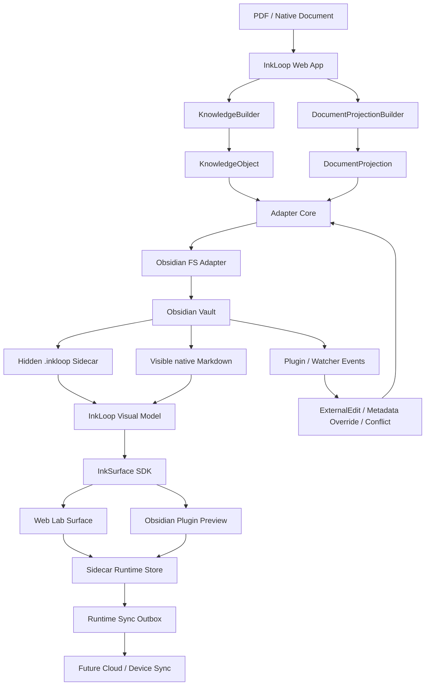
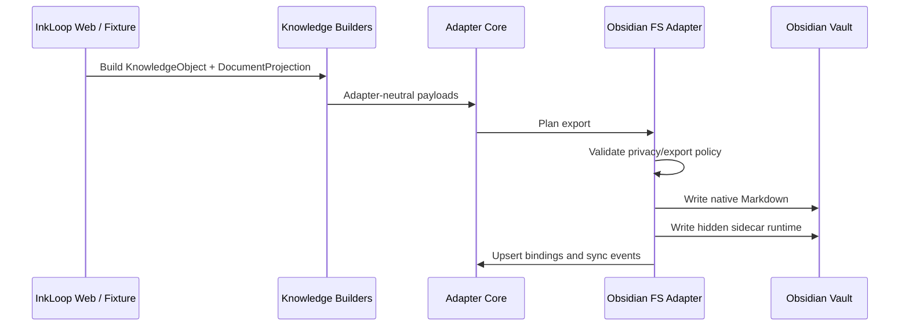
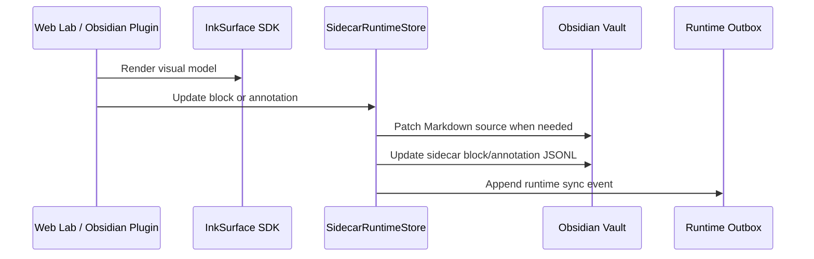
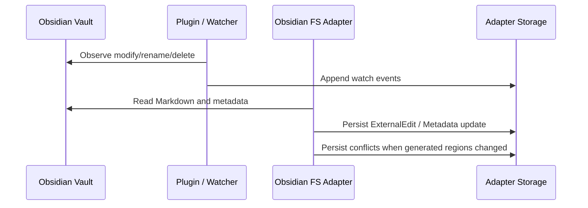
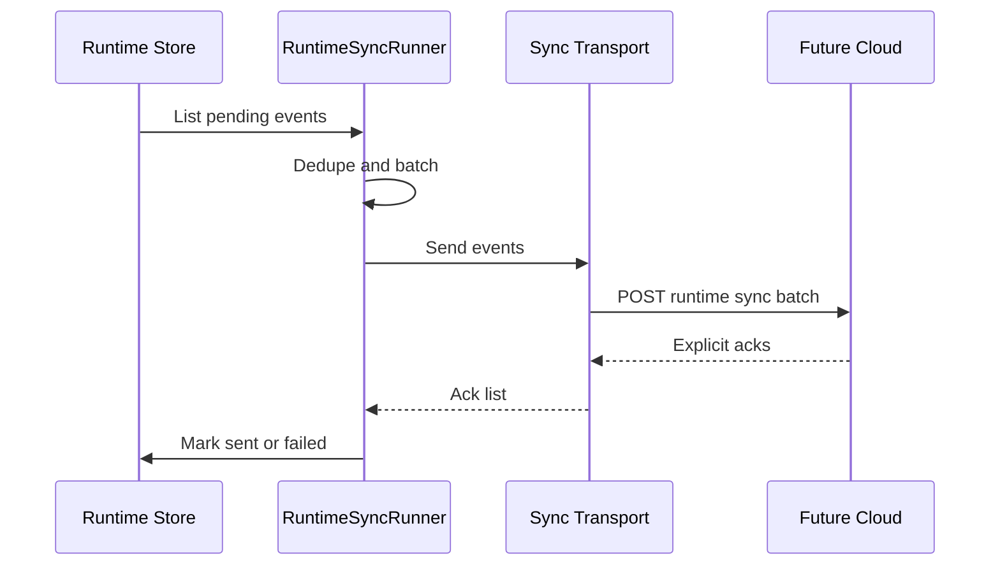

# Architecture

InkSurface SDK is the shared document-surface rendering layer for InkLoop. This repository also contains the runnable Obsidian Runtime MVP that proves the SDK, sidecar runtime, adapter contracts, and bidirectional sync flow against a real local vault.

The architecture has one central rule: user documents stay native to the host application, while InkLoop runtime state lives in hidden sidecar data. The SDK renders a document surface from that data; it does not own persistence, sync, AI, file watching, or host lifecycle.

## Goals

- Render the same document surface in Web and Obsidian from one SDK.
- Keep user-facing Markdown clean and editable.
- Store InkLoop annotations, AI notes, strokes, anchors, canvas state, and sync events in hidden sidecar files.
- Pull external edits back as explicit records instead of silently overwriting InkLoop facts.
- Keep Adapter Core portable for future Notion, Readwise, Zotero, or other host adapters.
- Preserve privacy boundaries around full-text export, raw evidence, PDF assets, OCR artifacts, and debug data.

## Non-Goals

- Obsidian does not run InkLoop AI workflows.
- The SDK does not parse PDFs, perform OCR, call models, watch files, or sync data.
- Obsidian is not a full mirror of all InkLoop runtime internals.
- Production cloud sync is not implemented in this MVP; current cloud behavior is represented by local JSONL-shaped sync records.

## System Overview



## Main Components

### InkSurface SDK

Location: `src/`

The SDK turns an `InkLoopVisualModel` or InkLoop projection Markdown into DOM nodes. It supports:

- document title and ordered blocks
- editable and generated regions
- margin notes
- AI notes
- excerpts, QA, tasks, and annotations
- highlighter and pen strokes with explicit color and opacity
- pure string edit helpers for controlled Markdown projection sections

The SDK is side-effect-free on import. It does not inject styles, mutate the host DOM, start timers, read storage, watch files, or call network APIs unless the host explicitly calls the relevant function.

Build outputs:

```text
dist/inkloop-surface-sdk.es.js
dist/inkloop-surface-sdk.iife.js
dist/index.d.ts
```

The compatibility bundle name remains `inkloop-surface-sdk` and the IIFE global remains `InkLoopSurfaceSDK`, while the public product/package name is `InkSurface SDK`.

### Knowledge Layer

Locations:

```text
examples/ai-annotation-demo/src/knowledge/
examples/ai-annotation-demo/src/knowledge-builder/
```

`KnowledgeObject` represents discrete knowledge records such as annotations, AI notes, excerpts, Q&A, and tasks.

`DocumentProjection` represents a full editable document envelope:

- document identity and revision metadata
- ordered blocks
- block ids
- source anchors
- page and bbox references
- generated/editable region semantics
- export policy and privacy gates

`KnowledgeBuilder` folds InkLoop marks and AI turns into `KnowledgeObject` records. `DocumentProjectionBuilder` turns document text/reflow/OCR-like data into full document projections. Adapter implementations consume these contracts rather than raw InkLoop stroke, HMP, or inference internals.

### Adapter Core

Location: `examples/ai-annotation-demo/src/adapters/core/`

Adapter Core defines the portable contract for external workspaces:

- target identity
- bindings between InkLoop ids and remote paths
- sync events
- conflicts
- external edits
- document sync behavior
- in-memory storage used by tests and smoke flows

Core concepts avoid Obsidian-specific paths so future adapters can reuse them.

### Markdown Adapter Layer

Location: `examples/ai-annotation-demo/src/adapters/markdown/`

This layer renders adapter contracts into Markdown and parses external edits from Markdown. It owns:

- frontmatter helpers
- controlled section rendering
- document projection rendering
- source note rendering
- knowledge object rendering
- external edit parsing

Generated sections and editable regions are intentionally separated. Remote edits to generated sections become conflicts; remote edits to editable body regions become external edit records.

### Obsidian FS Adapter

Location: `examples/ai-annotation-demo/src/adapters/obsidian-fs/`

The Obsidian FS adapter writes native Markdown and hidden sidecar files into an Obsidian vault. It owns:

- vault validation
- safe vault-relative path policy
- atomic file writes
- document projection export
- knowledge object export
- binding state
- metadata pull
- external edit pull
- watcher scan fallback
- conflict creation
- CLI entrypoints

The adapter enforces exportability gates before rendering full document projections. Non-exportable projections, such as `local_only` or `include_full_text=false`, are skipped before any Markdown file is written.

### Sidecar Runtime

Locations:

```text
src/runtime/
examples/ai-annotation-demo/src/adapters/obsidian-fs/sidecar-runtime.ts
```

The sidecar runtime is the hidden source of truth for runtime rendering and mutation state inside a host vault. It stores:

- document metadata
- source references
- block surfaces
- annotations
- freehand strokes
- canvas nodes
- runtime sync events

`SidecarRuntimeStore` exposes a runtime port for updating block text, adding/updating annotations, patching Markdown source ranges, appending sync events, and listing outbox state.

### Obsidian Plugin

Location: `examples/ai-annotation-demo/obsidian-plugin/inkloop-sync/`

The plugin is a quiet InkLoop Runtime host inside Obsidian. It:

- observes vault modify/delete/rename events
- keeps native Markdown as the visible user file
- decorates Obsidian's native Markdown preview with the shared SDK surface
- supports Focus Reading and Mark Thinking modes
- supports pen/highlighter drawing and color selection
- writes sidecar annotations and runtime events
- triggers local sync endpoints

The plugin is not the renderer source of truth. It consumes the SDK bundle when available and uses the sidecar runtime data as its document state.

### Web Lab

Locations:

```text
obsidian-lab.html
src/obsidian-lab.ts
examples/ai-annotation-demo/vite.config.ts
```

Web Lab is a local validation host for the same Obsidian runtime shape. It lets developers test:

- preview and mark-thinking modes
- text edits
- annotation edits
- freehand pen/highlighter strokes
- reset
- pull from Obsidian
- runtime sync
- latency and local roundtrip behavior

Mutation endpoints are dev-only. They accept loopback requests, same-origin Web Lab requests, or requests with `x-inkloop-lab-token: $INKLOOP_LAB_WRITE_TOKEN`.

### Local Store and Original Web Demo

Locations:

```text
src/local/
src/core/
src/capture/
src/evidence/
src/surface/
src/main.ts
```

The original InkLoop Web demo remains in this repository as the source application used to validate real annotation workflows. It owns PDF import, PDF.js rendering, pointer capture, mark classification, evidence extraction, reflow, AI call orchestration, IndexedDB persistence, and reading surface behavior.

Those responsibilities stay outside the SDK.

## Data Ownership

| Data | Owner | Notes |
|---|---|---|
| Original PDF/native source asset | InkLoop | Not exported by default. |
| OCR/text/reflow source evidence | InkLoop | Used to build projections; raw debug evidence stays private unless explicitly enabled. |
| `KnowledgeObject` records | InkLoop | AI notes, annotations, Q&A, excerpts, tasks. |
| `DocumentProjection` | InkLoop | Exportable document envelope with block anchors and privacy policy. |
| Visible Markdown body in Obsidian | Obsidian/User | User-facing document under `InkLoop/`. |
| Sidecar runtime state | InkLoop Runtime Host | Hidden `.inkloop/` data used by Web Lab and plugin. |
| Obsidian text edits | Obsidian/User | Pulled back as `ExternalEdit`, not silent overwrites. |
| Obsidian metadata edits | Obsidian/User | Pulled as metadata updates/overrides. |
| Runtime sync events | Runtime Store | JSONL-shaped outbox for local and future cloud/device sync. |
| Production cloud sync | Future Cloud Layer | Not implemented here; local sync shape is designed to map to it. |

## Obsidian Vault Layout

The visible vault intentionally stays small:

```text
obsidian-vault/
  InkLoop/
    <document-title> - <doc_id>.md
  .inkloop/
    manifest.json
    indexes/
      path-index.json
      doc-index.json
    docs/
      <doc_id>/
        document.json
        source.json
        surfaces/
          markdown.blocks.jsonl
          surface-manifest.json
        canvas/
          canvas.json
          nodes.jsonl
        outbox/
          runtime-events.jsonl
    .inkloop-adapter-state.json
    .inkloop-watch-outbox.jsonl
```

Only the document under `InkLoop/` is intended as a normal knowledge-base file. `.inkloop/` is hidden sidecar state.

## Core Flows

### Export to Obsidian



### Edit in Web Lab or Obsidian



### Pull External Changes



### Runtime Sync



The current smoke transport writes to local JSONL files. The HTTP transport already expects explicit per-event acknowledgements and has request timeout behavior so failed syncs can retry.

## Privacy and Safety Boundaries

- Full document export is gated by `DocumentProjection.export_policy.include_full_text`.
- `local_only` projections are skipped before rendering.
- Sidecar source paths are resolved with vault-boundary checks.
- Adapter state writes use atomic writes where state corruption would break roundtrip behavior.
- Runtime outbox writes preserve concurrent appends during sync status rewrites.
- Web Lab mutation APIs are guarded for loopback, same-origin, or explicit token access.
- SDK imports do not mutate host state or start background work.

## Conflict Strategy

The adapter treats external changes as explicit records:

- Editable document body changes become `ExternalEdit`.
- Metadata changes become metadata updates/overrides.
- Generated/controlled section changes become conflicts.
- Missing, renamed, or moved files are detected through bindings, frontmatter, and content hashes.
- Conflicts are persisted so a host can later review, merge, reject, or re-export.

## Extension Points

### New Host Adapter

A future adapter should consume the same portable inputs:

- `KnowledgeObject`
- `DocumentProjection`
- `ExternalEdit`
- Adapter Core storage/contracts

It should implement planning, rendering, apply, pull, conflict, and binding behavior without depending on Obsidian-specific file paths.

### Production Cloud Sync

The runtime sync outbox already uses cloud-shaped event records. A production transport needs:

- authenticated endpoint
- per-event ack contract
- retry policy
- conflict policy
- device identity
- durable server-side ordering

### Production Import Binding

The smoke flow uses fixture-backed document data. Production import should bind real PDF/native document sources into the same document projection and sidecar runtime shape.

## Verification

Primary command:

```bash
npm run verify
```

This runs:

- TypeScript checks
- Biome lint
- Vitest suite
- Web build
- SDK build

Obsidian runtime smoke:

```bash
npm run obsidian:smoke -- --out-dir .inkloop-smoke-runs/obsidian-runtime-mvp --force-clean
npm run build
npm run obsidian:install-plugin -- --vault .inkloop-smoke-runs/obsidian-runtime-mvp/obsidian-vault
INKLOOP_LAB_RUN_DIR=.inkloop-smoke-runs/obsidian-runtime-mvp npm run demo:dev -- --host 0.0.0.0
```

Then open:

```text
http://localhost:8765/obsidian-lab.html
```

## Repository Map

```text
src/                                   Standalone shared SDK package source
dist/                                  Generated SDK bundles and declarations
examples/ai-annotation-demo/src/       Web/PDF/adapter/runtime validation app
examples/ai-annotation-demo/server/    Demo AI proxy and dev-only handlers
examples/ai-annotation-demo/scripts/   Demo smoke, fixture, and plugin scripts
examples/ai-annotation-demo/obsidian-plugin/  Obsidian runtime host plugin
examples/ai-annotation-demo/examples/ink-surface/ Minimal SDK example
packages/ko-schema/                    Protocol fixture data
docs/                                  SDK architecture and usage docs
```

## Current Limits

- The Obsidian plugin is desktop-only in the current manifest.
- Cloud/device sync is represented by local event/outbox shape, not a production backend.
- Real Obsidian API behavior still benefits from manual smoke validation because the plugin is not yet covered by a dedicated mocked Obsidian test harness.
- Production import binding for arbitrary real PDFs/native documents should be implemented on top of the existing projection and sidecar shape.
