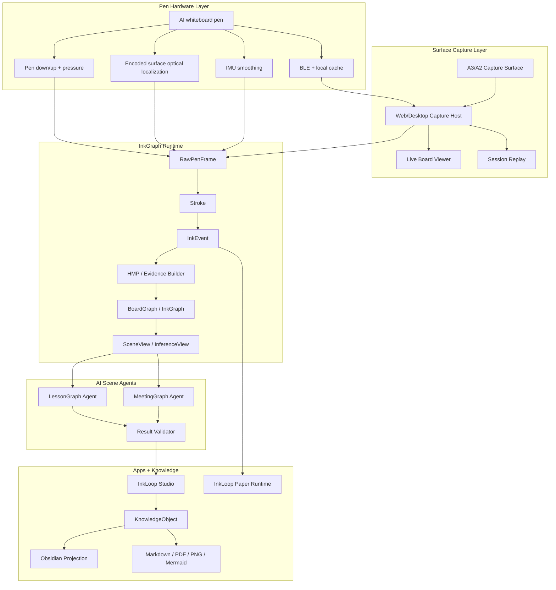
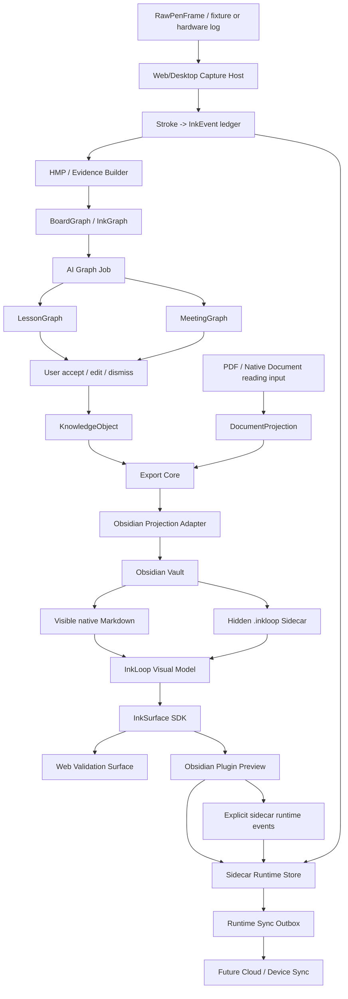
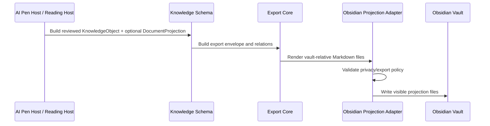
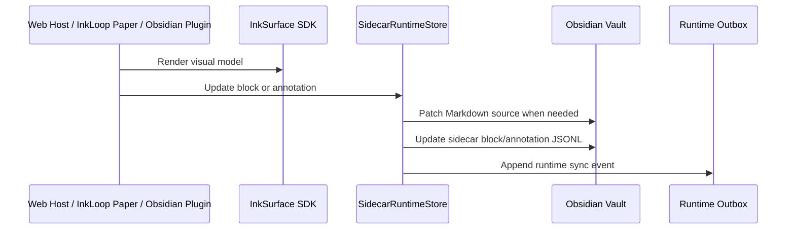
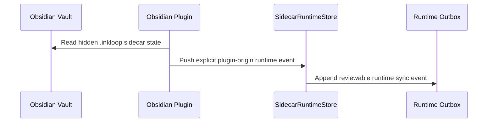
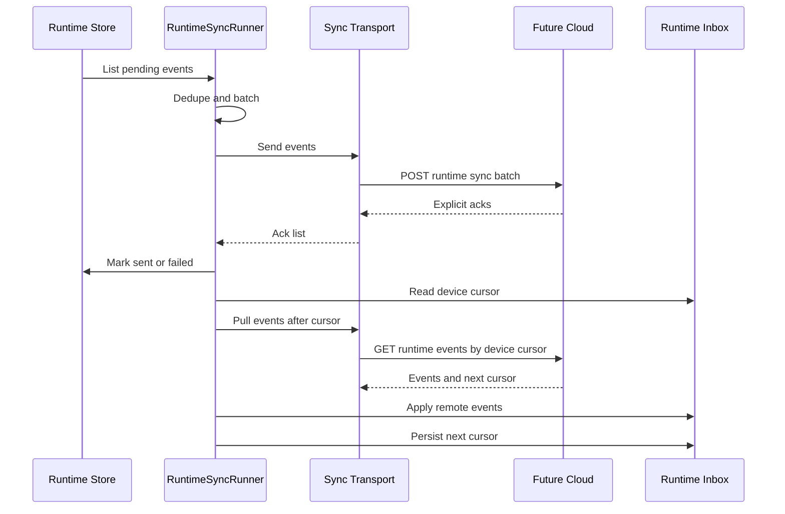

# Architecture

InkLoop is now organized around the AI Pen Kickstarter V1. InkSurface SDK is the shared document-surface rendering layer inside that system. This repository also contains the runnable Web/Obsidian/Android validation hosts that prove the SDK, sidecar runtime, adapter contracts, runtime sync flow, and AI Pen / InkGraph contract against local runtimes.

The product architecture has one central rule: **the event ledger is the source of truth**. Pen frames, strokes, InkEvents, BoardGraph / InkGraph objects, and traceable `source_refs` are canonical. UI, AI outputs, Obsidian Markdown, e-paper review screens, and exports are derived views.

The document/runtime architecture has a second rule: user documents stay native to the host application, while InkLoop runtime state lives in hidden sidecar data. The SDK renders a document surface from that data; it does not own persistence, sync, AI, file watching, or host lifecycle.

## AI Pen Kickstarter V1 Architecture



### V1 Scope Boundaries

- Web/Desktop Host is the primary Kickstarter demo runtime: AI Pen capture or simulation, Live Board, session recording, replay, Studio confirmation, and export.
- Android/e-paper remains a runtime reuse and roadmap host for InkLoop Paper. It must not be described as the October 2026 Kickstarter hardware promise.
- Obsidian receives knowledge projection and runtime sidecar state grouped by source file/session units. Visible Markdown carries `inkloop_document_id`, `inkloop_document_uri`, and `inkloop_projection_role`, but Obsidian does not reverse-parse arbitrary PDF annotations or arbitrary Markdown edits into canonical InkEvents.
- Meeting audio, subtitles, agenda, speaker, and timeline data are optional context. The V1 meeting path starts from marked whiteboard events entering the evidence pipeline and aligning to the InkGraph schema.

### Current Launch Boundary

| Boundary | Current Status | Source |
| --- | --- | --- |
| Local V1 software chain | `local_demo_ready` | `test-results/ai-pen-demo-evidence/README.md` |
| Browser AI Pen smoke | `browser.ok=true` | `test-results/ai-pen-browser-smoke/result.json` |
| Launch operations queue | `86 P0 inputs` | `test-results/ai-pen-kickstarter-ops-refresh/README.md` |
| Pre-launch page | `prelaunch_page_not_ready` | `test-results/ai-pen-kickstarter-prelaunch-page/prelaunch-page.json` |
| Launch freeze | `launch_freeze_not_ready`, `0/13 gates ready` | `test-results/ai-pen-kickstarter-launch-freeze/launch-freeze.json` |

The architecture is therefore demo-ready for the local V1 software chain, not Kickstarter launch-ready. Real AI Pen hardware logs, Capture Surface calibration, supplier quote artifacts, GTM proof, Kickstarter page/legal review, proof-shot evidence, and owner signoff remain outside the local software demo.

## Goals

- Launch a credible AI Pen + Capture Surface Kickstarter campaign by the end of October 2026.
- Prove education and business meeting end-to-end demos with real or hardware-faithful pen events.
- Keep AI outputs editable, dismissible, and traceable through `source_refs`.
- Render the same document surface in Web and Obsidian from one SDK.
- Keep user-facing Markdown clean and locally editable without treating arbitrary Markdown changes as capture truth.
- Store InkLoop annotations, AI notes, strokes, anchors, canvas state, and sync events in hidden sidecar files.
- Treat Obsidian-side changes as projection edits unless the plugin emits an explicit sidecar runtime event; never silently overwrite InkLoop facts.
- Keep Knowledge Export contracts portable for future Notion, Readwise, Zotero, or other host adapters.
- Preserve privacy boundaries around full-text export, raw evidence, PDF assets, OCR artifacts, and debug data.

## Non-Goals

- The October 2026 Kickstarter base tier does not promise a full e-paper tablet.
- The first version does not promise any ordinary whiteboard without Capture Surface setup.
- The first version does not promise perfect multi-pen, multi-color, formula recognition, diagram recognition, or deep meeting-tool integrations.
- Obsidian does not run InkLoop AI workflows.
- The SDK does not parse PDFs, perform OCR, call models, watch files, or sync data.
- Obsidian is not a full mirror of all InkLoop runtime internals.
- Production cloud sync is not implemented in this MVP; current cloud behavior is represented by the sync API contract app and local/test transports.

## System Overview



## Main Components

### Runtime Schema

Location: `packages/runtime-schema/`

Runtime Schema is the platform-neutral contract for document runtime records, surface blocks, annotations, strokes, local mutation inputs, and runtime sync events. It has no DOM, Node file API, Obsidian, PDF, or cloud dependency.

The demo runtime keeps compatibility re-exports so existing web validation, sidecar store, and sync runner code can migrate incrementally.

### InkSurface SDK

Locations:

```text
packages/surface-model/src/   Platform-neutral visual model and pure edit helpers
packages/surface-web/src/     DOM/SVG surface renderer and pure edit helpers
src/index.ts                  Compatibility re-export for existing root package imports
```

The SDK turns an `InkLoopVisualModel` or InkLoop projection Markdown into DOM nodes. The Surface Model package owns the platform-neutral input contract, parser, normalization, and pure edit helpers. The Surface Web package owns DOM/SVG rendering and style installation.

It supports:

- document title and ordered blocks
- editable and generated regions
- margin notes
- AI notes
- excerpts, QA, tasks, and annotations
- highlighter and pen strokes with explicit color and opacity
- pure string edit helpers for controlled Markdown projection sections

The SDK is side-effect-free on import. It does not inject styles, mutate the host DOM, start timers, read storage, watch files, or call network APIs unless the host explicitly calls the relevant function.

Build outputs:

```text
dist/inkloop-surface-sdk.es.js
dist/inkloop-surface-sdk.iife.js
dist/index.d.ts
dist/packages/*/src/*.js
dist/packages/*/src/*.d.ts
```

The compatibility bundle name remains `inkloop-surface-sdk` and the IIFE global remains `InkLoopSurfaceSDK`, while the public product/package name is `InkSurface SDK`.

Public runtime and export modules ship as subpath exports of the root package, such as
`ink-surface-sdk/runtime-schema`, `ink-surface-sdk/offline-store/indexeddb`, `ink-surface-sdk/sync-client`,
`ink-surface-sdk/knowledge-schema`, `ink-surface-sdk/export-core`, and `ink-surface-sdk/adapters/obsidian`.
The `packages/*` names remain workspace source modules in this release, not separate public npm packages.

### Knowledge Layer

Locations:

```text
packages/knowledge-schema/src/
packages/export-core/src/
examples/ai-annotation-demo/src/knowledge/
```

`KnowledgeObject` represents reviewed knowledge records such as lesson notes, formula steps, meeting actions,
meeting decisions, meeting risks, diagrams, reading notes, highlights, and tasks.

`DocumentProjection` represents a full editable document envelope:

- document identity and revision metadata
- ordered blocks
- block ids
- source anchors
- page and bbox references
- generated/editable region semantics
- export policy and privacy gates

`packages/knowledge-schema` owns the public `KnowledgeObject`, `DocumentProjection`, entity membership,
KO relation, export envelope, and content-hash helpers used by external adapters.

`packages/export-core` owns deterministic export helpers such as taxonomy tags, entity mode inference,
concept layer assembly, and stored-membership relation projection.

AI Pen V1 LessonGraph and MeetingGraph outputs are converted into reviewed `KnowledgeObject` records by
`buildLessonGraphKnowledgeObjects` and `buildMeetingGraphKnowledgeObjects` in `packages/knowledge-schema`.
The demo app still keeps a reader/annotation-oriented builder under `examples/ai-annotation-demo/src/knowledge/`
for historical PDF/read-review flows, but it is not the Kickstarter V1 source-of-truth path. Adapters consume
`KnowledgeObject` and `DocumentProjection` contracts rather than raw InkLoop stroke, HMP, or inference internals.

### Knowledge Export Contracts

Locations:

```text
packages/knowledge-schema/
packages/export-core/
packages/adapter-obsidian/
```

Knowledge Export is the portable projection layer for external workspaces:

- `packages/knowledge-schema` defines `KnowledgeObject`, `DocumentProjection`, concept layers, export envelopes, content hashes, and source-reference expectations.
- `packages/export-core` owns deterministic export helpers such as taxonomy tags, entity mode inference, concept layer assembly, and relation projection.
- `packages/adapter-obsidian` renders accepted V1 knowledge objects and document projections into deterministic vault-relative Markdown files.

The export layer is intentionally separate from Runtime Sync. It does not own device cursors, event ordering, file watchers, production cloud jobs, or arbitrary reverse parsing of Obsidian edits into canonical AI Pen `InkEvent` records.

### Adapter Authority Contracts

Location: `packages/adapter-contracts/`

Adapter authority contracts classify adapters as `client_local`, `cloud_api`, or `hybrid`. This prevents backend code from trying to access local vaults/files and prevents client code from owning cloud API jobs that belong on the backend.

Current examples:

- Obsidian runtime/plugin behavior is `client_local`.
- Notion-style API adapters are `cloud_api`.
- Drive-style adapters can be `hybrid` when metadata and file permissions split across cloud/client surfaces.

### Obsidian Markdown Adapter

Location: `packages/adapter-obsidian/`

The Obsidian Markdown adapter renders canonical export artifacts into a clean Markdown vault release. It consumes
`KnowledgeObject`, `DocumentProjection`, `ConceptLayer`, and `InkLoopVisualModel` inputs and emits deterministic
vault-relative Markdown files. It does not watch files, write to disk, call the Obsidian API, or own sync.

It is used by the updated demo export/release path for:

- reading, diary, and meeting folders
- document hub files
- KO note files
- concept hub files
- same-entity, same-AI-turn, and same-context backlinks
- embedded SVG ink replay

### Sidecar Runtime

Locations:

```text
packages/offline-store/src/file-sidecar-store.ts
plugins/obsidian/inkloop-sync/
examples/ai-annotation-demo/server/runtime-sync-dev.ts
```

The sidecar runtime is the hidden source of truth for runtime rendering and mutation state inside a host vault. It stores:

- document metadata
- source references
- block surfaces
- annotations
- freehand strokes
- canvas nodes
- runtime sync events

`SidecarRuntimeStore` exposes a runtime port for updating block text, adding/updating annotations, patching Markdown source ranges, appending sync events, and listing outbox state.

### Offline Store Contract

Location: `packages/offline-store/`

The offline store package defines cache records, offline document open states, missing asset behavior, eviction policy rules, and the current concrete MVP stores:

- cached metadata and surface models can open without network
- missing large assets produce partial document states instead of blank failure
- pending mutations and pinned documents are never evicted
- newer cached schemas enter migration-required state before local mutation
- file sidecars back Obsidian/desktop vault hosts
- IndexedDB backs Web/WebView app shells

### Sync Client

Location: `packages/sync-client/`

The sync client owns reusable sync behavior: outbox push batching, dedupe, retry metadata, timeout-safe HTTP transport, explicit per-event acknowledgements, pull by device cursor, and inbox application. It operates on `RuntimeOutboxPort`, `RuntimeSyncEvent`, and host-provided `RuntimeInboxPort`, so file sidecars, IndexedDB stores, native stores, and future production transports can share the same sync runner.

The HTTP transport requires a stable device id and sends it through the sync contract as `device_id`. Pull cursors
are advanced only after inbox application succeeds without conflicts; conflicted pulls leave the previous cursor
intact so hosts can persist conflict records or open a merge flow.

The demo validation host uses the same sync-client contract as WebView and Obsidian runtime hosts, so local JSONL smokes and future cloud transports exercise the same push/pull shape.

### Cloud Sync API Boundary

Location: `apps/sync-api/`

The sync API directory documents the future production backend boundary. It defines push, pull, asset metadata, and conflict-listing contracts with JSONL fixtures. It is not a deployed service in this repository.

The backend owns authenticated device identity, event ordering, per-device cursors, conflict records, asset authorization, and cloud adapter jobs. Clients continue to own local stores, local adapters, caches, and immediate offline mutations.

### Native Bridge

Location: `packages/native-bridge/`

The native bridge package defines the local message protocol between a bundled WebView renderer and a native/offline Runtime Host. It covers document snapshot requests, mutation application, asset requests, sync status requests, validation, and typed success/error responses.

The bridge requires hosts to load renderer assets locally from the app bundle or verified cache. Network is used for sync and downloads, not to boot the renderer.

### Obsidian Plugin

Source location: `plugins/obsidian/inkloop-sync/`

Package bundle location after `npm run build`: `dist/obsidian-plugin/inkloop-sync/`

The plugin is a quiet InkLoop Runtime host inside Obsidian. It:

- observes vault modify/delete/rename events
- keeps native Markdown as the visible user file
- decorates Obsidian's native Markdown preview with the shared SDK surface
- supports Focus Reading and Mark Thinking modes
- supports pen/highlighter drawing and color selection
- writes sidecar annotations and runtime events
- triggers local sync endpoints

The plugin is not the renderer source of truth. It consumes the SDK bundle when available and uses the sidecar runtime data as its document state.

### Web Validation Surfaces

Locations:

```text
examples/ai-annotation-demo/ai-pen-demo.html
examples/ai-annotation-demo/src/ai-pen-demo.ts
examples/ai-annotation-demo/mobile.html
examples/ai-annotation-demo/vite.config.ts
```

The AI Pen demo page is the current Kickstarter V1 validation host. It lets developers test:

- AI Pen capture simulation
- Live Board rendering
- InkEvent ledger display
- LessonGraph and MeetingGraph candidate outputs
- source_refs validation before user review

The mobile page remains the Android/e-paper runtime reuse host. Runtime sync behavior is covered by deterministic tests and dev endpoints rather than a separate Obsidian lab page.

### Reading / PDF Validation Surface

Locations:

```text
examples/ai-annotation-demo/src/local/
examples/ai-annotation-demo/src/core/
examples/ai-annotation-demo/src/capture/
examples/ai-annotation-demo/src/evidence/
examples/ai-annotation-demo/src/main.ts
```

The original InkLoop Web reading surface remains in this repository as a validation host for document reading,
PDF import, PDF.js rendering, pointer capture, mark classification, evidence extraction, reflow, AI call
orchestration, IndexedDB persistence, and reading surface behavior.

Those responsibilities stay outside the SDK and outside the October 2026 Kickstarter base hardware promise.
They are retained because Reading Notes, Highlights, Tasks, and source file/session unit projections are still
part of the broader InkLoop system and InkLoop Paper runtime reuse story.

## Data Ownership

| Data | Owner | Notes |
|---|---|---|
| Original PDF/native source asset | InkLoop | Not exported by default. |
| OCR/text/reflow source evidence | InkLoop | Used to build projections; raw debug evidence stays private unless explicitly enabled. |
| `KnowledgeObject` records | InkLoop | AI notes, annotations, Q&A, excerpts, tasks. |
| `DocumentProjection` | InkLoop | Exportable document envelope with block anchors and privacy policy. |
| Visible Markdown body in Obsidian | Obsidian/User | User-facing document under `InkLoop/`. |
| Sidecar runtime state | InkLoop Runtime Host | Hidden `.inkloop/` data used by validation hosts and plugin. |
| Obsidian text edits | Obsidian/User | Local projection edits in V1; not parsed into canonical InkEvents or KnowledgeObjects. |
| Obsidian plugin settings | Obsidian/User | May emit explicit sidecar runtime events/settings; no arbitrary Markdown watcher is a truth source. |
| Runtime sync events | Runtime Store | JSONL-shaped outbox for local and future cloud/device sync. |
| Production cloud sync | Future Cloud Layer | Not implemented here; local sync shape is designed to map to it. |

## Obsidian Vault Layout

The visible vault intentionally stays small:

```text
obsidian-vault/
  InkLoop/
    <document-title> - <doc_id>.md
  .inkloop/
    manifest.json
    indexes/
      path-index.json
      doc-index.json
    docs/
      <doc_id>/
        document.json
        source.json
        surfaces/
          markdown.blocks.jsonl
          surface-manifest.json
        canvas/
          canvas.json
          nodes.jsonl
        outbox/
          runtime-events.jsonl
    .inkloop-adapter-state.json
    .inkloop-watch-outbox.jsonl
```

Only the document under `InkLoop/` is intended as a normal knowledge-base file. `.inkloop/` is hidden sidecar state.

## Core Flows

### Export to Obsidian



### Edit Runtime State In Hosts



In V1, visible Obsidian Markdown files are clean knowledge projections. Users can edit them as normal notes, but those edits do not become canonical AI Pen `InkEvent`, `BoardGraph`, `MeetingGraph`, `LessonGraph`, or `KnowledgeObject` records unless a future controlled adapter records an explicit reviewed sidecar event.

### Sync Explicit Obsidian Sidecar Events



The Obsidian V1 plugin can host runtime sidecar state and push/pull explicit runtime events. It does not watch arbitrary visible Markdown/PDF edits and infer new capture events from them.

### Runtime Sync



The current smoke transport writes to local JSONL files. The HTTP transport expects explicit per-event acknowledgements for push and a cursor-shaped pull response for inbox application. Failed push events retain retry metadata; pull cursors advance only after inbox application completes.

## Privacy and Safety Boundaries

- Full document export is gated by `DocumentProjection.export_policy.include_full_text`.
- `local_only` projections are skipped before rendering.
- Sidecar source paths are resolved with vault-boundary checks.
- Adapter state writes use atomic writes where state corruption would break roundtrip behavior.
- Runtime outbox writes preserve concurrent appends during sync status rewrites.
- Web validation mutation APIs are guarded for loopback, same-origin, or explicit token access.
- SDK imports do not mutate host state or start background work.
- Runtime schema validation is dependency-free and can run in Web, WebView, native bridge tests, or backend contract tests.

## Conflict Strategy

V1 avoids silent convergence by keeping projection edits and runtime truth separate:

- Visible Obsidian Markdown edits remain normal vault edits and are not reverse-parsed into InkLoop facts.
- Plugin-origin sidecar events are explicit runtime sync events with device identity, event ids, and acknowledgements.
- Generated/controlled projection sections can be overwritten by a later export, so campaign and demo copy must describe Obsidian as projection/output, not capture truth.
- Future controlled-edit adapters may add reviewable conflict records for specific editable regions, but they must not infer arbitrary Markdown/PDF edits as canonical InkEvents.

## Extension Points

### New Host Adapter

A future adapter should consume the same portable inputs:

- `KnowledgeObject`
- `DocumentProjection`
- `RuntimeSyncEvent`
- `packages/knowledge-schema`, `packages/export-core`, and `packages/adapter-contracts` contracts

It should implement planning, rendering, apply, explicit runtime event handling, and binding behavior without depending on Obsidian-specific file paths.

### Production Cloud Sync

The runtime sync outbox already uses cloud-shaped event records. A production transport needs:

- authenticated endpoint
- per-event ack contract
- retry policy
- conflict policy
- device identity
- durable server-side ordering

### Production Import Binding

The smoke flow uses fixture-backed document data. Production import should bind real PDF/native document sources into the same document projection and sidecar runtime shape.

## Verification

Primary command:

```bash
npm run verify
```

This runs:

- TypeScript checks
- Biome lint
- Vitest suite
- Web build
- SDK build

AI Pen demo smoke:

```bash
npm run demo:dev -- --host 127.0.0.1
```

Then open:

```text
http://127.0.0.1:8765/ai-pen-demo.html
```

Obsidian runtime smoke:

```bash
npm run obsidian:smoke
```

## Repository Map

```text
apps/sync-api/                        Future cloud sync API contract fixtures
packages/adapter-contracts/           Adapter execution authority and placement rules
packages/adapter-obsidian/            Obsidian Markdown projection adapter
packages/export-core/                 Export helpers and relation projection
packages/knowledge-schema/            KnowledgeObject, DocumentProjection, and export envelopes
packages/native-bridge/                Local WebView bridge message contract
packages/offline-store/                Offline cache state and eviction policy contract
packages/runtime-schema/               Platform-neutral runtime records and sync event contracts
packages/surface-model/                Platform-neutral visual model and pure edit helpers
packages/sync-client/                  Runtime outbox push, retry, dedupe, and ack handling
packages/surface-web/                  DOM/SVG surface renderer and pure edit helpers
src/                                   Root compatibility re-export for existing SDK consumers
dist/                                  Generated SDK bundles and declarations
plugins/obsidian/inkloop-sync/         Obsidian runtime host plugin source
examples/ai-annotation-demo/src/       Web/PDF/AI Pen/runtime validation app
examples/ai-annotation-demo/server/    Demo AI proxy and dev-only handlers
examples/ai-annotation-demo/scripts/   Demo smoke and fixture scripts
examples/ai-annotation-demo/ai-pen-demo.html AI Pen Kickstarter V1 demo page
native/                                Native host integration notes
packages/ko-schema/                    Legacy protocol fixture data
docs/                                  Runtime, SDK, and product architecture docs
```

## Current Limits

- The Obsidian plugin is desktop-only in the current manifest.
- Cloud/device sync is represented by local event/outbox shape, not a production backend.
- Real Obsidian API behavior still benefits from manual smoke validation because the plugin is not yet covered by a dedicated mocked Obsidian test harness.
- Production import binding for arbitrary real PDFs/native documents should be implemented on top of the existing projection and sidecar shape.
