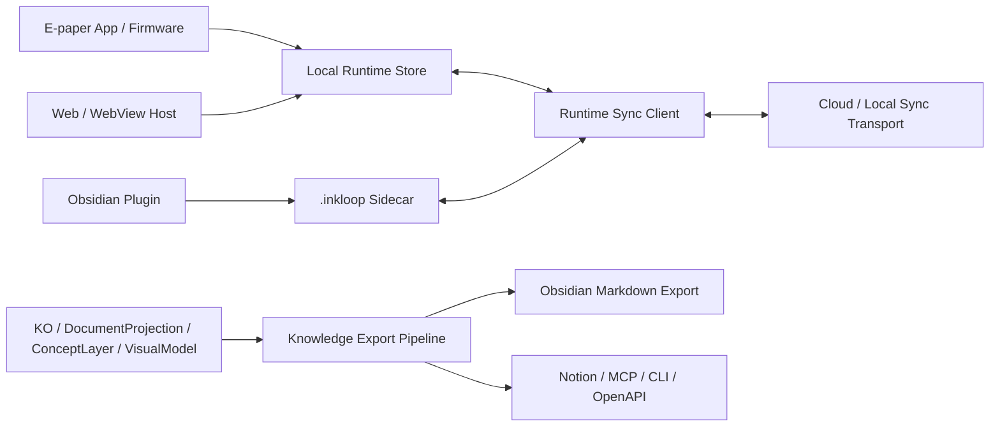

# Runtime Sync Canonical Path

## Problem Frame

The updated demo currently has a whole-vault release path that publishes a clean Markdown vault to Obsidian. That is useful for export, backup, and future cross-app publishing, but it is a poor fit for day-to-day InkLoop device to Obsidian sync: it replaces too much state, performs poorly, and still depends on manual refresh behavior.

For the core product experience, the e-paper device, Web host, and Obsidian plugin should share one runtime sync path. Users should be able to read and write on the device or in Obsidian without thinking about refresh buttons, whole-vault replacement, or which side owns the latest state.

This upgrade should preserve the existing e-paper app and firmware direction, replace the current e-paper to Obsidian whole-release flow with runtime sync, and defer generalized export destinations such as Notion, MCP, CLI, and OpenAPI to a separate Knowledge Export Pipeline.

## Target Architecture

## Requirements

**Architecture Boundary**

- R1. Runtime Sync must be the canonical path for InkLoop app, e-paper device, Web/WebView host, and Obsidian plugin synchronization.
- R2. Whole-vault clean Markdown release must not be used as the canonical device to Obsidian sync mechanism.
- R3. Knowledge Export must be treated as a separate projection/publishing pipeline for Obsidian Markdown, Notion, MCP, CLI, OpenAPI, backups, and migrations.
- R4. User-facing Markdown/PDF files must remain native and clean; InkLoop runtime state must live in local runtime stores and hidden sidecars.
- R5. The e-paper app and firmware direction must be preserved. This upgrade should replace the sync path, not rewrite the device application or low-level input stack.

**Writing Experience**

- R6. A stroke written on the e-paper/Web side should persist once, render once, keep its selected pen/highlighter style, and not duplicate or change color after pointer-up.
- R7. A stroke written in Obsidian marking mode should commit to sidecar/runtime state and become visible to other runtime hosts without requiring a whole-vault release.
- R8. Local writing should not trigger visible preview flashing, scroll jumps, or full-surface repaint unless a real document reload is required.
- R9. The same freehand stroke data should render consistently across Web/WebView and Obsidian.

**Reading Experience**

- R10. Reading mode should open quickly from cached local/runtime state and should not depend on downloading or regenerating a whole Markdown vault package.
- R11. Document layout, page anchors, highlights, boxes, handwritten marks, and AI/margin annotations should stay visually aligned across Web/WebView and Obsidian.
- R12. The runtime path should support PDF-derived documents, native Markdown documents, and new InkLoop-created documents without polluting the visible vault structure.

**Synchronization Experience**

- R13. Sync should be automatic or near-automatic for normal use. The user should not need to manually refresh Obsidian after every e-paper/Web edit.
- R14. Sync should be incremental at the runtime event/document level rather than replacing the whole vault for ordinary edits.
- R15. Conflicts should be explicit records or visible states, not silent overwrites.
- R16. Obsidian plugin, Web/WebView host, and e-paper app should share the same sync semantics: outbox, inbox, acknowledgement, retry, dedupe, and device cursor behavior.
- R17. Offline edits should remain locally usable and later sync without losing writing, reading position, or annotation state.
- R18. Manual refresh may remain as a recovery/debug action, but it must not be required for the normal writing or reading loop.

**Knowledge Export Pipeline**

- R19. The existing clean Markdown vault release path should be repositioned as an export target, not removed.
- R20. Exporter behavior should be reusable across future targets, including Obsidian Markdown, Notion, MCP, CLI, OpenAPI, HTML, JSON, and backups.
- R21. Export targets should consume canonical artifacts such as KO, DocumentProjection, ConceptLayer, and VisualModel; they should not own runtime source-of-truth behavior.
- R22. Export/import app integrations should not block the runtime sync MVP.

**Migration And Safety**

- R23. Switching the device-to-Obsidian flow from whole-vault release to runtime sync must not delete or rewrite existing exported Markdown without explicit user action.
- R24. Existing clean export output should remain readable as an export artifact, even after runtime sync becomes the canonical path.

**Observability And Validation**

- R25. The MVP must include a repeatable validation scenario covering e-paper/Web writing, Obsidian rendering, Obsidian editing/writing, and return sync.
- R26. The validation scenario should measure or at least report perceived latency, duplicate-stroke behavior, color/style preservation, refresh/flicker behavior, and manual-refresh dependency.
- R27. The implementation should keep parity tests for shared rendering behavior across Web/WebView and Obsidian.

## Success Criteria

- A user can write on the e-paper/Web side and see the same mark in Obsidian without manually triggering whole-vault export.
- A user can write or edit supported runtime content in Obsidian and see it propagate back through the runtime sync path.
- Normal edit sync does not rewrite or replace the entire visible vault.
- Pen/highlighter strokes retain color and style across hosts.
- No duplicate strokes appear during or after writing.
- Obsidian no longer flashes on every local write.
- Reading layout remains usable on narrower tablet/e-paper widths.
- The clean Markdown export path still exists, but it is clearly labeled and implemented as export/publishing rather than live sync.

## Scope Boundaries

- This phase does not build Notion, MCP, CLI, OpenAPI, or other export targets beyond preserving the abstraction boundary.
- This phase does not redesign the e-paper firmware or input hardware protocol.
- This phase does not add new AI product features.
- This phase does not require full collaborative real-time editing semantics. Near-real-time or reliable background sync is enough for MVP if it removes manual refresh and whole-vault replacement from normal use.
- This phase does not make exported Markdown the source of truth for InkLoop runtime state.
- This phase does not remove or migrate user-visible exported Markdown automatically.

## Key Decisions

- Runtime Sync is the product sync path: It serves continued reading, writing, editing, and state convergence across InkLoop-controlled hosts.
- Knowledge Export is the cross-app publishing path: It serves Obsidian Markdown export, Notion, MCP, CLI, OpenAPI, backups, and migrations.
- Obsidian has two roles: as a runtime host through the plugin and as a future export target through clean Markdown output.
- Whole-vault release should be retained only where it is valuable as export, not used for ordinary device to Obsidian synchronization.
- Foundation work comes before application-layer features: writing, reading, and sync quality are higher priority than new app workflows.

## Dependencies / Assumptions

- `packages/sync-client` already provides push/pull, inbox, acknowledgement, retry, dedupe, and device cursor concepts that planning should evaluate for reuse.
- `packages/offline-store` already provides file-sidecar and IndexedDB store foundations that planning should evaluate for the device/Web/Obsidian runtime path.
- `plugins/obsidian/inkloop-sync` is the existing sidecar runtime plugin path and should be the starting point for Obsidian runtime sync.
- The updated demo’s panel vault release path is useful evidence for Knowledge Export but should not define runtime sync behavior.

## Outstanding Questions

### Resolve Before Planning

None.

### Deferred to Planning

- [Affects R13-R18][Technical] Decide whether the first runtime sync transport should be local-only, cloud-backed, or support both behind one transport interface.
- [Affects R5-R7][Technical] Identify the smallest integration point in the e-paper/WebView app that can replace whole-vault publishing with runtime event sync without rewriting firmware.
- [Affects R12][Technical] Define how native Markdown, imported PDF, and newly created InkLoop documents map into one runtime identity model.
- [Affects R25-R27][Technical] Define the automated and manual validation harness for cross-host writing, reading, and sync parity.

## Next Steps

-> `/ce:plan` for structured implementation planning.
