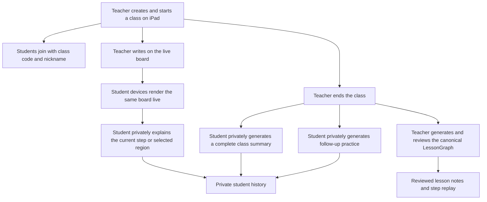

# Education Multi-Device Classroom

## Problem Frame

InkLoop has completed and accepted its e-paper meeting and reading scenarios. The next product focus is the education scenario originally anticipated by the shared education + meeting architecture. The first education milestone must prove a real multi-device classroom rather than another single-page scenario switch: an iPad acts as the teacher's whiteboard, multiple student devices see the writing live, and each student can privately invoke AI processing during and after class.

The work should extend the shared AI Pen and InkGraph product contracts without reopening the accepted meeting or reading experiences. The classroom must run on one local network so the team can validate interaction quality, latency, reconnect behavior, and e-paper WebView compatibility before adding public cloud deployment or formal accounts.

## Classroom Flow

## Requirements

**Classroom Session And Roles**

- R1. A teacher must be able to create, start, and end a locally hosted classroom session from an iPad browser using touch or Apple Pencil as the simulated whiteboard input.
- R2. A student must be able to join an active classroom from a responsive Web client using a class code and nickname, without creating a formal account.
- R3. Each joined browser must receive a distinct temporary participant credential, separate from the student nickname, so student AI results and history remain private to that participant.
- R4. The classroom must have explicit `live` and `ended` states. Live classes accept teacher board input and student live processing; ended classes stop teacher input but remain available for review and post-class processing.

**Live Board**

- R5. Teacher strokes must appear on joined student devices incrementally without requiring manual refresh.
- R6. A student joining after the class starts must first receive the current board state and then continue with live incremental updates without duplicate strokes.
- R7. A temporarily disconnected student must recover the missing board state after reconnecting without corrupting the visible board.
- R8. The live board must preserve stroke order, normalized placement, and basic tool appearance across the iPad teacher view, ordinary student browsers, and the e-paper WebView validation host.
- R9. The live experience must use a low-latency delivery path, while the accepted runtime event ledger remains responsible for durable history, idempotency, reconnect recovery, and later replay.

**Private Student AI Processing**

- R10. During a live class, a student must be able to request a private explanation for the current teaching step or a student-selected board region without changing the teacher board or another student's experience.
- R11. After the class ends, a student must be able to generate a private class summary from the persisted lesson timeline that covers the source-supported lesson outline, ordered teaching steps, key concepts, and formulas without inventing missing content.
- R12. After the class ends, a student must be able to generate private follow-up practice based on the persisted lesson content, with source-supported questions and answers or hints kept separate from the shared board.
- R13. Every student AI result must identify the board evidence and lesson time range it used so the student can return to the relevant source context.
- R14. Student AI jobs and results must be isolated by classroom and participant. They must not enter the teacher's canonical lesson output or another student's history unless a future explicit sharing action is added.
- R15. AI processing must use the real configured AI gateway when available and provide a clearly identified deterministic fallback when the gateway is unavailable, so multi-device testing and demos remain repeatable.
- R16. AI requests must expose queued, running, completed, and failed states, and a failed request must be retryable without duplicating completed results.

**Persistence And Return**

- R17. Classroom board events, lesson timeline, classroom state, participant identities, and private student results must persist on the local Mac classroom host across page refreshes and service restarts.
- R18. A student returning from the same browser must be able to reopen the ended class and continue using their prior private history without entering a formal account flow.
- R19. The teacher must be able to reopen an ended class to review the board timeline and classroom-level lesson output without exposing student-private AI results.

**Device And Experience Coverage**

- R20. The Student Viewer must be responsive and usable in a normal desktop/mobile browser and in the existing e-paper WebView host without modifying the accepted reading workflow.
- R21. The iPad teacher board and student views must show clear class identity, connection state, live/ended state, and AI job state without exposing runtime debugging controls in the normal experience. The normal experience must also handle an invalid class code, an empty board, reconnecting or offline state, unavailable AI, and insufficient lesson evidence.
- R22. The system must support one teacher and multiple simultaneous student browsers in the same local-network classroom; student writing back to the shared board is not required.

**Compatibility And Freeze Boundary**

- R23. Shared AI Pen, InkEvent, SceneView, LessonGraph, source reference, validation, local storage, and sync behavior should be extended through their existing product contracts where practical rather than duplicated inside the education UI.
- R24. Accepted meeting and reading user flows must remain behaviorally unchanged. Education work may add backward-compatible shared capabilities and regression coverage, but must not require new meeting or reading interaction behavior.

**Local Access And Data Control**

- R25. Teacher-only actions, including starting or ending a class and submitting shared board input, must require a teacher credential that is distinct from the student class code and participant credential. Possessing the class code alone grants only the Student Viewer role.
- R26. The local host must derive participant identity from the issued credential rather than trusting a client-supplied participant ID, and every private AI read, write, and job update must enforce both classroom and participant scope. Student nicknames must not be sent to the AI gateway or written to diagnostic logs unless required for an explicit user-visible function.
- R27. The teacher must be able to delete an ended classroom and its server-side board, lesson, participant, and private-result data from the local host. A student must be able to clear the participant credential and private cached data held by that browser.

**Teacher Lesson Output**

- R28. After ending a class, the teacher must be able to generate a canonical LessonGraph from the shared board timeline, including structured lesson notes and an ordered step replay.
- R29. LessonGraph candidates must enter a teacher review flow where the teacher can accept, edit, or dismiss them before they become the classroom's reviewed lesson output.
- R30. Every promoted lesson note and replay step must retain valid source references to the relevant board evidence and time range. Low-confidence formulas or unsupported content must remain visibly in need of review rather than being promoted as trusted output.
- R31. The canonical LessonGraph and reviewed teacher output must be isolated from student-private explanations, summaries, and practice. Student AI activity may read authorized classroom evidence but must never mutate, promote into, or become implicit evidence for the teacher output.

## Success Criteria

- An iPad teacher can create a class, write continuously, and end the class while at least three student browser sessions display the same ordered board content.
- A late-joining or briefly disconnected student converges to the teacher's current board without manual refresh, missing strokes, or duplicate strokes.
- For ordinary browser Student Viewers, simulated live board delivery meets P50 no more than 150 ms and P95 no more than 300 ms on the validation LAN, measured from teacher pointer sample receipt to student render commit. This result must be labeled as browser simulation evidence rather than real AI Pen transport evidence.
- E-paper WebView render and refresh latency is reported separately from the ordinary-browser target, together with visible refresh behavior and a human usability decision.
- Two students in the same classroom can request different current-step explanations and neither can see the other's request or result.
- A student credential cannot start or end a class, submit teacher strokes, or read another participant's AI job or result, even when the other participant ID is known.
- After class, a returning student can generate and reopen a complete summary and practice set using the persisted lesson timeline.
- At least one current-step explanation, one complete summary, and one practice set complete successfully through the real AI gateway and pass human usefulness and source-reference review; deterministic fallback runs are reported separately as reliability evidence.
- After ending the class, the teacher can generate a LessonGraph with at least three ordered, source-supported lesson steps, review every candidate, and reopen the accepted or edited lesson notes and step replay after a service restart.
- Dismissing or editing a student-private result does not change the teacher LessonGraph, and teacher review actions do not expose another student's private results.
- Deleting an ended classroom makes its board, lesson, participant, and private-result records unavailable after a service restart.
- Every promoted explanation, summary section, and practice set retains valid source references to the relevant lesson evidence.
- The same Student Viewer completes a functional smoke on a normal browser and the e-paper WebView host.
- Targeted education checks and the existing meeting/reading regression baseline pass without changing accepted meeting or reading behavior.

## Scope Boundaries

- The first milestone is local-network only; public internet access, public deployment, and remote classroom operation are deferred.
- Formal student accounts, rosters, LMS integration, grades, teacher analytics, billing, and cross-device student identity recovery are deferred.
- Students cannot write to or edit the shared teacher board in this milestone.
- Student AI results are private. Sharing results with the teacher or class is deferred.
- Multi-teacher, teaching assistant, multi-room, and multi-pen collaboration are deferred.
- The e-paper device is a Student Viewer compatibility host, not a reason to redesign or extend the accepted reading scenario.
- This milestone simulates teacher input with iPad touch or Apple Pencil; real AI Pen BLE ingestion and physical Capture Surface validation remain separate hardware evidence tracks.
- Production-scale concurrency, production cloud authorization, and internet-facing security hardening are not claimed by this local classroom milestone.
- Local-network scope does not remove the baseline role and private-result isolation requirements in R25-R27.

## Key Decisions

- One shared lesson, private student intelligence: the teacher board and lesson timeline are classroom truth, while explanations, summaries, and exercises belong to an individual participant.
- Canonical teacher output: the reviewed LessonGraph is the classroom's formal lesson artifact, containing lesson notes and step replay; only teacher review can promote or change it.
- Three processing moments: current-step explanation serves the live class; complete summary and practice generation serve post-class review.
- Class code and nickname: temporary browser identity is sufficient for the first local-network milestone and avoids pulling formal account work into classroom validation; the class code identifies the classroom but does not grant teacher authority.
- Responsive Web first: ordinary browsers and the e-paper WebView share one Student Viewer, preserving the frozen reading experience.
- Local persistence: ending a class transitions it into review rather than deleting it, enabling meaningful post-class workflows.
- Real AI with deterministic fallback: product quality can be evaluated with the real gateway while transport and UI acceptance remain repeatable when AI access is unavailable.
- Separate immediacy from durability: live board delivery optimizes for classroom responsiveness; the runtime ledger and sync semantics own durable history and convergence.
- Extend the shared runtime: education should reuse existing product contracts and packages, with new behavior isolated at the classroom/session and education experience layers.

## Alternatives Considered

| Approach | Outcome | Decision |
| --- | --- | --- |
| Extend the existing single-page education/meeting demo | Fast visual prototype, but cannot prove roles, privacy, reconnect, or real multi-device behavior | Rejected as the target; retain only as contract/demo reference |
| Build the classroom on production cloud accounts first | Strong remote access and identity, but adds deployment and account scope before classroom value is validated | Deferred |
| Build a local multi-device classroom on shared product contracts | Proves the highest-risk interaction and reuse assumptions with limited infrastructure scope | Selected |
| Add bidirectional student board collaboration | Enables group work, but changes conflict, moderation, and authority semantics substantially | Deferred |

## Dependencies / Assumptions

- The existing AI Pen and LessonGraph contracts remain the baseline for teacher strokes, lesson evidence, validation, and knowledge outputs.
- Existing runtime sync and offline storage capabilities can be evaluated for durable classroom history and reconnect recovery, but a separate low-latency classroom delivery mechanism is expected for live strokes.
- The local Mac host and all classroom devices can reach one another on the same LAN; network isolation or captive-portal environments are outside the first validation setup.
- The existing AI gateway configuration is assumed to support education prompts; this assumption must be verified during planning, and real-AI acceptance remains distinct from deterministic fallback acceptance.

## Outstanding Questions

### Resolve Before Planning

None.

### Deferred to Planning

- [Affects R5-R9][Technical] Select the low-latency LAN delivery mechanism and define how snapshots, sequence positions, acknowledgements, and the durable runtime ledger interact.
- [Affects R3, R14, R17-R18][Technical] Define the temporary participant credential, browser recovery behavior, and local-host authorization boundary without introducing formal accounts.
- [Affects R25-R27][Technical] Reuse the repository's server-authoritative token and namespace patterns for teacher/participant authorization, data deletion, and log redaction.
- [Affects R10-R13][Technical] Define how current-step and selected-region evidence is represented so AI results remain source-traceable across live and ended classes.
- [Affects R15-R16][Technical] Identify the smallest adapter around the existing AI gateway that supports real execution, deterministic fallback, cancellation, retries, and idempotency.
- [Affects R20][Technical] Establish responsive and e-paper WebView performance budgets, input limitations, and the device smoke matrix.
- [Affects R23-R24][Technical] Identify exact shared-package extension points and the regression suites that enforce the meeting/reading freeze boundary.
- [Affects R28-R31][Technical] Define the teacher LessonGraph job, review-state persistence, replay projection, and promotion boundary using the existing LessonGraph, validation, and KnowledgeObject contracts.

## Next Steps

-> `/ce:plan` for structured implementation planning.
