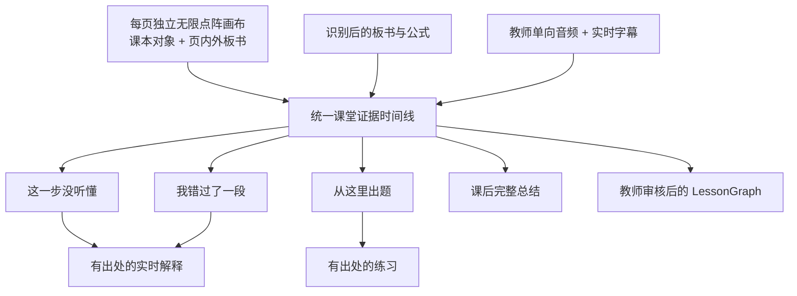

# 初中数学多模态课堂

## Problem Frame

第一阶段已经证明教师与学生可以在两个 Web 端完成实时板书同步，学生可以私下触发当前步骤解释、课后总结和练习，教师也可以审核规范 `LessonGraph`。但当前 AI 的主要输入仍是笔画坐标、顺序和时间，缺少可靠的手写公式识别、课本上下文和教师讲解文字。因此，“笔画同步正确”不等于“系统理解了老师正在讲哪道题”，现有 AI 可能只能描述线条而无法解释数学推导。

下一阶段面向初中数学，把课本、教师板书、公式识别和教师语音整合成一条可追溯的课堂证据时间线。目标不是堆叠视频会议能力，而是解决学生在课堂中最常见的三个问题：某一步没听懂、短暂错过一段、希望围绕当前位置继续练习；并让课后总结、练习和教师审核都能回到准确的课本页、板书区域和讲解时段。

## Product Flow

## Requirements

**课本工作区与全班焦点**

- R1. 教师端必须以单一无限点阵教学视口承载课本和板书，不再出现页面工作区、内层滚动框和 PDF 页面的多层滚动结构。每个课本页对应一张独立无限画布；课本页固定在该页画布的世界坐标原点附近，初始视角将其居中显示。教师平移画布后课本页可以离开视口中心，但课本对象不能相对世界坐标被单独拖动，四周点阵区域可持续扩展书写。
- R2. 教材页、页内标注和页外板书必须处于同一坐标空间并一起缩放。页外点阵区域承担与当前课本页关联的草稿功能，不再要求老师进入另一块嵌套白板；所有页外板书仍须明确关联当前教材页。
- R3. 教师使用 Apple Pencil 或鼠标左键直接书写；使用双指手势或按住空格拖动平移；使用双指捏合或滚轮缩放。点阵背景必须随视角连续缩放，并以稳定视觉层级帮助老师判断缩放尺度。
- R4. 每页独立保存板书、平移位置和缩放比例。教师翻页时切换到该页自己的无限画布，再次返回时完整恢复该页上次视角和全部页内外板书。
- R5. 学生端默认跟随教师当前教材页、画布视角和已确认焦点。学生可在同一无限画布中临时平移、缩放和自由浏览；进入自由浏览后，教师后续视角变化不得强制拉回学生，只显示“老师视角已更新”，由学生点击“回到老师视角”恢复跟随。
- R29. 教师发布的课堂视角必须包含当前教材页和该页画布的平移、缩放状态；发布视角只影响仍在跟随状态的学生。学生端不得修改共享板书、教材对象或教师视角。
- R30. 系统可以根据教师指针、标注和讲解建议一个焦点，但建议本身不改变全班视图；只有教师确认建议，或教师执行明确的聚焦操作，才能发布全班焦点。焦点须使用画布世界坐标或可稳定换算到教材页/板书区域的坐标表达，缩放和平移后仍能准确定位。
- R31. 教师翻页、平移、缩放或确认焦点时，仅处于跟随状态的学生应用教师页面与视角；自由浏览中的学生保留本地页面和视角，并显示“老师视角已更新”。教师新增或修改的共享标注、板书仍须同步到所有学生。网络重连后按同一规则恢复状态，不得丢失教材标注、页外板书及其来源关系。
- R32. 没有教材时，教学视口必须显示可操作的空状态，提供加载内置教材和上传 PDF 的明确入口，不得呈现无法解释的大块空白。教材下载或渲染失败时，保留点阵画布和已同步板书，显示失败原因与重试入口；教师不得发布不存在的页，学生在教材恢复后须自动重新对齐教材、板书和教师视角。

**手写与公式识别**

- R6. 教师的笔画必须继续实时同步，同时被识别为可供后续处理使用的文字、常见初中数学公式和有顺序的推导步骤；识别结果必须保留到原始笔画和板书区域的来源关系。
- R7. 教师端必须能查看识别文本或公式，并能用低干扰的方式快速更正；更正不得改写或删除原始笔画证据。
- R8. 低置信文字或公式必须明显标记为待确认，在教师确认或更正前不得作为可信结论进入实时解释、最终总结、练习答案或教师审核后的 `LessonGraph`；实时解释遇到未确认的关键公式时，只能说明不确定性并引用可确认的证据，不能猜测公式含义。
- R9. 识别必须优先覆盖本阶段已经完成硬验收的规范案例“用配方法解 `x² + 4x - 5 = 0`”；函数图像、几何图形和开放式证明只作为后续扩展案例，不是本阶段硬门槛。

**教师音频、字幕与录制控制**

- R10. 教师端必须支持教师单向实时音频，学生只能收听和阅读字幕；学生端不得请求麦克风或摄像头权限。
- R11. 录音必须由教师明确开始，教师端与学生端在录制期间都必须持续显示录音状态；创建课堂或开始上课不得暗中自动录音。
- R12. 系统必须在课堂中提供实时字幕并标出低置信内容；教师不需要在授课过程中逐字修正，而是在课后进行一次集中校正。
- R13. 默认保存教师原始音频和对应字幕，直到教师删除原始音频或删除整堂课堂；课后校正后的字幕作为最终总结、练习和教师审核的语音证据。删除原始音频后可以保留字幕与已审核产物，删除整堂课堂则同时删除这些派生产物。
- R14. 音频链路不可用时，课堂必须按“教师音频 + 实时字幕 → 仅实时字幕 → 同步课本 + 板书”的顺序降级，并明确告诉两端当前所处模式。“仅实时字幕”只适用于教师采集和转写仍工作、但学生音频播放链路不可用的情况；如果教师音频采集或转写都不可用，则直接降级到同步课本与板书，不伪造字幕。

**学生场景动作与可追溯结果**

- R15. 学生在直播课堂中必须可以触发“这一步没听懂”；系统以当前教师确认焦点为主，并结合附近板书步骤、课本区域和字幕时段生成私人解释。
- R16. 学生在直播课堂中必须可以触发“我错过了一段”；系统从学生触发点向前选择一段有明确边界的课堂证据，给出发生了什么、关键结论和如何返回对应位置。
- R17. 学生在直播课堂中可以在当前课本区域、板书区域或步骤上标记“从这里出题”，该锚点只对本人可见；课堂结束后，学生从锚点生成覆盖相同知识点的私人练习，并将题目、提示和答案分开呈现。
- R18. 课后完整总结必须基于教师校正后的字幕、教师确认过的公式和有序课堂证据，覆盖本课目标、推导主线、关键易错点和最终结论；不能把待确认内容表述成事实。
- R19. 在固定配方法验收课中，每个实时解释、错过片段说明、练习题、总结段落和 `LessonGraph` 步骤都必须保留课本页/区域、板书区域和字幕时间范围三类来源；点击来源后应回到相应课堂上下文，而不只是展示内部 ID。降级模式中确实不存在的来源必须明确标为不可用，不能伪造；缺失关键来源时，结果必须降低信任状态或拒绝生成。
- R20. 学生触发的解释、错过片段说明、练习和个人历史继续保持私有，不得进入其他学生空间或自动改变教师规范课堂产物。

**教师课后审核**

- R21. 课堂结束后，教师先集中校正低置信字幕和手写/公式识别，再生成或刷新 `LessonGraph` 候选；系统必须让教师看得出哪些产物仍基于未确认内容。
- R22. 教师可以对 `LessonGraph` 候选执行接受、编辑和驳回，且每项都能定位到课本、板书与字幕证据；只有审核后的投影才是规范课堂产物。
- R23. 教师修正字幕或公式后，受影响的总结、练习和 `LessonGraph` 必须明确显示为需要刷新或已基于新证据刷新，不能静默保留过期结论。

**连续性、隐私与冻结边界**

- R24. 教师和学生刷新或短暂断线后，必须恢复课本页、课堂焦点、板书、字幕位置和各自有权访问的结果，不得把学生私有数据广播到课堂共享流。
- R25. 课本 PDF、教师音频、字幕、识别文本、原始笔画和 AI 产物都属于课堂数据；教师删除课堂后，这些服务端数据及其派生产物必须不可恢复地变为不可访问。
- R26. 会议和阅读场景保持冻结；本阶段可以复用共享的笔画、来源引用、音频片段、识别结果和图谱能力，但不得要求会议或阅读用户采用新的交互流程。
- R27. 如果手写识别、语音转写或生成式 AI 会把课堂数据发送到外部服务，教师必须在启用前看到明确说明；系统只能发送完成该任务所需的最小证据，不得发送学生昵称、学生私有结果或无关课本页面，并且不得在诊断日志中记录原始音频、完整课本内容、访问凭证或未经脱敏的 AI 请求。
- R28. 教师音频采集和所有带课堂凭证的数据传输必须运行在受信任的安全浏览器上下文中；局域网明文 HTTP 只能用于不含音频与敏感课堂素材的现有开发验证，不能被视为本阶段音频与隐私验收通过。

## Success Criteria

- 在两个普通 Web 浏览器中，教师可以完成固定“配方法”课堂；学生能同步看到课本页、课本标注、草稿板书、教师确认焦点和课堂状态。
- 教师端和学生端的主教学区域只有一个可平移、可缩放的点阵视口，不出现外层页面滚动与内层教材滚动同时存在的双重滚动；在常见桌面和 iPad 视口中，教材首次出现时位于可见区域且没有大块无意义顶部空白。
- 教师能用鼠标、触控板或 Apple Pencil 完成书写、平移和 50%-400% 范围内的连续缩放；缩放过程中教材、页内标注、页外板书和焦点保持空间对齐，点阵密度变化平滑且文字保持可读。
- 教师在两个教材页之间往返后，两页各自的板书和视角均完整恢复；学生跟随时同步切页和视角，自由浏览时不被强拉，并能通过一次明确操作返回老师最新视角。
- 固定案例中的题目与五个推导步骤能被识别为 `x² + 4x - 5 = 0`、`x² + 4x = 5`、`x² + 4x + 4 = 9`、`(x + 2)² = 9`、`x + 2 = ±3`、`x = 1 或 x = -5`；教师可以不重画原始笔迹地更正错误识别，所有低置信公式在确认前保持待审核状态。
- 教师明确开始录音后，学生能听到单向音频并看到实时字幕；两端持续显示录制状态，学生端不出现麦克风或摄像头权限请求。
- 学生分别触发“这一步没听懂”“我错过了一段”“从这里出题”后，结果能正确解释或覆盖配方法，并能回到相应课本页/区域、板书区域和字幕时间范围。
- 课堂结束且教师完成集中校正后，完整总结正确包含移项、两边加 4、配成完全平方、开平方和两个解；练习至少生成一道同类题，题目、提示和答案分离且答案正确。
- 教师可以完成所有 `LessonGraph` 候选的接受、编辑或驳回；最终投影步骤有序、来源有效，且不包含未确认公式或学生私有内容。
- 人工断开音频后，系统按已定义顺序降级且课本与板书课堂不中断；恢复后不会产生重复证据或错误的字幕时间范围。
- 第一阶段的多人同步、权限隔离、重连、删除和会议/阅读回归门槛继续通过。

## Scope Boundaries

- 本阶段只支持教师单向音频和实时字幕，不实现教师/学生实时视频。
- 本阶段的“无限”指每个教材页具有不受当前视口尺寸限制的可扩展世界坐标空间，不包含多人同时编辑、任意移动教材页、跨页铺排、对象选择/编组、便签、图片拖入或通用设计工具能力。
- “无限”是用户体验上的可扩展空间，不代表接受无界数据。服务端必须拒绝 NaN/Infinity 和超出安全范围的坐标，并限制单笔点数与字节数、事件速率、每页/每课堂存储量；客户端必须对离屏内容做视口裁剪，并在超限时保留已提交内容、给出可恢复的明确错误。
- 一个教材页对应一张独立无限画布；不实现整本教材铺在同一画布，也不实现将教材页作为可自由拖拽对象。
- 学生不上传音频或视频，不请求麦克风或摄像头权限，也不向共享课本或白板写回。
- 仅“配方法解一元二次方程”是数学语义硬门槛；函数图像、几何、证明题、多语言和复杂理科公式均延期。
- 不承诺所有手写和公式的完美自动识别；本阶段承诺低置信可见、可快速更正、未确认不进入可信产物。
- 不包含正式账号、班级花名册、作业提交、评分、学情分析、LMS、远程公网课堂和生产级视频会议。
- 本阶段仍是受信任局域网内的功能原型和两个 Web 端验收，不宣称满足公网课堂、学校规模部署或特定地区的教育数据合规认证。
- 不重新迭代已验收的会议和阅读场景，也不把电子纸设备纳入本阶段的开发与验收门槛。

## Key Decisions

- 课本优先而非白板优先：真实教学围绕教材展开，板书和草稿是教材上下文中的补充证据。
- 单一无限教学视口：消除嵌套滚动和容器层级，教材、页内标注与页外推导共享一个空间；无限画布服务于围绕教材展开讲解，不演化成通用协作白板。
- 每页独立画布：翻页即切换教材上下文，视角和板书按页恢复，使来源定位、学生跟随和课后证据回放保持清晰。
- 学生自主回跟：学生自由回看时不被教师操作打断，教师新视角以非阻断提示到达，学生自行决定何时返回。
- 统一证据时间线：课本、笔画/公式和语音字幕不是三个平行附件，而是学生实时求助和课后产物共同引用的课堂事实。
- 教师拥有全班焦点：系统只建议，教师确认后才影响全班，避免自动焦点打断授课或强制拉回正在回看的学生。
- 识别结果可校正且有信任状态：低置信识别不应被 AI 放大成错误总结或错误答案。
- 课中自动字幕、课后集中校正：优先保证授课连续性，再用校正后的转写生成最终产物。
- 音频优先、视频延期：对解释数学步骤而言，板书、课本和讲解音频的价值高于教师画面，且权限、带宽和隐私成本更低。
- 一个硬案例先打穿：以固定配方法案例同时验证识别、对齐、学生动作和教师审核，避免用多个浅案例掩盖语义链路缺口。

## Dependencies / Assumptions

- 第一阶段课堂会话、角色隔离、实时笔画、持久化、学生私有 AI 和教师审核能力继续作为可复用基线。
- 内置标准验收讲义必须使用团队有权分发的自制内容；教师自行导入 PDF 时，由教师确认其有权在课堂中使用。
- 浏览器音频采集与播放需要明确权限、兼容性和局域网可达性验证；具体传输与转写方案在规划阶段决定。
- 现有来源引用可以表达笔画和音频片段，但是否足以表达 PDF 页内区域、识别版本和字幕校正版本，需要在规划阶段核对。
- 现有教材视图已能同步页码、缩放和焦点，但当前坐标主要按教材页归一化表达；规划阶段须验证扩展到无限世界坐标后仍能无损兼容既有板书、焦点、AI 来源和历史课堂数据。
- 当前两个 Web 入口是本阶段验收宿主；电子纸兼容和真实 AI Pen/Capture Surface 仍是独立证据轨道。

## Outstanding Questions

### Resolve Before Planning

None.

### Deferred to Planning

- [Affects R1-R5, R29-R31][Technical] 定义每页无限画布的世界坐标、视口变换、点阵层级和教材固定对象边界，并给出现有页内归一化笔画与焦点数据的兼容/迁移方式。
- [Affects R3-R5, R29-R31][Technical] 验证 Pointer Events、触控板滚轮、双指捏合、Apple Pencil 与空格拖动在桌面浏览器和 iPad Safari 中的手势仲裁，确保书写不会被页面滚动或缩放手势误触发。
- [Affects R4-R5, R29-R31][Technical] 明确教师发布视角、学生跟随视角和学生本地自由视角的持久化边界、同步频率、断线恢复与冲突规则。
- [Affects R6-R9][Needs research] 评估固定配方法案例的手写/公式识别路径、置信度校准和教师快速校正交互，确定达到硬门槛所需的最小识别覆盖。
- [Affects R10-R14][Technical] 选择局域网单向音频传输、流式转写、分段持久化和失败降级方式，并验证浏览器权限与非安全上下文限制。
- [Affects R5, R10-R12][Technical] 通过浏览器原型确定课本/焦点同步、教师音频和实时字幕的可验收延迟预算，以及字幕分段稳定前后的呈现规则。
- [Affects R15-R19][Technical] 定义统一课堂证据时间线如何切分“当前步骤”“错过的一段”和“从这里”，以及三类来源在结果中的组合和跳转行为。
- [Affects R21-R23][Technical] 定义识别/字幕校正后的派生产物失效、刷新与版本提示规则，避免旧结果看似仍可信。
- [Affects R24-R25][Security] 明确 PDF、原始音频、字幕和识别版本的访问控制、保留、删除验证与日志脱敏边界。
- [Affects R1, R25, R27][Security] 定义导入 PDF 的格式、大小、恶意内容校验和外部处理授权，并确认内置验收讲义的分发权利。
- [Affects R27-R28][Security] 确定本地安全源、证书信任、外部服务凭证管理、最小化上传和供应商失败时的回退边界。
- [Affects all][Feasibility] 在规划前核对现有第一阶段未提交改动和目标分支基线，避免下一阶段计划依赖尚未稳定落库的接口。

## Next Steps

-> `/ce:plan` for structured implementation planning.
