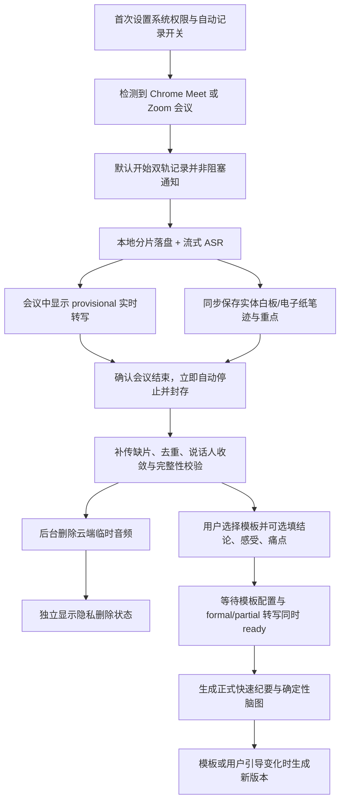

# InkLoop 实时会议事实链、跨平台 Core 与场景化纪要

## Problem Frame

InkLoop 目前可以采集实时笔迹、板书 OCR 和 Google Meet / Zoom 会后转写，但第三方转写可能不完整、发生偏差，也难以用原始事实复现和调试。会议或课堂的正式结果若依赖第三方加工结果，InkLoop 无法稳定保证完整性、可追溯性和重算能力。

首个里程碑需要建立一条实时、自有且可调试的会议事实链。用户在首次安装时一次完成系统权限，并自主开启“自动记录受支持会议”；此后检测到目标会议时默认开始双轨录制和实时转写，不再逐场弹出阻塞确认，但必须非阻塞通知、持续显示状态并允许一键停止。Mic 轨记录老师实际使用的本机/外接教学麦克风，Remote 轨记录目标会议应用播放的远端音频；两轨本地可靠落盘并同步流式送入 ASR，会议后只做缺口补传和正式收敛。原始双轨长期留在用户 Mac，第三方会议平台只承担通话与可选对照作用。

板书的首要来源是老师使用 InkLoop 白板笔在实体白板上产生的 PenFrame / InkEvent；Live Board 是实体板书的实时数字镜像与投影视图。会议中的电子纸手写是第二板书来源，使用同一 InkGraph 契约但保留不同 surface 来源。音频、实体板书笔迹、电子纸笔迹、板书快照和用户重点共同形成 Evidence Snapshot。

首发应用适配 macOS、Chrome Google Meet 和 Zoom macOS 桌面端，但 Session、Clock、Media Chunk、流式传输、Transcript 和 Evidence 生命周期必须位于跨平台 Meeting Media Core SDK，macOS/Windows 应用只承担平台能力适配。实时板书进入 Google Meet / Zoom 的虚拟摄像头能力单独放到第二阶段，不阻塞实时转写事实链落地。

## User Flow

## Requirements

**会议检测、授权与录制状态**

- R1. 首版支持 macOS 上 Chrome 中运行的 Google Meet，以及 Zoom macOS 桌面端；首次安装向导一次完成所需系统权限，并让用户明确开启或关闭“自动记录并实时转写受支持会议”。
- R1a. 自动记录开启后，检测到目标会议默认直接开始录制和实时转写，不再逐场弹出阻塞确认；同时必须保留用户主动“开始记录”的手动入口，覆盖检测漏报和自动模式关闭的场景。
- R2. 首次启用时必须说明采集 Mic/目标应用音频、本地原始文件保存、实时云处理范围以及用户履行参会人告知的责任；具体告知方式按投放地区和组织政策审阅。
- R3. 自动模式只能对白名单会议应用和明确识别的会议状态生效，不得退化成全天候后台录音；每次自动开始必须发送非阻塞通知，并提供“停止本场”和“以后不自动记录此应用”。
- R4. 录音期间必须持续显示清晰、不可混淆的录制状态，并提供暂停、继续和立即停止操作。
- R5. 检测器确认会议结束后必须立即自动停止并封存，不显示倒计时，也不要求用户操作；随后以非阻塞通知说明记录已停止并开始 formal 收敛。自动停止后若用户仍需记录，应手动开启新会话，不能继续向已结束会议追加音频。
- R5a. 只有明确的会议结束信号才能触发 R5。窗口失焦、切换标签页、应用进入后台、短暂断网或静音不得单独判定为结束；自动停止事件必须记录具体检测信号，以便评估误停和漏停。
- R6. 权限不足、某一路音频不可用、磁盘空间不足或录音异常时，必须在会议期间明确告知，不能将降级录制伪装为完整记录。

**自有音频事实源**

- R7. InkLoop 同时采集老师实际使用的本机/外接教学麦克风和目标会议应用播放音频，并将两路原始音频独立保存，以便区分本地与远端声音、重新转写和问题调试。
- R7a. 正常路由下目标会议应用输出通常不包含本机麦克风直送，但扬声器回采和本地监听可能造成重复；系统必须以 Remote 轨为回声参考，分轨转写后结合时序、声学和文本相似度抑制残余重复，低置信冲突保留并标记。AEC 与去重只作用于派生结果，不得覆盖原始双轨。
- R8. 两路音频必须共享可对齐的会议时间轴，并可与实时笔迹、板书快照和用户重点标记按时间关联。
- R9. 原始双轨长期保存在用户 Mac 本地；用户可以查看占用空间、定位本地文件、重新转写并主动删除。
- R10. Google Meet / Zoom 提供的字幕、转写或智能纪要只能作为可选对照和故障兜底，默认不作为正式纪要的权威事实源。
- R11. 若自有录音不完整，正式产物必须暴露缺失区间和证据状态；第三方工件补足的内容必须保留独立来源标识，不能与自有事实静默混合。

**实时云端转写、会后收敛与隐私**

- R12. 首版即提供实时流式转写；每个已封存双轨分片必须同时安全落盘并进入流式发送队列，网络或 ASR 故障不得影响本地事实保存。
- R12a. 实时结果标为 `provisional` 并使用稳定 utterance ID 支持修订；会议结束后只补传缺片并完成尾部、标点、去重、说话人和覆盖校验，收敛为 `formal`，不得无条件从零重跑整场 ASR。
- R13. 云端只接收实时转写和正式收敛所需的临时音频分片；完成转写与完整性校验后必须自动删除云端和 Provider 侧临时音频。
- R14. 云端可保留带时间戳的转写、说话人聚类、来源状态和证据引用，但不得把临时原始音频作为长期资产保留。
- R15. 上传、转写、校验和云端删除必须对用户呈现可理解的状态；失败时本地源文件仍可重试，不能因为云端失败丢失事实源。
- R15d. formal 转写与完整性校验完成后，纪要生成和云端临时音频删除并行执行；删除失败进入独立隐私状态和幂等重试，不得阻塞快速纪要、脑图或其他正式结果可见。

**板书来源与跨平台边界**

- R15a. 板书首要来源是老师使用 InkLoop 白板笔在实体白板上产生的结构化 PenFrame / InkEvent；Live Board 是该实体板书的数字镜像，不得被描述成取代老师实体书写的独立主输入。
- R15b. 电子纸手写是第二板书来源，与实体白板笔迹使用统一 InkGraph 契约，但必须保留设备、surface 类型、坐标与时间来源；摄像头画面只能作为可选视觉上下文。
- R15c. Session、Clock、Media Chunk、ACK/补传、Transcript、Evidence 和 Provider 接口进入跨平台 Core SDK；macOS 首发 Adapter 实现会议检测、权限、媒体采集和安全存储，后续 Windows Adapter 复用同一数据流而不复制业务状态机。

**说话人与正式版本**

- R16. 首版自动区分本机发言与远端说话人聚类，并结合已知参会人、上下文和语言风格做自动身份匹配；高置信结果可使用已知姓名，低置信结果继续使用稳定匿名标签，不得编造身份。
- R17. 不设置“用户确认说话人”步骤。身份分析与转写收敛在后台自动完成；身份置信度不足只影响展示标签，不阻塞纪要。
- R18. 会议结束后先让用户选择场景模板，可选填“当场结论、最深感受、关注痛点”；音频补传和 formal/partial 转写收敛同时在后台并行。
- R19. 正式后处理只在模板配置已提交且 formal 或明确 partial 转写已收敛后启动。模板或用户引导变化生成新 Evidence revision，旧版本保留，不做不可逆覆盖。

**场景模板与内容规则**

- R20. 系统根据会议标题、日程信息、转写和板书证据推荐场景模板，但正式后处理前由用户选择；用户可同时提供当场结论、最深感受和关注痛点作为 `user_supplied` 引导。
- R21. 第一批只交付“会议纪要专家”和“访谈备忘录”；“大学课堂笔记”和“互动课堂”作为第二批模板，复用同一事实链。“推理总结”是内部分析和模板路由能力，不作为独立业务模板暴露。
- R22. 所有模板必须遵守事实锚定、信息密度优先、无实质内容则省略、说话人标识一致、推测与事实分离、输出语言与输入一致等共通约束；用户引导只调整信息优先级和组织方向，未被转写或板书支持的内容不得写成 confirmed fact/decision，可明确呈现为用户个人备注。
- R23. 用户重点标记享有最高处理优先级，必须优先进入快速纪要，并在面向用户的正式输出中突出显示，同时保持对原始转写或板书位置的引用。
- R24. 会议纪要专家采用三层金字塔：第一层必须包含精准标题、一句话摘要、结论或共识以及实际存在的待办；第二层按需包含讨论脉络和关键提取；第三层仅在出现实质战略讨论、未解决重要分歧或风险信号时输出，并将推理标记为 `[分析]`。
- R25. 会议纪要篇幅随会议时长自适应：不超过 15 分钟以第一层为主；15–45 分钟按需加入第二层；45 分钟以上可按明确信号加入第三层。任何层级的篇幅目标不得迫使系统输出空壳或低价值内容。
- R26. 访谈备忘录按问题与发言人组织内容，保留数字、专有名词和具体例子；每条被保留的实质发言只归入一个议题，噪声和无实质内容按 R22 省略；会议结束时将需确认事项和后续行动分别输出。
- R27. 第二批大学课堂笔记应覆盖概念与定义、讲授要点、案例、教师强调、问答、知识联系、复习主题、记忆辅助和可能考题；不存在的板块必须省略。
- R28. 第二批互动课堂应按教学时间顺序生成简明复习材料，突出术语、公式、示例和复习问题，过滤无关插曲及无实质课堂讨论。

**快速纪要与可视化脑图**

- R29. 快速纪要继续优先提供短摘要和结构化卡片，按需完整报告保持独立后台任务，不得阻塞快速结果。
- R30. 脑图必须从已经校验的结构化纪要确定性生成，不增加额外模型调用，也不得出现纪要中不存在的事实节点。
- R31. 脑图以会议或课程主题为中心，子节点随模板动态变化：会议可展开结论、讨论、行动、风险与待确认；访谈可展开问题、受访者观点、洞察和后续行动；教育模板采用概念、案例、问答与复习任务。
- R32. 每个脑图内容节点必须能回到对应转写时间或板书位置；自动身份映射、模板或用户引导变化后，脑图随正式纪要重新生成。

**第二阶段实时板书转播**

- R33. 第二阶段提供 InkLoop macOS 虚拟摄像头，将 Live Board 画面作为原生摄像头源送入 Google Meet / Zoom；该能力不依赖两家平台的深度会议 API。
- R34. 在虚拟摄像头交付前，实时板书继续使用已有 Live Board 链接或屏幕共享，不阻塞首个自有事实链里程碑。
- R35. 虚拟摄像头只承担板书视频转播，不能替代双轨音频事实源，也不改变正式纪要的证据规则。

## Success Criteria

- 在受支持的 Google Meet 与 Zoom 测试会议中，已开启自动记录的用户无需逐场确认即可开始，且每次开始都有非阻塞通知、整个录制期间都有准确状态并可一键停止。
- 至少覆盖本地发言、远端单人、远端多人、耳机、扬声器回采、本地监听、断网追平、暂停恢复、应用异常恢复和缺失一路音频；任何不完整采集或低置信重复都能被识别。
- 麦克风、系统音频、笔迹和板书快照在共同时间轴上达到足以从纪要节点回放对应证据的对齐精度。
- 会议中可仅依赖 InkLoop 自有双轨音频持续显示 provisional 实时转写；会议结束后通过缺片补传和增量收敛生成 formal 转写、临时纪要和脑图，不需要 Google Meet / Zoom 转写。
- 实体白板笔迹、电子纸笔迹、Mic 与 Remote 音频都保留明确 source 和统一 Session Clock；Live Board 能准确表现实体板书的数字镜像。
- Core SDK 不依赖 macOS 媒体 API；macOS 能力通过 Adapter 接入，协议级测试可用模拟 Adapter 验证断线、乱序、补传和版本收敛。
- 自动身份映射修订后，正式纪要和脑图正确更新，旧版本仍可查看；低置信身份保持匿名标签。
- 云端临时音频在转写和完整性校验成功后按策略删除；失败任务保留本地事实源并支持安全重试。
- 第一批会议与访谈模板通过固定真实样本集验证：无虚构事实、无无效证据引用、用户重点不遗漏、无内容板块不输出。
- 快速纪要性能不因脑图而增加模型调用；完整报告仍不会阻塞其他会议的快速纪要。

## Scope Boundaries

- 首个里程碑仅支持 macOS、Chrome Google Meet 和 Zoom macOS 桌面端；Safari、Edge、Windows、移动端和其他会议软件不在首版范围。
- 首版提供云端流式 ASR 和实时转写，但不要求首版训练或托管自有基础语音模型；Provider 必须可替换。
- 首版不保证所有远端参会人都能自动匹配真实姓名；低置信结果保留匿名标签，不要求用户确认。
- 首版不交付虚拟摄像头；采用 Live Board 链接或屏幕共享。虚拟摄像头属于明确的第二阶段。
- 不做 Google Meet / Zoom 深度实时 API 集成，不以平台私有转写作为正式权威事实源。
- 第一批不交付大学课堂笔记和互动课堂模板；课前教学素材与教案整理沿用现有独立能力，不纳入本项目。
- 首版不通过模型生成自由形态脑图，也不额外调用模型优化脑图布局。
- 视频画面不进入纪要事实提取；只有未来明确需要识别摄像头或共享课件时再单独评估。

## Key Decisions

- macOS 应用优先、Core SDK 跨平台：首发只验证一套原生媒体能力，但通用数据流和生命周期不写死在 macOS。
- 先事实链、后虚拟摄像头：音频完整性和可调试性直接决定纪要可信度；实时板书已有链接与屏幕共享兜底。
- 实时转写＋会后增量收敛：会议中并行消化 ASR 耗时，会后只补齐和校验；本地落盘保证实时网络失败不损伤事实源。
- 本地长期保留、云端临时处理：兼顾重新转写与问题调试，同时降低云端原始录音的隐私和存储风险。
- 一次设置、默认自动运行：以首次明确开关、目标会议白名单、非阻塞开始通知、持续状态和一键停止降低心智负担；不使用逐场阻塞弹窗。
- 确认结束即停止：不增加倒计时操作；明确检测到会议结束后立即封存，后续内容如需记录必须另开新会话。
- 实体白板优先：InkLoop 白板笔在实体白板上的书写是板书主事实，Live Board 是数字镜像；电子纸是第二来源。
- 双轨不是简单拼接：Mic 代表老师的输入，Remote 代表会议应用输出；AEC 和跨轨去重负责处理扬声器回采或本地监听造成的重复。
- 自动推荐、用户先选模板：在正式后处理前明确内容链路，同时保留后续切换和重新生成能力。
- 配置与转写并行：用户先完成模板和可选关注信息，系统在后台收敛身份与转写；双条件齐备后自动生成正式结果。
- 脑图确定性生成：复用结构化纪要，保持低延迟、事实一致和证据可追溯。
- 会议与访谈优先：先服务当前已经跑通真实数据评估的会议后处理链，教育模板作为第二批复用基础设施。

## Dependencies / Assumptions

- 现有仓库已经具备实时笔迹、Live Board、板书 OCR、Evidence Snapshot、会后纪要、版本化 Artifact 和 Provider 转写对照能力。
- 当前仓库未发现原生 macOS 应用目标、系统音频录制或虚拟摄像头实现；macOS Companion 是新增产品能力。
- 用户拥有录制会议的合法权限，并负责按所在地区和组织要求告知参会人；InkLoop 仍需提供首次明确选择、每场可见状态和可审计的会话事件。
- 云端转写服务能够接受双轨或带来源标识的流式音频，返回支持修订且可映射到统一时间轴的分段结果。

## Outstanding Questions

### Resolve Before Planning

- 无。

### Deferred to Planning

- [Affects R1–R8][Needs research] 确定最低 macOS 版本、系统音频与麦克风采集能力、Chrome Meet/Zoom 明确结束信号与误停/漏停指标、AEC/重复抑制边界，以及异常恢复的原生技术路线。
- [Affects R9, R12–R15][Security] 明确定义本地文件保护、上传加密、临时对象生命周期、删除确认、重试幂等和存储配额策略。
- [Affects R13][Technical] 定义“转写与完整性校验成功”的机器验收条件，确保只有满足条件后才删除云端临时音频。
- [Affects R12–R19][Needs research] 选择支持稳定 ID/修订协议的流式 ASR 与说话人聚类方案，并建立多人、重叠发言、回声、重复和低质量网络音频评测集。
- [Affects R20–R32][Technical] 将模板选择、版本重算和脑图投影纳入现有后处理 Artifact 生命周期的具体方案。
- [Affects R1–R6][Design/Legal] 设计首次自动记录开关、每场非阻塞通知、常驻状态、参会人告知提醒和权限失败体验，并进行适用市场的法律审阅。
- [Affects R15c][Technical] 冻结 Core SDK 与平台 Adapter 的能力声明、错误/降级语义和版本兼容策略，避免为未来平台抽象尚不稳定的原生实现细节。
- [Affects R33–R35][Needs research] 第二阶段研究 macOS 虚拟摄像头的系统版本、签名、公证、安装升级和 Meet/Zoom 兼容要求。

## Next Steps

-> `/ce:plan`：以首个里程碑“跨平台 Meeting Media Core SDK + macOS Adapter + 双轨实时转写/会后增量收敛 + 会议/访谈模板 + 确定性脑图”为范围创建结构化落地计划；虚拟摄像头作为独立第二阶段计划。
