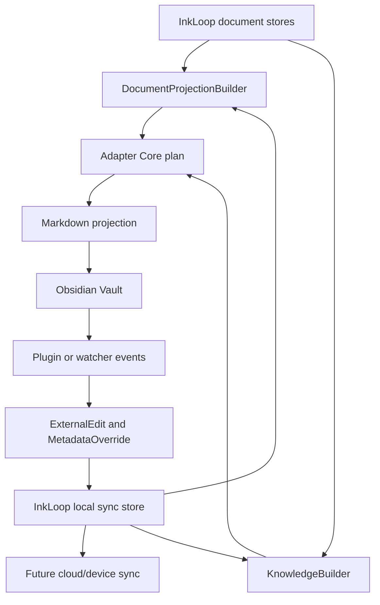
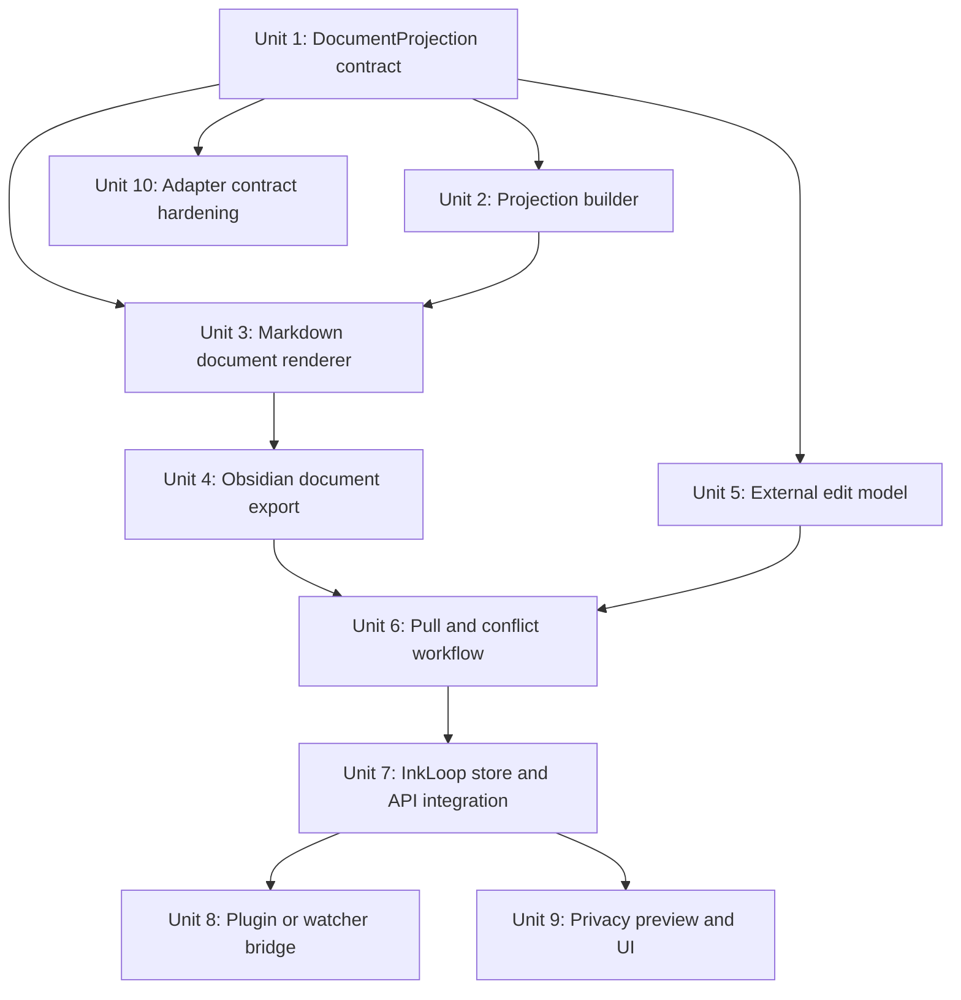
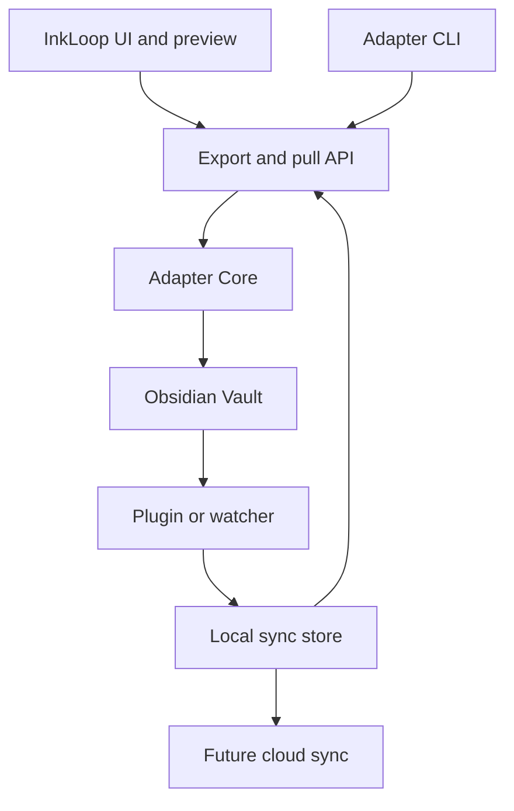

# feat: Editable Document Adapter MVP

## Overview

This plan updates the original `KnowledgeObject x Adapter x Obsidian` landing plan from a phased V1 export into a final MVP: InkLoop documents must become readable and editable in Obsidian, with changes syncing back to InkLoop local storage and the future cloud/device sync layer.

The key product correction is that Obsidian is not a mirror of InkLoop runtime state. It is an editable external workspace. InkLoop remains authoritative for source assets, anchors, AI-generated facts, object ids, and original annotation evidence. Obsidian becomes authoritative for external edits, user-written document notes, task completion, tags, file placement, and external reading/modification state within the exported workspace.

The current adapter substrate already covers KO schema validation, mock fixtures, Markdown rendering, Obsidian FS export, binding storage, idempotence, conflict snapshots, and metadata pull. The final MVP builds on that substrate but shifts the center of gravity from "note projection" to "editable document projection".

## Problem Frame

The old plan assumes the primary deliverable is stable projection of `KnowledgeObject` records into Obsidian Markdown files. That proves the adapter path, but it does not satisfy the real user workflow:

- Users should be able to open a document in Obsidian or a similar knowledge app.
- The exported document should carry the readable document body, not only a source stub and separate notes.
- InkLoop-generated annotations, AI notes, Q&A, tasks, summaries, and excerpts should be anchored to the document projection.
- Users should be able to modify the external document or its metadata and have those changes flow back into InkLoop.
- Obsidian should not need InkLoop AI interaction. AI remains an InkLoop-side capability.

The MVP therefore needs a `DocumentProjection` layer alongside KO projection. KO remains the stable fact/object protocol, while `DocumentProjection` is the editable document envelope that external apps render and modify.

## Requirements Trace

- R1. Export a full readable source document into Obsidian, generated from InkLoop text/OCR/reflow data rather than a placeholder Source Note.
- R2. Preserve stable document, page, and block anchors so exported KO notes can point back to exact document locations.
- R3. Render annotations, AI notes, Q&A, summaries, excerpts, and tasks as anchored blocks, backlinks, callouts, or sidecar notes without requiring Obsidian-side AI.
- R4. Keep original InkLoop evidence private by default: raw strokes, HMP internals, inference views, OCR artifacts, and PDFs are not exported unless explicitly enabled.
- R5. Make repeated exports idempotent and non-destructive for user-authored content.
- R6. Pull Obsidian-side edits back as explicit external edits or metadata overrides, not as silent overwrites of InkLoop facts.
- R7. Support bidirectional sync to InkLoop local storage first, with the same records shaped for future device/cloud sync.
- R8. Include Obsidian plugin or watcher-level integration in MVP so rename, delete, modify, and mobile-safe workflows are not left as a post-MVP reliability gap.
- R9. Preserve Adapter Core portability for future Notion/Readwise/Zotero adapters through contract tests and adapter-neutral data shapes.
- R10. Provide CLI/dev workflows for fixtures and temporary vaults, plus InkLoop UI/API entry points for real document exports.
- R11. Provide conflict detection and user-resolvable records for controlled sections, document body edits, deletion, rename, and metadata divergence.
- R12. Provide privacy gates, preview, and export audit so users know what document text and notes leave InkLoop.

## Updated Product Decision

| Area | Old plan direction | Final MVP direction |
|---|---|---|
| Primary object | `KnowledgeObject` notes | `DocumentProjection` plus anchored `KnowledgeObject` notes |
| Source Note | Backlink stub | Main editable document note |
| Obsidian authority | Projection only | External workspace authority for edits and metadata |
| Sync direction | Push plus limited metadata pull | Bidirectional external edit and metadata sync |
| Plugin | V1.5 enhancement | MVP reliability component or explicit local watcher fallback |
| Notion | Future V2 idea | Adapter contract ready; full Notion adapter needs a separate concrete design |
| Runtime state | Mostly hidden | Still hidden; only user-facing document and knowledge artifacts export |

## Source Document Update Points

These are the concrete parts of the original plan that need revision before it can be treated as the final MVP spec:

| Original section | Required update |
|---|---|
| 0. Core conclusion | Replace "marks/ai_turns/HMP/InferenceView to KO to Obsidian notes" with "InkLoop runtime to DocumentProjection plus KO to editable external workspace". |
| 1.1-1.2 Architecture and chain relationship | Add `DocumentProjectionBuilder` between InkLoop document stores and Adapter Core. KO projection becomes one part of a larger document workspace export. |
| 1.3 Responsibility boundary | Keep Adapter blind to Stroke/HMP internals, but allow it to consume document projection fields: readable body, block anchors, page anchors, export metadata, and external edit cursors. |
| 1.4 Truth source principle | Split authority: InkLoop owns original assets, anchors, AI facts, and KO content hashes; Obsidian owns user edits, free notes, task completion, tags, file moves, and external document modifications. |
| 1.5 V1/V1.5/V2 scope | Collapse the "only FS V1 first" interpretation. MVP includes FS export, plugin or watcher reliability, metadata pull, external edit pull, and InkLoop integration. |
| 2. Schema design | `source_document` cannot be only another KO kind. Add or formalize `DocumentProjection` with document body, block anchors, source ranges, generated regions, editable regions, and revision identity. |
| 2.2 Fields not in KO | Keep raw strokes and HMP out of KO, but add controlled export options for source PDF links, page images, OCR snippets, and document body text through the projection/privacy gate. |
| 3. KnowledgeBuilder | Add `DocumentProjectionBuilder` and make KnowledgeBuilder attach KOs to projection anchors instead of producing only standalone notes. |
| 4. Adapter Core | Extend lifecycle from `plan/render/apply/pullMetadata` to include document projection planning, external edit ingestion, sync cursors, and bidirectional conflict records. |
| 5.7-5.9 Markdown identity and controlled sections | Distinguish generated immutable sections, user-editable regions, and externally edited document body regions. Do not treat every controlled edit as only a conflict. |
| 5.17 Source Note design | Promote Source Note from backlink stub to the primary full document file, with stable block ids and embedded or linked InkLoop artifacts. |
| 5.20 Metadata Pull | Broaden to metadata plus external edits: tags, status, tasks, free notes, document body edits, rename/delete/move, and sync cursor updates. |
| 6. Obsidian Plugin Adapter | Move from V1.5 spike to MVP reliability requirement unless a local watcher bridge provides equivalent event capture. |
| 7. API design | Add document projection endpoints, external edit ingestion endpoints, sync job APIs, and conflict resolution APIs that are not KO-only. |
| 8. Storage design | Add document projections, external edits, metadata overrides, adapter targets, sync cursors, outbox/inbox records, and conflict records. |
| 9. Tech choices | Revisit "no AST Markdown renderer" once full document body editing and block-level merges enter scope. Template strings can stay for KO sidecar notes but may be insufficient for source documents. |
| 10. Task breakdown | Reorder work around document projection first, then adapter rendering, then bidirectional sync and plugin reliability. |
| 11. Test plan | Add full document projection, edit roundtrip, anchor stability, conflict, privacy, plugin/watcher, and adapter contract tests. |
| 12. Privacy and security | Treat source document body export as materially higher sensitivity than note export. Preview must show document text export scope. |
| 14. Acceptance loop | Replace fixture-only note export acceptance with real document open/export/edit/pull/re-export acceptance. |
| 18. ADRs | Update ADR-0001 and ADR-0003: Adapter still does not consume runtime internals, but it does consume `DocumentProjection`; InkLoop is not the only truth source for external edits. |
| 19. First-week checklist | Replace schema-only kickoff with projection fixture, source document renderer, external edit model, and temp vault roundtrip. |

## Scope Boundaries

- The MVP does not reproduce InkLoop's full runtime state inside Obsidian: raw strokes, HMP, InferenceView internals, active AI session state, vector index internals, and complete OCR debug layers stay internal unless a privacy-gated attachment export is later enabled.
- Obsidian does not run InkLoop AI workflows. It displays and edits documents and external notes; AI generation remains InkLoop-side.
- The MVP should not silently overwrite InkLoop facts with external edits. External changes become explicit edits, overrides, or conflicts.
- The MVP should not ship a shallow Notion implementation without a separate mapping design. It must keep Adapter Core ready for Notion and prove this through contract tests.

### Deferred to Separate Tasks

- Full Notion adapter: separate plan covering Notion page/database mapping, block id tracking, rate limits, auth, and conflict behavior.
- Raw PDF asset export: optional privacy-gated attachment export after document projection and edit sync are stable.
- Multi-user cloud conflict UI: the MVP should persist cloud-shaped sync records, but final multi-user resolution UX can follow once cloud storage is chosen.

## Context & Research

### Relevant Code and Patterns

- `src/knowledge/knowledge-object.ts`: current KO schema includes `source_document`, but it is still body-limited and KO-shaped.
- `src/knowledge-builder/*`: current builder folds marks and AI turns into KOs; it does not yet build a full document projection.
- `src/adapters/markdown/*`: current Markdown renderer supports frontmatter, controlled sections, snapshots, and source note stubs.
- `src/adapters/obsidian-fs/*`: current FS adapter handles vault validation, path policy, atomic writes, bindings, metadata pull, idempotence, and conflicts.
- `src/local/store.ts`: current local store owns docs, PDF blobs, marks, AI turns, reading position, and page/reflow caches.
- `docs/前端标注链路-技术文档.md`: existing system has object anchors and two projections that should inform block/page anchor design.

### Existing Substrate Already Landed

- KO runtime validation and fixtures.
- Fixture validation CLI.
- KnowledgeBuilder mockable input ports.
- Adapter Core interfaces and storage.
- Markdown renderer with controlled sections.
- Obsidian FS adapter with dry run, real export, binding relink, conflict snapshots, and metadata pull.
- Regression tests around idempotence, dry-run state, duplicate controlled sections, existing file relink, and vault path safety.

### External References

- None used for this plan. Obsidian plugin API details should be refreshed from official docs during the plugin implementation unit.

## Key Technical Decisions

- Add `DocumentProjection` instead of overloading `KnowledgeObject`: KO is best for discrete knowledge facts; full editable documents need block-level identity, revision metadata, generated/editable region semantics, and sync cursors.
- Treat external edits as first-class records: Obsidian edits should become `ExternalEdit` or `MetadataOverride` records so InkLoop can display, accept, reject, merge, or sync them.
- Keep generated anchors stable: page anchors and block ids must survive re-export when document text has not materially changed.
- Use source document Markdown as the primary Obsidian artifact: sidecar KO notes should backlink into the document rather than requiring users to browse fragmented notes first.
- Include plugin or watcher reliability in MVP: file-system export alone cannot robustly observe rename/delete/modify across user workflows.
- Keep privacy gates before projection: full document text export is more sensitive than note export and must be previewed.

## Open Questions

### Resolved During Planning

- Should Obsidian mirror all InkLoop runtime data? No. It should reproduce only the user-facing document and knowledge workspace needed for reading and editing.
- Should AI interaction exist in Obsidian? No. AI stays in InkLoop.
- Should MVP stop at FS V1? No. Final MVP includes reliable bidirectional sync and InkLoop integration, not just one-way file export.
- Should external edits overwrite InkLoop facts directly? No. They become explicit external edit records or metadata overrides.

### Deferred to Implementation

- Exact block anchor generation algorithm: choose after inspecting current reflow block structure and available source ranges.
- Exact source document merge strategy: characterize current Markdown renderer limits before deciding whether to introduce mdast/remark.
- Exact Obsidian plugin packaging: refresh official Obsidian API docs before implementation.
- Exact cloud transport: implement local outbox/inbox and sync-shaped storage first; bind to cloud once the storage target is selected.

## Output Structure

Expected new or expanded areas:

```text
src/knowledge/
  document-projection.ts
  external-edit.ts
src/knowledge-builder/
  document-projection-builder.ts
src/adapters/core/
  document-sync.ts
src/adapters/markdown/
  render-document-projection.ts
  parse-document-edits.ts
src/adapters/obsidian-fs/
  document-adapter.ts
  external-edit-puller.ts
plugins/obsidian-inkloop/
  manifest.json
  src/
src/sync/
  adapter-sync-store.ts
  sync-outbox.ts
```

The final layout may change if implementation reveals a simpler fit, but the MVP needs these responsibilities somewhere in the repo.

## High-Level Technical Design

> This illustrates the intended approach and is directional guidance for review, not implementation specification. The implementing agent should treat it as context, not code to reproduce.



## MVP Acceptance Criteria

- A real or fixture-backed InkLoop document exports to Obsidian as a readable full document file under the visible `InkLoop/` directory.
- Internal state, sidecar KO artifacts, task metadata, and sync outbox files stay under hidden `.inkloop/` directories unless explicitly promoted.
- Anchored KO artifacts render as readable annotation titles in the source document, with stable hidden metadata for round-trip mapping.
- Re-running export is idempotent and preserves user-written external content.
- Editing tags, task completion, free notes, and document body regions in Obsidian creates pullable records in InkLoop.
- Rename, move, delete, and controlled-section edits are detected and stored as binding updates, external edits, or conflicts.
- InkLoop can display or at least persist pulled external edits in local storage, shaped for later cloud/device sync.
- Export preview and privacy gate show when full document text will be exported.
- No Obsidian-side AI interaction or custom renderer is required for the workflow; the plugin runs in the background and Obsidian's native Markdown preview renders documents.

## Implementation Units



- [x] **Unit 1: DocumentProjection Contract**

**Goal:** Define the adapter-facing document projection contract that carries full readable document content, page anchors, block anchors, source ranges, revision identity, and export privacy state.

**Requirements:** R1, R2, R4, R7, R9, R12

**Dependencies:** Current KO schema and fixture validation.

**Files:**
- Create: `src/knowledge/document-projection.ts`
- Create: `src/knowledge/external-edit.ts`
- Create: `packages/ko-schema/fixtures/document-projections.json`
- Modify: `scripts/validate-fixtures.ts`
- Test: `src/knowledge/document-projection.test.ts`

**Approach:**
- Keep KO schema stable for discrete facts.
- Add a projection envelope that can include generated body blocks, page anchors, block anchors, source object refs, editable region markers, privacy flags, and content/revision hashes.
- Add fixture validation for both KO and document projection envelopes.
- Avoid raw strokes, HMP internals, and inference-view debug fields in the default projection schema.

**Patterns to follow:**
- `src/knowledge/knowledge-object.ts`
- `packages/ko-schema/fixtures/knowledge-objects.json`

**Test scenarios:**
- Happy path: a projection with two pages, block anchors, and export-allowed body validates and computes stable hashes.
- Edge case: a projection with missing page anchor or duplicate block anchor fails validation.
- Error path: a projection that includes local-only content without export permission is rejected by export filtering.
- Integration: fixture validation accepts KO and document projection envelopes together.

**Verification:**
- Fixture validation covers both KO and document projection inputs.
- Projection ids, page anchors, block anchors, and revision hashes are deterministic for unchanged content.

- [x] **Unit 2: DocumentProjectionBuilder**

**Goal:** Build full document projections from InkLoop document metadata, page text, OCR/reflow blocks, and existing object anchors.

**Requirements:** R1, R2, R3, R4, R10

**Dependencies:** Unit 1.

**Files:**
- Create: `src/knowledge-builder/document-projection-builder.ts`
- Modify: `src/knowledge-builder/types.ts`
- Modify: `src/local/store.ts`
- Modify: `src/core/store-format.ts`
- Test: `src/knowledge-builder/document-projection-builder.test.ts`

**Approach:**
- Add store ports for page text/reflow blocks and source object refs.
- Generate a readable body from the best available text layer: reflow first, OCR/text cache second, minimal page placeholder last.
- Preserve page and block identity across rebuilds when source ranges and text are stable.
- Link KOs by document id, page index, object refs, or anchor bbox to projection anchors.

**Patterns to follow:**
- Existing `getFoldedMarks` and `getFoldedAiTurns` store folding.
- Existing `surface` object anchor and reflow concepts documented in `docs/前端标注链路-技术文档.md`.

**Test scenarios:**
- Happy path: a mock document with reflow blocks builds a source document projection with stable page and block anchors.
- Edge case: missing OCR/text falls back to page placeholders and warnings without crashing export.
- Error path: a document marked local-only is skipped unless export permission is present.
- Integration: KOs created by KnowledgeBuilder can be associated with projection block anchors.

**Verification:**
- A fixture-backed document can produce a complete projection without any live PDF dependency.
- Rebuilding the same document does not churn anchor ids.

- [x] **Unit 3: Markdown Document Renderer**

**Goal:** Render source document projections into Obsidian-readable Markdown with stable anchors, generated sections, editable regions, and anchored InkLoop artifacts.

**Requirements:** R1, R2, R3, R5, R11

**Dependencies:** Units 1 and 2.

**Files:**
- Create: `src/adapters/markdown/render-document-projection.ts`
- Create: `src/adapters/markdown/parse-document-edits.ts`
- Modify: `src/adapters/markdown/controlled-section.ts`
- Modify: `src/adapters/markdown/renderer.ts`
- Test: `src/adapters/markdown/render-document-projection.test.ts`
- Test: `src/adapters/markdown/parse-document-edits.test.ts`

**Approach:**
- Render the source document as the primary Markdown file.
- Use stable page and block anchors that Obsidian links can target.
- Keep InkLoop-generated sections distinguishable from user-editable sections.
- Support embedded callouts or sidecar backlinks for KO artifacts.
- Characterize whether the current string renderer remains safe for document body merges before introducing an AST renderer.

**Patterns to follow:**
- Existing frontmatter and controlled section rendering.
- Existing conflict snapshot behavior.

**Test scenarios:**
- Happy path: a projection with page blocks and two anchored KOs renders to one source document and linked sidecar note content.
- Edge case: a user-edited region survives re-render while generated sections update.
- Error path: duplicate block anchors are reported as document-render conflicts.
- Integration: parsed external edits map back to projection block ids.

**Verification:**
- Markdown output is stable across repeated renders.
- User-editable regions remain roundtrippable.

- [x] **Unit 4: Obsidian Document Export**

**Goal:** Extend the Obsidian FS adapter from KO note export to full source document export with sidecar artifacts, bindings, atomic writes, and idempotence.

**Requirements:** R1, R3, R5, R10, R11

**Dependencies:** Units 1-3.

**Files:**
- Create: `src/adapters/obsidian-fs/document-adapter.ts`
- Modify: `src/adapters/obsidian-fs/adapter.ts`
- Modify: `src/adapters/obsidian-fs/path-policy.ts`
- Modify: `src/adapters/obsidian-fs/cli.ts`
- Modify: `src/adapters/obsidian-fs/storage.ts`
- Test: `src/adapters/obsidian-fs/obsidian-document.integration.test.ts`

**Approach:**
- Add CLI/dev support for exporting a projection envelope plus KOs.
- Store bindings for source documents and KO artifacts separately.
- Preserve existing path safety and atomic write behavior.
- Ensure source document export can relink to existing files through frontmatter identity.

**Patterns to follow:**
- Existing Obsidian FS adapter integration tests.
- Existing dry-run and real export behavior.

**Test scenarios:**
- Happy path: fixture projection exports to visible `InkLoop/` with hidden `.inkloop/` state and sidecar data.
- Edge case: re-export after user edits keeps editable regions and updates generated regions.
- Error path: deleting the source document records remote missing and creates a new projection only under policy.
- Integration: dry-run produces plan events without modifying adapter state.

**Verification:**
- Temp vault export demonstrates source document, sidecar notes, state file, and idempotent second run.

- [x] **Unit 5: External Edit and Metadata Model**

**Goal:** Represent Obsidian-originated changes as first-class records that can be persisted, reviewed, synced, and merged.

**Requirements:** R6, R7, R11

**Dependencies:** Unit 1.

**Files:**
- Create: `src/adapters/core/document-sync.ts`
- Modify: `src/adapters/core/types.ts`
- Modify: `src/adapters/core/storage.ts`
- Test: `src/adapters/core/document-sync.test.ts`

**Approach:**
- Model external document body edits, user free notes, tags, task status, file path changes, deletion, and controlled-section edits.
- Store sync cursor and remote revision state per binding.
- Distinguish accepted metadata overrides from unresolved conflicts.

**Patterns to follow:**
- Existing `ExternalBinding`, `SyncEvent`, and `ConflictRecord` concepts.

**Test scenarios:**
- Happy path: an Obsidian task checkbox update becomes a metadata override.
- Happy path: a user paragraph edit becomes an external document edit tied to a block anchor.
- Edge case: a file rename updates binding without creating a content conflict.
- Error path: a controlled generated section edit creates a conflict snapshot.

**Verification:**
- External changes can be serialized and replayed without access to Obsidian.

- [x] **Unit 6: Pull and Conflict Workflow**

**Goal:** Pull external edits from the vault, classify them, persist them, and surface conflicts without losing generated or user-authored content.

**Requirements:** R5, R6, R7, R8, R11

**Dependencies:** Units 4 and 5.

**Files:**
- Create: `src/adapters/obsidian-fs/external-edit-puller.ts`
- Modify: `src/adapters/obsidian-fs/metadata-puller.ts`
- Modify: `src/adapters/obsidian-fs/scanner.ts`
- Modify: `src/adapters/obsidian-fs/conflicts.ts`
- Test: `src/adapters/obsidian-fs/external-edit-puller.test.ts`
- Test: `src/adapters/obsidian-fs/obsidian-roundtrip.integration.test.ts`

**Approach:**
- Scan source documents and sidecar KO notes.
- Compare remote revision markers, controlled section hashes, editable region content, frontmatter metadata, and path state.
- Persist safe pulls automatically and conflicts explicitly.
- Keep the previous metadata-only pull behavior as a subset.

**Patterns to follow:**
- Existing scanner, metadata puller, and conflict regression tests.

**Test scenarios:**
- Happy path: free-note edit and tag edit are pulled and stored.
- Happy path: source document editable-region edit is pulled as an external edit.
- Edge case: duplicated active controlled sections produce a conflict, not a silent overwrite.
- Error path: a missing source document records a deletion event according to policy.
- Integration: export, edit in temp vault, pull, re-export preserves the edit.

**Verification:**
- Temp vault roundtrip covers export, manual edit simulation, pull, and re-export.

- [x] **Unit 7: InkLoop Store and API Integration**

**Goal:** Persist projections, external edits, metadata overrides, conflicts, and sync cursors in InkLoop local storage, and expose API/CLI entry points for real documents.

**Requirements:** R6, R7, R10, R11

**Dependencies:** Units 1, 2, 5, and 6.

**Files:**
- Modify: `src/local/store.ts`
- Modify: `src/core/store-format.ts`
- Create: `src/sync/adapter-sync-store.ts`
- Create: `src/sync/sync-outbox.ts`
- Modify: `server/standalone.ts` if present after API inspection
- Test: `src/sync/adapter-sync-store.test.ts`
- Test: `src/local/store-adapter-sync.test.ts`

**Approach:**
- Add local stores or versioned records for document projections, adapter targets, sync cursors, external edits, metadata overrides, and conflicts.
- Shape records so they can later be uploaded to cloud without changing adapter semantics.
- Expose export, preview, pull, and conflict resolution entry points through the current dev/API surface.

**Patterns to follow:**
- Existing IndexedDB versioned store setup and defensive fallback behavior.

**Test scenarios:**
- Happy path: pulled external edits persist and survive reload.
- Happy path: projection records can be rebuilt and queried by document id.
- Edge case: IndexedDB unavailable keeps adapter CLI workflows usable with JSON storage.
- Error path: unsupported local store version fails closed with a recoverable warning.
- Integration: real builder output can be exported through the adapter API path.

**Verification:**
- InkLoop can initiate export and pull using real document state, not only fixture files.

- [x] **Unit 8: Obsidian Plugin or Watcher Bridge**

**Goal:** Add reliable event capture for modify, rename, delete, and mobile-aware workflows through an Obsidian plugin or a clearly documented local watcher fallback.

**Requirements:** R6, R7, R8, R10, R11

**Dependencies:** Units 5-7.

**Files:**
- Create: `plugins/obsidian-inkloop/manifest.json`
- Create: `plugins/obsidian-inkloop/package.json`
- Create: `plugins/obsidian-inkloop/src/main.ts`
- Create: `plugins/obsidian-inkloop/src/settings.ts`
- Create: `plugins/obsidian-inkloop/src/sync-client.ts`
- Test: `plugins/obsidian-inkloop/src/main.test.ts`

**Approach:**
- Refresh official Obsidian plugin API docs before implementation.
- Prefer Vault API and frontmatter API for plugin writes.
- Use local HTTP bridge or JSON outbox as transport.
- If plugin work is too large for the first cut, implement a local file watcher with the same event/outbox contract and keep plugin completion in this MVP plan.

**Patterns to follow:**
- Original plan section 6 for plugin architecture.
- Adapter Core sync event and outbox contracts from Units 5-7.

**Test scenarios:**
- Happy path: plugin or watcher emits modify, rename, and delete events into the sync outbox.
- Edge case: offline InkLoop bridge queues changes without data loss.
- Error path: invalid target/vault settings surface a clear error and do not write files.
- Integration: queued events are pulled into InkLoop local sync store.

**Verification:**
- Obsidian-originated file changes can be observed without relying only on a manual CLI scan.

- [x] **Unit 9: Privacy Preview and InkLoop UI**

**Goal:** Let users see and control what will export, especially full document body text, before writing to external apps.

**Requirements:** R4, R10, R12

**Dependencies:** Units 1, 2, 4, and 7.

**Files:**
- Modify: `src/dev/console.ts`
- Modify: `src/config/features.ts`
- Create: `src/adapters/preview/export-preview.ts`
- Test: `src/adapters/preview/export-preview.test.ts`

**Approach:**
- Preview document body export scope, KO count, local-only exclusions, attachment status, target vault path, and pending conflicts.
- Add an explicit gate for exporting full document text.
- Keep raw PDF, strokes, HMP, and debug evidence excluded by default.

**Patterns to follow:**
- Existing dev console feature toggles and local-only privacy filter behavior.

**Test scenarios:**
- Happy path: preview lists source document, KO artifacts, and privacy exclusions.
- Edge case: local-only document blocks export until permission changes.
- Error path: invalid vault path blocks export before any write.
- Integration: accepted preview feeds the same export plan used by CLI.

**Verification:**
- Users can distinguish "export notes only" from "export full document body" before committing.

- [x] **Unit 10: Adapter Contract Hardening**

**Goal:** Prove the new contract is not Obsidian-only and remains usable for future Notion or other adapters.

**Requirements:** R7, R9, R10

**Dependencies:** Units 1, 3, 5, and 6.

**Files:**
- Create: `src/adapters/core/adapter-contract.test.ts`
- Create: `src/adapters/markdown/notion-contract-fixture.test.ts`
- Modify: `src/adapters/core/types.ts`
- Modify: `docs/plans/2026-06-26-001-feat-editable-document-adapter-mvp-plan.md` if implementation discovers a contract gap

**Approach:**
- Keep adapter-neutral concepts out of Obsidian-specific paths.
- Add contract tests that map a projection, KO artifacts, and external edits through an adapter-neutral interface.
- Use a Notion-shaped fixture only to test portability, not to imply production Notion support.

**Patterns to follow:**
- Existing Adapter Core manifest and storage abstractions.

**Test scenarios:**
- Happy path: an adapter-neutral target can plan document projection export and external edit pull.
- Edge case: an adapter without filesystem paths can still identify remote documents by remote id.
- Error path: adapter missing bidirectional capability refuses external edit pull with a typed error.
- Integration: Obsidian FS adapter satisfies the shared contract tests.

**Verification:**
- No core document projection or external edit concept depends on Obsidian-specific file paths.

## System-Wide Impact

- **Interaction graph:** document import, reflow/text extraction, KnowledgeBuilder, Adapter Core, Obsidian export, plugin/watcher events, local sync store, and future cloud outbox all become part of the same workflow.
- **Error propagation:** export errors should stop writes before partial output when possible; pull errors should preserve raw remote snapshots for retry.
- **State lifecycle risks:** source document projection, sidecar KO notes, bindings, external edits, metadata overrides, and conflicts need independent revision tracking.
- **API surface parity:** CLI, UI, and plugin/watcher flows must use the same adapter planning and sync records.
- **Integration coverage:** unit tests alone are insufficient; temp vault roundtrip and local store persistence tests are required.
- **Unchanged invariants:** Adapter still must not parse raw Stroke/HMP/InferenceView internals. It consumes only KO, DocumentProjection, and external edit contracts.



## Risks & Dependencies

| Risk | Mitigation |
|---|---|
| Full document Markdown merge is more complex than note rendering | Characterize current string renderer first; introduce AST parsing only if merge safety requires it. |
| External edits could corrupt InkLoop facts if treated as authoritative | Persist edits as separate records and require explicit merge/accept behavior. |
| Anchor ids may churn when reflow changes | Base anchors on source ranges/object refs where available and test stable rebuilds. |
| Plugin scope could expand too much | Keep plugin focused on event capture, bridge configuration, commands, and safe vault writes. |
| Full document export increases privacy exposure | Add preview, export gate, local-only filtering, and audit records before writing. |
| Notion portability could remain theoretical | Add adapter-neutral contract tests with a Notion-shaped fixture. |

## Documentation / Operational Notes

- Update the original v0.2 plan or supersede it with this MVP plan before implementation begins.
- Add a user-facing test guide after Units 4, 6, and 8: fixture export, temp vault roundtrip, real vault workflow, and plugin/watcher setup.
- Keep `README.md` changes separate because the current worktree already has unrelated local README modifications.
- When implementation starts, preserve the existing fixture CLI and Obsidian FS tests as regression coverage.

## Sources & References

- Origin document: `InkLoop_KO_Adapter_Obsidian_Dev_Landing_Plan_v0.2.md`
- Current system documentation: `docs/前端标注链路-技术文档.md`
- Current adapter substrate: `src/knowledge/`, `src/knowledge-builder/`, `src/adapters/`
- Current local store: `src/local/store.ts`
