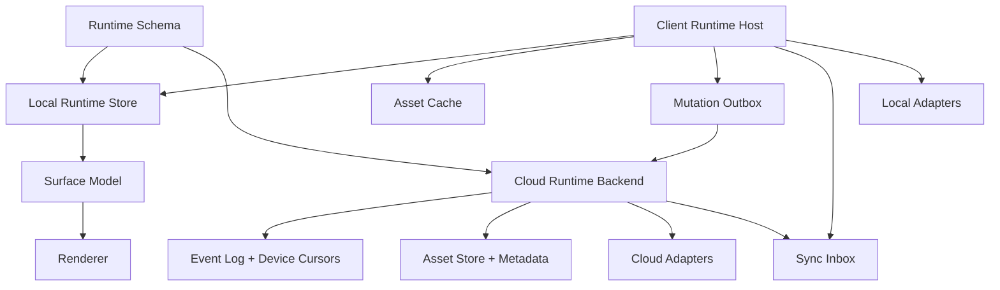
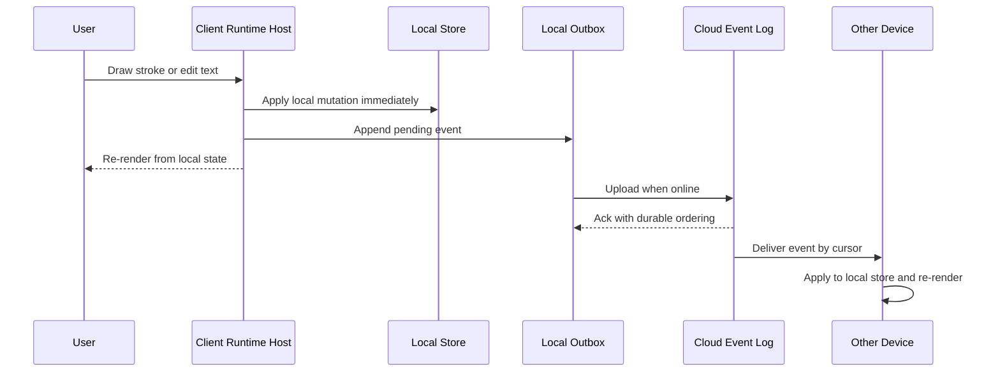
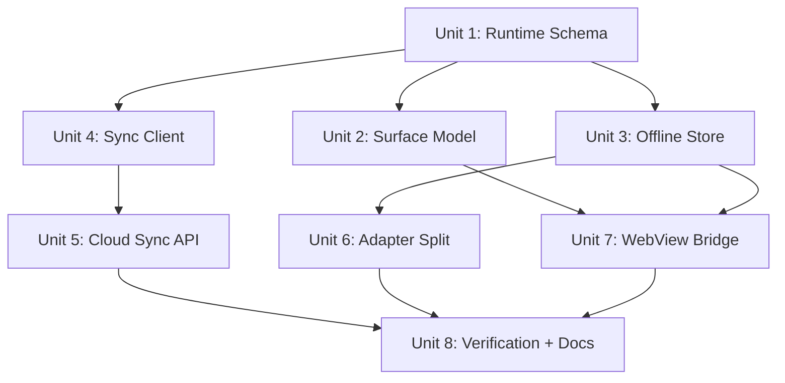

# feat: Cross-Platform Offline Runtime Architecture

## Overview

This plan upgrades InkSurface from a Web/Obsidian renderer MVP into a cross-platform, offline-first runtime architecture. The core shift is that the JavaScript SDK remains one renderer implementation, not the whole platform strategy.

The long-term platform contract becomes:

- Cloud is the cross-device source of truth for account state, event ordering, asset metadata, device cursors, conflict records, and cloud adapters.
- Each client is an offline-first Runtime Host with local document state, asset cache, mutation outbox, sync inbox, input capture, and platform rendering.
- Renderers can differ by platform, but all renderers consume the same Runtime Schema, Surface Model, and Mutation Event Protocol.
- WebView-based apps load a bundled local app shell and renderer assets. They do not depend on a remote webpage to open documents.

## Problem Frame

The current SDK is written in JavaScript and already works well for Web and Obsidian because both can run DOM/SVG rendering directly. That does not automatically solve Android, iOS, macOS, Windows, or Linux:

- Mobile devices must work offline after opening cached or pinned documents.
- Handwriting latency must stay local and cannot wait for cloud roundtrips.
- Platform file access differs sharply: Obsidian vaults, iOS Files, Android SAF, desktop folders, PDF assets, and cloud drives have different permission models.
- WebView is useful only if it loads bundled local resources and talks to a native/offline runtime bridge.
- A fully remote WebView would fail offline; a fully preloaded offline app would create large installs and poor cache control.

The product answer is not "all data and adapters live on the backend" and not "every client only renders." The right split is:

| Layer | Owner | Reason |
|---|---|---|
| Runtime schema and event protocol | Shared contract | Every platform must speak one document/event language. |
| Cloud event log and asset metadata | Backend | Cross-device ordering, auth, backup, adapter jobs, conflict records. |
| Local runtime store and cache | Client | Offline reading, low-latency handwriting, local permissions. |
| Local adapters | Client | Obsidian vault, local PDF, local filesystem, iOS Files, Android SAF. |
| Cloud adapters | Backend | Notion, Readwise, Linear, cloud APIs, scheduled jobs. |
| Renderer | Platform host | Web renderer first; native renderers can follow for performance and platform UX. |

Offline behavior is stateful, not binary:

| Document/cache state | Expected behavior |
|---|---|
| App shell bundled, document cached | Open fully offline, allow reading and local mutations. |
| App shell bundled, document metadata cached, large asset missing | Open document shell and sidecar notes; show asset-missing state for the uncached PDF/page asset. |
| App shell bundled, document not cached | Open app and library metadata; block document open with a download-required state. |
| Pending local mutations exist | Preserve and display local state; sync later, never evict pending outbox data. |
| Local schema older than app schema | Run local migration or enter migration-required state before applying mutations. |

## Requirements Trace

- R1. Preserve one platform-neutral source of truth for document blocks, anchors, annotations, strokes, AI side notes, canvas nodes, and sync events.
- R2. Support offline open/read/mark/edit for cached and user-pinned documents without relying on a remote webpage.
- R3. Keep handwriting and text edits local-first, then sync through an outbox/inbox model when network returns.
- R4. Split adapters by authority: cloud API adapters on backend, local file/vault adapters on clients.
- R5. Allow multiple renderers while enforcing one Runtime Schema and one mutation protocol.
- R6. Preserve current Web/Obsidian behavior during migration and avoid breaking `ink-surface-sdk` consumers.
- R7. Provide a migration path from local JSONL sidecar sync to authenticated production cloud sync.
- R8. Make cross-platform verification fixture-based so Web, Obsidian, WebView, and future native renderers can be compared.

## Scope Boundaries

- This plan does not implement a production cloud backend in the current MVP branch.
- This plan does not require native iOS/Android renderers before product validation; WebView with local bundles is the first mobile delivery path.
- This plan does not put AI execution into Obsidian or other external editors.
- This plan does not require every document asset to be downloaded offline. Offline availability is cache-policy based.
- This plan does not force all future platform apps into this repository. Shared contracts should be reusable across repos.

### Deferred to Separate Tasks

- Native iOS renderer: after WebView bridge proves interaction and sync contracts.
- Native Android renderer: after WebView bridge proves interaction and sync contracts.
- Production cloud adapter implementations: after event log, auth, and conflict contracts exist.
- End-to-end encrypted sync decisions: product/security decision before production user data rollout.

## Context & Research

### Relevant Code and Patterns

- `src/index.ts` is the current side-effect-free Web DOM/SVG renderer.
- `docs/architecture.md` already states that the SDK does not own persistence, sync, AI, file watching, or host lifecycle.
- `examples/ai-annotation-demo/src/runtime/types.ts` defines the current `RuntimeStorePort`, `RuntimeSyncEvent`, annotation, stroke, and mutation types.
- `examples/ai-annotation-demo/src/runtime/sidecar-store.ts` provides the current file-backed sidecar runtime store and mutation behavior.
- `examples/ai-annotation-demo/src/runtime/sync-runner.ts` already models batched event sending, retries, dedupe, and per-event acks.
- `plugins/obsidian/inkloop-sync/main.js` is the first client Runtime Host: it observes local files, renders with the SDK, writes sidecar mutations, and triggers sync.
- `examples/ai-annotation-demo/src/adapters/core/` contains adapter-neutral binding, sync, and conflict concepts that should move toward shared contracts.

### Institutional Learnings

- No directly matching memory entry was found for this repository. The useful recurring rule from the local context is to validate runtime behavior from actual stores, sockets, files, and UI state rather than assuming architecture intent.

### External References

- No external research was used for this planning pass. The plan is based on current repo architecture and the product decisions from the discussion. Native platform implementation should refresh current Apple, Android, Windows WebView2, and Tauri/WebView guidance before execution.

## Key Technical Decisions

- **Keep JS as `surface-web`, not as the universal runtime.** JS DOM/SVG remains the fastest shared renderer for Web, Obsidian, Electron/Tauri/WebView, and validation fixtures. Platform runtimes should not depend on DOM APIs for storage, sync, or event semantics.
- **Make Runtime Schema the real cross-platform SDK.** Schema, validation, migrations, and golden fixtures become the shared platform contract; renderers are replaceable consumers.
- **Use local-first clients with cloud event ordering.** Clients can mutate offline and append outbox events. The cloud assigns durable ordering, stores acks/cursors, and fans out events to other devices.
- **Use cache tiers instead of all-or-nothing offline.** App shell and schema are always bundled; recent/pinned documents and pending edits are offline; large assets and old OCR/index layers are fetched on demand.
- **Split adapters by authority.** Cloud adapters run on backend when they call cloud APIs. Local adapters run on clients when they need user device permissions or local files.
- **Preserve current package compatibility.** Existing `ink-surface-sdk` imports and the `InkLoopSurfaceSDK` IIFE global continue to work while shared packages are introduced.
- **Use golden rendering fixtures for parity.** Every renderer must pass the same VisualModel and mutation fixtures; pixel-perfect parity is required only for selected critical fixtures.

## Open Questions

### Resolved During Planning

- **Should WebView require network to open the app?** No. WebView hosts load bundled local assets and only use network for sync and downloads.
- **Should clients be render-only?** No. Clients own local runtime store, cache, outbox/inbox, input capture, and local adapters.
- **Should all adapters move to backend?** No. Cloud adapters move backend-side; local file/vault adapters stay client-side.
- **Should every platform maintain a separate renderer immediately?** No. Start with `surface-web` in WebView, then add native renderers only where UX/performance warrants it.

### Deferred to Implementation

- Exact cloud storage engine, queue, and deployment target: depends on backend stack selection outside this SDK repo.
- Exact iOS and Android storage APIs: verify current platform APIs during native shell implementation.
- Conflict merge algorithms for rich text: start with event-level conflict records and evolve once real edit cases are captured.
- End-to-end encryption and key management: production security decision before real cloud document content sync.

## Output Structure

The expected repository shape after the migration is:

```text
packages/
  runtime-schema/
  surface-model/
  surface-web/
  sync-client/
  offline-store/
  native-bridge/
apps/
  sync-api/
plugins/
  obsidian/
native/
  ios/
  android/
src/
  # compatibility exports for current ink-surface-sdk consumers
docs/
  architecture.md
  plans/
```

This is a target structure, not a mandate to move every file in one PR. The migration should preserve current package compatibility while introducing shared packages.

## High-Level Technical Design

> This illustrates the intended approach and is directional guidance for review, not implementation specification. The implementing agent should treat it as context, not code to reproduce.





## Phased Delivery

### Implementation Progress

2026-06-28:

- Added `packages/runtime-schema` with runtime record types, schema constants, validation helpers, versioning notes, fixtures, and tests.
- Added `packages/surface-model` with platform-neutral visual model types, Markdown projection parsing, and pure edit helpers.
- Added `packages/surface-web` as the DOM/SVG renderer package while preserving the root `ink-surface-sdk` compatibility entry and IIFE bundle.
- Added `packages/sync-client` as the reusable outbox push/ack/retry/dedupe layer while preserving the demo runtime compatibility entry.
- Added `packages/offline-store` with explicit offline-open, missing-asset, migration-required, and eviction policy contracts.
- Migrated the concrete file-sidecar runtime store into `packages/offline-store/src/file-sidecar-store.ts`.
- Added `IndexedDbOfflineRuntimeStore` for Web/WebView offline snapshots, cache records, and outbox events.
- Extended `packages/sync-client` with pull/inbox/device cursor support while preserving push/ack behavior.
- Added `packages/native-bridge` with local WebView bridge messages, validation, WebView host notes, offline state matrix, and native host README stubs.
- Added `apps/sync-api` with future backend push/pull/asset/conflict contracts, privacy notes, JSONL fixtures, and contract tests.
- Added `packages/adapter-contracts` with adapter authority classification for client-local, cloud-API, and hybrid adapters.
- Added `docs/cross-platform-offline-runtime.md` and `docs/platform-renderer-strategy.md` as stable GitHub-facing architecture entrypoints.
- Updated package, docs, and pack verification so the extracted package structure ships consistently.

### Phase 1: Contract Extraction

- Extract runtime schema, surface model, and sync event contracts from the demo into packages.
- Preserve current Web/Obsidian behavior.
- Add golden fixtures and compatibility tests.

### Phase 2: Offline Client Runtime

- Add local runtime store abstraction, cache policy model, sync client, and WebView bridge contract.
- Convert Web Lab and Obsidian to consume shared packages.
- Keep current JSONL sidecar as one local store implementation.

### Phase 3: Production Sync Boundary

- Add backend sync API skeleton, auth/device identity contract, server acks, cursors, and conflict records.
- Keep backend implementation minimal until product deployment stack is selected.
- Add threat-model and retention decisions before any real user document content is synced.

### Phase 4: Platform Hosts

- Ship local-bundle WebView hosts first.
- Add native input bridge where needed for Pencil/stylus quality.
- Add native renderers only after golden fixture parity is enforceable.

## Implementation Units



- [x] **Unit 1: Extract Runtime Schema Package**

**Goal:** Make document, block, annotation, stroke, canvas node, asset reference, device cursor, and sync event contracts platform-neutral.

**Requirements:** R1, R5, R6

**Dependencies:** None

**Files:**
- Create: `packages/runtime-schema/package.json`
- Create: `packages/runtime-schema/src/`
- Create: `packages/runtime-schema/src/index.ts`
- Create: `packages/runtime-schema/src/fixtures/`
- Create: `packages/runtime-schema/src/schema-versioning.md`
- Test: `packages/runtime-schema/src/runtime-schema.test.ts`
- Modify: `package.json`
- Modify: `docs/architecture.md`

**Approach:**
- Move the stable subset of `examples/ai-annotation-demo/src/runtime/types.ts` into `packages/runtime-schema`.
- Add schema version constants and migration boundaries for future event changes.
- Keep current `RuntimeSyncEvent` operations, then explicitly model planned future operations such as delete, snapshot, and asset events as deferred extensions.
- Keep TypeScript types as the developer interface and add JSON-schema-like validation only where cross-language clients need it.

**Execution note:** Start with fixture and validation tests before changing imports in existing hosts.

**Patterns to follow:**
- `examples/ai-annotation-demo/src/runtime/types.ts`
- `src/index.test.ts`

**Test scenarios:**
- Happy path: a document fixture with blocks, annotations, strokes, and canvas nodes validates and roundtrips without dropping fields.
- Edge case: a stroke with points outside `[0, 1]` is accepted for infinite-canvas overflow.
- Error path: an event missing `event_id`, `doc_id`, or `operation` is rejected by validation helpers.
- Compatibility: existing Web Lab and Obsidian runtime fixtures still satisfy the extracted schema.

**Verification:**
- Runtime schema can be imported without DOM, Node file APIs, or host-specific dependencies.

- [x] **Unit 2: Extract Surface Model Package**

**Goal:** Separate platform-neutral visual model transformation from DOM/SVG rendering.

**Requirements:** R1, R5, R6, R8

**Dependencies:** Unit 1

**Files:**
- Create: `packages/surface-model/package.json`
- Create: `packages/surface-model/src/`
- Create: `packages/surface-model/src/index.ts`
- Create: `packages/surface-model/src/golden-fixtures/`
- Create: `packages/surface-web/package.json`
- Create: `packages/surface-web/src/`
- Test: `packages/surface-model/src/surface-model.test.ts`
- Test: `packages/surface-web/src/surface-web.test.ts`
- Modify: `src/index.ts`
- Modify: `package.json`
- Modify: `docs/ink-surface-sdk.md`

**Approach:**
- Move pure VisualModel types, normalization, markdown projection parsing, and edit helpers out of `src/index.ts`.
- Move Web DOM/SVG rendering and style installation into `packages/surface-web`.
- Keep `src/index.ts` as the compatibility export surface for existing `ink-surface-sdk` consumers during the transition.
- Define a stable renderer input contract that Web, Obsidian, native renderers, and screenshot tests can consume.
- Add fixture snapshots that represent baseline annotation styles, highlighter strokes, pen strokes, margin notes, editable text, and overflow canvas marks.

**Execution note:** Preserve `ink-surface-sdk` public exports during extraction; add compatibility tests before changing package boundaries.

**Patterns to follow:**
- `src/index.ts`
- `src/index.test.ts`
- `docs/ink-surface-sdk.md`

**Test scenarios:**
- Happy path: runtime blocks and annotations convert into the same VisualModel currently rendered in Web Lab and Obsidian.
- Edge case: unknown annotation fields are preserved for future renderers.
- Edge case: generated/read-only regions remain marked as non-editable.
- Compatibility: existing ESM and IIFE entrypoints continue to render the same fixture.
- Integration: the root `ink-surface-sdk` export and `packages/surface-web` render the same golden fixture.

**Verification:**
- The Web renderer imports shared model logic rather than owning model transformation itself.

- [x] **Unit 3: Generalize Offline Runtime Store**

**Goal:** Turn the current file sidecar store into one implementation of a portable offline runtime store contract.

**Requirements:** R2, R3, R6, R7

**Dependencies:** Unit 1

**Files:**
- Create: `packages/offline-store/package.json`
- Create: `packages/offline-store/src/`
- Create: `packages/offline-store/src/runtime-store-port.ts`
- Create: `packages/offline-store/src/cache-policy.ts`
- Create: `packages/offline-store/src/file-sidecar-store.ts`
- Create: `packages/offline-store/src/indexeddb-store.ts`
- Test: `packages/offline-store/src/offline-store.test.ts`
- Test: `packages/offline-store/src/cache-policy.test.ts`
- Modify: `examples/ai-annotation-demo/src/runtime/sidecar-store.ts`
- Modify: `plugins/obsidian/inkloop-sync/main.js`

**Approach:**
- Promote `RuntimeStorePort` and mutation semantics into `packages/offline-store`.
- Keep JSONL/file sidecar storage for Obsidian and desktop validation.
- Add IndexedDB-backed storage for Web/WebView local app shells.
- Model cache tiers: app shell, recent documents, pinned documents, pending mutations, on-demand large assets, and evictable derived indexes.
- Ensure mutations always apply locally before sync is attempted.

**Patterns to follow:**
- `examples/ai-annotation-demo/src/runtime/sidecar-store.ts`
- `examples/ai-annotation-demo/src/runtime/sidecar-store.test.ts`
- `examples/ai-annotation-demo/src/local/store.ts`

**Test scenarios:**
- Happy path: cached document opens offline with blocks, annotations, and strokes intact.
- Happy path: a stroke is added offline, appears in local state, and creates one pending outbox event.
- Edge case: pending outbox events are never evicted by cache cleanup.
- Edge case: an uncached large PDF asset returns a missing-asset state without preventing the app shell from opening.
- Error path: corrupted local JSONL or IndexedDB records are quarantined without losing confirmed local mutations.
- Integration: Obsidian plugin and Web Lab can use the shared store contract with their existing behavior.

**Verification:**
- The same mutation fixture can run against file-sidecar and IndexedDB implementations.

- [x] **Unit 4: Build Production Sync Client Contract**

**Goal:** Replace the local JSONL-shaped transport with a reusable client sync package that supports auth, retries, cursors, inbox application, and offline state.

**Requirements:** R3, R7

**Dependencies:** Unit 1, Unit 3

**Files:**
- Create: `packages/sync-client/package.json`
- Create: `packages/sync-client/src/`
- Create: `packages/sync-client/src/sync-client.ts`
- Create: `packages/sync-client/src/device-cursor.ts`
- Create: `packages/sync-client/src/conflict-record.ts`
- Test: `packages/sync-client/src/sync-client.test.ts`
- Test: `packages/sync-client/src/device-cursor.test.ts`
- Modify: `examples/ai-annotation-demo/src/runtime/sync-runner.ts`

**Approach:**
- Promote `RuntimeSyncRunner` behavior into `packages/sync-client`.
- Add explicit push and pull phases: upload local outbox, receive server acks, fetch remote events by cursor, apply inbox events to local store.
- Require idempotent `event_id`, `dedupe_key`, and server-assigned ordering.
- Add a conflict record shape for events that cannot be applied cleanly.
- Keep the current local JSONL transport as a test/local transport.

**Patterns to follow:**
- `examples/ai-annotation-demo/src/runtime/sync-runner.ts`
- `examples/ai-annotation-demo/src/runtime/sync-runner.test.ts`

**Test scenarios:**
- Happy path: two pending events upload, receive acks, and are marked sent.
- Happy path: remote events after the current cursor apply to local store in server order.
- Edge case: duplicate remote event ids do not apply twice.
- Error path: network timeout leaves events pending or failed with retry metadata.
- Error path: malformed ack response does not mark events sent.
- Integration: local mutation followed by sync appears on a second local store after pull.

**Verification:**
- The sync client can run without a DOM and without assuming a specific storage implementation.

- [x] **Unit 5: Define Cloud Runtime Backend Boundary**

**Goal:** Specify the backend APIs and persistence model needed for production cross-device sync, without binding the SDK to a deployment stack too early.

**Requirements:** R4, R7

**Dependencies:** Unit 1, Unit 4

**Files:**
- Create: `apps/sync-api/README.md`
- Create: `apps/sync-api/contracts/runtime-sync-api.md`
- Create: `apps/sync-api/contracts/security-and-privacy.md`
- Create: `apps/sync-api/contracts/runtime-sync-api.test-fixtures.jsonl`
- Create: `apps/sync-api/src/`
- Test: `apps/sync-api/src/runtime-sync-contract.test.ts`
- Modify: `docs/architecture.md`

**Approach:**
- Define endpoint contracts for push batch, pull by cursor, asset metadata lookup, asset upload/download, device registration, and conflict listing.
- Treat the server event log as append-only with compacted document snapshots as an optimization.
- Store assets content-addressed where possible and separate source PDFs, derived OCR/text, thumbnails, and embeddings by cache/permission class.
- Define auth, authorization, retention, redaction, and logging boundaries before accepting real document content.
- Require events to carry enough causality metadata for conflict detection, such as client event id, device id, local revision, and server sequence after ack.
- Keep Notion/Readwise/Linear style adapters backend-side because they use cloud APIs and scheduled jobs.
- Keep local file/vault adapters out of the backend.

**Patterns to follow:**
- `examples/ai-annotation-demo/vite.config.ts` local sync endpoints
- `examples/ai-annotation-demo/src/runtime/sync-runner.ts`

**Test scenarios:**
- Happy path: push batch returns per-event acks with durable server sequence numbers.
- Happy path: pull by device cursor returns only events after the cursor.
- Edge case: retrying the same push batch is idempotent.
- Error path: unauthorized device token fails without accepting events.
- Error path: event with unsupported schema version is rejected with a structured error.
- Security: request logs include event ids and device ids but do not log full document bodies or stroke payloads by default.
- Privacy: deleting or revoking a document prevents further pulls of its assets and events for unauthorized devices.
- Integration: one device pushes an annotation event and another device pulls it by cursor.

**Verification:**
- Backend contract fixtures can be consumed by `packages/sync-client` tests without a live server.

- [x] **Unit 6: Split Adapter Authority**

**Goal:** Make adapter placement explicit so local adapters run on clients and cloud API adapters run on the backend.

**Requirements:** R4, R6

**Dependencies:** Unit 1, Unit 3, Unit 5

**Files:**
- Create: `packages/adapter-contracts/package.json`
- Create: `packages/adapter-contracts/src/`
- Create: `packages/adapter-contracts/src/adapter-authority.ts`
- Test: `packages/adapter-contracts/src/adapter-authority.test.ts`
- Modify: `examples/ai-annotation-demo/src/adapters/core/`
- Modify: `examples/ai-annotation-demo/src/adapters/obsidian-fs/`
- Modify: `plugins/obsidian/inkloop-sync/main.js`
- Modify: `docs/architecture.md`

**Approach:**
- Add an adapter authority classification: `client_local`, `cloud_api`, or `hybrid`.
- Keep Obsidian vault, local PDF, local filesystem, iOS Files, and Android SAF as client-local adapters.
- Treat Notion, Readwise, Linear, and other API-backed services as cloud adapters.
- Model hybrid adapters such as Google Drive or iCloud Drive as cloud metadata plus client file permissions/cache.
- Keep `ExternalEdit`, `MetadataOverride`, and conflict records adapter-neutral.

**Patterns to follow:**
- `examples/ai-annotation-demo/src/adapters/core/types.ts`
- `examples/ai-annotation-demo/src/adapters/obsidian-fs/`
- `examples/ai-annotation-demo/src/adapters/core/adapter-contract.test.ts`

**Test scenarios:**
- Happy path: Obsidian FS adapter is classified as `client_local` and never requires backend file access.
- Happy path: a Notion-like adapter fixture is classified as `cloud_api`.
- Edge case: hybrid adapter declares which operations are client-only vs backend-capable.
- Error path: attempting to run a client-local adapter from backend context is rejected by contract validation.
- Integration: external edits from a client-local adapter still serialize into cloud sync conflict records.

**Verification:**
- Adapter contracts make placement explicit and preserve current Obsidian adapter behavior.

- [x] **Unit 7: Add Local WebView Bridge Contract**

**Goal:** Define how iOS, Android, and desktop WebView shells load the local renderer bundle and communicate with native/local runtime services.

**Requirements:** R2, R3, R5, R8

**Dependencies:** Unit 2, Unit 3, Unit 4

**Files:**
- Create: `packages/native-bridge/package.json`
- Create: `packages/native-bridge/src/`
- Create: `packages/native-bridge/src/bridge-contract.ts`
- Create: `packages/native-bridge/src/webview-host.md`
- Create: `packages/native-bridge/src/offline-state-matrix.md`
- Test: `packages/native-bridge/src/bridge-contract.test.ts`
- Create: `native/ios/README.md`
- Create: `native/android/README.md`
- Modify: `docs/architecture.md`

**Approach:**
- Define a bridge contract for loading document snapshots, applying local mutations, requesting assets, reporting network state, and receiving sync updates.
- Require WebView shells to load bundled local JS/CSS/HTML assets rather than remote URLs.
- Keep native shells responsible for platform storage permissions, background sync scheduling, file picker access, stylus metadata, and secure token storage.
- Define user-visible states for cached, partially cached, missing asset, pending sync, sync failed, and migration required.
- Use the Web renderer as the first shared UI on all platforms, but leave room for native renderers to consume the same Surface Model later.

**Patterns to follow:**
- `src/index.ts`
- `examples/ai-annotation-demo/src/obsidian-lab.ts`
- `plugins/obsidian/inkloop-sync/main.js`

**Test scenarios:**
- Happy path: local WebView requests a cached document snapshot and renders without network.
- Happy path: WebView sends `annotation.add`; native/local runtime applies it and returns updated state.
- Edge case: requested asset is not cached and network is offline; renderer receives a missing-asset state, not a full app failure.
- Edge case: local app shell is newer than local data schema; bridge returns migration-required rather than rendering stale data.
- Error path: bridge rejects mutation messages with unsupported schema versions.
- Integration: WebView mutation appends a sync outbox event and later receives an ack from the sync client.

**Verification:**
- A local WebView host can open cached fixture documents with airplane-mode network simulation.

- [ ] **Unit 8: Cross-Platform Verification and Documentation**

**Goal:** Make platform parity measurable with fixtures, smoke flows, and architecture docs.

**Requirements:** R5, R6, R8

**Dependencies:** Units 1-7

**Files:**
- Create: `packages/runtime-schema/src/fixtures/cross-platform/`
- Create: `docs/cross-platform-offline-runtime.md`
- Create: `docs/platform-renderer-strategy.md`
- Modify: `docs/architecture.md`
- Modify: `README.md`
- Test: `packages/surface-model/src/golden-rendering.test.ts`
- Test: `packages/sync-client/src/cross-device-sync.test.ts`
- Test: `examples/ai-annotation-demo/src/runtime/sidecar-store.test.ts`

**Approach:**
- Define golden fixtures for markdown, PDF-like page blocks, highlighter, pen strokes, AI side notes, margin notes, canvas overflow, offline mutation, conflict, and reset.
- Compare render outputs structurally for all renderers and visually for selected Web fixtures.
- Add a cross-device sync simulation: Device A offline mutation, push after network returns, Device B pull and apply.
- Document platform delivery tiers: Web, Obsidian desktop, WebView mobile, native mobile, desktop WebView/Tauri/Electron.

**Patterns to follow:**
- `docs/architecture.md`
- `examples/ai-annotation-demo/docs/obsidian-runtime-mvp-handoff.md`
- `src/index.test.ts`
- `examples/ai-annotation-demo/src/runtime/sync-runner.test.ts`

**Test scenarios:**
- Happy path: all golden fixtures produce stable Surface Model snapshots.
- Happy path: Web renderer renders every fixture without throwing.
- Edge case: infinite-canvas overflow stroke remains present in model and visible in Web renderer.
- Error path: unsupported schema version fixture fails with an explicit migration-required error.
- Integration: simulated offline edit syncs from one store to another through the sync client.

**Verification:**
- Cross-platform fixture suite becomes the release gate before adding native renderers.

## System-Wide Impact

- **Interaction graph:** Web Lab, Obsidian plugin, future mobile WebView shells, local stores, sync client, backend sync API, and adapters all converge on Runtime Schema and Surface Model.
- **Error propagation:** Local mutations should fail fast before writing invalid state; sync errors stay in outbox metadata; backend errors must not delete local pending edits.
- **State lifecycle risks:** Cache eviction, duplicate event delivery, sidecar reset, conflict generation, partial asset downloads, and multi-device edits need explicit state transitions.
- **API surface parity:** Existing `ink-surface-sdk` ESM and IIFE imports remain compatible while new packages are introduced.
- **Integration coverage:** Unit tests alone are not enough; cross-device sync simulation and WebView offline smoke tests are required.
- **Unchanged invariants:** SDK imports remain side-effect-free; Obsidian remains a runtime host rather than an AI host; user Markdown stays native and clean.

## Security and Privacy Posture

- Sync APIs require authenticated device identity and per-document authorization.
- Client tokens are stored by platform secure storage, not in WebView local storage.
- Event logs store the minimum payload required for sync and conflict resolution; logs and telemetry redact document bodies, OCR text, and raw stroke payloads unless explicitly enabled for local debugging.
- Asset access is mediated by document permission and cache policy; revocation must stop new downloads even if old local cache cleanup is eventual.
- Local adapters must not upload source files or hidden sidecar data unless the document export policy allows it.
- Production rollout needs a decision on encryption at rest, transport security, retention, account deletion, and optional end-to-end encryption before real user content is synced.

## Risks & Dependencies

| Risk | Likelihood | Impact | Mitigation |
|---|---:|---:|---|
| Schema churn breaks existing Web/Obsidian MVP | Medium | High | Extract contracts behind compatibility exports and run existing smoke fixtures during migration. |
| WebView app still accidentally depends on network | Medium | High | Require bundled local app shell and add offline-open smoke tests. |
| Local cache grows without control | Medium | Medium | Implement explicit cache tiers, eviction policy, and pinned document protection. |
| Cloud ordering conflicts with offline local edits | High | High | Use local optimistic application, server sequence ordering, device cursors, and conflict records. |
| Native renderers drift visually from Web renderer | Medium | Medium | Require golden Surface Model fixtures and selected visual parity fixtures before native renderer release. |
| Backend adapters try to access local files | Low | High | Enforce adapter authority classification in contract tests. |
| Sensitive documents sync before privacy model is settled | Medium | High | Gate production cloud sync behind auth, export policy, and encryption/privacy decisions. |
| Local schema migration fails after app update | Medium | High | Add schema-versioned migrations and migration-required state before mutating stale data. |
| App shell and cached renderer assets fall out of sync | Low | Medium | Bundle renderer with app shell version and validate compatibility at bridge startup. |

## Success Metrics

- Cached document opens offline on WebView host without network.
- Partially cached document opens with clear missing-asset state rather than blank failure.
- A pen/highlighter mutation renders immediately offline and later syncs to another device.
- Current Web Lab and Obsidian plugin continue to render and sync existing fixtures.
- All renderers consume the same Surface Model fixtures.
- Cloud sync contract supports idempotent push, cursor-based pull, and per-event ack behavior.
- Adapter authority classification prevents backend execution of client-local adapters.

## Alternative Approaches Considered

| Approach | Outcome | Reason |
|---|---|---|
| Remote WebView for all clients | Rejected | Fails offline and creates unacceptable startup dependency on network. |
| Fully native renderers from day one | Rejected for MVP | Higher cost and slower iteration; use shared Web renderer first and add native renderers where needed. |
| Put all adapters on backend | Rejected | Backend cannot safely access Obsidian vaults, local files, or device permission surfaces. |
| Treat cloud as only source and clients as thin renderers | Rejected | Breaks offline editing and creates high-latency handwriting. |
| Keep current demo JSONL as production sync | Rejected | Useful shape, but production needs auth, device cursors, server ordering, and conflict records. |

## Documentation / Operational Notes

- Update `docs/architecture.md` after Unit 1 and Unit 5 so the architecture page reflects the new cloud/client split.
- Add `docs/cross-platform-offline-runtime.md` as the product-facing technical explanation for offline behavior, cache policy, and sync.
- Add `docs/platform-renderer-strategy.md` to document Web renderer vs native renderer responsibilities.
- Keep README focused on package usage; link to deeper architecture docs rather than expanding the README into a platform spec.

## Sources & References

- Related architecture: `docs/architecture.md`
- SDK usage docs: `docs/ink-surface-sdk.md`
- Current runtime types: `examples/ai-annotation-demo/src/runtime/types.ts`
- Current runtime store: `examples/ai-annotation-demo/src/runtime/sidecar-store.ts`
- Current sync runner: `examples/ai-annotation-demo/src/runtime/sync-runner.ts`
- Current Obsidian host: `plugins/obsidian/inkloop-sync/main.js`
- Current adapter core: `examples/ai-annotation-demo/src/adapters/core/`
