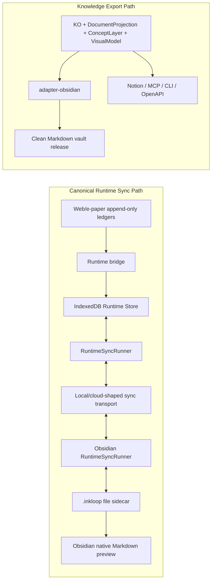
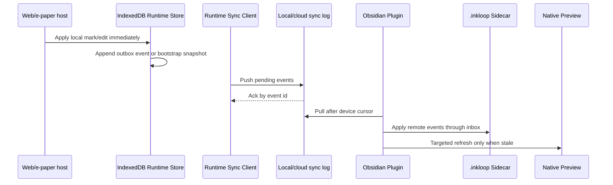
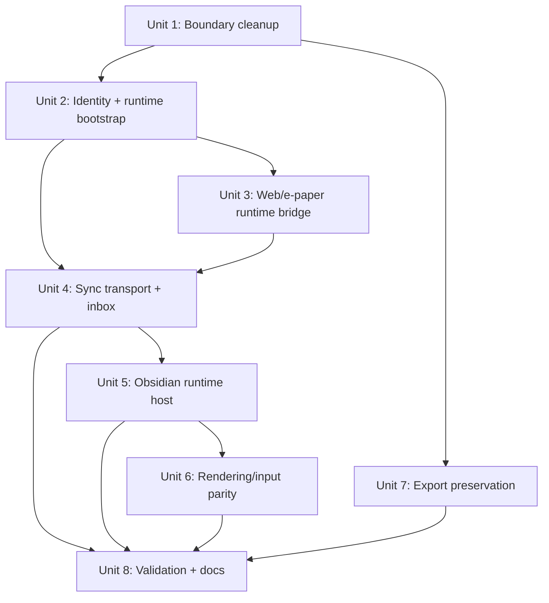

# feat: Make Runtime Sync the Canonical Obsidian Path

## Overview

This plan upgrades the InkLoop to Obsidian path from whole-vault release/download into a runtime sync loop shared by the e-paper app, Web/WebView host, and Obsidian runtime plugin.

The main change is architectural: the clean Markdown vault release becomes Knowledge Export, while day-to-day reading, writing, handwriting, annotation edits, progress, and sidecar convergence move through Runtime Store + Runtime Sync Client. The e-paper application and firmware direction stay intact; this work replaces the sync path around the app, not the low-level pen/input stack.

| Path | Purpose | Source of truth | Normal user loop |
|---|---|---|---|
| Runtime Sync | Continued reading, writing, sidecar state, handwriting, annotation edits | Local runtime store plus cloud/local event log | Automatic or near-automatic |
| Knowledge Export | Clean Markdown publishing, backup, future Notion/MCP/CLI/OpenAPI targets | KO, DocumentProjection, ConceptLayer, VisualModel artifacts | Explicit export action |
| Whole-vault release | Current demo publishing evidence | Export artifact only | Not used for normal sync |

## Problem Frame

The updated demo proves a clean Markdown release path, but that path replaces too much state and still behaves like a manual publish/download workflow. It is useful for export and backup, but it is the wrong default for a user who is reading and writing across an InkLoop device and Obsidian.

For the product experience, a user should be able to write on the e-paper/Web side, open Obsidian, and see the same marks without regenerating a whole vault. They should also be able to edit supported runtime content or write annotations in Obsidian and have those changes flow back through the same runtime channel. Native Markdown and PDF files must stay clean; InkLoop runtime state belongs in hidden stores and `.inkloop` sidecars (see origin: `docs/brainstorms/2026-07-02-runtime-sync-canonical-path-requirements.md`).

## Requirements Trace

**Architecture Boundary**

- R1. Runtime Sync is the canonical path for InkLoop app, e-paper device, Web/WebView host, and Obsidian plugin synchronization.
- R2. Whole-vault clean Markdown release is not used as the normal device to Obsidian sync mechanism.
- R3. Knowledge Export remains a separate projection/publishing pipeline for Obsidian Markdown and future Notion/MCP/CLI/OpenAPI/backups.
- R4. User-facing Markdown/PDF files remain native and clean; runtime state lives in local stores and hidden sidecars.
- R5. Existing e-paper app and firmware direction are preserved; integration happens above the pen/input stack.

**Writing Experience**

- R6. Web/e-paper strokes persist once, render once, keep style/color, and do not duplicate after pointer-up.
- R7. Obsidian marking-mode strokes commit to sidecar/runtime state and sync out without whole-vault release.
- R8. Local writes do not cause visible Obsidian preview flashing, scroll jumps, or unnecessary full-surface repaint.
- R9. Freehand stroke data renders consistently across Web/WebView and Obsidian.

**Reading Experience**

- R10. Reading opens from cached runtime state and does not depend on regenerating a Markdown vault package.
- R11. Layout, anchors, highlights, boxes, handwritten marks, and margin annotations stay aligned across hosts.
- R12. Runtime identity supports imported PDFs, native Markdown files, and new InkLoop-created documents without visible vault pollution.

**Synchronization Experience**

- R13. Normal sync is automatic or near-automatic; manual refresh is recovery/debug only.
- R14. Sync is incremental at runtime event/snapshot level rather than whole-vault replacement.
- R15. Conflicts are explicit records or visible states, not silent overwrites.
- R16. Obsidian, Web/WebView, and e-paper hosts share outbox, inbox, ack, retry, dedupe, and device cursor semantics.
- R17. Offline edits remain usable locally and later sync without losing writing, progress, or annotation state.
- R18. Manual refresh remains only as a recovery/debug action.

**Knowledge Export Pipeline**

- R19. Existing clean Markdown vault release is repositioned as an export target, not removed.
- R20. Exporter boundaries stay reusable for future targets.
- R21. Export targets consume canonical artifacts; they do not own runtime source-of-truth behavior.
- R22. Future export/import integrations do not block this runtime MVP.

**Migration and Safety**

- R23. Switching sync paths does not delete or rewrite existing exported Markdown without explicit user action.
- R24. Existing clean export output remains readable as an export artifact.

**Observability and Validation**

- R25. MVP includes repeatable validation for Web/e-paper writing, Obsidian rendering, Obsidian edits/writing, and return sync.
- R26. Validation reports latency, duplicate behavior, color/style preservation, flicker, and manual-refresh dependency.
- R27. Shared rendering parity tests remain in place for Web/WebView and Obsidian.

## Scope Boundaries

- No Notion, MCP, CLI, OpenAPI, or other export target is built in this phase.
- No firmware rewrite or low-level input hardware redesign is included.
- No new AI product feature is added; existing AI note data may sync as runtime state.
- No full collaborative real-time editor semantics are required. Reliable near-real-time/background sync is enough for MVP.
- Exported Markdown does not become the runtime source of truth.
- Existing exported Markdown is not automatically deleted or migrated.
- Production cloud sync service implementation remains behind the `apps/sync-api` contract unless a separate backend task is opened.

### Deferred to Separate Tasks

- General Knowledge Export targets beyond Obsidian Markdown.
- Production auth, user/device registration, and cloud deployment for `apps/sync-api`.
- Native renderer implementations beyond the current short-term `surface-web` and WebView bundle strategy.
- Formal AI result validator package; this remains out of scope until AI output durability becomes the focus.

## Context & Research

### Repository Research Summary

- The repo is a Node/TypeScript npm workspace with SDK packages in `packages/*`, the validation/product demo in `examples/ai-annotation-demo`, an Obsidian runtime plugin in `plugins/obsidian/inkloop-sync`, and sync API contract fixtures in `apps/sync-api`.
- `docs/architecture.md` already defines the key invariant: user documents stay native, while InkLoop runtime state lives in hidden sidecars and stores.
- `packages/runtime-schema` contains platform-neutral runtime records and current sync events, but the event vocabulary is still too narrow for full runtime bootstrap and deletion/progress sync.
- `packages/offline-store` already has `SidecarRuntimeStore` and `IndexedDbOfflineRuntimeStore`, but the updated demo still defaults its Obsidian path to whole-vault release.
- `packages/sync-client` already supports push, pull, inbox, explicit ack, retry, dedupe, and device cursor behavior.
- `plugins/obsidian/inkloop-sync/main.js` is the right Obsidian runtime host starting point. It already creates `.inkloop` sidecars, writes runtime events, decorates native Markdown preview, and preserves preview signatures after local writes.
- `examples/ai-annotation-demo/src/local/store.ts` and `examples/ai-annotation-demo/src/app/annotation-loop.ts` preserve the e-paper/Web app's append-only marks and AI-turn ledgers. Runtime sync should bridge from these ledgers instead of replacing them.
- `examples/ai-annotation-demo/src/integration/inksurface/vault-release.ts` and `vault-publish-device.ts` are explicitly whole-release/export-shaped and should not stay in the normal device-to-Obsidian loop.

### Institutional Learnings

- `docs/solutions/integration-issues/obsidian-ink-rendering-stability-2026-06-28.md` is directly relevant. It records three guardrails for this work:
  - Prefer vault/file identity over absolute `obsidian://open?path=...` links.
  - Persist stroke color and opacity as inline SVG styles as well as attributes.
  - Local Obsidian sidecar writes should update preview signatures and schedule sync, not force immediate preview rerender.

### Flow Analysis

- **Web/e-paper write flow:** user writes with pen/highlighter/AI pen -> existing mark ledger stores the mutation -> runtime bridge updates IndexedDB runtime snapshot and outbox -> sync client pushes event/snapshot -> Obsidian pulls into `.inkloop` sidecar -> native preview decorates without manual refresh.
- **Obsidian write flow:** user opens native Markdown preview, enters thinking mode, edits text/annotation or writes freehand -> plugin writes Markdown/sidecar as appropriate and appends runtime event -> sync client pushes -> Web/e-paper host pulls into IndexedDB/runtime store -> Web surface rerenders from local state.
- **Cold-start flow:** a host without the document must receive or fetch a runtime bootstrap snapshot/cache record before incremental events can apply. Incremental events alone cannot replace the current whole-vault release for first sync.
- **Offline flow:** host applies local mutations immediately, keeps pending events protected from eviction, and syncs later by cursor.
- **Export flow:** user explicitly exports clean Markdown -> `adapter-obsidian` renders vault-relative files -> export output remains readable but is not used as runtime source of truth.

### External References

- No external research was used. The required behavior is already defined by local architecture docs, package contracts, plugin code, and prior integration learnings.

## Key Technical Decisions

- **Runtime Sync is canonical for product sync.** Whole-vault release is too coarse for day-to-day writing and creates manual refresh/performance problems. Runtime sync matches the existing outbox/inbox/cursor architecture and the user's desired e-paper to Obsidian loop.
- **Knowledge Export is explicit and export-only.** The clean Markdown vault release stays valuable for backup, publishing, and future cross-app export, but it must not own live state convergence.
- **Add runtime bootstrap to the sync model.** The current event operations are useful for edits, but a new host cannot cold-start from incremental edit events alone. Runtime sync needs a document snapshot/cache bootstrap path alongside incremental events.
- **Bridge above the existing app ledger.** The e-paper/Web app already has append-only marks, AI turns, reader layouts, and input tuning. The smallest safe integration point is after durable ledger mutations, where a runtime bridge can derive sidecar-compatible snapshots/events without touching firmware or pen capture logic.
- **Use one transport interface with local-first MVP.** The first implementation should support both local/dev and cloud-shaped HTTP transports behind `RuntimeSyncTransportPort`. Land the local/dev transport and inbox first, while keeping `apps/sync-api` as the production boundary.
- **Use stable runtime document identity.** Imported PDFs use the existing InkLoop document id/file hash lineage. Native Markdown and new InkLoop documents get a persistent runtime doc id stored in sidecar/indexed runtime metadata; content hashes are revisions, not identity.
- **Keep Obsidian native preview/editor as the host surface.** The plugin should remain quiet and decorate Obsidian's native Markdown preview. The separate custom runtime view should be debug/recovery only unless a future product decision changes this.
- **Local mutation does not imply visible rerender.** Obsidian local writes update current DOM/live SVG and preview signatures. Remote pulls may trigger a targeted refresh when the open preview is stale.
- **Conflicts block cursor advancement.** If an inbox cannot apply a remote event cleanly, the host records/surfaces a conflict and keeps the previous cursor.

## Open Questions

### Resolved During Planning

- **Should the first runtime transport be local-only, cloud-backed, or both?** Both behind one interface. Implement local/dev first for MVP validation and keep the HTTP cloud-shaped contract ready for production.
- **Where should the e-paper/Web app integrate?** After append-only ledger writes and snapshot derivation, not inside firmware or raw pointer capture.
- **How do PDF, native Markdown, and new InkLoop documents share identity?** Through a persisted runtime identity record with stable doc id and source revision fields; content hash is revision metadata, not identity.
- **What should replace whole-vault release for cold start?** Runtime bootstrap snapshots/cache records plus incremental events.

### Deferred to Implementation

- Exact local event-log storage shape for the dev transport: choose the smallest implementation that can serve push/pull/inbox validation without becoming a production backend.
- Exact conflict UI in Obsidian and Web/e-paper host: implement durable conflict records first, then expose the minimum visible state needed for MVP validation.
- Exact background sync cadence: tune after measuring local smoke latency and avoiding Obsidian flicker.
- Exact package boundary for reusable knowledge builders: keep demo logic in place until runtime sync boundaries stabilize.

## High-Level Technical Design

> This illustrates the intended approach and is directional guidance for review, not implementation specification. The implementing agent should treat it as context, not code to reproduce.

## Implementation Units

- [x] **Unit 1: Separate Runtime Sync From Knowledge Export**

**Goal:** Make the source-of-truth split explicit in code, docs, labels, and example entrypoints so the whole-vault path is no longer treated as normal sync.

**Requirements:** R1, R2, R3, R19, R20, R21, R22, R23, R24

**Dependencies:** None

**Files:**
- Modify: `docs/architecture.md`
- Modify: `docs/ink-surface-sdk.md`
- Modify: `docs/cross-platform-offline-runtime.md`
- Modify: `docs/platform-renderer-strategy.md`
- Modify: `examples/ai-annotation-demo/src/mobile-main.ts`
- Modify: `examples/ai-annotation-demo/src/mobile/dev.ts`
- Modify: `examples/ai-annotation-demo/src/integration/inksurface/vault-release.ts`
- Modify: `examples/ai-annotation-demo/src/integration/inksurface/vault-publish-device.ts`
- Modify: `examples/ai-annotation-demo/obsidian-plugin/inkloop-vault-sync/main.js`
- Test: `examples/ai-annotation-demo/src/integration/inksurface/vault-publish.test.ts`
- Test: `examples/ai-annotation-demo/src/integration/inksurface/vault-release.test.ts`

**Approach:**
- Rename user-facing and developer-facing references so `publishVaultRelease` is clearly export/publish/backup, not live sync.
- Keep the current downloader plugin and release executor as export evidence, but mark it as non-canonical for runtime synchronization.
- Add documentation language that Obsidian has two roles: runtime host through `plugins/obsidian/inkloop-sync`, and export target through clean Markdown release.
- Ensure export-only flows cannot be triggered by automatic runtime sync code paths.

**Patterns to follow:**
- `docs/reviews/2026-07-02-updated-ai-annotation-demo-architecture-gap-review.md`
- `packages/adapter-obsidian/README.md`
- `examples/ai-annotation-demo/src/integration/inksurface/vault-release.ts`

**Test scenarios:**
- Happy path: explicit export action still builds and publishes a deterministic vault release.
- Integration: runtime sync configuration does not invoke `publishVaultRelease` for ordinary mark/text edits.
- Edge case: empty export release remains guarded and cannot overwrite an existing export by accident.
- Error path: failed export publish reports export failure without changing runtime outbox state.

**Verification:**
- Documentation and UI labels no longer imply whole-vault release is the live sync mechanism.
- Existing clean export output remains readable and deterministic.

- [x] **Unit 2: Extend Runtime Identity, Bootstrap, and Event Contracts**

**Goal:** Give runtime sync enough contract surface to cold-start documents, preserve stable identity, sync deletes/progress, and avoid event echo/duplicate application.

**Requirements:** R4, R12, R14, R15, R16, R17, R25

**Dependencies:** Unit 1

**Files:**
- Modify: `packages/runtime-schema/src/index.ts`
- Modify: `packages/runtime-schema/src/runtime-schema.test.ts`
- Modify: `packages/runtime-schema/src/fixtures/runtime-sync-event.json`
- Modify: `packages/runtime-schema/src/schema-versioning.md`
- Modify: `packages/offline-store/src/index.ts`
- Modify: `packages/offline-store/src/file-sidecar-store.ts`
- Modify: `packages/offline-store/src/indexeddb-store.ts`
- Test: `packages/offline-store/src/file-sidecar-store.test.ts`
- Test: `packages/offline-store/src/indexeddb-store.test.ts`
- Create: `examples/ai-annotation-demo/src/integration/inksurface/runtime-identity.ts`
- Test: `examples/ai-annotation-demo/src/integration/inksurface/runtime-identity.test.ts`

**Approach:**
- Add a stable runtime identity helper that maps imported PDF, native Markdown, and new InkLoop docs into one doc identity model.
- Treat content hashes as source revisions, not document identity.
- Add or formalize runtime operations for bootstrap/snapshot, annotation deletion/tombstone, reading progress, and source rename metadata.
- Add event origin metadata sufficient for inbox dedupe and echo suppression.
- Keep schema validation dependency-free and compatible with Web, Obsidian plugin bundle, and backend contract tests.

**Execution note:** Add contract tests before wiring hosts. This unit changes shared API surface.

**Patterns to follow:**
- `packages/runtime-schema/src/index.ts`
- `packages/offline-store/src/file-sidecar-store.ts`
- `packages/offline-store/src/indexeddb-store.ts`
- `plugins/obsidian/inkloop-sync/main.js`

**Test scenarios:**
- Happy path: imported PDF uses the existing InkLoop document id across repeated opens and source revision changes.
- Happy path: native Markdown gets one persisted runtime doc id and keeps it after content edits.
- Happy path: a new InkLoop-created document gets a stable doc id before any export exists.
- Happy path: bootstrap/snapshot event validates and can populate an empty runtime store.
- Edge case: content hash changes update revision metadata without changing doc identity.
- Edge case: source rename updates path metadata while preserving doc identity.
- Error path: malformed bootstrap, delete, progress, or origin metadata fails validation.
- Integration: file-sidecar and IndexedDB stores can load the same fixture identity and list pending events.

**Verification:**
- A host can bootstrap a document without using clean Markdown vault release.
- Incremental events have enough metadata for dedupe, cursor-safe inbox application, and conflict detection.

- [x] **Unit 3: Bridge Existing Web/E-paper Ledgers Into IndexedDB Runtime Store**

**Goal:** Make the current e-paper/Web app write runtime snapshots and outbox events from its existing append-only ledgers without replacing pen capture, firmware integration, or AI workflow code.

**Requirements:** R5, R6, R9, R10, R11, R13, R14, R16, R17

**Dependencies:** Unit 2

**Files:**
- Modify: `examples/ai-annotation-demo/src/app/annotation-loop.ts`
- Modify: `examples/ai-annotation-demo/src/local/store.ts`
- Modify: `examples/ai-annotation-demo/src/core/store-format.ts`
- Modify: `examples/ai-annotation-demo/src/integration/inksurface/runtime-surface.ts`
- Create: `examples/ai-annotation-demo/src/integration/inksurface/runtime-sync-bridge.ts`
- Test: `examples/ai-annotation-demo/src/integration/inksurface/runtime-sync-bridge.test.ts`
- Test: `examples/ai-annotation-demo/src/integration/inksurface/runtime-surface.test.ts`
- Test: `examples/ai-annotation-demo/src/local/store.test.ts`
- Modify: `examples/ai-annotation-demo/src/mobile/dev.ts`

**Approach:**
- Add a runtime bridge that consumes durable mark, AI-turn, reading-layout, and progress mutations after they are written to the existing local store.
- Seed `IndexedDbOfflineRuntimeStore` from `buildRuntimeAndVisual` for initial document snapshots.
- Append idempotent runtime events when marks, tombstones, annotation edits, AI margin notes, and reading progress become durable.
- Use mark ids and overlay ids as dedupe anchors so repeated bridge runs do not duplicate strokes.
- Persist a bridge watermark or applied-ledger cursor so a failed bridge write can be replayed from the append-only ledger on app resume, document open, or explicit recovery sync.
- Preserve current handwriting behavior in `capture/ink.ts`, `surface/reader.ts`, and firmware/WebView bridge code; this unit only observes committed state.

**Execution note:** Add characterization tests around current mark ledger behavior before adding bridge writes.

**Patterns to follow:**
- `examples/ai-annotation-demo/src/app/annotation-loop.ts`
- `examples/ai-annotation-demo/src/local/store.ts`
- `examples/ai-annotation-demo/src/integration/inksurface/runtime-surface.ts`
- `packages/offline-store/src/indexeddb-store.ts`

**Test scenarios:**
- Happy path: one pen mark creates one runtime annotation and one pending runtime event.
- Happy path: one highlighter mark preserves tool, color, opacity, and reader layout metadata.
- Happy path: one AI side note becomes a margin annotation without invoking new AI work.
- Happy path: reading progress writes a runtime progress event and can be restored from IndexedDB.
- Edge case: rerunning the bridge over the same mark ledger does not duplicate strokes or annotations.
- Edge case: bridge write fails after the original mark ledger commit; a later recovery scan backfills the missing runtime event exactly once.
- Edge case: a tombstone mark creates a deletion/tombstone runtime event instead of silently removing history.
- Error path: IndexedDB unavailable reports a local runtime-store error but does not block the original mark ledger write.
- Integration: after a Web/e-paper mark, `IndexedDbOfflineRuntimeStore.listPendingEvents(docId)` includes the expected runtime event.

**Verification:**
- The Web/e-paper app can keep its existing writing experience while producing sync-client-compatible runtime state.

- [x] **Unit 4: Add Local/Cloud-Shaped Sync Transport and Inbox Application**

**Goal:** Replace the current POST wakeup/manual pull shape with a shared push/pull/inbox runtime sync loop that works locally now and maps to the future cloud API.

**Requirements:** R13, R14, R15, R16, R17, R18, R25, R26

**Dependencies:** Units 2 and 3

**Files:**
- Modify: `packages/sync-client/src/index.ts`
- Modify: `packages/sync-client/src/sync-client.test.ts`
- Create: `packages/sync-client/src/local-event-log-transport.ts`
- Test: `packages/sync-client/src/local-event-log-transport.test.ts`
- Modify: `apps/sync-api/contracts/runtime-sync-api.md`
- Modify: `apps/sync-api/src/runtime-sync-contract.test.ts`
- Modify: `examples/ai-annotation-demo/server/`
- Create: `examples/ai-annotation-demo/src/integration/inksurface/runtime-inbox.ts`
- Test: `examples/ai-annotation-demo/src/integration/inksurface/runtime-inbox.test.ts`
- Modify: `examples/ai-annotation-demo/vite.config.ts`

**Approach:**
- Add a local/dev event-log transport that implements the same push/pull semantics as `apps/sync-api`.
- Add inbox adapters that can apply remote runtime events to IndexedDB and file-sidecar stores without generating duplicate local outbox events.
- Ensure pull cursor advances only after all remote events apply without conflict.
- Persist conflict records when block ranges, source revisions, or annotation versions make automatic apply unsafe.
- Keep local/dev transport endpoints on the existing dev-only security posture: loopback/same-origin or explicit token access, no unauthenticated LAN write surface by default, and no full document/stroke payload logging in server logs.
- Keep manual sync as a visible recovery/debug action, while normal mutation/app-resume/open-preview paths schedule background sync.

**Execution note:** Implement inbox behavior test-first because cursor advancement and conflict handling are data-integrity sensitive.

**Patterns to follow:**
- `packages/sync-client/src/index.ts`
- `packages/sync-client/src/sync-client.test.ts`
- `apps/sync-api/contracts/runtime-sync-api.md`
- `packages/offline-store/src/file-sidecar-store.ts`
- `packages/offline-store/src/indexeddb-store.ts`

**Test scenarios:**
- Happy path: Web host pushes one event, Obsidian host pulls it by cursor and applies it once.
- Happy path: Obsidian host pushes one event, Web host pulls it by cursor and applies it once.
- Happy path: bootstrap snapshot followed by incremental event produces one current runtime document.
- Edge case: transport redelivers an already-applied event id and inbox skips it without mutating state twice.
- Edge case: a host pulls its own acknowledged event and suppresses echo safely.
- Error path: malformed remote event is rejected before cursor advancement.
- Error path: conflict during inbox apply records conflict and leaves previous cursor unchanged.
- Error path: network/transport failure leaves pending local events intact with retry metadata.
- Security: local/dev push or pull write access from a non-loopback origin without the expected token is rejected before reading or writing runtime payloads.
- Privacy: transport status logs include event ids, doc ids, counts, and latency, but not full document body, raw stroke points, or AI note bodies by default.
- Integration: local/dev transport can sync between an IndexedDB-backed host fixture and a file-sidecar-backed host fixture.

**Verification:**
- Normal cross-host sync no longer depends on whole-vault release or manual Obsidian downloader refresh.

- [x] **Unit 5: Wire Obsidian Plugin as a Runtime Sync Host**

**Goal:** Make `plugins/obsidian/inkloop-sync` consume and produce the canonical runtime sync stream while continuing to render in Obsidian's native Markdown preview.

**Requirements:** R4, R7, R8, R9, R11, R12, R13, R15, R16, R18

**Dependencies:** Unit 4

**Files:**
- Modify: `plugins/obsidian/inkloop-sync/main.js`
- Modify: `plugins/obsidian/inkloop-sync/styles.css`
- Modify: `plugins/obsidian/inkloop-sync/manifest.json`
- Modify: `scripts/build-obsidian-plugin.mjs`
- Modify: `scripts/install-obsidian-plugin.mjs`
- Test: `packages/surface-web/src/index.test.ts`
- Test: `packages/offline-store/src/file-sidecar-store.test.ts`
- Test: `packages/sync-client/src/sync-client.test.ts`
- Create: `examples/ai-annotation-demo/src/integration/inksurface/obsidian-runtime-host.test.ts`

**Approach:**
- Bundle or mirror the shared runtime sync contracts into the plugin so it can push/pull through `RuntimeSyncRunner` semantics, not just call a one-off `syncEndpoint`.
- Implement Obsidian file-sidecar inbox application over `.inkloop/docs/<doc_id>` and `.inkloop/outbox/runtime-events.jsonl`.
- Preserve native Markdown preview/editor behavior; do not replace Obsidian's own edit/preview toggle with a separate document view for normal use.
- Keep `InkLoopDocumentView` only as debug/recovery if still needed, and avoid opening it in normal runtime sync flows.
- Apply remote events with targeted preview refresh only when the open preview signature is stale.
- Keep local text/annotation/freehand writes updating sidecar and preview signatures without immediate rerender.
- Treat native Obsidian source-mode Markdown edits as first-class external edits: map clean editable-region changes to runtime `block.update` or external edit records, and map controlled/generated-region changes to explicit conflicts.

**Execution note:** Characterize current no-flicker behavior before changing sync scheduling.

**Patterns to follow:**
- `plugins/obsidian/inkloop-sync/main.js`
- `docs/solutions/integration-issues/obsidian-ink-rendering-stability-2026-06-28.md`
- `packages/offline-store/src/file-sidecar-store.ts`
- `packages/sync-client/src/index.ts`

**Test scenarios:**
- Happy path: remote `annotation.add` event writes to sidecar and appears in native preview after targeted refresh.
- Happy path: local Obsidian handwriting appends one runtime event and does not force immediate preview rerender.
- Happy path: local Obsidian text edit patches native Markdown when allowed and appends one `block.update` event.
- Happy path: native Obsidian source-mode edit to a clean editable Markdown paragraph creates one runtime update or external edit record.
- Edge case: remote event for an unopened document updates sidecar without trying to mutate a non-existent DOM preview.
- Edge case: native Obsidian source-mode edit to generated/controlled content creates a conflict instead of silently rewriting runtime truth.
- Edge case: PDF sidecar can receive mark events even when native PDF rendering is limited.
- Error path: sidecar write failure leaves pull cursor unchanged and records sync failure status.
- Error path: unsupported event version is recorded as conflict/rejection, not silently dropped.
- Integration: Obsidian plugin status file reports last push/pull, cursor, latency, and conflicts.

**Verification:**
- Obsidian no longer needs whole-vault release for live runtime marks and edits.
- Local Obsidian writes do not flash or color-shift after pointer-up.

- [x] **Unit 6: Unify Rendering, Input, and Mode Behavior Across Hosts**

**Goal:** Preserve the current Web/e-paper handwriting quality while making Obsidian and Web render the same stroke styles, responsive layout, focus reading mode, and thinking/marking mode.

**Requirements:** R6, R7, R8, R9, R10, R11, R12, R25, R26, R27

**Dependencies:** Unit 5

**Files:**
- Modify: `packages/surface-model/src/index.ts`
- Modify: `packages/surface-model/src/index.test.ts`
- Modify: `packages/surface-web/src/index.ts`
- Modify: `packages/surface-web/src/index.test.ts`
- Modify: `plugins/obsidian/inkloop-sync/main.js`
- Modify: `plugins/obsidian/inkloop-sync/styles.css`
- Modify: `examples/ai-annotation-demo/src/capture/stroke-style.ts`
- Modify: `examples/ai-annotation-demo/src/capture/ink.ts`
- Modify: `examples/ai-annotation-demo/src/surface/reader.ts`
- Modify: `examples/ai-annotation-demo/src/mobile/mobile.css`
- Test: `examples/ai-annotation-demo/src/integration/inksurface/runtime-surface.test.ts`

**Approach:**
- Keep `surface-web` as the shared short-term renderer and reduce duplicate fallback rendering in the plugin where practical.
- Promote style fixtures for pen, highlighter, AI pen, boxes, circles, underlines, margin notes, overflow/infinite canvas, and dark-theme color preservation.
- Ensure persisted strokes write explicit color/opacity and render with inline SVG style precedence.
- Keep focus reading as one mode that hides annotation layers and disables editing.
- Keep mark thinking as one mode that enables text edits, freehand marks, annotation edits, and tool/color controls without per-block edit buttons.
- Place mode/tool/color controls in a compact global Obsidian-native-friendly surface, such as commands/status/floating palette, and avoid extra document titlebars, per-block Preview/Edit buttons, or replacing Obsidian's native edit/preview toggle.
- Preserve `touch-action: none` only while in drawing tools; do not allow stylus writing to scroll the page.
- Keep responsive layout from squeezing or distorting document text on narrower WebView/tablet widths.

**Execution note:** Add renderer parity fixtures before changing Obsidian fallback rendering or CSS.

**Patterns to follow:**
- `packages/surface-web/src/index.ts`
- `plugins/obsidian/inkloop-sync/styles.css`
- `examples/ai-annotation-demo/src/capture/stroke-style.ts`
- `examples/ai-annotation-demo/src/surface/reader.ts`
- `docs/platform-renderer-strategy.md`

**Test scenarios:**
- Happy path: pen stroke fixture renders with the same color and opacity in Web renderer and Obsidian fallback path.
- Happy path: highlighter fixture stays visible in dark theme and preserves text readability.
- Happy path: thinking mode allows drawing and annotation edit without per-block edit buttons.
- Happy path: focus reading hides marks and margin notes without deleting runtime state.
- Happy path: Obsidian native edit/preview controls remain usable and InkLoop does not add a second document titlebar.
- Edge case: narrow tablet width reflows margin notes below content without text distortion.
- Edge case: infinite/overflow canvas mark remains visible and does not resize the text block unexpectedly.
- Error path: unsupported style values fall back safely without changing stored runtime payload.
- Integration: iPad/WebView stylus pointermove does not cause page scroll while drawing.

**Verification:**
- Web/WebView and Obsidian render the same sidecar/runtime fixture with no duplicate strokes, no color shift, and no visible flash after local writes.

- [x] **Unit 7: Preserve and Guard Knowledge Export as a Separate Pipeline**

**Goal:** Keep the current clean Markdown export path valuable while making sure it cannot overwrite runtime state or masquerade as live sync.

**Requirements:** R3, R19, R20, R21, R22, R23, R24

**Dependencies:** Unit 1

**Files:**
- Modify: `packages/adapter-obsidian/src/index.ts`
- Modify: `packages/adapter-obsidian/README.md`
- Modify: `packages/export-core/src/index.ts`
- Modify: `packages/export-core/README.md`
- Modify: `examples/ai-annotation-demo/src/integration/inksurface/vault-render-input.ts`
- Modify: `examples/ai-annotation-demo/src/integration/inksurface/vault-release.ts`
- Modify: `examples/ai-annotation-demo/src/integration/inksurface/vault-sync-plan.ts`
- Modify: `examples/ai-annotation-demo/src/integration/inksurface/vault-sync-exec.ts`
- Test: `examples/ai-annotation-demo/src/integration/inksurface/vault-release.test.ts`
- Test: `examples/ai-annotation-demo/src/integration/inksurface/vault-sync-plan.test.ts`
- Test: `examples/ai-annotation-demo/src/integration/inksurface/storage-native-topology.e2e.test.ts`

**Approach:**
- Keep `adapter-obsidian` pure: render files from canonical artifacts without watching files, writing disk, calling Obsidian APIs, or syncing runtime state.
- Add guardrails so export/dowloader state is separate from `.inkloop` runtime outbox/inbox/cursors.
- Preserve conflict behavior for user-edited exported Markdown, but do not treat exported Markdown as the source of runtime truth.
- Document future export target reuse through `export-core` rather than through Obsidian-specific runtime code.

**Patterns to follow:**
- `packages/adapter-obsidian/src/index.ts`
- `examples/ai-annotation-demo/src/integration/inksurface/vault-sync-plan.ts`
- `examples/ai-annotation-demo/src/integration/inksurface/vault-sync-exec.ts`

**Test scenarios:**
- Happy path: export renderer produces the same deterministic clean Markdown files as before.
- Happy path: export release does not write runtime outbox, cursor, or sidecar inbox files.
- Edge case: user-edited exported Markdown is treated by export sync plan as conflict or preserved user content, not runtime truth.
- Error path: attempting export with non-exportable projection still skips full-text output before writing.
- Integration: storage-native topology test still verifies clean Markdown contains no hidden runtime comments.

**Verification:**
- Knowledge Export remains intact and clearly separate from Runtime Sync.

- [x] **Unit 8: Build Cross-Host Validation Harness and Acceptance Docs**

**Goal:** Provide repeatable evidence that the runtime sync path works end to end and that the old manual whole-vault path is no longer required for normal validation.

**Requirements:** R25, R26, R27

**Dependencies:** Units 4, 5, 6, and 7

**Files:**
- Create: `examples/ai-annotation-demo/scripts/smoke-runtime-sync-flow.ts`
- Create: `examples/ai-annotation-demo/src/integration/inksurface/runtime-sync-flow.test.ts`
- Modify: `examples/ai-annotation-demo/src/integration/inksurface/storage-native-topology.e2e.test.ts`
- Modify: `examples/ai-annotation-demo/README.md`
- Modify: `README.md`
- Modify: `docs/architecture.md`
- Create: `docs/reviews/2026-07-02-runtime-sync-canonical-path-acceptance.md`
- Create: `docs/solutions/integration-issues/runtime-sync-canonical-path-2026-07-02.md`

**Approach:**
- Add a smoke scenario that seeds a document, writes pen/highlighter/annotation/text/progress changes from Web/e-paper side, syncs to Obsidian sidecar, then writes from Obsidian side and syncs back.
- Include offline/reconnect and conflict cases at the store/transport level.
- Capture validation output as a structured acceptance artifact: latency, duplicate count, color/style preservation, flicker/refresh dependency, cursor state, and conflict state.
- Keep manual Obsidian smoke steps as a final visual check, but make automated store/transport/render parity tests the primary release gate.
- Update docs so a future contributor can tell when to use Runtime Sync versus Knowledge Export.

**Execution note:** Write the harness around stores/transports first; add live Obsidian manual verification after deterministic tests are passing.

**Patterns to follow:**
- `docs/architecture.md`
- `docs/solutions/integration-issues/obsidian-ink-rendering-stability-2026-06-28.md`
- `packages/sync-client/src/sync-client.test.ts`
- `packages/offline-store/src/file-sidecar-store.test.ts`
- `examples/ai-annotation-demo/src/integration/inksurface/runtime-surface.test.ts`

**Test scenarios:**
- Happy path: Web/e-paper pen stroke syncs to Obsidian sidecar with exactly one persisted stroke.
- Happy path: Web/e-paper highlighter retains selected color/opacity after Obsidian render.
- Happy path: Obsidian text edit syncs back to IndexedDB runtime store and updates the Web host fixture.
- Happy path: Obsidian handwriting syncs back and renders once on Web.
- Edge case: offline Web/e-paper edit remains visible locally and syncs after reconnect.
- Edge case: offline Obsidian edit remains visible locally and syncs after reconnect.
- Edge case: duplicate delivery does not duplicate marks.
- Error path: conflicting source revision creates a conflict record and does not advance cursor.
- Integration: no normal test path calls whole-vault release to make runtime edits visible.

**Verification:**
- The acceptance document shows that writing, reading, Obsidian edit/write, return sync, latency, duplicate behavior, color preservation, and flicker behavior were checked.

## System-Wide Impact

- **Interaction graph:** Existing app ledger, IndexedDB runtime store, sidecar store, sync client, local/cloud transport, Obsidian native preview, clean export renderer, and validation harness all converge around runtime schema boundaries.
- **Error propagation:** Local mutation errors should not silently lose app ledger writes; sync errors stay in outbox/status; inbox conflicts block cursor advancement; export failures do not affect runtime state.
- **State lifecycle risks:** Bootstrap snapshots, incremental events, sidecar writes, device cursors, conflict records, export releases, and preview signatures must stay separate enough to avoid loops and silent overwrites.
- **API surface parity:** `ink-surface-sdk/runtime-schema`, `ink-surface-sdk/offline-store`, `ink-surface-sdk/sync-client`, `ink-surface-sdk/surface-web`, and `ink-surface-sdk/adapters/obsidian` remain public SDK boundaries.
- **Integration coverage:** Unit tests alone are insufficient; this needs store-to-store sync tests, renderer parity fixtures, and a manual/live Obsidian smoke check.
- **Unchanged invariants:** SDK imports remain side-effect-free. User Markdown/PDF files remain native. Obsidian does not run InkLoop AI workflows. Clean Markdown export remains explicit export.

## Alternative Approaches Considered

- **Keep whole-vault release and optimize it:** Rejected for normal sync because it still replaces too much state, cannot provide low-friction bidirectional editing, and keeps manual refresh/publish semantics in the user's daily loop.
- **Make exported Markdown the source of truth:** Rejected because it pollutes user documents with runtime details or loses sidecar-only state such as strokes, AI note anchors, canvas nodes, cursors, conflicts, and reading progress.
- **Build production cloud sync first:** Deferred because the repo already has a local/dev-compatible sync client and API contract. MVP validation can prove semantics before backend deployment choices.
- **Rewrite the e-paper app around runtime store directly:** Rejected for this phase because current pen capture, OSD, reader layout, append-only ledgers, and AI workflow behavior are fragile and already product-shaped. A bridge above the ledger is lower risk.
- **Put Obsidian rendering into a separate custom view:** Rejected for normal use because it breaks the user's expectation of native Obsidian preview/editor flow and previously created extra UI chrome. Keep it only for debug/recovery if needed.

## Success Metrics

- Web/e-paper write appears in Obsidian through runtime sync without a whole-vault export action.
- Obsidian text/annotation/freehand change appears back in the Web/e-paper runtime store.
- Normal runtime sync touches event/snapshot sidecars and cursors, not the entire visible vault.
- Replayed pen/highlighter strokes retain color, opacity, style, and count across hosts.
- No duplicate stroke appears after pointer-up or after sync redelivery.
- Obsidian local writing does not visibly flash or scroll-jump after commit.
- Local/dev fixture sync reports an end-to-end latency number and should target sub-2-second propagation on the smoke document before broader performance work.
- Cached documents open for reading without network when runtime snapshot and required assets are present.
- Export release still produces clean Markdown but is clearly separate from live runtime sync.

## Dependencies / Prerequisites

- Existing `packages/sync-client` push/pull/inbox/device cursor behavior remains the base sync runner.
- Existing `packages/offline-store` file-sidecar and IndexedDB stores are reused rather than replaced.
- Existing `plugins/obsidian/inkloop-sync` remains the canonical Obsidian runtime plugin.
- Existing e-paper/Web app mark ledger remains the app-side durable source for local pen workflows.
- Validation can begin with local/dev transport before a production cloud service exists.

## Risk Analysis & Mitigation

| Risk | Likelihood | Impact | Mitigation |
|---|---|---|---|
| Incremental events cannot cold-start a new host | High | High | Add runtime bootstrap snapshot/cache records in Unit 2 before replacing whole-vault sync. |
| Event echo creates duplicate strokes | Medium | High | Add origin metadata, event-id dedupe, inbox applied-event tracking, and explicit duplicate tests. |
| Runtime bridge fails after app ledger commit | Medium | High | Persist bridge watermarks and run idempotent recovery scans from append-only ledgers. |
| Obsidian preview flashes after local writes | Medium | High | Preserve preview signature pattern from the prior solution; local writes update DOM/signature, remote writes refresh only when stale. |
| Stroke color changes under dark theme | Medium | Medium | Persist inline SVG styles and attributes; add renderer parity fixtures for dark theme colors. |
| E-paper writing quality regresses | Medium | High | Integrate after ledger writes; do not modify firmware, OSD, or pointer-capture paths except targeted parity fixes. |
| Conflicts silently overwrite user content | Medium | High | Block cursor advancement on conflict and persist conflict records before retry. |
| Export and runtime state become mixed | Medium | Medium | Separate outbox/cursor/sidecar paths from release state and add tests that export does not mutate runtime sync state. |
| Local/dev transport exposes write endpoints too broadly | Low | High | Keep loopback/same-origin/token guards, reject unauthorized LAN writes, and avoid logging full sensitive payloads. |
| Local/dev transport becomes accidental production backend | Low | Medium | Keep it named and documented as dev/local; production remains behind `apps/sync-api` contract. |
| Plugin bundle grows or drifts from SDK contracts | Medium | Medium | Bundle shared contracts intentionally and keep package import side effects at zero. |

## Phased Delivery

### Phase 1: Boundary and Contract

- Land Units 1 and 2.
- Outcome: architecture is explicit, runtime identity is stable, and runtime bootstrap/snapshot semantics exist.

### Phase 2: Runtime Host Wiring

- Land Units 3 and 4.
- Outcome: Web/e-paper writes enter IndexedDB runtime state and can sync to a second runtime store through shared push/pull/inbox semantics.

### Phase 3: Obsidian Canonical Runtime Path

- Land Units 5 and 6.
- Outcome: Obsidian plugin consumes and emits runtime sync, renders native preview without flicker, and stays visually aligned with Web.

### Phase 4: Export Guardrails and Acceptance Evidence

- Land Units 7 and 8.
- Outcome: clean Markdown export remains intact, and validation evidence proves the new runtime path works without whole-vault release.

## Documentation / Operational Notes

- Update root architecture docs when Unit 1 and Unit 2 land so future work does not reintroduce whole-vault sync as canonical.
- Promote the runtime-sync acceptance learnings into `docs/solutions/` after implementation, especially if new flicker, duplicate, or cursor issues are found.
- Keep manual Obsidian smoke instructions current because live plugin behavior is still not fully covered by mocked Obsidian APIs.
- Keep all plan/code references repo-relative and public-GitHub-safe.

## Sources & References

- Origin document: `docs/brainstorms/2026-07-02-runtime-sync-canonical-path-requirements.md`
- Architecture baseline: `docs/architecture.md`
- Offline runtime baseline: `docs/cross-platform-offline-runtime.md`
- Renderer strategy: `docs/platform-renderer-strategy.md`
- Gap review: `docs/reviews/2026-07-02-updated-ai-annotation-demo-architecture-gap-review.md`
- Obsidian stability learning: `docs/solutions/integration-issues/obsidian-ink-rendering-stability-2026-06-28.md`
- Runtime schema: `packages/runtime-schema/src/index.ts`
- Offline stores: `packages/offline-store/src/file-sidecar-store.ts`, `packages/offline-store/src/indexeddb-store.ts`
- Sync client: `packages/sync-client/src/index.ts`
- Obsidian plugin: `plugins/obsidian/inkloop-sync/main.js`
- Web/e-paper ledgers: `examples/ai-annotation-demo/src/local/store.ts`, `examples/ai-annotation-demo/src/app/annotation-loop.ts`
- Current whole-vault release path: `examples/ai-annotation-demo/src/integration/inksurface/vault-release.ts`, `examples/ai-annotation-demo/src/integration/inksurface/vault-publish-device.ts`
