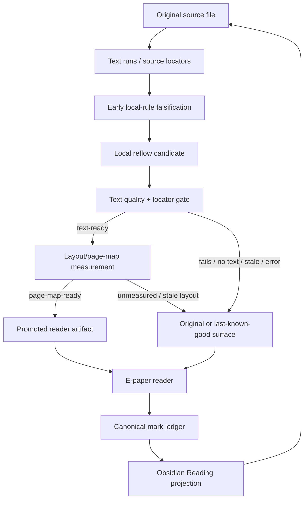
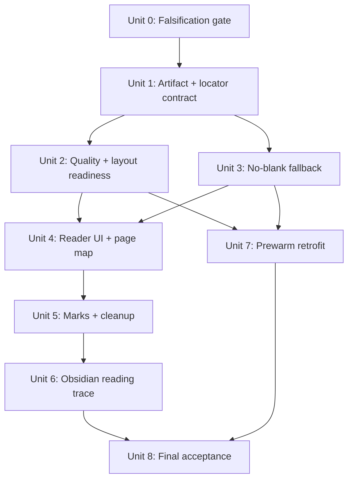
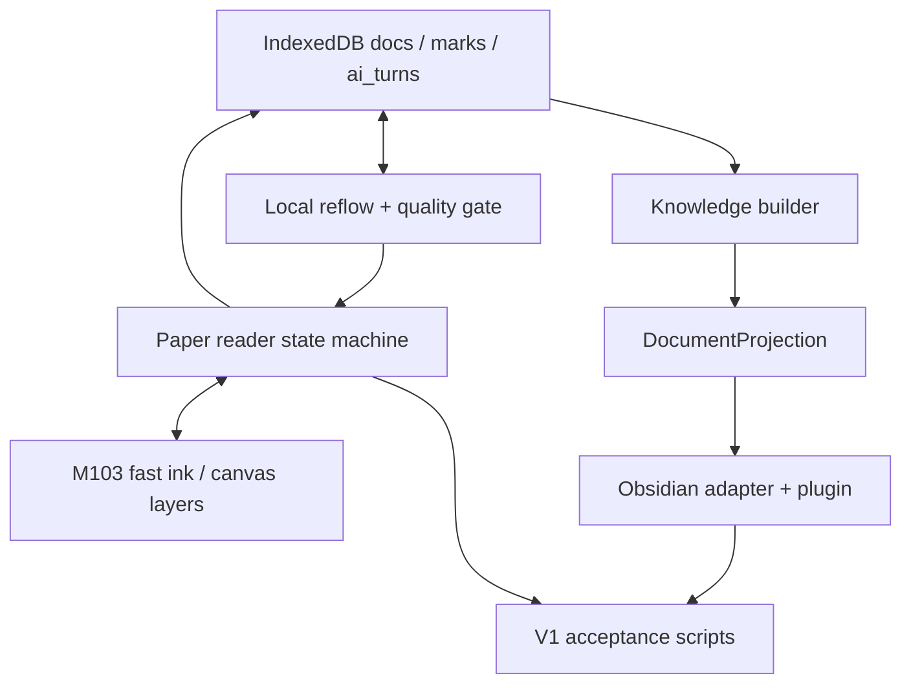

# feat: Add E-Paper Reflow Trust Loop

## Overview

This plan makes InkLoop Paper V1 reflow trustworthy enough for the focused reading demo path. The goal is not a perfect PDF reflow engine. The goal is a PDF-first, local-first reading loop where the original source stays canonical, reflow is a scored derived artifact, reader pages map back to source pages, marks survive page/view changes without residue, and Obsidian reading output can prove which real source mark produced it.

The first acceptance path is the current "AI时代的UX范式" demo PDF on the e-paper reader, plus a small fixture set for simple text, scanned/no-text fallback, and complex/low-quality fallback. EPUB and Markdown keep the same source-locator vocabulary but are not equal V1 acceptance targets for this plan.

## Problem Frame

The current reader has enough foundations to build on: local rule-based reflow, persisted `docs` page caches, reader layout snapshots, source run anchors, restored marks, page-progress persistence, Runtime Sync, and Obsidian projection. The user-visible failures come from missing trust boundaries and state handling: blank processing screens, page labels that drift, reflow pages with wasted space or no text, stale handwriting residue, marks that cannot be traced back clearly, and reading Markdown that can contain meeting-shaped output.

The correct product behavior is to treat reflow as a derived reading view. If it is valid, it can become the preferred reader surface. If it is processing, stale, low quality, or unavailable, the reader must keep original or last-known-good content visible and attach marks only to the visible stable surface.

## Requirements Trace

**Source truth and artifact trust**

- R0/R0a/R0b. Plan is PDF-first and introduces source locator plus source revision concepts that later EPUB/Markdown can share.
- R1-R5a. Original source remains canonical; reflow is local-first, deterministic, derived, provenance-carrying, and quality-gated before becoming preferred.

**Reader experience**

- R6-R13a. Reader mode must avoid blank screens, expose explicit states, keep progress coherent, use actual virtual reader pages, reduce avoidable blank space, and treat layout-affecting options as artifact identity.
- Reader States table. Original, cached-ready, processing, low-quality, no-text, ready, stale, and hard-error states must have visible behavior and mark ownership rules.

**Marks and return links**

- R14-R17a. Original and reflow marks converge on the same mark ledger, retain source and reader anchors, clean up stale ink across transitions, support legacy approximate restoration, and make back-to-source highlight canonical source first.

**Obsidian projection**

- R18-R21. Reading output must come from real reading marks, accepted AI replies, or source-linked reading artifacts; meeting-only concepts must not leak into reading; visible Markdown should stay clean while source trace remains inspectable.

**Preprocessing and performance**

- R22-R27. Local e-paper import/library open is the proof path; reflow readiness runs in the background, prioritizes current/next/previous/last-read pages, distinguishes support states, includes a falsification check, and keeps controls usable on e-paper.

**Success criteria**

- S1-S10. Verification must prove no blank reader opening, coherent original/reflow progress, correct page labels, safe fallback, mark persistence, source highlighting, reading/meeting projection separation, deterministic evidence, fixture coverage, and legacy mark compatibility.

## Scope Boundaries

- No K2pdfopt, MuPDF, OCRmyPDF, Readium, epub.js, Foliate, or engine replacement is required for V1.
- No AI/VLM rewriting is used as the default reader text source.
- No perfect PDF semantic reconstruction for complex papers, formulas, scanned books, tables, or image-heavy documents.
- No Cloud Hub dependency for local import, local reading, or local reflow readiness.
- No Web import requirement for proving this focused reflow trust loop, though Web import should later reuse the readiness contract.
- No full EPUB/Markdown quality gate in the first acceptance pass.
- No Obsidian runtime source-of-truth behavior for arbitrary PDF marks or arbitrary Markdown edits.
- No device-specific low-latency optimization in this focused reflow trust-loop task. The current connected proof device is T10CPlus; legacy M103 evidence remains useful only as historical comparison.

### Deferred to Separate Tasks

- Product-grade Cloud Hub coordination of derived reflow artifacts across devices.
- External reflow engine integration after the artifact/page-map contract is stable.
- Full EPUB locator and CFI-grade reader implementation.
- T10 device-specific handwriting latency work.

## Context & Research

### Relevant Code and Patterns

- `examples/ai-annotation-demo/src/surface/reflow.ts` contains the local deterministic baseline: `LOCAL_REFLOW_ENGINE`, `ReflowBlock`, `groupLines`, `reflowLocal`, source run ids, and page chrome filtering.
- `examples/ai-annotation-demo/src/surface/reader.ts` owns reader-mode rebuild, cached reflow lookup, virtual page navigation, reader page counts, restored mark projection, source highlighting, reply markers, and reader layout snapshots.
- `examples/ai-annotation-demo/src/core/store-format.ts` defines the durable boundary: `docs` are derived caches, while `marks` and `ai_turns` are append-only truth. `PersistedPage` currently stores `reflow`, `reflow_engine`, and reader layouts.
- `examples/ai-annotation-demo/src/local/store.ts` provides `getReflow`, `putReflow`, `putDocumentReflow`, `putReaderLayout`, `setReadingProgress`, library sync records, and document deletion.
- `examples/ai-annotation-demo/src/mobile-main.ts` owns the e-paper reading shell, view mode toggle, shelf progress, mark summary, source-return flow, and loading labels such as "正在整理重排文本".
- `examples/ai-annotation-demo/src/mobile/mobile.css` contains the Paper reader UI, shelf, mark summary, and e-paper touch target styling.
- `examples/ai-annotation-demo/src/integration/inksurface/document-projection.ts` exports `DocumentProjection` from persisted reflow blocks and falls back to synthetic page blocks when real reflow is absent.
- `examples/ai-annotation-demo/src/knowledge/builder.ts` already maps reading marks to reading-safe kinds such as `excerpt`, `annotation`, `reading_note`, `ai_note`, and `qa`.
- `packages/adapter-obsidian/src/index.ts` and `plugins/obsidian/inkloop-sync/main.js` render Obsidian Reading/Meeting output and already contain partial meeting-only filtering.
- `examples/ai-annotation-demo/scripts/verify-reflow-text-integrity.ts` is the current deterministic source/reflow hash check and should become part of the quality-gate evidence.
- Existing related tests and smokes include `examples/ai-annotation-demo/src/surface/reader-pagination.test.ts`, `examples/ai-annotation-demo/src/local/store.test.ts`, `examples/ai-annotation-demo/src/integration/inksurface/document-projection.test.ts`, `packages/adapter-obsidian/src/index.test.ts`, `examples/ai-annotation-demo/scripts/verify-obsidian-reading-kind-coverage.ts`, `examples/ai-annotation-demo/scripts/verify-m103-reading-mark-types-device.ts`, `examples/ai-annotation-demo/scripts/verify-v1-product-acceptance.ts`, and `examples/ai-annotation-demo/scripts/verify-v1-product-e2e.ts`.

### Institutional Learnings

- `docs/solutions/best-practices/source-file-centered-v1-product-boundary-2026-07-02.md` says source files are the product boundary; e-paper handles reading/thinking marks, Obsidian handles lightweight projection, and Cloud Hub coordinates identity and sync without becoming the reading source of truth.
- `docs/solutions/integration-issues/runtime-sync-canonical-path-2026-07-02.md` says normal Obsidian convergence should use Runtime Sync and hidden sidecars, not whole-vault release. This plan preserves that boundary by improving reading projection inputs rather than making Obsidian own runtime coordinates.
- `docs/solutions/integration-issues/obsidian-ink-rendering-stability-2026-06-28.md` says Obsidian source links should prefer vault/file identity when possible, persisted SVG strokes need inline styles as well as attributes, and local Obsidian writes should not force visible preview repaint.
- `docs/reviews/2026-07-04-inkloop-v1-productization-acceptance.md` shows the broader V1 loop has strong Cloud Hub, M103, Runtime Sync, and Obsidian evidence, but this plan is intentionally narrower: it fixes reader reflow trust and source-trace correctness.

### Flow Analysis

- **Open book:** user taps a shelf item; original or cached reader content must appear immediately; background readiness may start but cannot blank the screen.
- **Flip reader pages:** virtual pages advance through the actual reader page count, then hand off to the next source page without stale labels or page-1 reset.
- **Fallback page:** no-text, low-quality, stale, or hard-error pages keep original/cached content visible and attach marks to that visible stable surface.
- **Create mark:** user underlines, highlights, writes, circles, or uses AI brush; the mark gets immediate feedback, durable source locator, optional reader artifact/layout anchor, and explicit approximate handling when anchors are legacy.
- **Return to source:** mark summary, AI reply marker, and Obsidian link open canonical source first and visibly highlight the target; reader-location return is optional and only when the artifact is valid.
- **Regenerate artifact:** source revision, provider, or layout options change; old artifacts become stale, and marks migrate by source locator or degrade to source-only instead of silently attaching to unrelated layout.
- **Project to Obsidian:** Reading Markdown includes source-linked reading output only; meeting-only risk/decision/task sections do not appear in Reading unless the source object is explicitly a reading-safe kind.

### External References

- No external research was used for this plan. The V1 decision is explicitly to stabilize the local rule-based baseline and artifact contract before evaluating external engines.

## Key Technical Decisions

- **Artifact trust before engine replacement.** Add provenance, quality, page-map, and state transitions around existing `reflowLocal` before considering K2pdfopt/Readium-style engines.
- **Keep original source canonical.** Reflow can be preferred only when valid; all marks and projections must still point back to the source locator.
- **Use local deterministic rules for V1 reader text.** AI/VLM may support later analysis, but not reader text generation because it can alter the source.
- **Extend the existing store additively.** `PersistedPage.reflow` and `reflow_engine` must remain readable for compatibility, while new artifact metadata and states are added without deleting old data.
- **Reader state is explicit, not inferred from a loading label.** The UI should know whether it is showing original, cached-ready, processing, low-quality, no-text, ready, stale, or hard-error.
- **Pending and failed artifacts cannot own marks.** Marks attach to the visible stable surface only; a candidate reflow gets anchors only after promotion.
- **Legacy data is approximate, not invisible.** Old marks/reflow caches without source-locator/artifact metadata remain visible but should not be described as fully verified.
- **Split internal artifact states from user-facing reader states.** Internal states can distinguish text-ready, layout-ready, page-map-ready, stale, complex-layout, and legacy-approximate. The user-facing reader should collapse these into a few readable labels with clear next actions.
- **Split text readiness from layout/page-map readiness.** Background work can prepare text-quality artifacts for adjacent pages, but page maps depend on live or hidden layout measurement keyed by exact layout fingerprint. A page is not a preferred reader artifact until its layout/page map is valid.
- **Source fallback uses the canonical original view in V1.** If no valid cached or current reader artifact can be shown, the Paper app should switch or remain in original page view with a compact reader-state banner, rather than trying to fake the PDF inside the reflow DOM.
- **Reading and meeting projections stay separated.** Reading output uses the canonical reading-safe vocabulary: `excerpt`, `annotation`, `reading_note`, `ai_note`, and `qa`. `summary` may appear only when source-linked to reading artifacts, not as detached generated filler. Task/decision/risk remain meeting-shaped unless deliberately added by a future reading-specific requirement.

## Open Questions

### Resolved During Planning

- **Should Web import be part of the first proof?** No. Local e-paper import/library open is the proof path for this focused reflow trust loop; Web import later consumes the same readiness contract.
- **Should EPUB/Markdown share full acceptance?** No. They keep the locator/revision vocabulary, but the first quality gate is PDF-first.
- **Should external engines be planned now?** No. V1 stabilizes artifact trust and fallback behavior first.
- **Should Obsidian visible Markdown show full debug provenance?** No. Visible Markdown should show a concise source trace; detailed evidence belongs in sidecars or plugin-rendered detail.

### Deferred to Implementation

- Initial numeric quality thresholds for the fixture set; implementation should tune from fixture evidence and keep defaults conservative.
- Exact visual styling for compact banners, badges, and source flash effects after the labels and behavior below are implemented.
- Exact hidden/offscreen measurement technique for layout/page-map readiness if live-page measurement is not enough for the current Paper/T10 proof.

## V1 Identity And Locator Contract

This contract is the minimum shape the implementation must preserve. Exact field names can follow local TypeScript style, but these semantics should not be re-decided during implementation.

| Concept | V1 rule |
| --- | --- |
| `source_revision` | For local PDFs, use `PersistedDoc.file_hash`. If Cloud Hub has `cloud_revision`, record it as cloud sync metadata; do not let it replace local source revision unless the source bytes/hash changed. |
| PDF source locator | Must include `document_id`, `source_revision`, `page_id`, `page_index`, and at least one text-backed anchor (`sourceRunIds`/object refs plus quote/range when available) or geometry-backed anchor (`bbox` plus nearby quote when available). Quote alone is not a stable locator. |
| Duplicate text | Resolve with page identity plus run ids and bbox. Repeated headings or repeated paragraphs must not be located by quote-only matching. |
| Page boundary | V1 locators are page-local. A multi-page mark should split into page-local anchors or degrade to source-only approximate rather than pretending one page owns all text. |
| Artifact identity | Use source revision + normalized provider/engine key + option/layout fingerprint + page index. `local` is a legacy alias for `LOCAL_REFLOW_ENGINE`; new writes should use `LOCAL_REFLOW_ENGINE`, and old `local` caches are approximate/unverified until revalidated. |
| Artifact schema | Include schema version, migration id, created/updated timestamps, quality status, fallback reason, and text/layout readiness. Unknown or malformed versions downgrade to original/cached fallback on read. |
| Reader layout identity | Includes viewport/layout fingerprint and text run layout. It can validate visual restoration, but it does not replace source locator truth. |
| Legacy records | Old `reflow` records without artifact metadata remain renderable as compatibility caches but never satisfy fully verified promotion. |

## Reader UX Contract

Internal artifact states can be detailed, but the reader surface should stay simple. The first line is the content, not diagnostics.

| Internal outcome | User-facing label | Visible surface | Reflow control | Allowed actions |
| --- | --- | --- | --- | --- |
| Ready / cached ready | `重排阅读` | Valid reader artifact | Enabled and selected | Read, flip, mark, source return |
| Text-ready but layout pending / processing | `正在准备重排` | Original source or cached reader | Keep current surface; show pending indicator | Read visible surface, mark visible surface, retry in background |
| Low-quality / complex-layout | `已显示原版` | Original source or cached reader | Disabled for this page with reason detail | Read original, mark source, retry/reprocess later |
| No text layer | `原版阅读` | Original source | Disabled with `没有可重排文本` detail | Read original, mark source |
| Stale artifact | `正在刷新重排` | Last-known-good reader or original | Keep current surface; show stale badge | Read visible surface, mark visible surface |
| Hard error | `原版阅读` | Original source | Disabled with retry detail | Read original, mark source, retry |
| Legacy approximate | `旧版重排` | Legacy cached reader if usable | Enabled with approximate badge | Read, mark source-first, source return labels approximate |

Control behavior:

- The original/reflow toggle is enabled only when a valid current or legacy-readable artifact is visible.
- Processing and stale states do not blank the reader; they keep original/cached selected and show a small status badge.
- Low-quality, no-text, and hard-error states disable reflow for that page and keep original source selected.
- State labels live in the reader chrome near page/progress controls, not as large body placeholders.
- Basic accessibility target: controls are at least 44 px touch targets where layout allows, icon controls have text labels or accessible labels, focus is visible, state changes are announced through visible text, and source highlights are not color-only.

Source-return behavior:

- Entry points are mark summary, AI reply markers, and `inkloop://doc/...` links.
- Destination is canonical original source first. If a valid matching reader artifact exists, the user may then return to the reader page.
- Highlight should scroll to the locator, flash or outline the target for a bounded interval, and keep a persistent route back to the prior reader context.
- Approximate locators show an approximate badge; missing locators fall back to the source page with a clear "无法精确定位" state.

## Causal Triage

| Symptom | Suspected cause | Smallest validating test | Proceed if not confirmed? |
| --- | --- | --- | --- |
| Blank reader while reflow runs | Reader hides original and has no cached visible surface | Open current demo PDF with no cache and force slow/failed reflow | No; fix immediate fallback first |
| Page label drift or page-1 reset | Reader virtual page count not tied to layout/page map | Flip original page 5 to reflow and back with measured page map | No; page-map label path must be fixed |
| Wasted bottom space | Pagination protects too much or lacks fill check | Fixture page with long body text and measured viewport | Yes, after no-blank fallback is fixed |
| Stale handwriting residue | Fast-ink/canvas cleanup missing on transitions | Page switch, shelf return, mark drawer open/close smoke | Yes, but isolate from reflow engine work |
| Obsidian meeting categories in Reading | Projection classification/filtering drift | Reading projection smoke with reading-native kinds only | Yes, can be fixed after reader trust core |

## High-Level Technical Design

> This illustrates the intended approach and is directional guidance for review, not implementation specification. The implementing agent should treat it as context, not code to reproduce.



| Reader state | Preferred visible surface | Artifact promotion | Mark ownership |
| --- | --- | --- | --- |
| Original available | Original source | Not required | Source locator |
| Cached reflow ready | Last valid artifact | Already valid | Stable artifact plus source locator |
| Processing | Original or cached | Pending only | Visible stable surface |
| Low-quality reflow | Original or cached | Blocked | Visible stable surface |
| No text layer | Original source | Blocked | Source locator |
| Ready | Current valid artifact | Promoted | Artifact/layout plus source locator |
| Stale artifact | Original or last-known-good | Refresh pending | Visible stable surface |
| Hard error | Original source | Blocked | Source locator |
| Legacy approximate reflow | Legacy cached reader if usable | Unverified compatibility only | Source locator plus approximate reader anchor |

Canonical mapping:

- `complex_layout` is not a separate reader state. It maps to `Low-quality reflow` with fallback reason `complex_layout`.
- `text_ready` without layout/page-map measurement is `Processing` or `Stale artifact`, depending on whether a previous valid surface exists.
- Legacy `local` or metadata-free reflow caches map to `Legacy approximate reflow` and never satisfy fully verified checks.

## Implementation Units



- [x] **Unit 0: Run Early Local-Reflow Falsification Gate**

**Goal:** Validate the core premise before building broad reader, mark, prewarm, or Obsidian work: the current local rule-based path must be able to support the focused demo PDF or produce a deliberate fallback-first decision.

**Requirements:** R0, R4, R5a, R8-R9a, R22, R26, S8, S9

**Dependencies:** None

**Files:**
- Modify: `examples/ai-annotation-demo/scripts/verify-reflow-text-integrity.ts`
- Create: `examples/ai-annotation-demo/scripts/verify-reader-reflow-falsification.ts`
- Test: `examples/ai-annotation-demo/src/surface/reflow-quality.test.ts`

**Approach:**
- Run the current "AI时代的UX范式" target pages plus scanned/no-text and complex/low-quality fixtures through the existing `groupLines`/`reflowLocal` path before adding new reader UI.
- Record normalized text preservation, source run coverage, source order, basic locator availability, page chrome removal, and obvious layout hazards.
- Include negative controls that preserve most text but break trust: repeated headings, repeated paragraphs, near-identical quotes on adjacent pages, page-boundary splits, header/footer removal, CJK line wraps, and two-column order inversion.
- Gate later work on one of three explicit decisions:
  - Continue local reflow: target pages have usable text preservation and locator evidence.
  - Fallback-first V1: local rules cannot safely promote the target pages, so reader work focuses on original/cached fallback trust.
  - Reopen engine evaluation: local rules cannot meet the demo requirement and fallback-first is not an acceptable demo story.

**Patterns to follow:**
- `examples/ai-annotation-demo/scripts/verify-reflow-text-integrity.ts`
- `examples/ai-annotation-demo/src/surface/reflow.ts`

**Test scenarios:**
- Happy path: current target demo pages produce useful text blocks with stable source run coverage.
- Expected failure: scanned/no-text fixture is classified as fallback, not empty successful reflow.
- Expected failure: duplicated or order-inverted fixture is blocked from promotion even if normalized text mostly matches.
- Product gate: the report contains `continue_local_reflow`, `fallback_first`, or `reopen_engine_scope` and the reason for that decision.

**Verification:**
- A machine-readable falsification report exists before Units 1-8 proceed.

- [x] **Unit 1: Add Artifact, Locator, And Store Compatibility Contract**

**Goal:** Represent reflow as a derived artifact with source revision, provider/options identity, layout identity inputs, quality status, page-map handle, and compatibility for legacy `reflow` caches.

**Requirements:** R0a, R0b, R1-R5a, R13, R13a, R16a, S8, S10

**Dependencies:** Unit 0

**Files:**
- Modify: `examples/ai-annotation-demo/src/core/store-format.ts`
- Modify: `examples/ai-annotation-demo/src/local/store.ts`
- Modify: `examples/ai-annotation-demo/src/surface/reflow.ts`
- Modify: `examples/ai-annotation-demo/src/surface/renderer.ts`
- Create: `examples/ai-annotation-demo/src/surface/reflow-artifact.ts`
- Test: `examples/ai-annotation-demo/src/local/store.test.ts`
- Test: `examples/ai-annotation-demo/src/surface/reflow-artifact.test.ts`

**Approach:**
- Add an artifact wrapper around existing `ReflowBlock[]` rather than replacing blocks directly. The artifact should carry source revision, provider/engine, option/layout fingerprint, validity status, quality summary, page map summary, and created/updated timestamps.
- Keep existing `getReflow`/`putReflow` callers working during migration, but introduce artifact-aware helpers for new code paths.
- Treat old pages with only `reflow` and `reflow_engine` as legacy approximate artifacts. They can render, but they should not satisfy "fully verified" checks.
- Keep the data model additive so old IndexedDB records remain readable.
- Implement the V1 identity and locator rules in this plan: local PDF `source_revision = file_hash`; PDF locators need page identity plus run/bbox evidence; artifact identity is source revision plus normalized engine/provider and layout-affecting options.
- Normalize engine keys. New writes use `LOCAL_REFLOW_ENGINE`; old `reflow_engine === "local"` records remain readable as approximate legacy local artifacts.
- Add schema version, migration id, revalidate-on-read, unknown-version downgrade, and rollback behavior so bad metadata cannot strand documents in broken reader states.
- Add one fake non-local provider artifact test with different block segmentation to prove reader and source-return logic consume the contract rather than `LOCAL_REFLOW_ENGINE` block ids.

**Execution note:** Add characterization coverage for old `PersistedPage.reflow` records before changing storage behavior.

**Patterns to follow:**
- `PersistedReaderLayoutSnapshot` in `examples/ai-annotation-demo/src/core/store-format.ts`
- `getReflow`, `putReflow`, `putDocumentReflow`, and `putReaderLayout` in `examples/ai-annotation-demo/src/local/store.ts`
- `LOCAL_REFLOW_ENGINE` and deterministic `blockId` in `examples/ai-annotation-demo/src/surface/reflow.ts`

**Test scenarios:**
- Happy path: storing a new valid local artifact preserves blocks, source revision, provider/options identity, quality status, and page-map summary.
- Compatibility: a legacy page with only `reflow` and `reflow_engine` still returns renderable blocks but is marked approximate or unverified.
- Compatibility: both `local` and `local@v5` persisted records are readable, but new writes normalize to `LOCAL_REFLOW_ENGINE`.
- Edge case: changing source revision, provider, or layout-affecting options invalidates the preferred artifact without deleting the prior record.
- Error path: malformed or missing artifact metadata falls back to original/cached view state rather than throwing during reader open.
- Rollback path: unknown schema/migration versions downgrade to original/cached fallback without losing marks.
- Integration: active-document and non-active-document artifact writes both persist without crossing document ids.

**Verification:**
- Store-level tests prove old and new page records can coexist, old marks are not lost, and new artifact metadata can drive reader decisions.

- [x] **Unit 2: Add Quality Gate, Locator Checks, And Layout Readiness**

**Goal:** Score each local reflow candidate before promotion, block unsafe candidates, and split text-quality readiness from layout/page-map readiness.

**Requirements:** R0, R0a, R3, R5a, R8-R12, R24-R26, S1-S4, S8, S9

**Dependencies:** Unit 1

**Files:**
- Create: `examples/ai-annotation-demo/src/surface/reflow-quality.ts`
- Create: `examples/ai-annotation-demo/src/surface/reader-page-map.ts`
- Modify: `examples/ai-annotation-demo/src/surface/reflow.ts`
- Modify: `examples/ai-annotation-demo/src/surface/reader.ts`
- Modify: `examples/ai-annotation-demo/scripts/verify-reflow-text-integrity.ts`
- Test: `examples/ai-annotation-demo/src/surface/reflow-quality.test.ts`
- Test: `examples/ai-annotation-demo/src/surface/reader-pagination.test.ts`

**Approach:**
- Build the quality gate around measurable local checks: usable text count, source/reflow normalized text hash, block source locators, source run coverage, locator ordering, duplicate-text disambiguation, and complex-layout fallback indicators.
- Split lifecycle outcomes:
  - `text_ready`: source text, locators, order, and quality checks pass, but layout may not be measured.
  - `layout_ready`: visible or hidden measurement has produced a page map for the exact layout fingerprint.
  - `page_map_ready`: source locators can map to reader virtual pages for labels and return links.
- Produce a reader page map only from measured layout. Adjacent/background pages can become text-ready, but cannot become preferred reader artifacts until measured.
- Keep the gate conservative: if a result is ambiguous, prefer original/cached fallback over claiming successful reflow.
- Extend the integrity script from hash-only reporting into fixture-class evidence that can tell "pass", "no text fallback", and "low-quality fallback" apart.

**Technical design:** Directional quality outcome shape:

```text
candidate + source runs + pagination measurement
-> quality result: text_ready | no_text | low_quality | complex_layout | stale | error
-> layout result: page_map_ready | page_map_pending | stale_layout
-> artifact promotion decision
```

**Patterns to follow:**
- `groupLines` and `reflowLocal` in `examples/ai-annotation-demo/src/surface/reflow.ts`
- `readerDocumentPageInfo`, `readerPageCountForSource`, and `paginateLayout` in `examples/ai-annotation-demo/src/surface/reader.ts`
- Existing hash comparison in `examples/ai-annotation-demo/scripts/verify-reflow-text-integrity.ts`

**Test scenarios:**
- Happy path: the simple text fixture and the measured current demo PDF page class produce text-ready plus page-map-ready artifacts with matching normalized text hash and a non-empty page map.
- Text-ready path: an adjacent page can persist as text-ready/page-map-pending without being preferred before layout measurement.
- Fallback: a scanned/no-text fixture returns `no_text` and does not promote a preferred reflow artifact.
- Fallback: a complex/low-quality fixture with lost locators, mismatched hash, duplicate quote ambiguity, wrong page/run order, or near-empty intermediate reader page returns low-quality/complex fallback.
- Edge case: a final partial page is allowed, but an empty or near-empty page while more body text remains is blocked.
- Edge case: stale page maps after viewport/style changes downgrade to page-map-pending until remeasured.
- Integration: reader page labels use page-map counts and do not reset to page 1 after virtual page flips.

**Verification:**
- Fixture evidence demonstrates one preferred reflow success, one no-text fallback, and one low-quality/complex fallback without relying on manual inspection.

- [x] **Unit 3: Ship Immediate No-Blank Source Fallback**

**Goal:** Eliminate the most visible failure early: opening or switching to reader mode must never hide original/cached content behind a blank or loading-only surface.

**Requirements:** R6, R7, R9, R23, R25, R27, Reader States table, S1

**Dependencies:** Unit 1

**Files:**
- Modify: `examples/ai-annotation-demo/src/surface/reader.ts`
- Modify: `examples/ai-annotation-demo/src/mobile-main.ts`
- Modify: `examples/ai-annotation-demo/src/surface/renderer.ts`
- Modify: `examples/ai-annotation-demo/src/mobile/mobile.css`
- Test: `examples/ai-annotation-demo/src/surface/reader-state.test.ts`

**Approach:**
- Implement the fallback rendering contract: if no valid cached/current reader artifact can be shown, use canonical original page view with a compact reader-state banner instead of clearing reader content and inserting a placeholder.
- Avoid rendering original PDF inside the reflow DOM for V1. Switch or remain in page/original mode while preserving reader intent/status in chrome.
- Ensure marks made during fallback attach to the original source surface and source locator.
- Keep cached reader content visible when it exists, even while a refresh is processing or stale.

**Patterns to follow:**
- `applyViewMode`, `renderPageTextLayerOnly`, `recordBookReadingProgress`, and `reflowPageInfo` in `examples/ai-annotation-demo/src/mobile-main.ts`
- `rebuild`, `renderFinal`, `readerVInfo`, `readerSetVPage`, `readerFlip`, and `settleV` in `examples/ai-annotation-demo/src/surface/reader.ts`
- Original rendering lifecycle in `examples/ai-annotation-demo/src/surface/renderer.ts`
- E-paper control styling near `#view-toggle` and `#book-marks` in `examples/ai-annotation-demo/src/mobile/mobile.css`

**Test scenarios:**
- Happy path: opening a book with a valid cached artifact renders cached reader content immediately.
- Processing: opening a book with no ready artifact keeps original source visible and shows `正在准备重排`.
- Fallback: scanned/no-text page shows original source with `原版阅读` and does not present an empty-success reflow page.
- Error path: reflow failure keeps original source readable and allows retry without losing marks.
- Mark ownership: a mark made in fallback attaches to original source, not a pending artifact.

**Verification:**
- Reader-state tests and e-paper smoke evidence show no white-screen opening when original/cached content exists.
- 2026-07-06 automated evidence: reader-state, page-map, quality-gate, reflow-artifact, and local-store tests pass; TypeScript and scoped Biome checks pass; local falsification gate continues with `continue_local_reflow`; first 3 demo PDF pages preserve matching source/reflow text hashes. Device smoke remains part of Unit 8 acceptance.

- [x] **Unit 4: Integrate Page Map, Reader Labels, And Page Fill**

**Goal:** Connect measured layout/page maps to reader labels, progress, toggles, source return, and text layout quality after the no-blank fallback is stable.

**Requirements:** R8-R13, R17, R24-R27, S2-S4, S6

**Dependencies:** Units 2 and 3

**Files:**
- Modify: `examples/ai-annotation-demo/src/surface/reader.ts`
- Modify: `examples/ai-annotation-demo/src/mobile-main.ts`
- Modify: `examples/ai-annotation-demo/src/mobile/mobile.css`
- Test: `examples/ai-annotation-demo/src/surface/reader-state.test.ts`
- Test: `examples/ai-annotation-demo/src/surface/reader-pagination.test.ts`

**Approach:**
- Use page-map-ready artifacts for real reader page labels and progress; do not estimate preferred reader labels from unmeasured text-ready pages.
- Apply the Reader UX Contract labels and toggle states from this plan.
- Tighten page-fill behavior so ordinary virtual pages use available vertical space while final partial pages remain acceptable.
- Make state labels compact and reader-facing; diagnostic details stay behind detail/debug surfaces.
- Add touch/focus/accessibility acceptance: 44 px target where layout allows, visible focus, accessible labels for icon controls, and non-color-only source highlights.

**Patterns to follow:**
- `readerDocumentPageInfo`, `readerPageCountForSource`, `paginateLayout`, `settleV`, and `applyV` in `examples/ai-annotation-demo/src/surface/reader.ts`
- `recordBookReadingProgress`, `renderPager`, and view toggle code in `examples/ai-annotation-demo/src/mobile-main.ts`

**Test scenarios:**
- Happy path: flipping original page 5 into reader mode lands on the matching measured virtual page instead of a blank or page-1 reset.
- Processing: text-ready/page-map-pending pages do not show final reader page totals until measured.
- Edge case: stale layout fingerprint downgrades page map and keeps old/cached content visible until remeasured.
- Layout: ordinary body pages avoid large preventable bottom gaps; final partial pages may leave space.
- Accessibility: state label, toggle, mark summary, and source-return controls are focusable/readable and not color-only.

**Verification:**
- Reader pagination tests prove measured virtual page count, page labels, and page-fill behavior are coherent.
- 2026-07-06 automated evidence: reader pagination tests cover source page to virtual page label alignment; reader `ready/vpage` events now carry canonical page state; mobile page indicator and reading progress consume the same state; source-return from AI reply switches to original page and flashes the source bbox; scoped TypeScript, Biome, falsification, and text-hash verification pass. Device visual/performance smoke remains part of Unit 8 acceptance.

- [x] **Unit 5: Stabilize Mark Ownership, Return Links, And Fast-Ink Cleanup**

**Goal:** Ensure marks attach to the visible stable surface, survive regeneration and reopen, and do not leave handwriting residue on unrelated screens or pages.

**Requirements:** R13a, R14-R17a, S5, S6, S10

**Dependencies:** Units 3 and 4

**Files:**
- Modify: `examples/ai-annotation-demo/src/surface/reader.ts`
- Modify: `examples/ai-annotation-demo/src/mobile-main.ts`
- Modify: `examples/ai-annotation-demo/src/capture/m103-input-source.ts`
- Modify: `examples/ai-annotation-demo/src/capture/m103-hqhw-area.ts`
- Modify: `examples/ai-annotation-demo/src/capture/m103-raw-pen-adapter.ts`
- Test: `examples/ai-annotation-demo/src/surface/reader-mark-ownership.test.ts`
- Test: `examples/ai-annotation-demo/src/capture/m103-raw-pen-adapter.test.ts`

**Approach:**
- Make mark capture consult current reader state before assigning artifact/layout anchors. Pending, failed, stale, or fallback states attach marks to source or last-known-good surface only.
- Preserve existing `reflow_anchor_runs`, `reader_layout_id`, `surface_points`, and `current_reader_layout_id` behavior for valid artifacts, but label legacy/approximate restoration explicitly when anchors are missing.
- Audit cleanup points for page switch, view switch, mark summary open/close, source return, shelf return, OSD clear, and app background/foreground.
- Make "Back to source" open the canonical source locator first and flash/highlight the target. Reader-location return is secondary and only when the artifact is valid.
- Implement the source-return flow contract: destination view, scroll/zoom behavior, highlight duration/style, persistent return-to-reader action, focus target, approximate-locator badge, and missing-locator fallback.

**Patterns to follow:**
- `captureReaderMark`, `ensureReaderLayoutId`, `syncRestoredMarks`, `readerFocusMark`, and `readerFocusOverlay` in `examples/ai-annotation-demo/src/surface/reader.ts`
- `openMarkSummaryPanel`, source-return handling, and `backToBookShelf` in `examples/ai-annotation-demo/src/mobile-main.ts`
- M103 OSD clear barrier and raw pen tests in `examples/ai-annotation-demo/src/capture/*`

**Test scenarios:**
- Happy path: a mark made on a valid reader artifact persists through page switch, shelf return, reopen, mark summary, and source return highlight.
- Fallback: a mark made while reflow is processing or low-quality attaches to source/cached visible surface, not the pending candidate.
- Regeneration: when a new artifact identity replaces an old one, existing reader marks migrate by source locator or become source-only/approximate.
- Error path: stale ink from prior page/test drawing is cleared when returning to shelf or opening another book.
- Integration: AI reply marker and mark summary both call the same source-return highlight path.

**Verification:**
- Paper/T10 mark-type device smokes and unit tests prove visible marks are durable, old approximate marks remain visible, and unrelated screens do not retain old ink.
- 2026-07-06 T10CPlus device evidence: `smoke:paper-reading-mark-types-device` ran against `AI时代的UX范式.pdf` with `INKLOOP_REQUIRE_TARGET_DOCUMENT=1`, created underline/circle/handwriting/review-later marks, reopened the book and verified all four persisted, pulled Runtime Sync events for the runtime-eligible marks, and cleaned test marks before and after the run (`cleanup_before.marks=10`, `cleanup_after.marks=4`). Device report identified `model: T10CPlus`, `manufacturer: ONYX`, Android 12, document `doc_3cfa06ac81d6`.

- [x] **Unit 6: Make Obsidian Reading Projection Source-Traceable And Meeting-Safe**

**Goal:** Ensure Obsidian Reading output is generated from real reading marks/accepted replies/source-linked artifacts, exposes useful source trace, and does not show meeting-only task/decision/risk sections by default.

**Requirements:** R18-R21, R17, S6, S7

**Dependencies:** Unit 5

**Files:**
- Modify: `examples/ai-annotation-demo/src/knowledge/builder.ts`
- Modify: `examples/ai-annotation-demo/src/integration/inksurface/document-projection.ts`
- Modify: `packages/adapter-obsidian/src/index.ts`
- Modify: `plugins/obsidian/inkloop-sync/main.js`
- Modify: `examples/ai-annotation-demo/scripts/verify-obsidian-reading-kind-coverage.ts`
- Test: `examples/ai-annotation-demo/src/knowledge/builder.test.ts`
- Test: `examples/ai-annotation-demo/src/integration/inksurface/document-projection.test.ts`
- Test: `packages/adapter-obsidian/src/index.test.ts`

**Approach:**
- Update reading projection expectations from the current generic "Reading Note / Highlight / Task / Decision / Risk" coverage toward the canonical reading-safe vocabulary: `excerpt`, `annotation`, `reading_note`, `ai_note`, `qa`, and source-linked `summary`.
- Treat review-later as `reading_note`; do not introduce a separate review-later kind in V1. Treat `source_document` as a document hub/frontmatter artifact, not a mark-derived reading item.
- Keep meeting-only `task`, `decision`, `risk`, `meeting_action`, `meeting_decision`, and `meeting_risk` out of Reading unless a future reading-specific requirement intentionally adds them.
- Include concise visible source trace for each reading item: source title, locator/page label, quote or nearby excerpt, mark type, AI acceptance state when relevant, and `inkloop://doc/...` backlink.
- Keep dense provenance, artifact hashes, and debug evidence in sidecars or plugin-rendered detail rather than cluttering visible Markdown.
- Reject or degrade artifact-derived reading output when it lacks a precise enough locator to support source highlight.

**Patterns to follow:**
- Reading KO assembly rules in `examples/ai-annotation-demo/src/knowledge/builder.ts`
- Synthetic page warning behavior in `examples/ai-annotation-demo/src/integration/inksurface/document-projection.ts`
- `knowledgeObjectsForEntity`, `vaultFolderForEntity`, and `renderVaultMarkdown` in `packages/adapter-obsidian/src/index.ts`
- Cloud reading render helpers and `inkloop://doc` handling in `plugins/obsidian/inkloop-sync/main.js`

**Test scenarios:**
- Happy path: a real highlighted reading mark produces a Reading item with source title, page/locator label, quote/excerpt, mark type, and return link.
- Happy path: an accepted AI reply anchored to a reading mark produces an AI note with source trace and acceptance state.
- Happy path: a source-linked reading summary, if rendered, includes source refs and does not appear as detached generated content.
- Edge case: a pure handwriting/drawing annotation produces useful reading output without pretending to be selected source text.
- Error path: a projected item without source locator is omitted or marked approximate rather than rendered as fully verified.
- Integration: Reading output contains no meeting-only task/decision/risk sections, and Meeting output remains unaffected.

**Verification:**
- Obsidian reading coverage smoke writes one source-file Reading document with real reading-shaped items and no meeting-only leakage.
- 2026-07-06 automated evidence: `src/knowledge/builder.test.ts` passes with reading output generated as `excerpt`, `annotation`, `reading_note`, `ai_note`, and `qa`; `packages/adapter-obsidian/src/index.test.ts` passes and verifies Reading filters meeting-only `task`/`decision`/`risk`; `smoke:obsidian-reading-kind-coverage` passes and checks the active vault Reading files for stale meeting/legacy sections.

- [x] **Unit 7: Extend Existing Prewarm Path For Local E-Paper Reading**

**Goal:** Improve local readiness by extending the existing adjacent prewarm path, not by introducing a standalone queue before the proof path earns it.

**Requirements:** R5, R22-R25, S1, S8, S9

**Dependencies:** Units 2 and 3

**Files:**
- Modify: `examples/ai-annotation-demo/src/surface/reader.ts`
- Modify: `examples/ai-annotation-demo/src/mobile-main.ts`
- Modify: `examples/ai-annotation-demo/src/local/store.ts`
- Test: `examples/ai-annotation-demo/src/surface/reader-pagination.test.ts`
- Test: `examples/ai-annotation-demo/src/surface/reflow-quality.test.ts`

**Approach:**
- Extend `prewarmPage` and `prewarmAdjacent` with artifact-state awareness, failure-state retention, and priority order: current, next, previous, then last-read/resume if cheap.
- Prewarm can produce text-ready/page-map-pending artifacts. It must not claim page-map-ready for non-visible pages unless a bounded hidden measurement surface with exact layout fingerprint is implemented.
- Defer standalone queue and document-wide background processing to a separate task unless retrofitting creates concrete duplication or state-management complexity.
- Prewarm work must never block original source readability and must preserve failure states for support/debug rather than retrying endlessly without state.
- Keep readiness local-first; Cloud Hub sync can later mirror artifact readiness but is not required for this plan.

**Patterns to follow:**
- `prewarmPage` and `prewarmAdjacent` in `examples/ai-annotation-demo/src/surface/reader.ts`
- `setReadingProgress` and `last_read_progress` in `examples/ai-annotation-demo/src/local/store.ts`
- Library open and shelf progress behavior in `examples/ai-annotation-demo/src/mobile-main.ts`

**Test scenarios:**
- Happy path: opening a local e-paper document prepares current/next/previous text-ready artifacts without blocking original reading.
- Edge case: repeated open/close does not duplicate prewarm work or overwrite a valid cached artifact with a failed candidate.
- Error path: no-text and low-quality pages retain explicit states and do not block later page readiness.
- Integration: page flip first checks promoted/cached/page-map-ready artifact before generating synchronously; text-ready/page-map-pending pages measure on open.

**Verification:**
- Tests prove priority order, text-ready vs page-map-ready distinction, and failure-state retention; device smoke shows opening/flip behavior does not wait on full-document processing.
- 2026-07-06 automated evidence: prewarm now treats explicit `no_text`/`low_quality` artifacts as cached readiness states via `getReflowArtifact`, so unsupported pages do not retry endlessly; store tests verify blocked artifacts count as document reflow state while remaining non-renderable; focused reflow tests, TypeScript, Biome, falsification, and text-hash verification pass.

- [x] **Unit 8: Extend V1 Acceptance Evidence For The Focused Reflow Loop**

**Goal:** Make the trustworthy reflow loop objectively verifiable through deterministic fixtures, no-device tests, and focused Paper/T10 evidence.

**Requirements:** R0, R16a, R17a, R26, S1-S10

**Dependencies:** Units 0-7

**Files:**
- Modify: `examples/ai-annotation-demo/scripts/verify-reflow-text-integrity.ts`
- Modify: `examples/ai-annotation-demo/scripts/verify-m103-reading-mark-types-device.ts`
- Modify: `examples/ai-annotation-demo/scripts/verify-v1-product-acceptance.ts`
- Modify: `examples/ai-annotation-demo/scripts/verify-v1-product-e2e.ts`
- Create: `examples/ai-annotation-demo/scripts/verify-reader-reflow-trust-loop.ts`
- Modify: `examples/ai-annotation-demo/package.json`
- Modify: `docs/reviews/2026-07-04-inkloop-v1-productization-acceptance.md`

**Approach:**
- Add a focused smoke/audit entry for the reader reflow trust loop rather than overloading broader Cloud Hub V1 verification.
- Fixture evidence should report falsification result, artifact state, text/layout readiness, quality outcome, page-map status, reader page count, fallback class, mark persistence, source-return highlight, and Obsidian Reading trace.
- Add a product acceptance journey on the connected Paper device, currently T10CPlus: open the target demo PDF, read through the selected target pages/sections, create at least one real reading mark, return to source, verify Obsidian Reading output, and recover from any fallback state without blank or diagnostic-only UI.
- Report whether the final path is `local_reflow_preferred`, `fallback_first`, or `engine_scope_reopened`. Do not let a fallback-first result masquerade as successful preferred reflow.
- Keep physical stylus acceptance separated from synthetic/dev hooks. Synthetic marks can validate downstream logic but must be labeled diagnostic when they replace user input.
- Update acceptance docs with the new evidence status after implementation runs, without claiming external engine support or perfect complex-PDF reflow.

**Patterns to follow:**
- Existing V1 audit shape in `examples/ai-annotation-demo/scripts/verify-v1-product-acceptance.ts`
- Existing mark persistence smoke in `examples/ai-annotation-demo/scripts/verify-m103-reading-mark-types-device.ts`, now exposed through `smoke:paper-reading-mark-types-device` for the current T10/Paper proof path.
- Existing no-device product smoke in `examples/ai-annotation-demo/scripts/verify-v1-product-e2e.ts`

**Test scenarios:**
- Happy path: current demo PDF opens without blank screen, promotes valid reflow for at least the target pages, flips through virtual pages with coherent labels, and returns to source highlight.
- Fallback: scanned/no-text fixture opens original view and records no-text state without empty-success reflow.
- Fallback: complex/low-quality fixture records low-quality/complex state and keeps original/cached content visible.
- Legacy: old mark/reflow records remain visible or approximate and are not projected as fully verified.
- Integration: Obsidian Reading output for the demo document is traceable to real reading marks and contains no meeting-only sections.
- Product journey: target demo flow remains understandable without requiring the user to understand artifact promotion, mark ownership, or diagnostic state terminology.

**Verification:**
- Acceptance output includes the fixture matrix and all S1-S10 results in a machine-readable report plus a concise review-doc update.
- 2026-07-06 automated evidence: added `verify:reader-reflow-trust-loop`, which composes falsification, text integrity, and Obsidian Reading coverage into `.inkloop/reports/reflow-trust-loop.json`; the current run reports `decision: "local_reflow_preferred"`, falsification `continue_local_reflow`, text integrity passed for the first 3 demo PDF pages, and Obsidian Reading projection passed with active-vault guard coverage. Physical stylus remains explicitly out of scope for this no-device smoke.

## System-Wide Impact



- **Interaction graph:** The main affected surfaces are local store, reflow builder, reader UI, M103 ink cleanup, mark ledger, knowledge builder, document projection, Obsidian renderer/plugin, and acceptance scripts.
- **Error propagation:** Reflow extraction/gate errors become reader states and artifact statuses. They should not throw the reader into blank UI or lose marks.
- **State lifecycle risks:** Artifact candidate, promoted artifact, stale artifact, legacy cache, and mark anchors must remain distinct to avoid silent data corruption.
- **API surface parity:** `getReflow`/`putReflow` compatibility must be preserved while new artifact-aware helpers become the preferred path.
- **Integration coverage:** Unit tests alone are insufficient; the final proof needs fixture reports, reader smoke, mark persistence, source-return highlight, and Obsidian output validation.
- **Unchanged invariants:** `marks` and `ai_turns` remain the source-of-truth ledgers; `docs.pages[].reflow` remains a derived cache; Cloud Hub remains optional for local reading readiness.

## Risk Analysis & Mitigation

| Risk | Likelihood | Impact | Mitigation |
| --- | --- | --- | --- |
| Artifact metadata migration breaks old books | Medium | High | Add compatibility tests before changing store helpers; keep old `reflow` blocks readable as approximate. |
| Quality gate is too strict and disables useful reflow | Medium | Medium | Start with conservative fixture classes and report reasons; allow original fallback instead of blocking reading. |
| Quality gate is too loose and promotes misleading text | Medium | High | Require text-hash, locator, and page-map checks before preferred promotion. |
| Reader state machine creates new UI complexity | Medium | Medium | Keep visible states minimal and map them directly to the origin Reader States table. |
| Mark projection drifts after regeneration | Medium | High | Use source locators first, artifact/layout identity second, and explicit source-only degradation. |
| Fast-ink residue remains on shelf or another book | Medium | High | Audit every reader transition and add cleanup tests/smoke assertions for page/view/shelf changes. |
| Obsidian reading output still shows meeting categories | Medium | Medium | Update adapter/plugin filters and reading coverage smoke to use reading-native kinds only. |
| Performance still feels slow on first open | Medium | Medium | Show original/cached surface immediately and extend existing prewarm with prioritized readiness. |

## Phased Delivery

### Phase 0: Falsify Before Building

- Run Unit 0 before broad implementation. If it returns `reopen_engine_scope`, pause this plan and decide whether to evaluate an external engine or reduce the demo fixture scope.

### Phase 1: Trust Contract

- Land Units 1 and 2 first. This establishes artifact metadata, compatibility, quality outcomes, and source-to-reader mapping without changing the whole UI at once.
- After Unit 2, hold a stop/go gate: continue local reflow, switch the demo to fallback-first, or reopen engine evaluation before Units 4-8.

### Phase 2: Reader Behavior

- Land Units 3, 4, 5, and 7 in dependency order. The no-blank fallback can ship before page-map polish; mark ownership and prewarm depend on the same state vocabulary.

### Phase 3: Projection And Acceptance

- Land Units 6 and 8 after reader behavior stabilizes. Projection should reflect real trustworthy marks rather than compensate for unstable reader state.

## Documentation / Operational Notes

- Update the acceptance snapshot only after implementation evidence exists; this plan itself is not a pass claim.
- Keep the current broader V1 Cloud Hub and meeting acceptance separate from this focused reflow trust-loop evidence.
- If Unit 0 or the Unit 2 stop/go gate shows local rules cannot pass the current demo PDF target even with fallback, explicitly reopen engine-integration or fixture-scope decisions before proceeding.
- Any future external engine should plug into the artifact/provenance/page-map contract introduced here.

## Sources & References

- **Origin document:** `docs/brainstorms/2026-07-06-epaper-reflow-trustworthy-loop-requirements.md`
- Ideation: `docs/ideation/2026-07-06-epaper-reflow-ideation.md`
- Source-file boundary: `docs/solutions/best-practices/source-file-centered-v1-product-boundary-2026-07-02.md`
- Runtime Sync boundary: `docs/solutions/integration-issues/runtime-sync-canonical-path-2026-07-02.md`
- Obsidian rendering stability: `docs/solutions/integration-issues/obsidian-ink-rendering-stability-2026-06-28.md`
- V1 acceptance context: `docs/reviews/2026-07-04-inkloop-v1-productization-acceptance.md`
- Reflow baseline: `examples/ai-annotation-demo/src/surface/reflow.ts`
- Reader implementation: `examples/ai-annotation-demo/src/surface/reader.ts`
- Store format: `examples/ai-annotation-demo/src/core/store-format.ts`
- Local store: `examples/ai-annotation-demo/src/local/store.ts`
- E-paper shell: `examples/ai-annotation-demo/src/mobile-main.ts`
- Obsidian projection: `examples/ai-annotation-demo/src/integration/inksurface/document-projection.ts`
- Obsidian adapter/plugin: `packages/adapter-obsidian/src/index.ts`, `plugins/obsidian/inkloop-sync/main.js`
