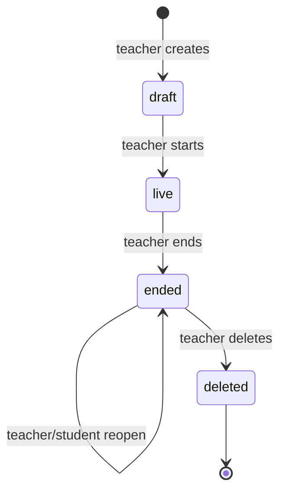
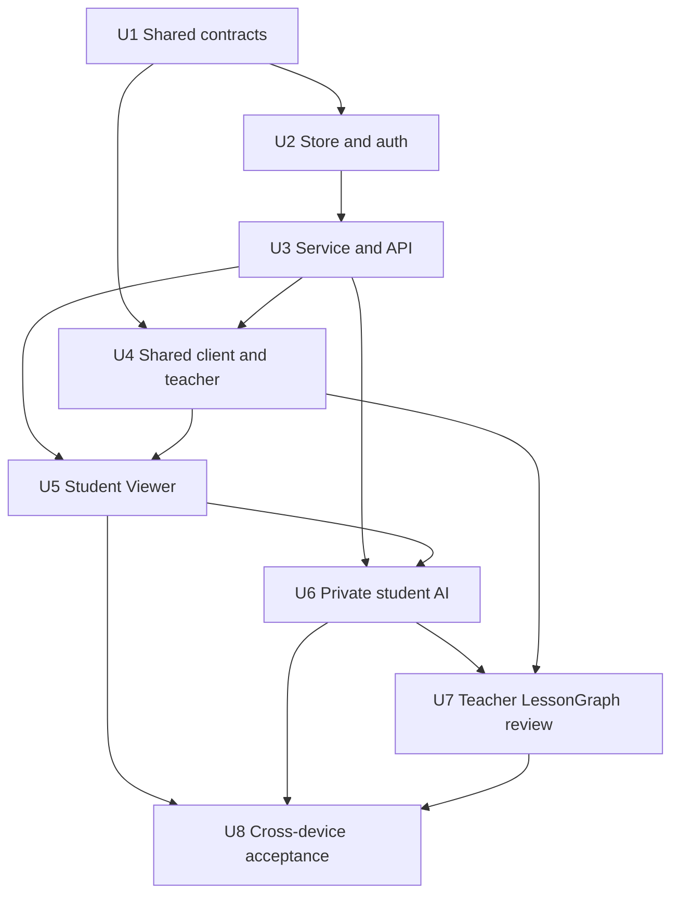

# feat: Add Education Multi-Device Classroom

## Overview

在不重新打开已验收的会议与阅读交互的前提下，新增一个局域网多设备课堂：Mac 运行课堂服务，iPad 浏览器作为教师白板，普通浏览器和现有电子纸 WebView 作为学生端。教师书写形成全班共享且可回放的课堂证据；每个学生可以基于同一证据私下触发实时讲解、课后总结和练习题；教师在课后生成并审核唯一的规范 `LessonGraph`。

该里程碑的核心不是增加一个单页场景开关，而是验证四个产品风险：多设备低延迟同步、断线后确定性收敛、无账号情况下的参与者隐私隔离，以及学生私有智能与教师规范课堂产物之间的单向边界（see origin: `docs/brainstorms/2026-07-16-education-multi-device-classroom-requirements.md`）。

## Problem Frame

现有仓库已经有 AI Pen / InkGraph 合约、运行时事件账本、增量同步、SSE、浏览器流式请求、本地 JSON/JSONL 持久化和 AI 网关，但现有教育/会议演示仍是单页面模拟，不能证明角色权限、多人实时性、晚加入、断线恢复或学生结果私密性。

本计划把稳定且跨宿主的课堂数据结构放进共享 schema，把局域网课堂服务和验证 UI 放进 `examples/ai-annotation-demo/`。课堂账本是课堂历史、恢复、回放和 AI 证据的唯一事实源；实时流只是同一批已接受事件及短暂预览的低延迟投递路径。会议和阅读继续使用原入口、原状态和原验收流程。

## Requirements Trace

### 课堂会话、角色与数据控制

- R1-R4：支持教师创建、开始、结束、刷新恢复和重开课堂；学生用课堂码和昵称加入；每个浏览器获得独立临时凭证；课堂状态机明确限制可执行动作。
- R17-R19：课堂、参与者、账本、AI 结果和教师输出在 Mac 本地持久化，服务重启后教师和原浏览器学生可以恢复各自内容。
- R22：一位教师可同时服务至少三个学生浏览器；学生无共享白板写入权限。
- R25-R27：教师凭证与课堂码/学生凭证分离；服务端从凭证推导参与者身份；私有接口同时校验课堂和参与者范围；支持教师删除已结束课堂和学生清理浏览器本地数据。

### 实时白板与设备体验

- R5-R9：教师书写以低延迟预览和权威完整笔画增量显示；服务端序号、快照和事件账本保证晚加入、重连、去重、顺序、位置和工具外观一致。
- R20-R21：同一 Student Viewer 响应式适配普通浏览器和电子纸 WebView，并显示课堂、连接、会话和 AI 状态以及约定的异常状态；不修改现有阅读入口。

### 学生私有 AI

- R10-R16：学生可私下解释当前步骤或选择区域，课后生成完整总结与练习；所有结果带可回到原板书的证据和时间范围；任务具备排队、运行、完成、失败、重试和幂等语义，并支持学生对本人结果保留、编辑或 dismiss；真实网关与明确标记的确定性 fallback 分开报告。

### 教师规范课堂输出

- R28-R31：课后从共享课堂证据生成规范 `LessonGraph`、课堂笔记和有序回放；候选项必须经教师接受、编辑或驳回；低置信公式保持待审核；学生私有活动只能读取课堂证据，不能成为或修改教师产物。

### 共享架构与冻结边界

- R23：复用并向后兼容地扩展 AI Pen、`InkEvent`、`SceneView`、`LessonGraph`、source reference、存储和同步模式，避免在 UI 中复制产品合约。
- R24：会议与阅读页面、Android 默认 `mobile.html` 启动地址、运行时同步和现有知识导出语义保持不变；教育只增加独立入口及回归覆盖。

### 可验收结果

- 至少一台 iPad 与三个学生浏览器在同一局域网完成创建、加入、持续书写、结束和重开流程；所有学生最终呈现相同的已提交笔画顺序。
- 普通浏览器从教师指针采样被课堂客户端接收到学生渲染提交的 P50 不高于 150 ms、P95 不高于 300 ms；结果明确标注为浏览器模拟，不声称是物理 AI Pen 链路证据。
- 电子纸刷新延迟、闪烁/残影和人工可用性结论单独记录，不并入普通浏览器门槛。
- 两个学生可得到不同的私有结果，且双方即使知道对方资源 ID 也无法读取；课堂共享流不出现任何私有任务或结果元数据。
- 三类学生 AI 结果各至少有一次真实网关成功样本并通过人工可用性/source-ref 审查；fallback 只作为可靠性证据单列。
- 教师输出至少包含三个有序且有来源的步骤，全部候选完成审核，并能在服务重启后恢复；学生结果的生成、编辑或清理均不改变它。
- 删除课堂后，服务重启仍无法读取其课堂、参与者、私有结果或教师输出。
- 新增教育验证通过，同时既有会议、阅读、Runtime Sync 和 Android 阅读入口的验收基线保持通过且行为不变。

## Scope Boundaries

- 首个里程碑仅覆盖同一局域网，不提供公网部署、远程课堂或生产级云鉴权声明。
- 不增加正式账号、班级花名册、LMS、成绩、教师分析、计费或跨浏览器学生身份恢复。
- 学生不向共享白板写入，也不能把私有结果分享给教师或全班。
- 不支持多教师、助教、多教室、多笔冲突编辑。
- 电子纸只是 Student Viewer 兼容性宿主；不改造阅读场景的信息架构、启动页或交互。
- iPad touch/Apple Pencil 是教师输入模拟；真实 AI Pen BLE 和物理 Capture Surface 延迟另行取证。
- 不把原始 pointer-move 样本写入耐久账本；短暂预览只服务实时视觉，课后证据只来自完整、已接受的课堂事件。
- 不在本里程碑抽象新的通用网络/渲染 package；只有被两个以上产品宿主稳定复用的合约进入 `packages/*`。

### Deferred to Separate Tasks

- 公网反向代理、TLS 证书、云端会话存储、生产限流和互联网威胁模型。
- 正式账号、跨设备学生身份恢复、结果分享、协作白板和 LMS/成绩集成。
- 物理 AI Pen/Capture Surface 的端到端延迟证明及电子纸专属刷新优化。
- 课堂数据导出、跨课堂知识库和长期保留策略；本里程碑只有本机保留及显式删除。

## Context & Research

### Relevant Code and Patterns

- `packages/runtime-schema/src/index.ts` 已定义 `RawPenFrame`、`InkLoopStroke`、`InkEvent`、`BoardObject`、`SceneView`、`LessonGraph`、`AiGraphJob` 及 source-ref 校验，是新增稳定课堂合约的归属地。
- `packages/knowledge-schema/src/index.ts` 的 `buildLessonGraphKnowledgeObjects` 和审核/来源过滤规则用于教师已审核输出，不用于学生私有历史。
- `examples/ai-annotation-demo/server/runtime-sync-dev.ts` 和 `examples/ai-annotation-demo/server/runtime-sync-store.ts` 提供服务端权威 session、命名空间隔离、单调序号、cursor、幂等接收及 JSONL 事件存储模式。
- `examples/ai-annotation-demo/server/cloud-library-handler.ts` 提供按命名空间管理 SSE 客户端、心跳与关闭清理模式。
- `examples/ai-annotation-demo/server/cloud-device-store.ts` 和 `examples/ai-annotation-demo/server/standalone.ts` 提供 JSON 持久化、安全 ID、随机 bearer token、本机会话恢复和 LAN/CORS 处理模式。
- `examples/ai-annotation-demo/src/core/api.ts` 已支持带鉴权 JSON 请求和基于 `fetch` 的流式响应，应扩展而不是引入第二套 API 客户端。
- `examples/ai-annotation-demo/server/infer.ts` 统一持有 AI 网关配置和密钥；教育服务应调用其受控的结构化推理适配器，不在新模块复制网关实现。
- `examples/ai-annotation-demo/src/core/prompt-versions.ts` 是 prompt 版本注册表；教育的三类学生任务和教师 LessonGraph 任务在这里登记版本。
- `examples/ai-annotation-demo/src/ai-pen-demo.ts` 只作为 `LessonGraph` 和画板演示参考，不能成为多设备课堂的状态源。
- `examples/ai-annotation-demo/vite.config.ts`、`examples/ai-annotation-demo/server/standalone.ts` 和现有 handler 测试展示了同一 handler 同时挂载到 Vite 开发服务与独立服务的方式。
- `examples/ai-annotation-demo/scripts/smoke-ai-pen-browser.ts` 提供原生 Chrome DevTools Protocol 多页烟测模式；`examples/ai-annotation-demo/scripts/analyze-live-board-latency.ts` 提供现有延迟证据格式和 meeting/education 基线。
- `examples/ai-annotation-demo/scripts/sync-android-assets.mjs` 与 `examples/ai-annotation-demo/scripts/verify-android-paper-assets.mjs` 负责多页产物同步和 Android 阅读边界验证。

### Institutional Learnings

- `docs/solutions/integration-issues/runtime-sync-canonical-path-2026-07-02.md`：持续状态由 Runtime Sync/账本拥有，导出只是投影；课堂实时流同样不能形成第二事实源。
- `docs/solutions/integration-issues/obsidian-ink-rendering-stability-2026-06-28.md`：本地预览与远端权威变更必须区分，最终提交时替换预览而不是重复渲染，并保留跨渲染器一致性测试。
- `docs/solutions/best-practices/source-file-centered-v1-product-boundary-2026-07-02.md`：规范运行时状态与可见投影分离；学生结果和教师笔记都是源课堂证据的派生产物。

### External Guidance Used

- MDN 的 SSE 重连语义支持使用事件 ID/cursor 恢复，但本计划使用流式 `fetch` 而不是原生 `EventSource`，以便 bearer credential 只出现在请求头。
- OWASP 的访问控制原则要求每次请求由服务端校验权限、使用最小权限并拒绝对象级越权；因此任何客户端 participant ID 都不能成为授权依据。
- 原生 WebSocket API 缺少自动背压；本地 MVP 选择可复用的 HTTP + 流式响应，并对慢客户端设置有界队列和强制重同步。

## Key Technical Decisions

1. **课堂状态机为 `draft -> live -> ended -> deleted`。** 创建和开始是两个教师动作；只有 `live` 接受教师板书和学生实时解释；只有 `ended` 接受课后总结、练习和教师 LessonGraph；`ended` 不接受新学生；`deleted` 是不可访问的终态。重开表示读取 `ended`，不是重新进入 `live`。
2. **完整笔画是唯一耐久书写单位，预览是可丢弃的加速层。** 教师端按限频发送带 `client_event_id`/revision 的预览片段，学生画在临时 overlay；抬笔后发送完整 `InkEvent`，服务端校验、落盘、分配课堂序号并广播，客户端以权威事件原子替换对应预览。预览不进快照、回放或 AI 证据，断线时可直接丢弃。
3. **服务端序号和账本定义权威顺序。** 教师提交带幂等键但不指定权威 sequence；同一 `client_event_id` 的重复完整笔画返回原 ack。每个课堂串行接受写入，先 append 成功再 ack/broadcast，避免看见但无法恢复的事件。
4. **晚加入和重连采用 checkpoint + cursor，并显式关闭“快照后、订阅前”的竞态窗口。** 学生先取得包含 `snapshot_sequence` 的当前板书快照，再从该序号之后打开流；服务端在注册 live tail 前先从账本回放 cursor 后的事件，并在同一课堂串行化边界内切换到 live tail，保证切换期间的事件不会丢失或重复。若发现序号缺口、cursor 早于保留窗口或预览/最终事件无法对齐，服务端发 `resync_required` 并关闭流，客户端重新取快照。客户端仅按连续序号提交到权威渲染层。
5. **下行使用带 bearer header 的流式 `fetch`。** 共享流只允许 `preview`、`board_event`、`class_state`、`resync_required` 和 heartbeat。学生私有 AI 状态通过 participant-scoped 读取/轮询（需要时可使用独立私有流），永不进入课堂共享流。慢客户端队列超限后断开并重同步，不允许内存无限增长。
6. **课堂码只定位并加入课堂，不能充当持续授权。** 创建课堂返回只显示一次的教师 bearer credential；学生用课堂码和昵称换取独立 opaque participant credential。服务端只存 token/class-code hash、role、classroom、participant、签发/撤销元数据；后续从 token 推导 scope，不接受请求体或路径里的 participant ID 作为授权事实。课堂码有格式/长度约束、统一失败响应和按来源的 LAN 限频；nickname 有长度/控制字符约束并始终以纯文本渲染。
7. **浏览器凭证持续到课堂删除或主动清理。** 教师/学生凭证保存在各自入口的浏览器存储以支持刷新和重开；课堂结束禁止新 join，但已签发参与者仍可读取课堂证据和自己的课后历史。清理本地凭证不会冒充服务器端删除；课堂删除会撤销所有凭证。
8. **课堂持久化采用索引 JSON + 每课堂隔离目录。** 课堂元数据、token hash 和审核投影用原子 JSON 写；板书事件使用 append-only JSONL；学生任务/结果存入按 participant 分隔的目录。进程重启会重建 snapshot/cursor、把遗留 `running` job 转为可解释的失败/可重试状态，并且永远不把 nickname 写入 AI payload 或诊断日志。
9. **AI 共用证据 checkpoint，不共用输出命名空间。** checkpoint 固定课堂、事件序号区间、时间范围、stroke/board source refs 和可选 normalized bbox。当前步骤取最近的连续教学证据段，区域解释只取与选择框相交的证据；空或不足的证据返回 `insufficient_evidence`，不调用网关。学生输出只写参与者目录；教师输出只写课堂教师目录。
10. **真实网关与 fallback 是同一结构化契约的两种执行模式。** 教育服务调用 `server/infer.ts` 暴露的最小结构化 gateway seam，解析并校验 source refs；超时、无配置或无效结构化输出才进入确定性 fallback，并在结果中保存 `execution_mode` 和原因。重试使用稳定幂等键，已完成任务直接返回原结果，不复制产物。
11. **教师 `LessonGraph` 采用候选与 reviewed projection 两阶段。** 生成任务只从共享课堂账本创建候选；每个步骤/概念/公式有稳定 candidate ID、置信度、source refs 和 `pending|accepted|edited|dismissed` 状态。只有教师审核动作可以更新状态，reviewed projection 只包含接受/编辑项；编辑后重新验证来源，低置信公式不能自动成为可信输出。
12. **共享 schema 稳定、课堂 host 逻辑留在 example。** 新增课堂 DTO/验证器和 source-ref 约束进入 `packages/runtime-schema`，保持 `AiGraphJob` 和现有导出向后兼容；存储、鉴权、handler、AI worker 与 UI 留在 `examples/ai-annotation-demo`，避免把验证宿主副作用带入根 SDK。
13. **新增独立教师/学生多页入口。** `teacher-classroom.html` 与 `student-classroom.html` 加入 Vite/Android 资产；Android 默认仍加载 `mobile.html`。电子纸兼容测试显式打开学生页，不改变已验收阅读路径。课堂页面只允许同源 API、严格 origin allowlist 和 Authorization header；局域网 HTTP 不声称具备链路机密性，验收网络必须是受信任隔离 LAN，公网/TLS 属于独立上线前置任务。
14. **AI 与昵称都按不可信内容处理。** nickname、课堂标题和 AI 返回内容不得通过 raw HTML 注入；首个里程碑只用 DOM text nodes 和结构化字段呈现，不开放通用 Markdown/HTML 渲染。AI 结构化校验解决内容契约，不替代 XSS 防护；错误响应采用代码/通用文案，不回显 prompt、token、内部路径或原始网关异常正文。

## Open Questions

### Resolved During Planning

- **低延迟机制：** HTTP 小批量上行 + 带鉴权的流式 `fetch` 下行；不引入 WebSocket。权威完整笔画与临时预览分层。
- **事件恢复：** 服务端单调序号、快照 checkpoint、连续 cursor；缺口时整体快照重同步，不在客户端猜测补洞。
- **参与者身份：** 课堂码只用于 join，服务端签发每浏览器独立 bearer token，并从 token 推导 participant scope。
- **持久化范围：** 课堂状态、账本、participant token hash、学生结果和教师审核输出全部在 Mac 本地持久化；浏览器只缓存凭证、视图和自己的结果。
- **当前步骤证据：** 以最近连续、已完成的课堂证据段为默认；区域选择使用 normalized bbox 与证据相交；两者都固定到一次不可变 checkpoint。
- **AI 失败和重试：** 网关失败/无效结构先产生明确的 fallback 或 failed 状态；相同幂等键不会重复已完成结果。
- **教师/学生边界：** 二者可读取同一课堂 evidence checkpoint builder，但任务存储、输出 schema 和写入端口分离；学生没有教师输出 repository 的 mutation capability。
- **电子纸接入：** 构建并复制独立 Student Viewer 页面，显式打开做测试；`mobile.html` 及 Android launch URL 不变。

### Deferred to Implementation

- **预览采样频率和每客户端队列上限：** 先用保守默认值实现，再依据普通浏览器延迟样本和电子纸刷新表现调优；不得改变完整笔画的耐久语义。
- **checkpoint 生成间隔和账本保留窗口：** 根据三学生持续书写样本的文件增长和恢复时间选择；接口必须先支持 `resync_required`，因此调参不改变协议。
- **“最近连续步骤”的闲置时间/空间阈值：** 使用 fixture 固定可解释默认值，再以真实课堂素材校准；阈值变化不得改变已保存 checkpoint。
- **网关结构化输出是否需要一次修复尝试：** 依据现有 gateway 模型能力决定；无论是否修复，都必须经过同一 schema/source-ref 验证后才能完成。
- **电子纸 WebView 对流式 `fetch` 的具体缓冲行为：** 在设备烟测中确认；若宿主缓冲响应，则保留同 cursor 语义的短轮询兼容传输，但不更改阅读入口或私有隔离边界。

## Output Structure

```text
packages/runtime-schema/src/
  index.ts                         # 稳定课堂、事件、快照、教育任务和审核合约
  runtime-schema.test.ts

examples/ai-annotation-demo/
  teacher-classroom.html
  student-classroom.html
  server/
    classroom-auth.ts
    classroom-auth.test.ts
    classroom-store.ts
    classroom-store.test.ts
    classroom-service.ts
    classroom-service.test.ts
    classroom-handler.ts
    classroom-handler.test.ts
    classroom-ai.ts
    classroom-ai.test.ts
  src/classroom/
    classroom-client.ts
    classroom-client.test.ts
    board-renderer.ts
    board-renderer.test.ts
    teacher-main.ts
    teacher-main.test.ts
    student-main.ts
    student-main.test.ts
    classroom.css
  scripts/
    smoke-education-classroom-browser.ts
    analyze-classroom-browser-latency.ts
    verify-education-classroom-e2e.ts
  fixtures/
    education-classroom-latency-sample.csv
    education-classroom-ai-evidence.json
```

目录树表达预期边界而非强制实现细节；每个实施单元的文件列表是执行范围依据。

## High-Level Technical Design

> *This illustrates the intended approach and is directional guidance for review, not implementation specification. The implementing agent should treat it as context, not code to reproduce.*

```mermaid
sequenceDiagram
  participant T as iPad Teacher
  participant H as Mac Classroom Host
  participant L as Classroom Ledger
  participant S as Student Viewer
  participant A as Education AI

  T->>H: teacher credential + preview chunks
  H-->>S: shared preview stream (ephemeral)
  T->>H: completed stroke + client_event_id
  H->>L: validate, append, assign sequence
  L-->>H: durable ack
  H-->>T: accepted sequence
  H-->>S: authoritative board_event
  S->>S: replace preview, commit render, record latency

  Note over S,H: Late join/reconnect
  S->>H: participant credential + snapshot request
  H-->>S: snapshot at sequence N
  S->>H: streamed fetch after N
  H-->>S: N+1... or resync_required

  S->>H: private AI request (credential; no participant ID authority)
  H->>L: freeze evidence checkpoint
  H->>A: source evidence without nickname
  A-->>H: validated real result or labeled fallback
  H-->>S: participant-scoped job/result

  T->>H: end and generate LessonGraph
  H->>A: shared classroom evidence only
  A-->>H: candidates + source refs
  T->>H: accept/edit/dismiss
  H->>L: reviewed teacher projection
```



## Implementation Units



上图只表达交付依赖；各单元的 `Dependencies` 字段和验收出口为准。

- [x] **Unit 1: Define backward-compatible classroom contracts**

**Goal:** 为服务端、教师端、学生端和测试建立一个共享、可验证且不泄露凭证的课堂协议词汇。

**Requirements:** R3-R9, R13-R16, R23, R28-R31

**Dependencies:** None

**Files:**
- Modify: `packages/runtime-schema/src/index.ts`
- Modify: `packages/runtime-schema/src/runtime-schema.test.ts`
- Modify: `packages/runtime-schema/README.md`

**Approach:**
- 新增版本化的课堂 session 摘要、状态/角色、完整 board event、临时 preview、snapshot/cursor、evidence checkpoint、教育 AI job/result 和教师 candidate review 类型及运行时验证器。
- 权威 board event 复用 `InkEvent`/`InkLoopStroke`/source refs，补充 classroom ID、server sequence、client idempotency ID 和事件时间范围；坐标保持 normalized，工具集合采用现有可跨渲染器表达的最小交集。
- 公共 DTO 不包含 token hash、AI 网关 payload、其他参与者 ID/任务计数或内部目录路径；participant identity 只允许作为服务端鉴权上下文派生字段。
- 教育任务使用独立版本化 schema，不扩大旧 `AiGraphJob` 的必填字段或改变 meeting/teach 现有解析结果。

**Execution note:** Implement contract validation test-first because every subsequent unit depends on rejection and compatibility semantics.

**Patterns to follow:**
- `packages/runtime-schema/src/index.ts` 中的版本常量、`RuntimeSchemaValidationIssue`、`validateAiGraphJob`、`validateInkLoopSourceRefs`。
- `packages/runtime-schema/src/schema-versioning.md` 的 additive/backward-compatible 演进约定。

**Test scenarios:**
- Happy path：合法课堂、完整笔画、快照、三类学生结果及教师审核候选分别通过验证，并保留序号、时间范围和有效 source refs。
- Edge case：normalized bbox/point 边界值 0 和 1 合法，越界、空 stroke、倒序时间或非正 sequence 被拒绝。
- Privacy：共享 stream envelope 中出现 participant/private job/result 字段时验证失败；公共 session DTO 不序列化 credential/hash。
- Error path：完成结果缺少 source refs、fallback 缺少执行标记、edited candidate 缺少 review metadata 时返回明确路径错误。
- Student review：私有结果的 `kept|edited|dismissed` 状态和修订元数据通过验证；edited 仍保留原 evidence checkpoint/source refs，dismissed 不出现在默认历史但可审计恢复。
- Compatibility：现有 `AiGraphJob`、`LessonGraph`、meeting/reading fixtures 继续按原结果通过，既有导出字段不变。

**Verification:** 所有课堂跨层数据均由共享验证器约束，同时已有 runtime/knowledge schema 消费者无需改动即可继续解析旧数据。

- [x] **Unit 2: Build local classroom persistence and credential boundary**

**Goal:** 提供服务端权威的课堂状态、事件账本、参与者身份和私有目录隔离，并在重启/删除时保持确定行为。

**Requirements:** R1-R4, R6-R7, R14, R16-R19, R25-R27

**Dependencies:** Unit 1

**Files:**
- Create: `examples/ai-annotation-demo/server/classroom-auth.ts`
- Create: `examples/ai-annotation-demo/server/classroom-auth.test.ts`
- Create: `examples/ai-annotation-demo/server/classroom-store.ts`
- Create: `examples/ai-annotation-demo/server/classroom-store.test.ts`

**Approach:**
- 使用安全随机数生成不相关的 classroom ID、可输入课堂码、teacher token、participant ID 和 participant token；磁盘只保存 token hash。课堂码查找只允许活动课堂，失败使用统一响应并做基础 LAN 限频。
- 对 classroom code、nickname、请求 ID、stroke 点数/字节数和 AI selector 设置显式上限；nickname 去除控制字符并只作为显示数据，不参与目录名、日志 key 或权限判断。
- 将全班元数据/教师输出与 `participants/<server_participant_id>/` 私有任务目录物理分隔；昵称只留在课堂 roster 存储和本人/教师允许的 UI 响应，不进入日志或 AI evidence。
- 对每个课堂串行化状态和账本写入；完整笔画 append 后才可见，checkpoint/JSON 采用临时文件替换。重复 `client_event_id` 返回首次 sequence，冲突 payload 则拒绝。
- 启动时校验索引和课堂目录，恢复最新 sequence/snapshot；遗留 running job 转为带 `service_restarted` 原因的可重试失败，不伪装成完成。
- 删除使用课堂级关闭栅栏：先在索引中标记不可访问并撤销 credential，再由 service 中止流/任务，最后移除目录；启动恢复会继续未完成清理，避免崩溃后数据重新暴露。

**Patterns to follow:**
- `examples/ai-annotation-demo/server/runtime-sync-store.ts` 的 JSONL sequence/event store。
- `examples/ai-annotation-demo/server/cloud-device-store.ts` 的 JSON 持久化和 namespace isolation。
- `examples/ai-annotation-demo/server/standalone.ts` 的 `randomBytes`、safe ID 和本机会话存储。

**Test scenarios:**
- Happy path：创建、开始、追加事件、结束、保存 participant 私有结果和教师输出后，以新 store 实例重开仍能恢复全部授权范围内状态。
- Identity：同昵称加入两次获得不同 participant/token；token hash 不等于原 token；请求体伪造 participant ID 不影响从 credential 得出的身份。
- Authorization：participant token 无法取得 teacher capability；A 的 credential 无法打开 B 的目录，即使知道 B 的 participant/job ID。
- State edge：draft 不收学生/笔画，live 接受 join/笔画/实时解释，ended 拒绝新 join 和笔画但允许已加入者课后任务，删除后全部 credential 失效。
- Idempotency：相同 client event + 相同 payload 返回同一 sequence 且账本只有一条；相同 ID + 不同 payload 返回冲突且不追加。
- Recovery：模拟 JSONL 尾部残缺、checkpoint 落后和 running job 后重启，store 只恢复完整记录、重建快照并把 job 置为可重试失败。
- Privacy：诊断 logger 接收的记录不包含 nickname、原 token、token hash、AI prompt 或结果正文。
- Input/XSS：超长 nickname、控制字符、路径分隔符和 HTML payload 被拒绝或作为纯文本保存，且不能改变目录路径、日志结构或授权 scope。
- Delete：删除过程中再次读取/写入立即失败；新 store 实例启动后课堂目录和索引访问均不存在。

**Verification:** 持久化层独立证明角色、participant scope、幂等、重启和删除语义，且磁盘布局不会把学生结果混入全班或教师输出文件。

- [x] **Unit 3: Expose the classroom lifecycle, board stream, and recovery API**

**Goal:** 用同一 HTTP handler 为 Vite 和 standalone 提供课堂生命周期、教师上行、学生快照/流和严格对象级授权。

**Requirements:** R1-R9, R17-R22, R25-R27

**Dependencies:** Units 1-2

**Files:**
- Create: `examples/ai-annotation-demo/server/classroom-service.ts`
- Create: `examples/ai-annotation-demo/server/classroom-service.test.ts`
- Create: `examples/ai-annotation-demo/server/classroom-handler.ts`
- Create: `examples/ai-annotation-demo/server/classroom-handler.test.ts`
- Modify: `examples/ai-annotation-demo/vite.config.ts`
- Modify: `examples/ai-annotation-demo/server/standalone.ts`

**Approach:**
- handler 只负责 method/path/body/CORS/stream framing；service 拥有状态转换、授权、写入顺序、preview fan-out、snapshot/cursor 和删除协作。
- 教师端点分别处理 create/start/end/delete、preview 和 completed-event batch；服务端忽略客户端 sequence/role/participant 声明，并限制 body、点数、批次和 normalized 坐标。
- join 端点用课堂码+昵称签发 participant credential；后续 snapshot、stream 和 reopen 都要求 bearer header。无效/ended code 使用不会泄漏内部状态的响应。
- CORS/origin 只允许受信任 LAN host 和同源页面，credential 不进入 query string；非简单写请求要求受控 content type/origin，所有响应使用安全 header 并禁止缓存凭证/私有结果。
- 流式响应发送 heartbeat 和可恢复 event ID；每客户端队列有上限，超限/sequence retention gap 发送 `resync_required` 后关闭。request close、课堂结束/删除和服务 shutdown 都清理 listener。
- preview 只在 live 中接受，按 teacher credential、event/revision 和 TTL 校验；最终完整事件到达或 TTL 到期即清除 preview。结束课堂先拒绝新输入、清理 preview，再广播 ended。
- 删除建立 abort fence，关闭所有共享/私有流并中止 AI controller；任何较晚返回的异步任务通过课堂 generation/tombstone 检查，不能重新落盘。

**Execution note:** Start with real temporary HTTP-server integration tests; middleware mocks alone cannot prove stream cleanup, bearer headers, reconnect cursors, or deletion races.

**Patterns to follow:**
- `examples/ai-annotation-demo/server/runtime-sync-dev.test.ts` 的真实临时 HTTP handler 测试。
- `examples/ai-annotation-demo/server/cloud-library-handler.ts` 的 SSE client、25 秒 heartbeat 和 close cleanup。
- `examples/ai-annotation-demo/server/cloud-library-handler.test.ts` 的 namespace stream isolation。

**Test scenarios:**
- Lifecycle：教师创建 draft、启动 live、结束并重开 ended；非法重复 start/end 得到稳定冲突状态；学生不能执行任一教师动作。
- Join：活动课堂码+昵称返回 distinct credential；空昵称、无效码和 ended code 被拒绝；响应不泄露教师 token 或其他参与者信息。
- Live path：教师 preview 到学生临时流，完整笔画 append 后以 sequence 广播并替换 preview；学生 token 无法提交 preview/笔画。
- Late join：已有 N 个事件时 snapshot 返回 sequence N，随后流从 N+1 开始且无重复。
- Reconnect：学生从已应用 cursor 接收缺失连续事件；过旧 cursor 或服务端检测到 gap 时收到 `resync_required`，重新 snapshot 后收敛。
- Snapshot-to-tail race：在取得 snapshot N 后、流注册前并发提交 N+1/N+2，客户端仍按顺序收到且各一次；切换为 live tail 时再提交 N+3 也不形成空洞。
- Idempotency/order：重复完整笔画得到同 ack；并发批次最终 sequence 严格递增；客户端伪造/倒序 server sequence 被忽略或拒绝。
- Backpressure：不消费响应的慢客户端达到有界队列后被关闭，其他客户端继续收到事件，服务内存队列可回收。
- Origin/input security：错误 origin、URL credential、错误 content type、超限 body/批次/点数和含非有限坐标的输入全部 fail closed，错误响应不回显 token 或原始 body。
- Privacy：共享流逐帧断言只含允许的课堂消息类型和公共字段；任何 student job/result 创建都不产生共享 stream frame。
- Deletion race：删除时流结束、正在写入/AI 请求被取消或失效，随后所有凭证和资源返回不可访问，迟到回调无法重建文件。
- Restart integration：用同一持久目录重启 HTTP server，ended 课堂、sequence、快照和原 credential 行为保持一致。

**Verification:** Vite 与 standalone 的同名 API 行为一致；三名学生、晚加入和重连均只依赖快照+流即可收敛，且权限测试覆盖每个写端点和私有资源端点。

- [x] **Unit 4: Add the reusable classroom board client and iPad teacher app**

**Goal:** 构建支持 touch/Apple Pencil、低延迟预览、完整笔画提交和教师会话恢复的独立 iPad 白板入口。

**Requirements:** R1, R5, R8-R9, R21-R22, R25

**Dependencies:** Units 1 and 3

**Files:**
- Create: `examples/ai-annotation-demo/teacher-classroom.html`
- Create: `examples/ai-annotation-demo/src/classroom/classroom-client.ts`
- Create: `examples/ai-annotation-demo/src/classroom/classroom-client.test.ts`
- Create: `examples/ai-annotation-demo/src/classroom/board-renderer.ts`
- Create: `examples/ai-annotation-demo/src/classroom/board-renderer.test.ts`
- Create: `examples/ai-annotation-demo/src/classroom/teacher-main.ts`
- Create: `examples/ai-annotation-demo/src/classroom/teacher-main.test.ts`
- Create: `examples/ai-annotation-demo/src/classroom/classroom.css`
- Modify: `examples/ai-annotation-demo/vite.config.ts`

**Approach:**
- classroom client 扩展 `src/core/api.ts` 的 bearer JSON/stream 能力，负责 credential storage、cursor、abort/reconnect 和 typed message validation；不在 UI 组件直接拼 HTTP。
- board renderer 维护权威层和 preview overlay：坐标按画布矩形归一化，resize 只重投影；最终 event 通过 `client_event_id` 替换 preview，sequence 去重，gap 触发 client resync 而不是局部猜测。
- teacher controller 从 Pointer Events 读取 touch/pen pressure（可用时）和工具状态，限频发送 preview，pointer-up/cancel 生成一个完整 stroke；本地先画 preview，但只有服务端 ack 后进入权威层。
- UI 明确显示课堂码、draft/live/ended、连接/重连、提交失败和已持久化状态；teacher credential 仅存在该入口的浏览器存储，刷新后从服务端 introspection/snapshot 恢复。
- 正常 UI 不显示 sequence、token、内部 job ID 或调试按钮；空板书结束时允许结束，但 AI 操作随后显示证据不足。
- 课堂码、nickname 和 AI/错误内容一律映射到结构化 DOM 并使用 text rendering；本里程碑不把 AI Markdown 直接赋给 `innerHTML`。
- 教师端信息层级固定为课堂身份/连接状态、主画板、最小工具栏和会话动作；结束/删除使用明确确认与后果文案，不能因误触直接丢失活动课堂。

**Patterns to follow:**
- `examples/ai-annotation-demo/src/core/api.ts` 的 auth/stream error handling。
- `packages/surface-web/src/index.ts` 的 host-installed renderer 和 normalized surface 模式，但不复用文档阅读状态。
- `examples/ai-annotation-demo/src/ai-pen-demo.ts` 的 pointer/ink 可视化仅作交互参考，不复用其本地假 LessonGraph 状态。

**Test scenarios:**
- Renderer：相同 normalized stroke 在两种 viewport 尺寸保持相对位置、顺序、颜色和宽度语义；resize 不复制 stroke。
- Preview reconciliation：多个 preview revision 只保留最新 overlay；最终同 client ID 事件原子替换；TTL、cancel 和结束课堂清除临时层。
- Sequence：重复 sequence 不重画，连续 sequence 应用，gap 停止提交并请求 snapshot；snapshot N 后只接受 N+1 起的事件。
- Teacher input：pen/touch 的 pointerdown/move/up 产生受限 preview 与一个完整 stroke；pointercancel 不提交残缺完整事件；鼠标可作为桌面调试输入。
- Auth/state：刷新恢复 teacher credential 和课堂；学生/缺失 credential 无法进入写状态；ended 后输入监听关闭且 UI 保留只读回放。
- Interaction/accessibility：工具和 start/end/delete 均可键盘聚焦并有可读 label；触控目标满足移动端尺寸；结束/删除需要确认且取消不改变课堂状态。
- Failure：preview 网络失败不污染权威层；完整提交失败显示可重试状态，相同 idempotency ID 重试后只出现一次。
- XSS：恶意课堂标题、nickname 或错误正文不能创建脚本节点、事件属性或危险链接，且刷新恢复后仍按纯文本显示。
- Integration：真实 handler ack 后教师本地权威层 sequence 与服务端 snapshot 一致，离线后恢复不会把未确认 preview 当作课堂历史。

**Verification:** iPad Safari 可连续书写、刷新和结束课堂；教师端所见权威笔画与服务端 snapshot 一致，且预览/提交模型为后续 Student Viewer 复用。

- [x] **Unit 5: Add the responsive and e-paper-compatible Student Viewer**

**Goal:** 提供一个独立学生入口，完成加入、实时观看、晚加入/重连、区域选择和本人数据清理，同时不触碰阅读工作流。

**Requirements:** R2-R8, R10, R18, R20-R22, R26-R27

**Dependencies:** Units 3-4

**Files:**
- Create: `examples/ai-annotation-demo/student-classroom.html`
- Create: `examples/ai-annotation-demo/src/classroom/student-main.ts`
- Create: `examples/ai-annotation-demo/src/classroom/student-main.test.ts`
- Modify: `examples/ai-annotation-demo/src/classroom/classroom.css`
- Modify: `examples/ai-annotation-demo/vite.config.ts`
- Modify: `examples/ai-annotation-demo/scripts/verify-android-paper-assets.mjs`
- Modify: `examples/ai-annotation-demo/android/INTEGRATION.md`

**Approach:**
- join view 只收课堂码和 nickname；成功后保存 participant credential 并切换到课堂 view。返回同一浏览器时用 credential 恢复，失效时回到 join，不尝试用 nickname 恢复身份。
- 启动严格执行 snapshot -> render -> stream-after-sequence；stream 异常显示 reconnecting/offline，指数退避且可取消；`resync_required` 清理 preview、替换权威 snapshot 后继续。
- 区域选择是 normalized bbox，只作为私有解释请求的 evidence selector，不产生共享 board event；ended 后保留 timeline/replay 和本人 AI 历史入口。
- CSS 使用响应式布局、足够触控尺寸、低动画/低阴影和电子纸友好的高对比模式；连接、live/ended、AI 状态以文字+图形双重表达。
- 学生端信息层级固定为课堂身份/连接状态、主板书、来源导航和本人 AI 区；live 时 AI 区不遮挡板书，ended 后才提升 summary/practice 和历史的优先级。
- Android 资产验证新增 `student-classroom.html` 及依赖哈希检查，但继续断言 `MainActivity.kt` 默认 URL 为 `mobile.html`，确保阅读入口不变。
- “清除此设备数据”删除该课堂的 participant credential、cursor、私有缓存和 UI state，再回到 join；不宣称删除服务端记录。

**Patterns to follow:**
- `examples/ai-annotation-demo/mobile.html` 和 `src/mobile/mobile.css` 的 WebView asset/base-path 与电子纸触控约束，只复用兼容原则，不修改页面。
- `examples/ai-annotation-demo/scripts/verify-android-paper-assets.mjs` 的入口/依赖哈希和 Android runtime boundary 断言。

**Test scenarios:**
- Join/return：合法 live code 加入并保存 credential；相同 nickname 两个浏览器互不复用；刷新和服务重启后同浏览器恢复；清理后必须重新加入。
- Invalid states：空/错误/ended code、credential 撤销、空板书、offline、reconnecting 和 deleted class 显示明确且不泄露资源存在性的信息。
- Late join/reconnect：快照 N 渲染完成后才应用 N+1；网络短断后补齐；gap 时完整替换 snapshot，无漏笔/重复/乱序。
- View parity：同 fixture 在桌面、窄屏和电子纸 viewport 的 normalized geometry、stroke order、tool appearance 相同，控件不遮挡板书。
- Selection：拖选区域得到合法 normalized bbox；resize 后选择仍映射同一区域；学生操作只创建私有 request，不改变 shared board。
- Privacy/local clear：UI、DOM、local cache 和错误信息不出现其他 participant/job；清理移除 credential/cursor/result cache，但不向服务器发送越权删除。
- Content safety：nickname 和 AI 结果中的 HTML、script、事件属性、data/javascript URL 不会被浏览器执行，公式以结构化纯文本保持可读。
- Accessibility：join 表单有 label/错误关联，连接与 job 状态以 `aria-live` 或等价可读方式更新，键盘可完成加入、选择解释范围、打开来源和清理本地数据；颜色不是唯一状态信号。
- Android boundary：构建产物包含 Student Viewer 及全部本地资源，同时 verifier 继续确认 Android 默认 `mobile.html` 和现有阅读 runtime 文本不变。

**Verification:** 同一 Student Viewer 在普通浏览器和电子纸 WebView 可加入、实时更新、断线恢复和清理本地数据；现有 Paper 阅读启动与操作路径无变更。

- [x] **Unit 6: Implement source-bound private student AI jobs**

**Goal:** 基于不可变课堂 evidence checkpoint 实现实时解释、课后总结和课后练习，并保证真实 AI、fallback、重试和 participant 隔离。

**Requirements:** R10-R18, R21, R26, R31

**Dependencies:** Units 1-3 and Student Viewer request surface from Unit 5

**Files:**
- Create: `examples/ai-annotation-demo/server/classroom-ai.ts`
- Create: `examples/ai-annotation-demo/server/classroom-ai.test.ts`
- Modify: `examples/ai-annotation-demo/server/infer.ts`
- Modify: `examples/ai-annotation-demo/src/core/prompt-versions.ts`
- Modify: `examples/ai-annotation-demo/server/classroom-handler.ts`
- Modify: `examples/ai-annotation-demo/server/classroom-handler.test.ts`
- Modify: `examples/ai-annotation-demo/src/classroom/student-main.ts`
- Modify: `examples/ai-annotation-demo/src/classroom/student-main.test.ts`
- Create: `examples/ai-annotation-demo/fixtures/education-classroom-ai-evidence.json`

**Approach:**
- evidence builder 只读取已提交 ledger/snapshot，生成固定 sequence/time/source-ref 集合；区域解释过滤 bbox 相交事件，当前步骤选最近连续证据段，课后任务读取完整持久 timeline。创建 job 后证据不随新笔画漂移。
- `infer.ts` 暴露最小的结构化教育推理 seam，共享现有 gateway URL/key/model/timeout/stream 处理；prompt payload 只含教学证据和任务参数，不含 nickname、participant ID 或 bearer token。
- 每类任务定义独立 prompt version 和输出验证：解释、summary section、question/hint/answer 都必须引用 checkpoint 内 source refs；未引用或越界引用不能完成。
- service 维护 queued/running/completed/failed；参与者作用域内以 client request ID + job kind + evidence checkpoint 建立幂等记录。运行时用 AbortController，删除课堂后 generation fence 拒绝迟到结果。
- queued job 采用课堂级有界并发和有界队列；超限返回明确可重试状态，单个 participant 不能耗尽所有课堂 AI 槽位。gateway 输入和输出设置字节/token/time 限额。
- fallback 从同一 evidence fixture 确定性生成最小可用且有来源的结果，明确标记 `deterministic_fallback`/reason；不能用 fallback 成功冒充真实 AI 验收。
- handler 不提供带任意 participant ID 的查询；list/get/retry 均从 bearer credential 得到参与者。实时解释仅 live 可创建，summary/practice 仅 ended 可创建。
- participant 可以把自己的结果标记为 kept/dismissed 或保存一份明确标注 `user_edited` 的修订；修订保留原 AI 文本、execution mode 和 evidence checkpoint，不重新成为 AI/教师证据，也不能越权修改其他参与者或教师产物。

**Execution note:** Use deterministic fixtures and fake gateway clocks first; then add a separately gated real-gateway acceptance path without making normal tests network-dependent.

**Patterns to follow:**
- `examples/ai-annotation-demo/server/infer.ts` 的 gateway secret/timeout handling。
- `examples/ai-annotation-demo/src/core/prompt-versions.ts` 的 version registry。
- `packages/runtime-schema/src/index.ts` 的 source-ref validation 和 `AiGraphJob` lifecycle vocabulary。

**Test scenarios:**
- Live explanation：有最近步骤时完成并只引用该 checkpoint；区域选择只引用相交证据；空板/空区域返回 insufficient evidence 且 gateway 未调用。
- Post-class：ended 课堂生成包含 outline、ordered steps、concepts/formulas 的 summary，以及问题、分离的 hint/answer；live 阶段请求被拒绝。
- Real gateway：合法结构输出保存为 `real`；timeout/无配置/异常/无效 JSON/越界 source refs 分别产生可解释 failed 或 labeled fallback，绝不保存未验证输出。
- Idempotency/retry：同 client request 重放返回原 job；completed retry 不复制结果；failed retry 形成可追踪 attempt 并仍归属同一逻辑请求。
- Lifecycle：queued -> running -> completed/failed 的每次状态持久化；进程重启恢复历史并把中断运行标为可重试；删除课堂中止调用且迟到 promise 不落盘。
- Privacy：A list/get/retry B 的已知 job ID 均为拒绝/不可见；共享 stream 没有 job frame；logger 和 fake gateway 断言不含 nickname、token、participant ID。
- Private review：A 可 edit/dismiss 自己的结果并在重启后恢复状态；edit 保留不可变原结果/source refs 且显示 user-edited，dismiss 从默认历史隐藏；A 对 B 的同一动作被拒绝。
- Resource limits：单个参与者连续提交超过队列/速率配额会收到可重试限流，已有 job 和其他参与者仍推进；超大网关响应被中止且不写半成品。
- Content safety：fake gateway 返回恶意 HTML/URL 时，服务仍保存结构化纯内容而 UI 不执行它；原始 gateway error body 不返回学生端。
- One-way boundary：生成、重试、清理任意学生结果前后，教师 LessonGraph store byte-for-byte/semantic projection 不变。
- UI：学生只看到自己的 queued/running/completed/failed、execution mode、来源跳转、kept/edit/dismiss 和重试动作；AI unavailable 与 insufficient evidence 使用不同状态。

**Verification:** 两名学生同时执行不同任务仍完全隔离；三类任务都能生成可回源结果；真实 AI 与 fallback 的运行、指标和 UI 标记可明确区分。

- [x] **Unit 7: Generate and review the canonical teacher LessonGraph**

**Goal:** 在课堂结束后从共享账本生成教师规范候选，完成 accept/edit/dismiss 审核、课堂笔记与步骤回放，并持久化为唯一 reviewed projection。

**Requirements:** R19, R21, R28-R31

**Dependencies:** Units 1-3 and AI/evidence seam from Unit 6

**Files:**
- Modify: `examples/ai-annotation-demo/server/classroom-ai.ts`
- Modify: `examples/ai-annotation-demo/server/classroom-ai.test.ts`
- Modify: `examples/ai-annotation-demo/server/classroom-service.ts`
- Modify: `examples/ai-annotation-demo/server/classroom-service.test.ts`
- Modify: `examples/ai-annotation-demo/server/classroom-handler.ts`
- Modify: `examples/ai-annotation-demo/server/classroom-handler.test.ts`
- Modify: `examples/ai-annotation-demo/src/classroom/teacher-main.ts`
- Modify: `examples/ai-annotation-demo/src/classroom/teacher-main.test.ts`
- Modify: `packages/knowledge-schema/src/index.test.ts`

**Approach:**
- teacher generation 只在 ended 执行，并复用全课堂 evidence checkpoint；真实/fallback、幂等和 source validation 遵循 Unit 6，但输出为候选 `LessonGraph`，不直接成为 reviewed 结果。
- 稳定 candidate ID 绑定 generation/evidence 和条目，不用数组下标；每个候选保存原始内容、置信度、来源和 review 状态。教师 edit 创建审计修订并重新验证，不能引入 checkpoint 外来源。
- 只有全部需要决策的候选进入 accepted/edited/dismissed 后才标记 review complete；低置信公式默认 pending，UI 明示“需要审核”。
- reviewed projection 从 review records 纯函数重建课堂笔记和 ordered replay；接受/编辑项保留来源，驳回项不进入 projection。重启后从持久记录重建，而不是依赖 DOM/cache。
- `buildLessonGraphKnowledgeObjects` 只消费 review complete 的教师 projection；学生结果 repository 不注入此构建函数，也不作为 source refs。
- 教师 UI 提供生成状态、逐项 source 跳转、accept/edit/dismiss、未审数量、reviewed notes 和按时间回放；不列出学生或学生结果。

**Patterns to follow:**
- `packages/knowledge-schema/src/index.ts` 的 `buildLessonGraphKnowledgeObjects`、review status 和 source-ref filtering。
- `packages/runtime-schema/src/index.ts` 的 `validateLessonGraphSourceRefs`。

**Test scenarios:**
- Generation：ended 且有充分证据生成至少三个按时间排序候选；live/空板/证据不足不能生成可信 LessonGraph。
- Review：accept 保留原文/来源，edit 保存修订并重验证，dismiss 不进入 projection；重复同一 review command 幂等。
- Formula trust：低置信公式保持 pending，未人工决策前 review 不完成且不进入 trusted output；编辑后仍保留有效 formula source refs。
- Projection：所有候选决策后生成 notes 与 replay，排序稳定、source refs 可回到对应 sequence/time；重启后完全一致。
- Authorization：participant credential 无法生成或 review；teacher 响应和 UI 不含学生 job/result/participant 私有元数据。
- Isolation：在 teacher review 前后创建/修改/删除学生 explanation、summary、practice，candidate/reviewed projection 均不变化；teacher action 也不改变学生历史。
- Knowledge integration：只有 reviewed accepted/edited 项进入 `buildLessonGraphKnowledgeObjects`；pending/dismissed/无效来源被过滤，既有 meeting/reading knowledge tests 不变。

**Verification:** 教师能完成生成、逐项审核、课堂笔记与步骤回放并在重启后恢复；规范输出只由共享课堂证据和教师动作决定。

- [ ] **Unit 8: Prove multi-device behavior, latency, e-paper compatibility, and freeze safety**

> 2026-07-18 automated baseline complete: one teacher/three students, late join/reconnect/delete, browser P50 3 ms/P95 17 ms, real gateway for all four education outputs, Android asset/default-entry, reading/reflow and AI Pen meeting/education freeze checks all pass. The unit remains open only for the connected physical e-paper refresh/flicker/ghosting/usability run required by this plan.

**Goal:** 建立可重复的跨层验收证据，分别报告浏览器模拟、电子纸体验和真实 AI，并锁住会议/阅读冻结边界。

**Requirements:** R5-R9, R14-R16, R20-R24, R27-R31 and all success criteria

**Dependencies:** Units 1-7

**Files:**
- Create: `examples/ai-annotation-demo/scripts/smoke-education-classroom-browser.ts`
- Create: `examples/ai-annotation-demo/scripts/analyze-classroom-browser-latency.ts`
- Create: `examples/ai-annotation-demo/scripts/verify-education-classroom-e2e.ts`
- Create: `examples/ai-annotation-demo/fixtures/education-classroom-latency-sample.csv`
- Modify: `examples/ai-annotation-demo/package.json`
- Modify: `examples/ai-annotation-demo/scripts/verify-android-paper-assets.mjs`
- Modify: `examples/ai-annotation-demo/scripts/analyze-live-board-latency.ts` only if shared parsing can be extended without changing existing report semantics
- Create: `docs/project/inkloop-ai-pen-kickstarter/source/education-classroom-validation-runbook.md`
- Create: `docs/project/inkloop-ai-pen-kickstarter/source/education-classroom-acceptance-template.md`

**Approach:**
- browser smoke 启动真实 local handler，用一个 teacher page 和至少三个隔离 browser contexts/student pages 执行 create/start/join/write/late join/disconnect/reconnect/end/reopen/delete，并比较每端最终 sequence 与 stroke digest。
- 浏览器埋点记录 teacher pointer sample receipt、preview request、host receipt/fan-out、student message receipt 和 render commit；课堂专用分析器以 teacher receipt -> student render commit 计算 P50/P95，并验证样本量、丢失率、run/scenario/device 标签。
- 不重写现有 meeting latency evidence。若复用 parser，只做 additive scenario 字段；课堂报告明确标注 `browser_simulation`，不与 AI Pen raw-frame 指标混合。
- 设备 runbook 要求同一构建显式打开 Student Viewer，记录 WebView 流/短轮询能力、平均/尾延迟、全刷/局刷、闪烁残影和人工可用性；不把电子纸结果套用 150/300 ms 浏览器门槛。
- real-AI acceptance 对三类学生任务和教师 LessonGraph 分别保存 execution mode、prompt version、source validation 及人工评审；fallback run 在独立章节证明演示可靠性。
- freeze gate 先保留现有 meeting/reading fixtures 和入口 hash/行为断言，再加入教育项；任何为教育修改 shared schema/renderer 的变更必须证明旧 fixtures 和页面仍工作。

**Execution note:** Treat cross-layer browser and restart checks as acceptance tests, not substitutes for unit tests; real AI and physical e-paper runs are explicit environment-dependent evidence tracks.

**Patterns to follow:**
- `examples/ai-annotation-demo/scripts/smoke-ai-pen-browser.ts` 的 Chrome DevTools Protocol 生命周期和页面隔离。
- `examples/ai-annotation-demo/scripts/analyze-live-board-latency.ts` 的 CSV/JSONL 校验、percentile 和证据报告。
- `examples/ai-annotation-demo/scripts/verify-v1-product-e2e.ts`、`verify-meeting-v1-e2e.ts` 和 `verify-android-paper-assets.mjs` 的现有验收边界。

**Test scenarios:**
- Multi-browser happy path：一教师、三学生完成全流程，最终 stroke digest/order 一致；一个学生的区域解释不影响另外两端。
- Recovery：学生晚加入、断开若干事件后恢复、服务重启后重开，均以 snapshot+cursor 收敛且没有 duplicate。
- Security matrix：缺失/错误/teacher/participant token 逐端点验证；已知另一 job ID 仍不可读；ended 禁止新 join；shared stream schema 扫描无私有字段。
- AI matrix：三种学生任务和教师生成分别覆盖 real success、gateway failure、invalid structured output、fallback、retry idempotency 和 source-ref 回跳；real/fallback 报告分开。
- Deletion：存在活动流和 in-flight job 时删除，所有 context 收到终止；服务重启后课堂与结果仍不可访问。
- Browser performance：足量连续书写样本的 P50/P95 满足 150/300 ms，丢失/无 render commit 样本使 gate 失败，不被静默剔除。
- E-paper：同 Student Viewer 完成 join/live/reconnect/post-class smoke，单独记录刷新数据及人工结论；Android 默认阅读页仍为 `mobile.html`。
- Freeze regression：现有 meeting V1、reading/reflow trust、Runtime Sync、Paper asset 和 shared schema fixtures 保持原有结果，教育入口不改变任何已有页面路由或交互。

**Verification:** 产生一套可复跑的浏览器、真实 AI、fallback、重启/删除和电子纸报告；普通浏览器性能及会议/阅读冻结基线都是明确 gate，而非人工口头判断。

## Phased Delivery

### Phase 1: Contracts and authoritative classroom core

- Units 1-3：先落共享合约、持久化/credential 边界和真实 HTTP/stream handler。
- 阶段出口：不用 UI 也能通过 handler 测试证明状态机、三学生隔离、event sequence、late join、reconnect、restart 和 delete。

### Phase 2: Multi-device board proof

- Units 4-5：增加 iPad 教师端、共享 board client/renderer 和 Student Viewer，再接 Android 独立资产。
- 阶段出口：一教师三学生可实时书写并确定收敛；阅读入口不变；先得到普通浏览器延迟基线，再调整 preview 限频/队列参数。

### Phase 3: Private intelligence and canonical teacher output

- Units 6-7：接入三类学生私有后处理、真实网关/fallback 和教师 LessonGraph 审核。
- 阶段出口：对象级隔离、source refs、幂等重试、重启恢复及 student-to-teacher 单向边界均有自动化覆盖。

### Phase 4: Acceptance and device evidence

- Unit 8：完成多浏览器、真实 AI、电子纸、删除恢复和冻结回归证据。
- 阶段出口：满足 origin 的全部成功标准；不以 fallback 代替 real-AI 验收，不以浏览器数据代替电子纸/物理笔证据。

## System-Wide Impact

- **Interaction graph:** 新 Vite 多页入口和 standalone/Vite middleware 连接课堂 handler；handler 连接 auth/store/service/AI；教师和学生共享 typed client/renderer，但拥有不同 capability/UI。现有 `index.html`、`mobile.html`、`ai-pen-demo.html` 不调用课堂模块。
- **Error propagation:** schema/body/auth 失败在 handler 终止；账本 append 失败不得 ack/broadcast；stream gap 转为 `resync_required`；AI failure/fallback 进入显式 job state；UI 区分 offline、unauthorized、insufficient evidence 和 AI unavailable。
- **State lifecycle risks:** 重点防止 preview 被误持久化、ack 先于 append、重复 client event、snapshot/cursor 裂缝、running job 重启漂移、删除后迟到写和 local credential 与服务端状态不一致。
- **API surface parity:** Vite 与 standalone 必须挂载同一 handler；普通浏览器和 WebView 使用同一 Student Viewer；真实/fallback 使用同一输出 schema；教师和学生只共享读取 evidence，不共享 mutation port。
- **Integration coverage:** 需要真实 HTTP 流、多个隔离浏览器 context、持久目录重启、AI fake/real seam、Android asset copy 和一台电子纸设备；单层 mock 无法证明这些边界。
- **Privacy/observability:** 日志只记录 classroom opaque ID、role、operation、sequence/count、latency、error code 和 execution mode；不记录 nickname、token、participant ID、prompt/result 文本。调试端点不得挂到普通课堂 UI。
- **Trust boundaries:** 浏览器输入、AI 输出和磁盘恢复数据都必须重新验证；LAN 范围只降低部署复杂度，不降低鉴权、origin、XSS、资源上限或对象级授权要求。局域网 HTTP 的窃听风险通过“仅受信任隔离网络”明确接受，不能作为公网发布配置。
- **Unchanged invariants:** 根 SDK 入口保持无副作用；Runtime Sync 仍是持续状态的规范路径；Knowledge Export 仍是投影；会议和阅读页面/数据/schema 行为不变；Android 仍默认启动 `mobile.html`；学生结果不进入 `LessonGraph`/KnowledgeObject export。

## Risk Analysis & Mitigation

| Risk | Likelihood | Impact | Mitigation |
| --- | --- | --- | --- |
| 完整笔画抬笔后才广播导致“实时”延迟失败 | High | High | 使用可丢弃、限频 preview overlay；完整笔画仍是唯一耐久事实，并用指针接收至 render commit 的埋点硬性验证 |
| SSE/streamed fetch 在电子纸 WebView 被缓冲 | Medium | High | 设备阶段验证；保留相同 cursor/消息 schema 的短轮询兼容传输，单独报告刷新指标，不改阅读入口 |
| 慢学生连接造成服务端内存增长 | Medium | High | 有界 per-client queue、heartbeat/close cleanup、超限 `resync_required`、压力测试不消费响应的客户端 |
| 高频 join/preview/AI 请求造成局域网 DoS | Medium | High | 按来源/credential 限频、请求/点数/队列/并发上限、公平调度和 overload 可重试响应；验证一个恶意学生不能阻塞其他人 |
| 快照和 live tail 切换期间丢事件 | Medium | High | 在课堂串行化边界内执行账本 catch-up -> live registration，客户端连续 sequence gate，并加入并发 N+1/N+2/N+3 集成测试 |
| 课堂码或客户端 participant ID 被用来越权 | Medium | High | 课堂码只换 opaque token；每请求 server-side auth；从 token 推导 participant；对象级负面测试覆盖所有端点 |
| 私有任务元数据泄漏进共享流或日志 | Medium | High | allowlist shared stream schema、按 participant 物理目录、日志字段 allowlist、全流扫描和 fake gateway payload 断言 |
| nickname 或 AI 内容在教师/学生 UI 触发 XSS | Medium | High | 全部作为不可信文本并用 DOM text nodes 呈现；不开放 raw Markdown/HTML；加入持久化后再打开的恶意 fixture 测试 |
| bearer token 在受监听 LAN 的明文 HTTP 上泄漏 | Medium | High | 本里程碑仅允许受信任隔离 LAN 并在 runbook/界面明确；token 不进 URL/日志；任何公网或不受信网络使用必须先完成 HTTPS/生产安全任务 |
| JSON/JSONL 崩溃后出现半写或 sequence 分叉 | Medium | High | per-class serialization、append-before-ack、原子 JSON replacement、尾部恢复、checkpoint 重建与 restart tests |
| 删除课堂时流/AI 迟到回调重建数据 | Medium | High | tombstone + generation fence + AbortController + 先撤权再清理；删除竞态和重启测试 |
| AI 生成看似合理但引用不存在的板书 | High | High | immutable evidence checkpoint、输出 schema/source-ref membership validation、无证据阻断、人工 source review |
| fallback 被误计为真实产品质量 | Medium | High | `execution_mode` 必填并在 UI/报告显著标记；real-AI 成功作为独立验收 gate |
| 教师审核输出被学生活动隐式污染 | Low | High | 独立 repositories/capability ports；teacher generation 只读 shared ledger；双向不变性测试 |
| shared schema/UI 改动破坏会议或阅读 | Medium | High | additive contracts、独立入口、禁止改 `mobile.html` flow、旧 fixtures/meeting/reading/Android regression gates |
| 局域网现场网络不可达或 iPad mixed-origin 限制 | Medium | Medium | runbook 明确 host URL、端口、同网段与 CORS/origin allowlist；在验收前做多设备连接预检 |

## Dependencies / Prerequisites

- 当前工作树的 `main` 相对已获取的 `origin/main` 落后 56 个提交，且上游已修改 `server/infer.ts`、`server/runtime-sync-dev.ts`、`server/standalone.ts`、`src/core/api.ts`、`src/core/prompt-versions.ts` 和 `vite.config.ts` 等本计划接缝。开始 Unit 1 前必须先更新到用户确认的最新主分支，并重新做一次只读路径/模式核对；如上游 `standalone.ts` 拆分已开始，课堂 handler 应挂到新的有序路由装配而不是继续扩大旧文件。
- Mac host、iPad 和学生设备在可互访的同一 LAN；现场网络不隔离客户端。
- 该 LAN 必须是团队控制的受信任测试网络；若网络包含不受信客户端，本里程碑的 HTTP bearer credential 模型不可作为安全部署使用。
- iPad 浏览器支持 Pointer Events；Apple Pencil 的 pressure/tilt 只能作为增强，基础书写不能依赖厂商专属 API。
- AI gateway 的 URL/key/model 在服务端配置且至少支持所需结构化输出；正常自动化测试使用 fake gateway/fallback，不依赖公网。
- 电子纸 WebView 能显式导航到同步后的 `student-classroom.html`；默认阅读 launch URL 保持不变。
- 执行时先运行触及 package 的 targeted checks，最终按仓库规则完成 root check、lint、test 和 build；计划阶段不运行这些命令。

## Rollout / Stop-Go Gates

- **Go to Phase 2:** classroom core 在临时 HTTP server 中通过角色矩阵、snapshot-to-tail 竞态、restart 和 delete race 测试；否则不开始 UI 集成。
- **Go to Phase 3:** 一教师三学生在普通浏览器的权威 stroke digest 一致，且 preview 路径能达到目标量级、没有未解决的 unbounded queue；否则先收敛传输，不接 AI。
- **Go to device acceptance:** Student Viewer 在桌面/窄屏通过功能烟测，Android asset verifier 继续证明默认 `mobile.html`；否则不把问题带到电子纸定位。
- **Go to milestone acceptance:** 浏览器延迟、电子纸可用性、真实 AI 和 fallback 四条证据轨分别有独立结论，且 meeting/reading freeze regression 全部通过。
- **No-go / rollback:** 任一对象级越权、共享流私有泄漏、删除后数据复活、teacher LessonGraph 被学生结果改变，或会议/阅读行为回归，均阻止里程碑验收；课堂入口保持独立，可从 Vite/Android 多页清单撤下而无需修改旧入口或迁移旧数据。

## Documentation / Operational Notes

- 在当前 Kickstarter source package 下维护课堂 runbook 和 acceptance template，记录 LAN 拓扑、设备/浏览器版本、classroom/run ID、时间同步方法、AI execution mode 和人工结论。
- UI 和文档明确本里程碑是“本地课堂验证”，不是公网生产服务；课堂码不能替代教师 credential。
- 教师删除对话框列出会删除的全班板书、参与者和全部私有结果；学生本地清理文案明确它不删除 Mac 上的课堂记录。
- 验收证据分为四栏：browser simulation latency、e-paper refresh/usability、real AI quality、deterministic fallback reliability。
- 实现完成后，把稳定的课堂 sync/auth/AI 隔离经验沉淀到 `docs/solutions/`，但不要把执行过程中尚未证明的推测提前写成 solution。

## Alternative Approaches Considered

- **直接扩展现有单页 AI Pen demo：** UI 复用快，但无法建立真实角色、凭证、stream、重连和私有存储边界，因此只保留为视觉/合约参考。
- **先做云账号和公网 WebSocket：** 可以支持远程课堂，但把部署、账号和互联网安全提前到核心交互验证之前；首个 LAN 里程碑不采用。
- **只广播抬笔后的完整 stroke：** 账本简单但无法可靠满足“正在写”和 pointer-receipt 延迟指标；改为 ephemeral preview + durable completed event。
- **把每个 pointer sample 写入 Runtime Sync：** 可回放最细粒度轨迹，但事件量、恢复成本和 AI evidence 噪声过高；不采用。
- **共享 EventSource URL 携带 token：** 实现简单但凭证会进入 URL/日志/history；使用带 header 的 streamed `fetch`。
- **学生和教师共用一个 AI job/graph 存储：** 代码表面复用多，但容易导致越权和 LessonGraph 污染；只共享 evidence builder/gateway seam，输出 repository 分离。
- **修改 `mobile.html` 加教育 tab：** 方便电子纸进入，但重新打开已冻结阅读流程；改为独立 Student Viewer 资产。

## Sources & References

- **Origin document:** `docs/brainstorms/2026-07-16-education-multi-device-classroom-requirements.md`
- **Architecture:** `packages/runtime-schema/src/index.ts`, `packages/knowledge-schema/src/index.ts`, `packages/sync-client/src/index.ts`, `packages/offline-store/src/index.ts`
- **Server patterns:** `examples/ai-annotation-demo/server/runtime-sync-dev.ts`, `examples/ai-annotation-demo/server/runtime-sync-store.ts`, `examples/ai-annotation-demo/server/cloud-library-handler.ts`, `examples/ai-annotation-demo/server/cloud-device-store.ts`, `examples/ai-annotation-demo/server/standalone.ts`
- **Client and AI patterns:** `examples/ai-annotation-demo/src/core/api.ts`, `examples/ai-annotation-demo/server/infer.ts`, `examples/ai-annotation-demo/src/core/prompt-versions.ts`
- **Validation patterns:** `examples/ai-annotation-demo/scripts/smoke-ai-pen-browser.ts`, `examples/ai-annotation-demo/scripts/analyze-live-board-latency.ts`, `examples/ai-annotation-demo/scripts/verify-android-paper-assets.mjs`
- **Institutional learnings:** `docs/solutions/integration-issues/runtime-sync-canonical-path-2026-07-02.md`, `docs/solutions/integration-issues/obsidian-ink-rendering-stability-2026-06-28.md`, `docs/solutions/best-practices/source-file-centered-v1-product-boundary-2026-07-02.md`
- **External:** [MDN Server-sent events](https://developer.mozilla.org/en-US/docs/Web/API/Server-sent_events), [MDN Using the Fetch API](https://developer.mozilla.org/en-US/docs/Web/API/Fetch_API/Using_Fetch), [OWASP Authorization Cheat Sheet](https://cheatsheetseries.owasp.org/cheatsheets/Authorization_Cheat_Sheet.html)
