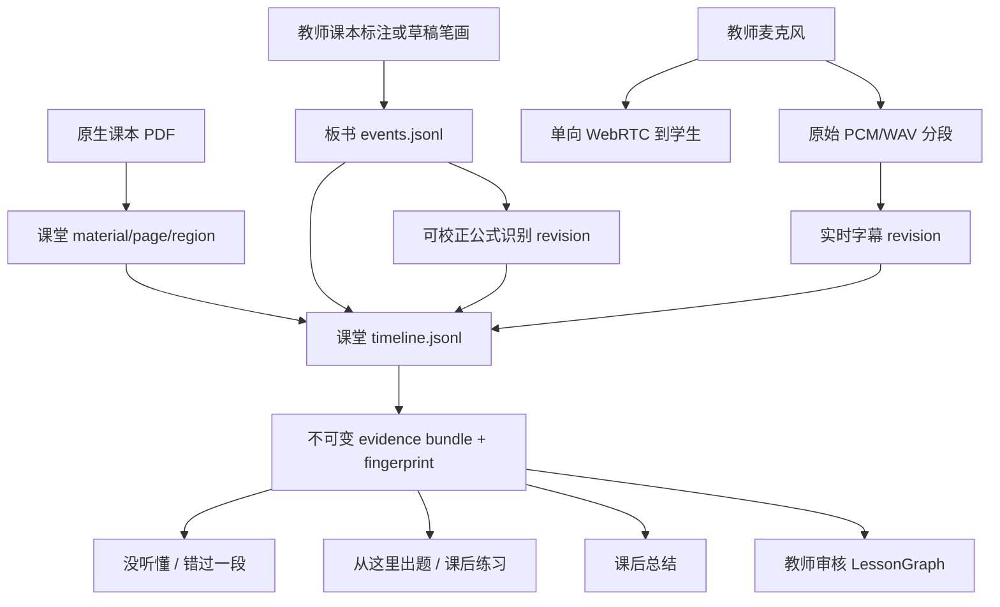
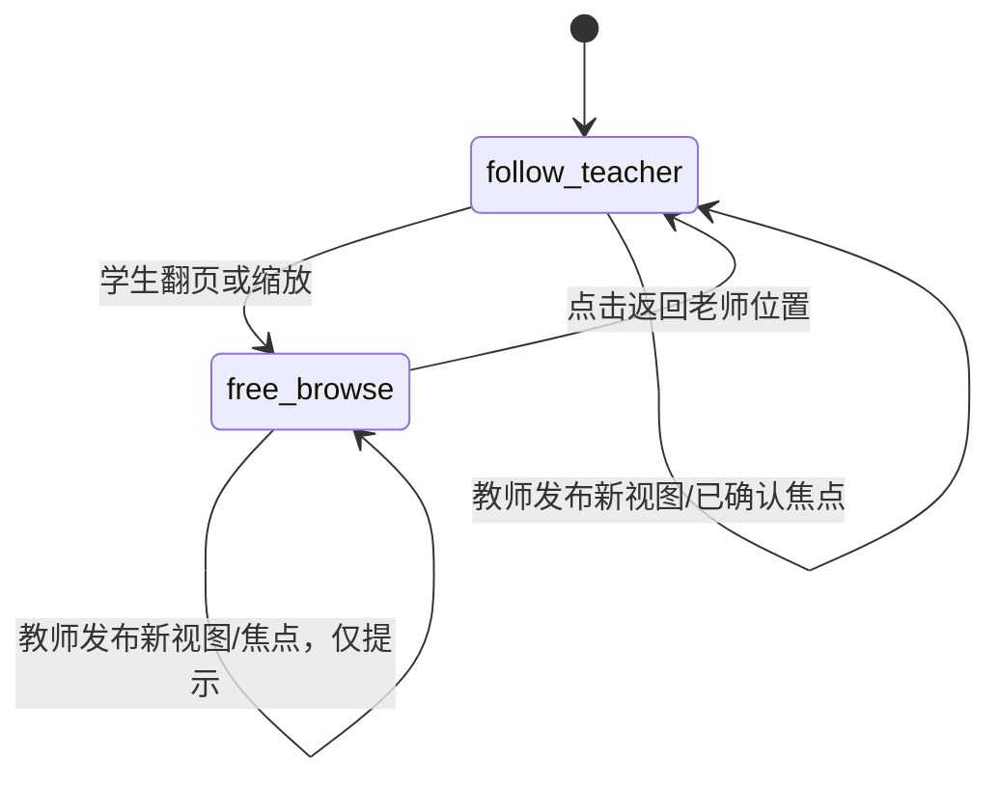
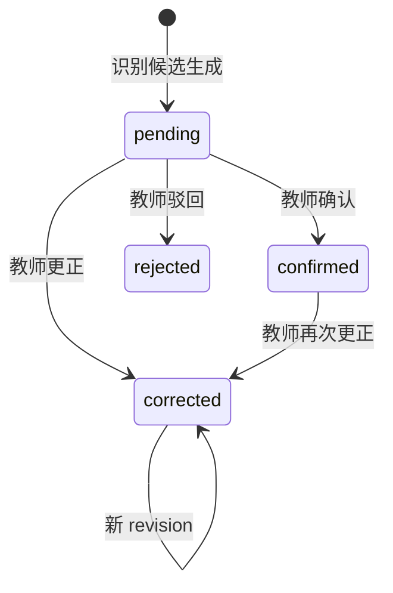
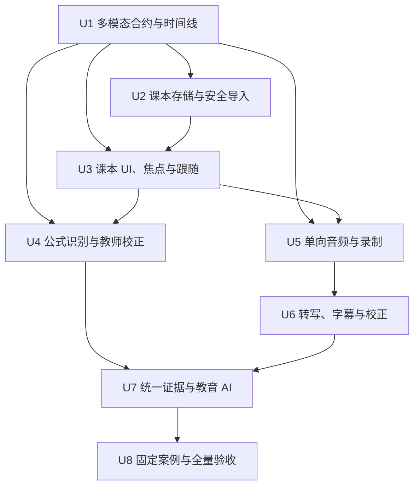
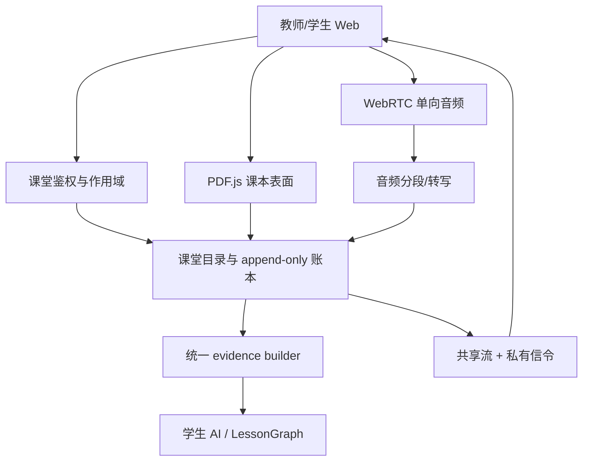

# feat: Add Middle-School Math Multimodal Classroom

## Overview

在已完成的双 Web 课堂基线上，把“同步笔画”升级为“可理解、可追溯的初中数学课堂”：教师以课本 PDF 为主画布，直接标注或打开与当前课本页关联的草稿白板；学生默认跟随教师，也可以自由浏览并一键返回；教师板书被识别为可校正的文字/公式；教师显式开启单向音频和实时字幕；学生围绕统一课堂证据触发“这一步没听懂”“我错过了一段”“从这里出题”；课后总结、练习和教师 `LessonGraph` 只使用已确认的公式和校正后的字幕。

本计划复用现有课堂鉴权、板书账本、PDF.js 渲染、OCR/手写识别接缝、来源引用、AI 网关和候选审核，不修改已验收的会议/阅读入口。外部项目 Meetily 仅作为音频与转写架构参考：借鉴原始录音与转写分段双路径、录音相对时间、设备/缓冲状态、显式录制和本地优先隐私；不复制其 Tauri/Rust 桌面壳、系统音频混音、会议说话人分离或会议摘要 UI。

## Problem Frame

第一阶段已经能在两个 Web 端同步教师笔画，并完成学生私有解释、课后总结、练习和教师 `LessonGraph` 审核。但是当前 AI 输入主要是笔画坐标和时间，无法可靠知道老师写的是 `x² + 4x + 4 = 9`，也没有课本页或教师讲解作为语义证据。即使所有按钮、来源 ID 和权限流程都通过，数学解释仍可能只描述“几条线”。

本阶段必须首先建立三类可对齐的证据，再增强 AI：课本页/区域、已审核的板书/公式、教师音频/字幕时间段。固定配方法案例是唯一数学语义硬门槛；规划不允许用多个浅案例、确定性 fallback 或教师完全重写结果来替代该门槛（see origin: `docs/brainstorms/2026-07-18-middle-school-math-multimodal-classroom-requirements.md`）。

## Requirements Trace

### 课本工作区与全班焦点

- R1-R2：内置标准配方法讲义和教师 PDF 导入共用课本工作区；课本可翻页、缩放、直接标注，独立草稿白板保持当前课本页/区域关联。
- R3-R5：学生默认跟随教师页、视图和已确认焦点；自由浏览是学生本地状态，一键返回教师视图；教师视图、焦点、标注和草稿切换实时同步且可恢复。

### 手写与公式识别

- R6-R9：板书实时同步后形成可版本化的识别候选，保留原始笔画来源；教师可快速确认/更正；低置信公式不得成为实时解释或课后产物的可信结论；固定六行配方法内容是识别硬门槛。

### 音频、字幕与录制控制

- R10-R14：教师通过安全浏览器上下文明示开启麦克风和录制；学生只接收单向音频/字幕，不请求麦克风或摄像头；原始教师音频、实时字幕和课后校正版有明确生命周期；音频播放、转写失败时按定义降级。

### 学生动作与可追溯结果

- R15-R20：“这一步没听懂”和“我错过了一段”在直播中生成私人结果；“从这里出题”在直播中保存私人锚点、课后生成练习；总结、练习和解释带课本、板书、字幕三类可导航来源；降级缺源时明确降低信任或拒绝生成。

### 教师课后审核

- R21-R23：教师先集中校正字幕和识别，再生成/刷新 `LessonGraph`；候选继续支持接受、编辑、驳回；任何上游证据修订都会让受影响产物显式过期而不是静默沿用。

### 连续性、隐私与冻结边界

- R24-R28：刷新、断线和服务重启后恢复共享证据和私有结果；删除课堂覆盖 PDF、音频、字幕、识别和派生产物；外部处理显式告知并最小化上传；音频与课堂凭证只在安全上下文传输；会议、阅读和电子纸路径保持冻结。

## Scope Boundaries

- 只做教师单向音频和实时字幕；不做教师/学生视频，不做学生麦克风、学生摄像头或共享白板写回。
- 固定“配方法解 `x² + 4x - 5 = 0`”是唯一语义硬门槛；函数图像、几何、证明、多语言和复杂理科公式延期。
- 不做正式账号、花名册、作业提交、评分、学情分析、LMS、远程公网课堂、TURN 基础设施和学校规模合规认证。
- 不承诺完美识别所有手写；承诺低置信可见、可校正、未确认不进入可信产物。
- 不把 Meetily 作为运行时依赖或服务端；不引入 Tauri/Rust，不接入其已归档 FastAPI 后端，不复制系统音频混音和会议 UI。
- 不重构完整阅读渲染器来服务课堂；只抽取已经稳定、无副作用的 PDF 页面布局、文本层和归一化坐标能力。
- 会议与阅读场景保持冻结；电子纸设备不在本阶段实现或验收范围内。

### Deferred to Separate Tasks

- 真实 AI Pen/Capture Surface 输入：继续作为独立硬件证据轨道，后续映射同一课堂 surface/timeline 合约。
- 电子纸 Student Viewer：多模态课堂在两个普通 Web 端硬验收后再恢复兼容验证。
- 公网/远程课堂：需要独立身份、TLS、TURN、容量和教育数据合规计划。
- 函数图像与几何：配方法硬门槛通过后作为识别与证据模型扩展案例。

## Context & Research

### Relevant Code and Patterns

- `packages/runtime-schema/src/index.ts` 已定义 `InkLoopSourceRef` 的 `ink_event`、`board_object`、`audio_segment` 和 `LessonGraph`，并包含第一阶段课堂、证据 checkpoint、学生 AI job 和教师候选合约；本阶段以向后兼容联合类型扩展，不另建教育专用私有 schema。
- `examples/ai-annotation-demo/server/classroom-store.ts` 使用课堂级串行队列、原子 JSON、append-only `events.jsonl`、按参与者隔离私有结果和墓碑式课堂删除；课本、时间线、音频、字幕和识别继续使用同一课堂目录与授权边界。
- `examples/ai-annotation-demo/server/classroom-service.ts` 将低延迟共享流与耐久板书账本分离，并用 cursor/重同步处理慢客户端；课本视图、焦点、识别、字幕和录制状态沿用该模式，WebRTC 信令单独保持参与者作用域。
- `examples/ai-annotation-demo/server/classroom-ai.ts` 已有不可变 evidence checkpoint、真实 AI/fallback 标记、并发/重试、私有存储和来源校验；本阶段替换证据构建器而不复制 job 基础设施。
- `examples/ai-annotation-demo/server/classroom-lesson.ts` 已有教师候选与 reviewed projection；增加证据 revision/fingerprint 和过期规则，不另建第二套审核系统。
- `examples/ai-annotation-demo/src/surface/renderer.ts`、`src/surface/page-layout.ts` 和 `src/evidence/page-ocr.ts` 已证明 PDF.js 页面渲染、文本层、OCR bbox 和归一化坐标；课堂只抽取可复用小模块，不导入阅读场景全局状态和副作用。
- `examples/ai-annotation-demo/src/core/pipeline.ts`、`src/evidence/ondevice.ts` 和 `server/infer.ts` 已有“端侧识别 → 本地 HWR → 云 VLM”适配接缝和严格转写提示；数学公式识别在此模式上新增课堂专用结构化契约和教师信任状态。
- `examples/ai-annotation-demo/server/standalone.ts` 已支持可选 HTTPS 入口；`scripts/start-local-cloud-hub-product.ts` 已有开发证书生成模式。课堂音频验收复用安全入口思想，但必须让教师浏览器信任证书，不能把 LAN HTTP 算作通过。

### Institutional Learnings

- `docs/solutions/integration-issues/runtime-sync-canonical-path-2026-07-02.md`：实时运行时事件与导出必须分离；本计划让课堂账本/时间线负责同步、恢复、游标和证据，PDF/总结导出不参与实时同步。
- `docs/solutions/best-practices/source-file-centered-v1-product-boundary-2026-07-02.md`：用户可见源文件保持原生，运行时状态放隐藏 sidecar；导入课本保留原 PDF，页视图、标注、识别和字幕状态存课堂隐藏目录。
- `docs/solutions/integration-issues/obsidian-ink-rendering-stability-2026-06-28.md`：本地可见状态与远端/持久化投影要区分，避免每次落盘强制整面重绘；课本标注、字幕修订和识别修订使用增量投影，避免教师书写时闪烁。

### External References

- [Meetily](https://github.com/Zackriya-Solutions/meetily)（调研 commit `0281737d87d26352fb0adc78c8c0975f691b23d1`，MIT）：参考音频录制路径与 VAD/转写路径分离、录音相对时间、显式录制状态、设备断开和 chunk-drop 提示、本地优先处理。其 Tauri/Rust/SQLite 架构与当前 Web/Node 课堂不同，只借鉴边界，不照搬实现。
- Meetily `frontend/src-tauri/src/audio/pipeline.rs` 与 `recording_manager.rs`：原始录音和转写输入使用不同处理路径，音频设备抖动、采样率、缓冲溢出需要成为可见状态。
- Meetily `frontend/src-tauri/migrations/20251006000000_add_audio_sync_fields.sql` 与 `frontend/src/types/index.ts`：字幕段保存录音相对 `audio_start_time`/`audio_end_time`，比只存墙钟时间更适合来源跳转和回放。
- Meetily `frontend/src-tauri/LOGGING_OPTIMIZATIONS.md`：逐音频 chunk/逐转写正文日志会抬高热路径延迟；本计划只记录聚合延迟、丢块和模式，不记录音频或字幕正文。
- [MDN getUserMedia](https://developer.mozilla.org/en-US/docs/Web/API/MediaDevices/getUserMedia)：麦克风采集只在安全上下文中可用且必须由用户授权。
- [MDN WebRTC signaling](https://developer.mozilla.org/en-US/docs/Web/API/WebRTC_API/Signaling_and_video_calling)：信令协议由应用负责，SDP/ICE 消息需要明确作用域；本计划复用课堂鉴权建立参与者私有信令通道。
- [MDN MediaRecorder](https://developer.mozilla.org/en-US/docs/Web/API/MediaRecorder)：浏览器录音编码支持存在差异。本阶段不把特定 MediaRecorder codec 作为唯一转写输入，使用可验证的 PCM/WAV 分段适配层。

## Key Technical Decisions

1. **保留板书账本，新增跨模态时间线，不双写第二份笔画。** `events.jsonl` 继续是板书事实源；新增 append-only `timeline.jsonl` 保存板书引用、课本视图/焦点、识别 revision、录制/降级状态和字幕 revision。板书先耐久写入原账本，再以稳定事件 ID追加时间线引用；重试或启动恢复会补齐缺失引用，避免一次崩溃让板书与时间线永久分叉。
2. **共享 schema 只加入稳定产品合约。** 新增课堂 material/surface/view/focus/recognition/transcript/audio/timeline/evidence bundle 合约，并给 `InkLoopSourceRef` 增加课本页内区域来源；存储目录、HTTP handler 和浏览器实现细节留在 example host。
3. **课本 PDF 是原生源，标注是课堂事件。** 内置讲义和导入 PDF 都以不可变 material ID、内容 hash 和页数登记；课本标注沿用 `ClassroomBoardEvent`，通过稳定 `ClassroomSurfaceRef` 指向 material/page。草稿白板使用独立 surface，但携带打开时的课本 page/region link。
4. **教师视图、焦点建议和全班焦点分层。** 页码/缩放/viewport 是教师共享视图；指针、最近标注和语音对齐产生的焦点建议是教师本地/临时状态；只有教师点击确认或执行显式聚焦才产生耐久全班 focus。学生脱离跟随只改变本人本地视图，点击“返回老师位置”后重新跟随。
5. **公式识别以“笔画组 + 图像 + 原始事件 IDs”为输入。** 教师端按同一 surface、空间相邻和短暂停顿组成候选行，将白底笔迹裁图与服务器可验证的事件 IDs 送入识别服务；服务返回结构化 text/LaTeX/confidence。教师确认/更正形成 append-only revision，原始笔画永不被覆盖。
6. **信任状态控制 AI，而非只控制 UI 标签。** `pending`/低置信识别可以显示并参与焦点建议，但证据构建器不会把它作为可信公式；直播解释只能声明不确定，课后总结、答案和 reviewed `LessonGraph` 在关键公式未确认时拒绝生成或保持 `needs_review`。
7. **WebRTC 只负责教师到学生音频，课堂服务负责鉴权信令。** 每个学生和教师建立一条单向 peer connection，教师只发送 audio track；SDP/ICE 使用独立的 teacher/participant-scoped 流或 mailbox，不进入共享课堂流、不持久化。局域网验收不引入 TURN，超出 LAN 的远程连通性明确延期。
8. **教师音频并行进入两条路径。** 同一麦克风 track 一路进入 WebRTC；另一路由 AudioWorklet 产出带课堂相对时间和幂等 chunk ID 的 PCM/WAV 分段，服务端保存原始分段并送转写适配器。学生播放失败不影响转写；转写失败不停止课本与板书课堂。
9. **转写提供者可替换且本地优先。** 新增 provider contract，首个真实验收目标是 loopback 的 Whisper/OpenAI-compatible 音频转写服务；允许教师显式开启外部 provider，但默认不得隐式上传。Meetily 不是 provider，因为其当前支持架构是 Tauri command/event，不是稳定的网络 API。
10. **字幕采用可修订、可稳定的录音相对时间。** 实时 provisional segment 可以被同一 segment ID 的 final revision 替换；课后教师更正产生新 revision。时间范围以 recording start 为零点，同时保存服务器接收时间用于诊断，不用墙钟时间做课本/板书对齐事实。
11. **统一 evidence bundle 是所有教育 AI 的唯一输入边界。** bundle 固定 material/page/region、相关 ink events、已确认 recognition revisions、final/corrected transcript segments、time window 和 evidence revision fingerprint。三个学生动作、总结、练习和 `LessonGraph` 共用 builder，但输出继续写入学生私有或教师规范命名空间。
12. **上游校正使派生产物过期，不静默改写。** 每个 AI job/候选保存 evidence fingerprint；公式或字幕新 revision 命中其来源范围时，产物显示 `stale`/“证据已更新”，由学生或教师显式刷新。原结果保留作审计，不自动被新内容覆盖。
13. **音频热路径只记录聚合健康指标。** 日志允许模式、chunk 数、字节、丢块、队列深度、延迟和错误码；禁止音频、字幕正文、PDF 正文、SDP、ICE、token、nickname 和完整 AI payload。
14. **两个 Web 端的安全入口是本阶段先决条件。** 教师只有点击“开始录制”后才请求麦克风；学生需要一次明确的“开启课堂声音”手势以满足 autoplay 策略。自签证书必须在教师/学生浏览器被信任；HTTP 8765 可继续做无音频开发，但不得计入多模态验收。
   最终验收时，教师/学生页面与课堂 API/信令必须由同一个被信任的 HTTPS origin 提供，或全部走被明确允许的 HTTPS origin；不得从 HTTPS 页面回落到 HTTP 课堂 API形成 mixed content，也不得继续使用宽泛的任意 LAN origin 放行规则。
15. **每个高风险异步写入都携带 classroom generation fence。** 课堂创建时生成不可复用的 generation；识别、转写、音频 finalize 和 AI worker 在外部调用前后都验证 generation 与课堂状态。删除课堂先撤销 generation、停止 worker、关闭 peer，再墓碑重命名目录，因此迟到回调不能把已删除数据重新写回。
16. **各阶段通过 capability flag 增量启用并可独立回退。** 没有 material 的旧课堂继续使用第一阶段白板；textbook、recognition、audio/transcript 和 multimodal evidence 逐项启用。关闭后一阶段不会改变已落盘证据，只让 UI 和 builder 回到上一阶段能力，便于定位回归和逐阶段验收。

## Performance and Capacity Budgets

这些预算用于固定两 Web、受信任 LAN、1 位教师 + 3 位学生的验收，不代表公网生产承诺：

- 教师已确认的课本页/视图/焦点到普通学生 Web 可见：P95 ≤ 500 ms。
- 教师完整笔画到学生渲染：继续保持第一阶段 P95 ≤ 300 ms；公式识别不得阻塞笔画提交或渲染。
- 教师音频到学生可听：连接稳定后 P95 ≤ 500 ms；若浏览器 autoplay 阻止，显示“开启课堂声音”而不是静默失败。
- 教师停止一段话到 final 字幕可见：固定验收课 P95 ≤ 5 s；支持 provisional 的 provider 应在 P95 ≤ 2 s 显示首段，但 provisional 不进入最终产物。
- 教师停笔到识别候选可见：固定配方法案例 P95 ≤ 5 s；识别排队或失败不能阻塞继续书写。
- 音频分段队列达到上限时显式标记 `transcription_delayed` 并保留原始音频，不能无限占用内存或静默丢失。

## Open Questions

### Resolved During Planning

- **课本能力复用方式：** 复用 PDF.js、`page-layout.ts`、文本层/OCR 和归一化坐标的纯能力；课堂建立独立无副作用 renderer，不导入阅读场景全局 `state` 或改动阅读入口。
- **统一时间线与第一阶段板书账本：** 板书继续以 `events.jsonl` 为事实源，跨模态 `timeline.jsonl` 引用它；启动时按稳定 ID补齐缺失引用，不维护第二份笔画数据。
- **焦点发布：** 规则只生成建议，教师确认才写全班 focus；学生自由浏览不会改变共享状态。
- **公式识别输入：** 使用服务端验证过的事件 IDs + 教师端栅格化笔画组，避免只发裸图片或只发坐标；固定案例优先调优，所有结果可校正。
- **实时音频传输：** LAN 内使用单向 WebRTC；课堂 HTTP 流只做共享状态，SDP/ICE 使用参与者私有信令，不广播。
- **音频与转写关系：** 原始 PCM/WAV 分段保存和转写队列分开，转写失败不丢原音频；不把浏览器 codec 差异带进核心 evidence contract。
- **转写后端：** provider seam + loopback Whisper-compatible 首选，外部 provider 明示 opt-in；不依赖 Meetily 私有实现或归档后端。
- **“我错过了一段”边界：** 默认从当前触发点向前最多 60 秒，优先截到最近一次教师确认焦点/翻页或完整字幕句边界；证据不足时展示选中的时间范围让学生调整，不猜测缺失内容。
- **“从这里出题”时机：** 直播中只保存学生私有锚点；课堂结束、教师完成关键公式/字幕校正后生成题目。
- **过期产物：** evidence fingerprint 变化后标记 stale 并显式刷新，保留原始版本，不静默重写。
- **Meetily 许可与复用：** 项目为 MIT；本计划只借鉴架构模式。若实施中复制实质代码，必须保留对应 MIT copyright/license 并在第三方声明中归属；默认实现不复制代码。

### Deferred to Implementation

- **公式分组阈值：** 停笔时间、行距和 bbox 外扩先用 fixture/固定案例校准，再根据真实教师笔迹调整；已落盘 group 和 revision 不因阈值更新被重写。
- **浏览器 PCM chunk 大小/重叠：** 以 2-4 秒窗口和短重叠起步，依据固定验收机的 final 字幕 P95、边界漏词和请求开销选择；chunk ID、录音相对时间和幂等语义保持稳定。
- **本地 Whisper 模型与进程管理：** provider contract 固定后，根据验收 Mac 的可用 runtime 决定是既有 loopback 服务、whisper.cpp sidecar 还是兼容服务；不得把某一可执行文件路径写入公共合约。
- **WebRTC host candidate 兼容性：** 在两浏览器 LAN 验收中记录 Safari/Chrome ICE 行为；如果 mDNS host candidate 导致同网失败，作为独立网络适配处理，不提前引入公网 TURN。
- **课本焦点建议规则权重：** 先采用最近教师标注 bbox > 最近确认公式 bbox > 当前页的确定性顺序；语音关键词对齐的权重在字幕真实数据可用后调整。
- **教师集中校正效率：** 固定验收中记录校正六行公式和关键字幕总耗时；如果需要逐字符多次操作，再调整批量确认/键盘流，不在计划中预写最终控件细节。

## Output Structure

```text
packages/runtime-schema/src/
  index.ts                              # 稳定课堂多模态合约与 source refs
  runtime-schema.test.ts

examples/ai-annotation-demo/
  public/demo/education/
    completing-square-handout.pdf       # 自制标准验收讲义
  fixtures/
    education-completing-square-handout.md
    education-completing-square-evidence.json
    education-completing-square-audio.wav
  server/
    classroom-materials.ts
    classroom-materials.test.ts
    classroom-recognition.ts
    classroom-recognition.test.ts
    classroom-audio.ts
    classroom-audio.test.ts
    classroom-transcription.ts
    classroom-transcription.test.ts
    classroom-evidence.ts
    classroom-evidence.test.ts
  src/classroom/
    textbook-renderer.ts
    textbook-renderer.test.ts
    classroom-follow-state.ts
    classroom-follow-state.test.ts
    classroom-recognition-client.ts
    classroom-recognition-client.test.ts
    classroom-audio-client.ts
    classroom-audio-client.test.ts
    classroom-audio-worklet.ts
  scripts/
    smoke-education-multimodal-classroom-browser.ts
    verify-education-multimodal-classroom-e2e.ts
```

该树表达预期模块边界，不要求为了匹配树而拆出无价值文件；每个实施单元的 `Files` 列表是执行范围依据。

## High-Level Technical Design

> *This illustrates the intended approach and is directional guidance for review, not implementation specification. The implementing agent should treat it as context, not code to reproduce.*







## Phased Delivery

### Phase 0 — Baseline Gate

- **Completed 2026-07-19:** automated and headed two-Web baseline passed after fixing Vite development API routing, visible LessonGraph refusal feedback and the stale student empty-board notice. Workflow is accepted; completing-square mathematical semantics remain explicitly unpassed. See `docs/reviews/2026-07-19-education-classroom-phase-0-baseline-acceptance.md`.
- 先把第一阶段课堂改动稳定落入目标分支：现有课堂单测、两个 Web smoke、真实 AI/source validation 和会议/阅读 freeze gate 通过。
- 保存一次配方法人工验收结果，明确哪些流程已通过、哪些数学语义尚未通过，作为后续回归基线。
- 不在未稳定的第一阶段文件集合上同时开发多模态分支，避免计划依赖漂移的接口。

### Phase 1 — Textbook Evidence

- Unit 1-3：合约/时间线、课本存储、两个 Web 课本/焦点/标注/跟随。
- 阶段出口：不用 AI 和音频，也能在两个 Web 端完成固定讲义翻页、缩放、标注、草稿关联、确认焦点、自由浏览和返回教师位置；刷新/重连后恢复。
- 回退出口：关闭 textbook capability 后，现有第一阶段 teacher board/student viewer 仍按原交互运行。

### Phase 2 — Recognized Math Evidence

- Unit 4：公式识别、置信度、教师确认/更正和 trust gate。
- 阶段出口：固定六行公式全部产生可审核结构，教师无需重画即可改正；未确认公式不会被实时解释当成事实。
- 回退出口：关闭 recognition capability 后保留课本/板书课堂，AI 明确缺少可信公式而不猜测。

### Phase 3 — Teacher Audio and Transcript

- Unit 5-6：安全入口、单向 WebRTC、原始录音分段、转写、实时字幕、课后校正和降级。
- 阶段出口：三学生能听教师音频并看字幕；学生端不请求媒体权限；断开播放/转写后按定义降级；原始音频和字幕可单独删除/校正。
- 回退出口：关闭 audio/transcript capability 后回到同步课本+板书，其他证据不丢失。

### Phase 4 — Scenario Intelligence

- Unit 7：统一 evidence bundle、三个学生动作、总结、练习、`LessonGraph` 和证据修订失效。
- 阶段出口：所有 AI 输入都包含可用的课本、已确认公式和校正字幕，不再直接把裸笔画坐标当数学语义。

### Phase 5 — Hard Acceptance

- Unit 8：固定配方法语义、隐私、恢复、删除、性能和 freeze gates。
- 阶段出口：`docs/project/inkloop-ai-pen-kickstarter/source/education-classroom-completing-square-acceptance-script.md` 的下一阶段硬门槛通过。

## Implementation Units



- [x] **Unit 1: Define multimodal classroom contracts and durable timeline**

**Goal:** 建立课本、surface、视图/焦点、识别 revision、录制/字幕状态和统一 evidence bundle 的稳定词汇，并在不复制板书数据的前提下提供跨模态顺序与恢复。

**Requirements:** R2-R9, R11-R14, R19, R21-R25, R27-R28

**Dependencies:** Phase 0 baseline gate

**Files:**
- Modify: `packages/runtime-schema/src/index.ts`
- Modify: `packages/runtime-schema/src/runtime-schema.test.ts`
- Modify: `packages/runtime-schema/README.md`
- Modify: `examples/ai-annotation-demo/server/classroom-store.ts`
- Modify: `examples/ai-annotation-demo/server/classroom-store.test.ts`
- Modify: `examples/ai-annotation-demo/server/classroom-service.ts`
- Modify: `examples/ai-annotation-demo/server/classroom-service.test.ts`

**Approach:**
- 新增版本化的 material、surface link、teacher view、focus suggestion/confirmed focus、recognition revision、recording/audio mode、transcript revision、timeline entry 和 evidence bundle/fingerprint 合约；给 source refs 增加课本 document/page/bbox 类型。
- `ClassroomBoardEvent` 增加向后兼容的 surface ref，使同一课堂可以区分课本第 N 页标注和与该页关联的 scratch surface；缺省值仍表示第一阶段 `teacher_board`。
- 新增 `timeline.jsonl` 与单调 timeline sequence。board event 的 timeline 项只保存稳定 event ID/board sequence/surface ref，不重复 points。写入失败后相同 client ID重试会补 timeline；启动时扫描 board ledger 补缺并校验无悬空引用。
- 在 classroom metadata 保存 board→timeline reconciliation watermark 和 timeline projection revision；服务端只在引用耐久后推进 watermark。启动恢复从 watermark 后补扫 board ledger，避免每次全量扫描，也让故障注入能验证“板书已收、时间线未收”的单一恢复方向。
- recognition/transcript 的更正使用 append-only revision；store 对外投影 latest revision，同时保留历史。高频 teacher viewport 先流式发布，静止 debounce 后再耐久写入；confirmed focus 始终立即耐久。
- classroom metadata 增加 generation/capabilities；所有异步 worker 写入时校验 generation，所有新 UI 能力按 capabilities 渐进展示。缺少字段的旧课堂推导为白板-only capability，不做破坏性迁移。
- 共享课堂流只包含所有参与者可见的课本/板书/字幕/录制状态，不包含 nickname、私有锚点、AI job、SDP 或 ICE。

**Execution note:** 先为旧第一阶段课堂目录、重复投递和 append 中断写 characterization/failure tests，再改变 store 加载与写入路径。

**Patterns to follow:**
- `JsonClassroomStore.serialize` 的课堂级写入串行化与 `writeJsonAtomic`。
- `appendBoardEvent` 的 client idempotency 和 `ClassroomService.subscribe` 的 cursor/gap 恢复。
- `validateClassroomBoardEvent`/`validateEducationAiJob` 的跨信任边界运行时校验。

**Test scenarios:**
- Happy path：旧式 teacher board event 写入后，board snapshot 与 timeline projection 都能按稳定 ID找到同一笔画，timeline 不复制 points。
- Compatibility：加载只有 `events.jsonl` 的第一阶段课堂目录时自动投影 timeline 引用，原 board sequence/digest 不改变。
- Idempotency：board append 成功而 timeline append 被模拟失败后，相同 client event 重试只补 timeline，不产生第二笔或第二个 timeline item。
- Revision：同一公式/字幕的 pending → corrected revision 保留历史，latest projection 指向新 revision，旧 source ref 仍可审计。
- Edge case：高频 viewport 更新合并为最终耐久 view，confirmed focus 不被合并丢失；学生断线后 snapshot + cursor 收敛到相同状态。
- Security：共享流序列化结果不包含 participant ID、nickname、私有锚点、AI metadata、SDP、ICE 或 credential。
- Error path：悬空 timeline board ref、sequence gap、损坏 JSONL 尾行不会污染内存投影，并产生可解释恢复/重同步状态。
- Recovery fence：删除课堂后模拟 recognition/transcription/AI 延迟完成，所有迟到写入因 generation 撤销被拒绝，重启后目录不会复活。
- Rollback：对旧白板-only 课堂，关闭 textbook/recognition/audio capability 后第一阶段同步与原 AI 流程仍能运行；对已经启用多模态课本的课堂，关闭 recognition 后只保留课本/板书并明确禁用数学语义 AI，不得退回裸坐标猜公式。重新打开 capability 后已落盘 timeline/revision 可继续使用，不重复生成。

**Verification:**
- 第一阶段 snapshot、AI job 和 teacher review 合约仍可解析；新 timeline 能独立重建当前课本、surface、focus、recognition、recording 和 transcript 投影。

- [x] **Unit 2: Add textbook material storage and safe PDF ingestion**

**Goal:** 支持内置标准验收讲义与教师 PDF 导入，保持原 PDF 原生、不可变、可删除，并提供稳定页内来源。

**Requirements:** R1-R2, R5, R19, R24-R28

**Dependencies:** Unit 1

**Files:**
- Create: `examples/ai-annotation-demo/server/classroom-materials.ts`
- Create: `examples/ai-annotation-demo/server/classroom-materials.test.ts`
- Modify: `examples/ai-annotation-demo/server/classroom-handler.ts`
- Modify: `examples/ai-annotation-demo/server/classroom-handler.test.ts`
- Modify: `examples/ai-annotation-demo/server/classroom-store.ts`
- Modify: `examples/ai-annotation-demo/server/classroom-store.test.ts`
- Create: `examples/ai-annotation-demo/public/demo/education/completing-square-handout.pdf`
- Create: `examples/ai-annotation-demo/fixtures/education-completing-square-handout.md`
- Modify: `examples/ai-annotation-demo/package.json`

**Approach:**
- 教师创建课堂时可选择内置讲义；上传 PDF 只能由 teacher credential 发起。服务端以 magic bytes、大小、页数、解析超时和内容 hash 校验，不信任文件名/MIME；拒绝加密、零页、超限或无法解析的 PDF。
- material ID由服务器生成，原始 PDF 存课堂 `materials` 子目录，metadata 原子写入；页面 source ref 使用 material ID、0-based page index 和 normalized bbox，不使用临时 blob URL。
- 上传内容只在教师明确启用外部 OCR/AI 时按最小页/区域发送；普通渲染和页面文字层提取保留本地路径。
- 内置讲义为团队自制两页以内材料：题目、五个配方法步骤占位、教学提示与验收来源区；保留可审查的 Markdown 源和生成后 PDF。
- 删除课堂沿用现有 tombstone directory 流程，覆盖 materials；单独删除原始音频不影响 material。

**Patterns to follow:**
- `src/surface/renderer.ts` 对 PDF decode timeout、destroy、page count 和稳定 document identity 的处理。
- `classroom-handler.ts` 的 teacher/participant route 授权和统一错误码。
- `source-file-centered-v1-product-boundary`：PDF 原件与隐藏课堂状态分离。

**Test scenarios:**
- Happy path：教师选择内置讲义或上传有效两页 PDF后得到稳定 material metadata，刷新/重启后 bytes hash、页数和 ID不变。
- Authorization：学生 credential 可以读取教师已发布给本课堂的 PDF bytes 和最小渲染 metadata，但不能上传、替换、删除、读取未发布 material 或查看教师导入审计信息；只有课堂码和无 credential 的请求不能读取任何 material。
- Validation：伪装成 PDF 的文本、加密 PDF、零页 PDF、超大小/页数 PDF和解析超时都被拒绝且不留下半写目录。
- Idempotency：相同内容和 idempotency key 重试返回同一 material，不重复存储；同名不同内容得到不同 material。
- Deletion：删除 ended classroom 后 PDF、metadata、页面来源和派生产物均不可读取；服务重启不会复活墓碑目录。
- Privacy：日志只含 material ID、页数、大小、hash 前缀和错误码，不含文件正文或上传 credential。

**Verification:**
- 两个 Web 端可以通过授权课堂接口取得同一 PDF bytes；内置讲义可由 PDF.js 解析并具有预期页数，会议/阅读 public assets 不改变。

- [x] **Unit 3: Build textbook-first teacher/student workspace, focus, and follow state**

**Goal:** 将课本作为教师主画布，支持页内标注、翻页/缩放、关联草稿白板、教师确认焦点，以及学生跟随/自由浏览/一键返回。

**Requirements:** R1-R5, R15-R17, R19, R24, R26

**Dependencies:** Unit 1, Unit 2

**Files:**
- Create: `examples/ai-annotation-demo/src/classroom/textbook-renderer.ts`
- Create: `examples/ai-annotation-demo/src/classroom/textbook-renderer.test.ts`
- Create: `examples/ai-annotation-demo/src/classroom/classroom-follow-state.ts`
- Create: `examples/ai-annotation-demo/src/classroom/classroom-follow-state.test.ts`
- Modify: `examples/ai-annotation-demo/src/classroom/teacher-main.ts`
- Modify: `examples/ai-annotation-demo/src/classroom/teacher-main.test.ts`
- Modify: `examples/ai-annotation-demo/src/classroom/student-main.ts`
- Modify: `examples/ai-annotation-demo/src/classroom/student-main.test.ts`
- Modify: `examples/ai-annotation-demo/src/classroom/board-renderer.ts`
- Modify: `examples/ai-annotation-demo/src/classroom/board-renderer.test.ts`
- Modify: `examples/ai-annotation-demo/src/classroom/classroom-client.ts`
- Modify: `examples/ai-annotation-demo/src/classroom/classroom.css`

**Approach:**
- 新 renderer 只负责 classroom material/page 的 PDF canvas、text layer、normalized overlay 和 source focus；复用 `pdfScaleForBox` 等纯函数，不导入阅读页面的全局 state、IndexedDB 文库或 reflow UI。
- 教师工作区默认展示课本，笔画落到当前 material/page surface；“打开草稿”创建与当前 page + 可选 focus bbox 关联的 scratch surface，切回课本不丢草稿。
- 教师页码、zoom mode/percent、viewport 和 active surface 低延迟发布；页码或视图稳定后写 timeline。系统用“最近标注 bbox → 最近已识别公式 bbox → 当前页面”生成 focus suggestion，教师点击“设为全班焦点”才发布 confirmed focus。
- 学生 `follow_teacher` 时应用教师 view/focus；任何学生主动翻页/缩放进入 `free_browse`，后续教师更新只显示提示，不强拉回；点击“返回老师位置”原子恢复教师 page/view/focus。
- 学生动作按钮读取明确当前 source selection；没有 confirmed focus 时退到教师当前 view，但必须在提交前显示证据范围。

**Execution note:** 对 follow/free-browse 状态机和跨缩放归一化坐标先写纯函数测试，再接 DOM/PDF.js。

**Patterns to follow:**
- `src/surface/page-layout.ts` 的 zoom/viewport 计算和边界 clamp。
- `ClassroomBoardRenderer` 的 source focus 与增量 board event 渲染。
- `runtime-sync-canonical-path` 的 local mutation 与 remote projection 区分：学生本地浏览不写共享状态。

**Test scenarios:**
- Happy path：教师翻到讲义第 2 页、放大、标注并确认焦点，三个 follow 学生在 500 ms P95 内显示同页/视图/焦点和标注。
- Student control：学生主动翻页后保持 free browse，教师再翻页不会强制拉回；点击返回后一次恢复正确 page/zoom/focus 并继续跟随。
- Scratch link：教师从课本 page 1/focus A 打开草稿并书写，学生看到 scratch；返回课本或刷新后草稿仍指向 page 1/focus A。
- Coordinate parity：相同 normalized bbox 在不同 viewport/zoom 的教师和学生端覆盖同一课本区域，source jump 能回到正确页和 bbox。
- Focus authority：指针/新笔画只更新教师 suggestion，不改变学生全班焦点；教师确认后才广播并持久化。
- Error path：PDF 页面 decode 失败时显示可重试错误并保留课堂/板书连接；material 被删除或 source page 越界时不崩溃、不跳到错误页。
- Reconnect：follow 和 free-browse 学生分别断线后，共享教师 view/focus 恢复，但 free-browse 本地视图不被错误覆盖；清除设备数据后才回到默认跟随。
- Regression：原第一阶段 teacher board 没有 material ref 时继续渲染；meeting/reading HTML、状态和入口无变化。

**Verification:**
- Phase 1 出口成立：在没有识别、音频和 AI 的情况下完成固定课本多设备课堂、草稿关联、焦点确认、自由浏览和恢复。

- [x] **Unit 4: Add formula recognition revisions and teacher trust review**

**Goal:** 把教师板书从裸坐标转换为可审核的初中数学文字/公式证据，并保证低置信结果不会污染 AI。

**Requirements:** R6-R9, R15, R18-R19, R21-R23, R27

**Dependencies:** Unit 1, Unit 3

**Files:**
- Create: `examples/ai-annotation-demo/server/classroom-recognition.ts`
- Create: `examples/ai-annotation-demo/server/classroom-recognition.test.ts`
- Create: `examples/ai-annotation-demo/src/classroom/classroom-recognition-client.ts`
- Create: `examples/ai-annotation-demo/src/classroom/classroom-recognition-client.test.ts`
- Modify: `examples/ai-annotation-demo/server/infer.ts`
- Modify: `examples/ai-annotation-demo/server/prompts.ts`
- Modify: `examples/ai-annotation-demo/server/classroom-handler.ts`
- Modify: `examples/ai-annotation-demo/server/classroom-handler.test.ts`
- Modify: `examples/ai-annotation-demo/src/classroom/teacher-main.ts`
- Modify: `examples/ai-annotation-demo/src/classroom/teacher-main.test.ts`
- Modify: `examples/ai-annotation-demo/src/classroom/student-main.ts`
- Modify: `examples/ai-annotation-demo/src/core/prompt-versions.ts`
- Create: `examples/ai-annotation-demo/fixtures/education-completing-square-evidence.json`

**Approach:**
- 教师 client 对同一 surface 的近期笔画按时间/空间形成行组，生成白底裁图；服务器验证请求中的 event IDs 均属于当前课堂/surface、bbox 与实际笔画相交、总量有限，再调用结构化识别 adapter。
- 识别 adapter 遵循与转写相同的 provider 数据边界：默认本地/loopback；外部识别或生成式 AI 需要教师显式启用并显示会发送“所选笔画裁图 + 对应事件”，只发送最小区域，不发送无关课本页、学生身份或私有结果。
- 识别输出限定为 kind、plain text、optional LaTeX、confidence、event IDs 和 provider/mode；event IDs 必须逐项验证。无效输出、超时或低质量结果形成明确 pending/failed，不伪造确定性公式。
- 教师侧在课本/草稿旁显示紧凑识别队列，支持确认、编辑文本/LaTeX、驳回和定位原笔画；更正产生 revision 并保留原始结果。
- 固定配方法 fixture 覆盖六行期望规范化；云 VLM、未来端侧 raw-stroke HWR 和确定性测试 adapter 共用 contract，UI 不感知 provider。
- AI evidence builder（Unit 7 前先以 guard helper 落地）只选择 confirmed/corrected revision；pending 关键公式使直播解释显示不确定并阻止课后可信结论。

**Patterns to follow:**
- `src/core/pipeline.ts` 的 on-device/local/cloud adapter 顺序和失败降级。
- `server/infer.ts` 的 Zod structured output、event ID allowlist 和 prompt versioning。
- 现有 teacher LessonGraph candidate 的接受/编辑/驳回与 source focus。

**Test scenarios:**
- Happy path：固定六行笔迹组得到与验收公式一致的 text/LaTeX，来源 event IDs 和 surface/page 正确；教师确认后 trust state 为 confirmed。
- Correction：模型把 `±3` 识别成 `+3` 时，教师更正为 `±3` 产生新 revision，原始候选保留，source jump 仍定位同一笔画。
- Low confidence：confidence 低于阈值时保持 pending，直播解释不得声称公式含义，课后总结/答案/`LessonGraph` 不得把它视为教师确认。
- Grouping edge：跨两行、跨页、跨 scratch surface 或超过时间窗的笔画不能被合成一个公式；慢写同一行的短暂停顿不会按单字符永久碎片化。
- Security：学生不能提交、确认、更正或驳回课堂 recognition；teacher 提供其他课堂 event ID、伪 bbox、过大图片或无来源图片均被拒绝。
- Provider failure：识别超时、无配置、invalid JSON 和未知 event ID 产生可重试状态，不阻塞板书同步、不回落成看似正确的公式。
- Revision invalidation：已被 AI job 使用的 recognition 被教师更正后，相关 job/lesson candidate 被标为 stale，未命中来源的产物不受影响。
- Regression：现有 `/api/interpret` 阅读/普通笔迹流程和 meeting prompts 不改变。

**Verification:**
- Phase 2 出口成立：固定案例所有公式均可确认/更正，学生端能看到可信/待确认状态，原始第一阶段 AI 不再直接把裸笔画当数学公式证据。

- [ ] **Unit 5: Add secure one-way teacher audio, scoped signaling, and raw recording**

**Goal:** 在两个 Web 端和受信任 LAN 内提供教师到学生的低延迟单向音频，同时保存带相对时间的原始教师音频分段，并保持权限/信令/日志隔离。

**Requirements:** R10-R11, R13-R14, R24-R25, R27-R28

**Dependencies:** Unit 1, Unit 3, trusted HTTPS prerequisite

**Files:**
- Create: `examples/ai-annotation-demo/server/classroom-audio.ts`
- Create: `examples/ai-annotation-demo/server/classroom-audio.test.ts`
- Create: `examples/ai-annotation-demo/src/classroom/classroom-audio-client.ts`
- Create: `examples/ai-annotation-demo/src/classroom/classroom-audio-client.test.ts`
- Create: `examples/ai-annotation-demo/src/classroom/classroom-audio-worklet.ts`
- Modify: `examples/ai-annotation-demo/server/classroom-handler.ts`
- Modify: `examples/ai-annotation-demo/server/classroom-handler.test.ts`
- Modify: `examples/ai-annotation-demo/server/classroom-service.ts`
- Modify: `examples/ai-annotation-demo/server/classroom-store.ts`
- Modify: `examples/ai-annotation-demo/src/classroom/teacher-main.ts`
- Modify: `examples/ai-annotation-demo/src/classroom/student-main.ts`
- Modify: `examples/ai-annotation-demo/src/classroom/classroom.css`
- Modify: `examples/ai-annotation-demo/vite.config.ts`
- Modify: `examples/ai-annotation-demo/server/standalone.ts`
- Modify: `examples/ai-annotation-demo/package.json`

**Approach:**
- 教师点击“开始录制并直播声音”后检查 `isSecureContext`，再调用麦克风权限；拒绝/无设备/HTTP 时显示明确原因且保持课本+板书课堂可用。课堂开始本身不自动请求权限。
- 为每个已加入 participant 建单向 WebRTC peer；学生只接收 audio track，不调用 `getUserMedia`。学生首次点击“开启课堂声音”后播放，页面持续显示声音/录制/降级状态。
- 信令 mailbox/stream 从 bearer token 推导 teacher/participant scope；participant 只能读写自己的 offer/answer/ICE，teacher 可按 opaque peer ID响应，消息有 TTL/大小/频率限制且不落盘。
- AudioWorklet 从教师 mic track 复制 PCM frames，按录音相对时间组装有界 chunk；服务器验证 sequence、sample rate、channels、时间连续性和幂等 ID后写 WAV/manifest。WebRTC 与录音任一路失败不会自动停止另一条。
- recording state 写 timeline；课堂结束会自动 finalize 但不替代教师显式 stop。服务重启把未完成 recording 标为 interrupted，保留已耐久 chunk。
- teacher 录制 session 绑定 classroom generation 和 recording generation；停止/删除会撤销 generation 后再关闭 tracks/peers。任何迟到 PCM chunk 或信令消息必须同时匹配两层 generation 才能被接受。
- 增加本地 HTTPS 启动/信任说明和可测试配置；开发 HTTP 页面明确显示“音频不可验收”。
- 为多模态验收提供同一被信任 HTTPS origin 下的静态课堂页面与 `/v1/classrooms` API/信令；不能只给现有 standalone API 增加 8732 HTTPS 而让 teacher/student HTML 继续从 8765 HTTP 打开。Vite HTTP 入口保留用于无音频开发。

**Execution note:** 先用 fake RTCPeerConnection/AudioWorklet port 写权限、状态机、信令隔离和 chunk 幂等测试，再做真实浏览器 smoke。

**Patterns to follow:**
- Meetily 的 recording/transcription 双路径和 recording relative timestamps，只借鉴模式。
- 现有 classroom teacher/participant bearer authorization 与私有 AI namespace。
- `start-local-cloud-hub-product.ts` 的 HTTPS key/cert 配置模式。

**Test scenarios:**
- Happy path：教师在可信 HTTPS 点击开始、授权麦克风，三学生点击开启声音后只收到教师 audio track；双方持续显示录制/音频状态。
- Secure origin：教师/学生 HTML、课堂 API和信令均从同一受信 HTTPS origin 工作，没有 mixed-content 或跨源 credential 回落；HTTP 8765 页面稳定阻止录音并显示开发提示。
- Permission：教师拒绝权限、无麦克风或 HTTP insecure context 时，不创建 recording、不请求学生权限，课堂自动保持 textbook + board 模式并显示原因。
- Autoplay：学生未点击开启声音时显示待启用而不是“已播放”；点击后播放成功并更新状态。
- Authorization：一个 participant 无法读取/注入另一个 participant 的 SDP/ICE；课堂码、nickname 或伪 peer ID不能替代 credential。
- Signaling lifecycle：重复 offer/answer 幂等，过期 ICE 被丢弃；参与者断线重连建立新 negotiation generation，旧 generation 不能覆盖新连接。
- Recording integrity：重复 PCM chunk 不重复写入，时间 gap/overlap/采样率漂移产生健康状态；队列上限触发 backpressure/延迟状态而非内存无限增长。
- Failure isolation：学生音频播放失败时教师录音与转写输入继续；录音上传失败时 WebRTC 可继续且教师看到“声音直播中、录制不完整”。
- Restart/delete：服务重启将 active recording 标 interrupted 并可读取已完成 chunks；删除课堂撤销信令、关闭 peers、删除 audio files 并阻止迟到 chunk 写回。
- Generation race：旧 negotiation/recording generation 的 ICE、PCM 和 finalize 在新录制或课堂删除后到达时被稳定拒绝，不影响新 generation。
- Logging：日志和错误响应不包含 PCM、SDP、ICE、token、nickname 或设备完整敏感信息。

**Verification:**
- Phase 3 音频出口部分成立：固定 LAN 中 1 位教师 + 3 位学生达到音频 P95 预算，学生权限面板没有麦克风/摄像头请求，原始音频 chunks 可重启恢复和删除。

- [ ] **Unit 6: Add transcription provider, live subtitles, correction, and degradation**

**Goal:** 将原始教师音频分段转为有录音相对时间、可修订和可集中校正的实时字幕，并完整表达 audio/subtitle/textbook-only 降级。

**Requirements:** R10-R14, R18-R19, R21, R23-R25, R27-R28

**Dependencies:** Unit 1, Unit 5

**Files:**
- Create: `examples/ai-annotation-demo/server/classroom-transcription.ts`
- Create: `examples/ai-annotation-demo/server/classroom-transcription.test.ts`
- Modify: `examples/ai-annotation-demo/server/classroom-audio.ts`
- Modify: `examples/ai-annotation-demo/server/classroom-audio.test.ts`
- Modify: `examples/ai-annotation-demo/server/classroom-handler.ts`
- Modify: `examples/ai-annotation-demo/server/classroom-store.ts`
- Modify: `examples/ai-annotation-demo/src/classroom/teacher-main.ts`
- Modify: `examples/ai-annotation-demo/src/classroom/teacher-main.test.ts`
- Modify: `examples/ai-annotation-demo/src/classroom/student-main.ts`
- Modify: `examples/ai-annotation-demo/src/classroom/student-main.test.ts`
- Modify: `examples/ai-annotation-demo/server/prompts.ts`
- Create: `examples/ai-annotation-demo/fixtures/education-completing-square-audio.wav`

**Approach:**
- provider contract 接收 WAV chunk、relative start/end、language hint 和 stable chunk ID，返回 provisional/final segments、confidence 和 provider mode；loopback URL 默认仅允许本机，外部 base URL 必须教师显式启用并显示数据流向。
- provider job 保存 classroom/recording generation、chunk hash 和 attempt；外部响应回写前重新校验 generation。外部 URL 做协议与目的地址约束，禁止凭教师输入把服务端变成访问本机元数据或任意内网的 SSRF 代理。
- provider 输出经过大小、时间范围、文本、segment ID 和 confidence 校验；重叠 chunk 用 relative time + normalized text 去重，不能重复字幕或把后段覆盖前段。
- final segment 作为 timeline revision 广播；低置信片段明显标记。课后教师在按时间排列的 transcript review 中集中更正，生成 corrected revision；原始 final 保留。
- audio mode 独立计算：`audio_with_subtitles`、`subtitles_only`、`textbook_board_only`。仅学生播放故障进入 subtitles-only；教师采集/转写不可用时不能继续伪造字幕。
- 删除原始音频保留 transcript/reviewed outputs；删除课堂删除全部。删除音频后 source jump 仍可定位字幕/课本/板书，但明确“原始音频已删除”。

**Patterns to follow:**
- Meetily transcript chunk 的 `is_partial` 与 `audio_start_time`/`audio_end_time` 思路。
- `classroom-ai.ts` 的 queue、timeout、retry、fallback reason 和进程重启 job recovery。
- `server/infer.ts` 的 provider config 不向客户端泄露 key。

**Test scenarios:**
- Happy path：固定音频产生按顺序 final 字幕，包含“移项”“两边加四”“完全平方”“正负三”“一或负五”，每段时间落在原 chunk 范围内。
- Provisional/final：同 segment 的 provisional 被 final revision 替代但历史可审计；provisional 不进入课后 evidence bundle。
- Overlap：相邻 WAV chunks 带重叠语句时只投影一次，跨 chunk 的公式/句子不丢首尾字。
- Low confidence/correction：`正负三` 被识别为 `正三` 且低置信时教师更正，corrected revision 成为最终证据并使依赖旧字幕的产物 stale。
- Provider failure：loopback provider 离线/超时/429/invalid response 时保留 WAV、标记 transcription delayed/failed 并可重试；课本+板书继续。
- Degradation：学生 WebRTC 失败而 STT 正常时进入 subtitles-only；教师采集或 STT 都失败时进入 textbook_board_only 且不产生伪字幕。
- Privacy：默认 provider 非 loopback 时拒绝上传，直到教师明确 opt-in；payload 不含 nickname、私有学生结果、无关 PDF 页面或 credential。
- Network security：provider URL 的不安全协议、重定向到未允许主机、loopback/私网目的与配置模式不匹配时拒绝；API key 仅服务端读取且不进入状态、错误或日志。
- Deletion：删除 audio 后 transcript/source metadata 保留且 audio playback 不可用；删除 classroom 后 provider late callback/worker 写入被拒绝。
- Performance：固定案例 final 字幕 P95 满足 5 s，逐 chunk 日志关闭后指标来自聚合计数而非正文。

**Verification:**
- Phase 3 完整出口成立：三个学生看到/听到教师讲解，字幕可低置信标记和课后集中校正，三种降级状态可复现且不会中断课本/板书。

- [x] **Unit 7: Build unified evidence bundles and migrate education AI workflows**

**Completed 2026-07-20:** unified material/ink/recognition/transcript bundles, combined fingerprints, student current/missed/practice-anchor actions, post-class outputs, and teacher `LessonGraph` now share one evidence boundary. Automated/type/build/three-student browser gates pass; fixed-case real-AI semantic acceptance remains Unit 8. See `docs/reviews/2026-07-20-education-classroom-phase-4-unified-evidence.md`.

**Goal:** 让实时解释、错过片段、出题锚点、课后总结/练习和教师 `LessonGraph` 全部消费同一份有信任与版本的课堂证据，而不是裸笔画坐标。

**Requirements:** R8, R15-R23, R24, R27

**Dependencies:** Unit 4, Unit 6

**Files:**
- Create: `examples/ai-annotation-demo/server/classroom-evidence.ts`
- Create: `examples/ai-annotation-demo/server/classroom-evidence.test.ts`
- Modify: `examples/ai-annotation-demo/server/classroom-ai.ts`
- Modify: `examples/ai-annotation-demo/server/classroom-ai.test.ts`
- Modify: `examples/ai-annotation-demo/server/classroom-lesson.ts`
- Modify: `examples/ai-annotation-demo/server/classroom-lesson.test.ts`
- Modify: `examples/ai-annotation-demo/server/prompts.ts`
- Modify: `examples/ai-annotation-demo/src/core/prompt-versions.ts`
- Modify: `examples/ai-annotation-demo/src/classroom/student-main.ts`
- Modify: `examples/ai-annotation-demo/src/classroom/student-main.test.ts`
- Modify: `examples/ai-annotation-demo/src/classroom/teacher-main.ts`
- Modify: `examples/ai-annotation-demo/src/classroom/teacher-main.test.ts`

**Approach:**
- evidence builder 从 timeline 固定 immutable range，并组装：teacher confirmed focus 或学生显式 source selection、material/page/bbox 与附近课本文本、相交 ink events、confirmed/corrected recognition、final/corrected transcript、relative time window、source refs 和 revision fingerprint。
- “这一步没听懂”优先 confirmed focus 和当前推导组，向前后扩展到最近完整字幕句；关键公式 pending 时返回 uncertainty/needs-confirmation，不调用会猜答案的 prompt。
- “我错过了一段”从触发点向前最多 60 秒，优先截到最近 focus/page boundary；学生可在生成前看到/调整范围。范围内无 confirmed math evidence 时返回 insufficient evidence。
- “从这里出题”直播中保存 participant-scoped anchor，包含 material/board/time refs 和当时 fingerprint；课堂结束且关键证据审核后，现有 practice job 以 anchor bundle 生成题目/提示/答案。
- summary 和 LessonGraph 只取 corrected/final transcript 与 confirmed/corrected formulas。所有 structured output 要求每段返回课本、ink、audio refs 的输入 allowlist；降级缺源时显式列出 missing source，不编造。
- AI job 和 teacher generation 保存 fingerprint；上游 revision 命中后投影为 stale。刷新创建新 attempt/version，保留旧结果和 review history；学生私有和 teacher canonical namespace 继续隔离。

**Execution note:** 从固定 fixture 的 evidence builder 和 structured output source allowlist 开始测试，确保在改 prompt/UI 前先证明 AI 收到了正确数学内容。

**Patterns to follow:**
- `classroom-ai.ts` 的 immutable checkpoint、participant isolation、retry/idempotency 和 source map validation。
- `classroom-lesson.ts` 的 candidate/reviewed projection 边界。
- `InkLoopSourceRef` 与 `LessonGraph` 的来源闭包验证。

**Test scenarios:**
- Current step：第 ② 步 confirmed focus 生成的 bundle 包含课本对应区域、`x² + 4x + 4 = 9` corrected recognition、教师“两边同时加四”的字幕和对应 ink refs，不包含第 ⑤ 步未来证据。
- Selected region：学生框选第 ③ 行时只包含相交公式 `(x + 2)² = 9` 和附近字幕，不回退到整个画布。
- Missed segment：触发点前 60 秒跨越一个 focus boundary 时默认从最近 boundary 开始；学生调整范围后 fingerprint 和结果来源同步变化。
- Practice anchor：学生 A 的“从这里出题”anchor 对学生 B/教师不可见；结束课堂后题目只考 anchor 的配方法知识，题目/提示/答案分别带来源。
- Trust gate：关键公式 pending 或字幕仅 provisional 时，summary/practice/final LessonGraph 拒绝可信完成或保持 needs_review；教师确认/校正后可刷新成功。
- Structured output：AI 返回未知 material/page/event/segment ID、缺少必须来源、错误答案结构或超范围内容时被拒绝/明确 fallback，不能完成为 source-valid。
- Staleness：更正 `+3` 为 `±3` 后，命中该 revision 的解释/总结/练习/candidate 标 stale；无关早期结果不受影响，刷新产生新 fingerprint。
- Isolation：两个学生同一 focus 生成不同私人结果，互相无法读取；任何 student job 或 edit 都不改变 teacher reviewed projection。
- Reopen：服务重启后 anchor、bundle、fingerprint、stale state、学生私有历史和教师审核投影一致。

**Verification:**
- Phase 4 出口成立：日志/fixture 证明所有教育 AI payload 都含语义公式、课本上下文和字幕，而非只有笔画 coordinates；学生动作和教师产物保持来源完整与权限隔离。

- [x] **Unit 8: Automate and run the completing-square hard acceptance**

**Completed 2026-07-20:** the canonical `x² + 4x - 5 = 0` case now has deterministic semantic scoring and a real `glm-5.2` gate for current-step, selected-region, summary, practice and raw LessonGraph. The four-profile browser smoke covers textbook focus/follow/free-browse, private actions/anchors, correction staleness, restart, isolation, media posture, audio/class deletion and review recovery. Browser P50/P95 and all freeze gates pass. Real mic/STT/HWR performance and human usefulness remain explicitly provider/device-dependent, not fixture-passed. See `docs/reviews/2026-07-20-education-classroom-unit-8-hard-acceptance.md`.

**Goal:** 用一个固定案例证明课本、公式、音频字幕、学生动作和教师审核的完整语义链路，同时守住恢复、删除、隐私、性能和会议/阅读冻结门槛。

**Requirements:** All; all success criteria from origin

**Dependencies:** Unit 1-7

**Files:**
- Create: `examples/ai-annotation-demo/scripts/smoke-education-multimodal-classroom-browser.ts`
- Create: `examples/ai-annotation-demo/scripts/verify-education-multimodal-classroom-e2e.ts`
- Modify: `examples/ai-annotation-demo/scripts/smoke-education-classroom-browser.ts`
- Modify: `examples/ai-annotation-demo/scripts/verify-education-classroom-e2e.ts`
- Modify: `examples/ai-annotation-demo/package.json`
- Modify: `docs/project/inkloop-ai-pen-kickstarter/source/education-classroom-validation-runbook.md`
- Modify: `docs/project/inkloop-ai-pen-kickstarter/source/education-classroom-acceptance-template.md`
- Modify: `docs/project/inkloop-ai-pen-kickstarter/source/education-classroom-completing-square-acceptance-script.md`
- Modify: `examples/ai-annotation-demo/README.md`

**Approach:**
- 浏览器 smoke 使用一个教师和三个隔离学生 profile，加载内置讲义，覆盖跟随/自由浏览/返回、课本标注、草稿关联、焦点确认、公式 correction、音频权限状态、字幕和三个学生动作。
- 使用 deterministic transcription/recognition fixtures 验证状态机、来源、恢复和隐私；真实 AI/真实 STT 跑独立 evidence track，必须记录 provider/mode、原始输出、人工数学判定和性能，不把 fixture/fallback 算语义通过。
- 固定人工脚本严格书写/朗读六行配方法，分别记录 workflow gate 和 math semantic gate；原始 AI candidate 与教师审核后投影分开评分。
- 加入恶意 PDF、跨 participant signal/job/anchor 访问、日志秘密扫描、删除后迟到 worker、HTTP mic gate 和 stale evidence 测试。
- 会议/阅读、Runtime Sync、Android default entry 等既有 freeze checks 保持原期望；电子纸多模态 smoke 不加入本阶段 gate。

**Patterns to follow:**
- 现有 `smoke-education-classroom-browser.ts` 的隔离浏览器 profile、晚加入、重连、隐私和删除验证。
- `education-classroom-validation-runbook.md` 的 browser/real AI/physical device evidence track 分离。
- 根项目 `npm run check`、`lint:ci`、`test`、`build` 的最终广度要求。

**Test scenarios:**
- Full happy path：教师从内置讲义完成固定授课，三学生收敛到相同共享课本/板书/字幕，各自完成动作，教师校正并审核 LessonGraph。
- Math semantic：当前步骤解释正确说明两边加 4；区域解释正确说明完全平方；总结覆盖完整推导；练习答案正确；原始 LessonGraph 主线正确且无需教师重写全部内容。
- Focus/follow：一个学生 free browse，两个跟随；教师确认新焦点后只有跟随学生跳转，自由浏览学生点击返回后收敛。
- Audio modes：正常 audio+subtitles、学生播放失败 subtitles-only、STT 失败 textbook+board 三种模式均有正确 UI/来源/生成门槛。
- Recovery：在 PDF 翻页、公式 pending、active recording、AI running 和 teacher review 后分别刷新/断线/重启，状态恢复且没有重复 timeline/chunk/result。
- Security：student media permissions 为零；跨学生读取/信令/anchor/job 均拒绝；外部 provider 未 opt-in 不收到 payload；日志 secret/content scan 通过。
- Deletion：先仅删原始音频验证字幕/已审核结果保留与 source degraded，再删课堂验证 PDF、audio、transcript、recognition、anchors、AI outputs 和 credentials 全部不可访问。
- Performance：课本/焦点、笔画、音频、字幕和识别分别按预算报告 P50/P95，样本量和浏览器版本写入 evidence。
- Freeze：meeting V1、reading/reflow、Runtime Sync、AI Pen demo、Android default `mobile.html` 继续通过原测试，不因课堂 shared contract 扩展改变行为。

**Verification:**
- Phase 5 出口成立：固定人工验收和自动化报告都区分 workflow/semantic、fixture/real、browser/hardware；配方法硬门槛通过且没有 P0/P1 隐私、恢复或冻结回归。

## System-Wide Impact



- **Interaction graph:** 教师 UI 写入课本视图/笔画/录音；课堂 handler 鉴权后进入 store/service；识别与转写 worker 追加 revision；evidence builder 固定来源；学生/教师 AI 读取 bundle；共享状态流回两个 Web，WebRTC 音频独立直达学生。
- **Error propagation:** PDF/识别/音频/转写/AI 各自有独立状态和 retry；失败只能让对应能力降级，不能关闭课堂或伪造结果。跨信任边界错误返回稳定 code，不回显 provider/body/path/token。
- **State lifecycle risks:** board/timeline 双文件补引用、PCM chunk 幂等、provisional/final/corrected revision、stale AI fingerprint、课堂删除时的 active worker/peer 竞态是重点；所有晚到写入先再次确认 classroom 存在且未 tombstone。
- **API surface parity:** Vite dev handler 与 standalone Cloud Hub 必须装配同一 classroom material/audio/transcription/evidence services；不能只让 8765 能工作而 8731/HTTPS 失效。
- **Integration coverage:** unit mocks 不能证明 PDF canvas 坐标、真实 mic permission、autoplay、WebRTC ICE、真实 STT/AI 和三浏览器延迟；Unit 8 单独覆盖。
- **Unchanged invariants:** root SDK entrypoints 继续 side-effect-free；meeting/reading UI、`mobile.html` 默认入口、Runtime Sync 与 Knowledge Export 边界不变；学生私有结果永不进入 shared stream 或 teacher canonical projection。

## Alternative Approaches Considered

| Approach | Benefit | Why not selected |
| --- | --- | --- |
| 直接嵌入/移植 Meetily Tauri/Rust | 本地录音/Whisper 能力成熟 | 当前产品是浏览器教师 + 多学生 Web；桌面壳无法直接提供学生低延迟音频，还会引入第二套存储和生命周期 |
| 运行 Meetily 已归档 FastAPI 后端 | 看似快速获得 HTTP 转写 | Meetily 明确标为 archived/unsupported，且旧 CORS/鉴权面不适合课堂；不应依赖历史接口 |
| 只用浏览器 Web Speech API | 原型代码少 | 浏览器/语言/网络行为不一致，通常依赖厂商云，难以保证本地优先、可测试时间戳和数据边界 |
| 音频全部通过课堂 Node 服务转发 | 易统一录制和广播 | 增加服务端媒体转发、延迟与带宽；LAN 三学生用 WebRTC peer 更轻，服务器只需信令和录音 chunks |
| 先做音频视频，再补语义 | 展示效果直观 | 不能解决 AI 只看坐标的核心问题；课本和公式证据必须先建立 |
| 把全部新事件塞进现有 board `events.jsonl` | 单文件顺序简单 | 会让 board snapshot/恢复契约混入音频/PDF事件并破坏第一阶段兼容；引用型 timeline 更安全 |
| AI 自动发布全班焦点 | 减少教师点击 | 错误焦点会打断全班；产品决策要求只有教师确认才能改变全班焦点 |

## Dependencies / Prerequisites

- 第一阶段教育课堂改动、需求、计划和验收资料先稳定提交/合并；当前工作区尚有未提交课堂文件，执行前必须确认目标分支基线。
- 验收 Mac 与教师/学生浏览器必须信任本地 HTTPS 证书；麦克风权限不能在 LAN HTTP 上验收。
- 至少一个真实可用的 loopback Whisper/OpenAI-compatible audio transcription provider；无真实 provider 时只能完成 fixture/降级验收，不能宣布字幕语义门槛通过。
- 真实 AI gateway 继续可用；deterministic fallback 只用于可靠性，不计数学语义通过。
- 自制标准讲义与固定教师音频 fixture 的分发权由团队确认，不使用受版权限制的真实教材页作为内置资产。

## Risk Analysis & Mitigation

| Risk | Likelihood | Impact | Mitigation |
| --- | --- | --- | --- |
| 数学手写识别仍不稳定 | High | High | 固定一个案例、结构化输出、教师快速校正、低置信 trust gate；不承诺全领域 |
| Safari/浏览器麦克风、autoplay、ICE 差异 | High | High | HTTPS、显式教师/学生手势、能力检测、参与者私有信令、真实两浏览器 smoke |
| 本地 STT 达不到 5 s 字幕预算 | Medium | High | PCM chunk/overlap 可调、队列指标、provider seam；先保音频和课本/板书，字幕明确 delayed |
| board ledger 与 timeline 在崩溃时分叉 | Medium | High | 稳定 ID、串行写、幂等补引用、启动 reconciliation、故障注入测试 |
| 更正后旧 AI 结果继续被信任 | Medium | High | evidence fingerprint + stale projection + 显式刷新，不静默覆盖 |
| PDF/音频让课堂目录快速增长 | Medium | Medium | 大小/页数/时长/chunk 队列限制、删除原音频、按课堂隔离与监控，不承诺生产规模 |
| 外部 STT/AI 泄露课本或学生数据 | Medium | High | local-first、教师 opt-in、最小区域/音频分段、无 nickname/private result、payload/log tests |
| 自定义转写 URL 造成 SSRF 或凭证泄露 | Medium | High | server-side allowlist/协议与重定向校验、loopback 模式约束、key 只在服务端、网络安全测试 |
| WebRTC 信令暴露学生网络信息 | Medium | High | participant-scoped mailbox、短 TTL、不持久化、不记录 SDP/ICE、受信 LAN scope |
| 复用阅读代码导致冻结场景回归 | Medium | High | 只抽纯函数/契约，课堂 renderer 独立，meeting/reading freeze tests 每阶段运行 |
| 范围横跨 PDF、识别、音频、AI 难以一次交付 | High | High | 五阶段独立出口；每阶段都可人工演示，后续阶段不能掩盖前一阶段失败 |

## Documentation / Operational Notes

- 更新 `education-classroom-validation-runbook.md`，新增 HTTPS 信任、麦克风/声音手势、真实 STT、音频模式、字幕/公式校正和证据 stale 操作。
- 更新固定配方法脚本，在下一阶段列出课本页、教师确切朗读、录制按钮、三学生动作和教师集中校正步骤。
- 运行日志/证据只保存聚合指标和错误码；真实课堂原音频、字幕/PDF正文、SDP/ICE 和 AI payload 不进入仓库或 CI artifact。
- 每阶段验证 Vite 8765（开发 UI）与 standalone/HTTPS 装配一致；最终手工验收只使用被浏览器信任的安全入口。
- 采用 feature capability/status 而不是隐藏失败：`textbook_ready`、`recognition_pending`、`audio_live`、`subtitles_only`、`textbook_board_only`、`transcription_delayed`、`evidence_stale` 都应可观察。
- 若实施中复制 Meetily 实质代码，追加第三方声明和 MIT license；只借鉴概念/模式则在架构文档保留参考链接即可。

## Success Metrics

- 固定配方法六行识别后，教师可在不重画的情况下校正；最终确认文本/LaTeX 与验收脚本一致。
- 三个学生 Web 的课本/焦点 P95、板书 P95、音频 P95、字幕 P95 和识别 P95 分别达到本计划预算。
- 三个学生动作、总结、练习和原始 LessonGraph 均通过数学人工判定，且每个结果能导航到三类有效来源；缺源降级不伪造来源。
- 学生端媒体权限请求数为 0；跨 participant 信令/anchor/job 访问全部拒绝；日志秘密/正文扫描为 0 命中。
- 删除原始音频和删除整个课堂两个生命周期均通过服务重启验证。
- meeting/reading/Runtime Sync/Android default entry 的既有回归门槛保持通过。

## Sources & References

- **Origin document:** `docs/brainstorms/2026-07-18-middle-school-math-multimodal-classroom-requirements.md`
- **Current classroom plan:** `docs/plans/2026-07-17-001-feat-education-multi-device-classroom-plan.md`
- **Manual acceptance:** `docs/project/inkloop-ai-pen-kickstarter/source/education-classroom-completing-square-acceptance-script.md`
- **Validation baseline:** `docs/project/inkloop-ai-pen-kickstarter/source/education-classroom-validation-runbook.md`
- **External reference:** [Zackriya-Solutions/meetily](https://github.com/Zackriya-Solutions/meetily), MIT, researched at commit `0281737d87d26352fb0adc78c8c0975f691b23d1`
- **Browser media:** [MDN getUserMedia](https://developer.mozilla.org/en-US/docs/Web/API/MediaDevices/getUserMedia), [MDN WebRTC signaling](https://developer.mozilla.org/en-US/docs/Web/API/WebRTC_API/Signaling_and_video_calling), [MDN MediaRecorder](https://developer.mozilla.org/en-US/docs/Web/API/MediaRecorder)
