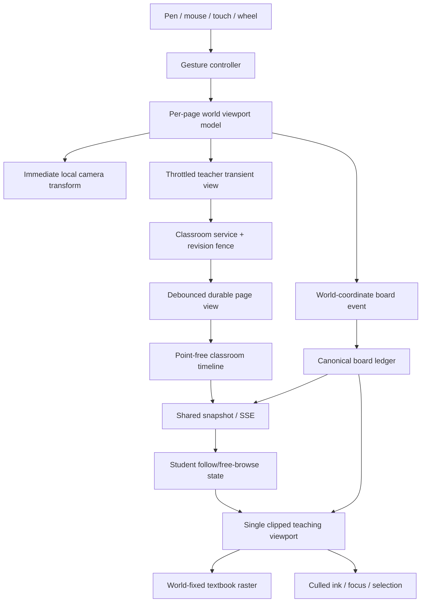
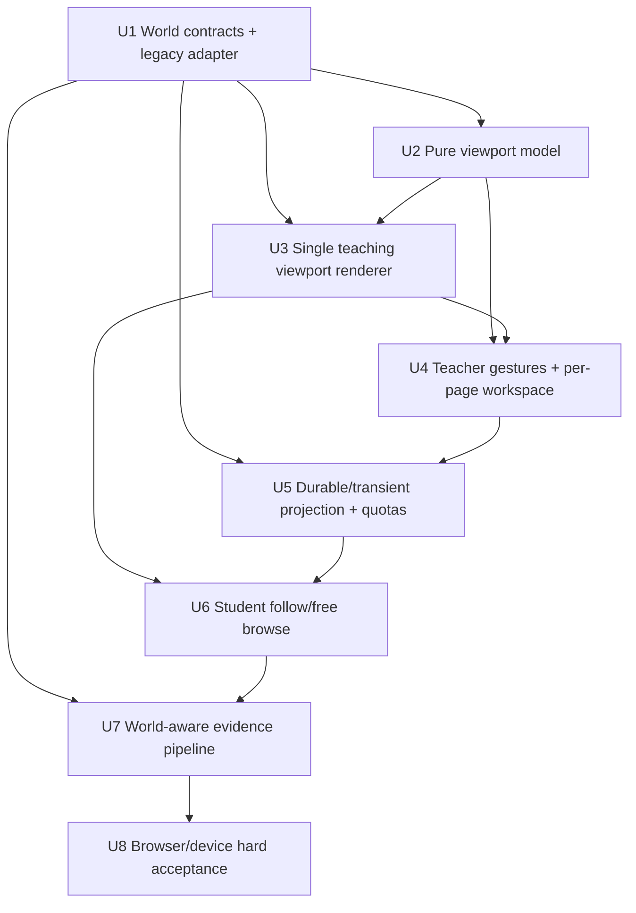
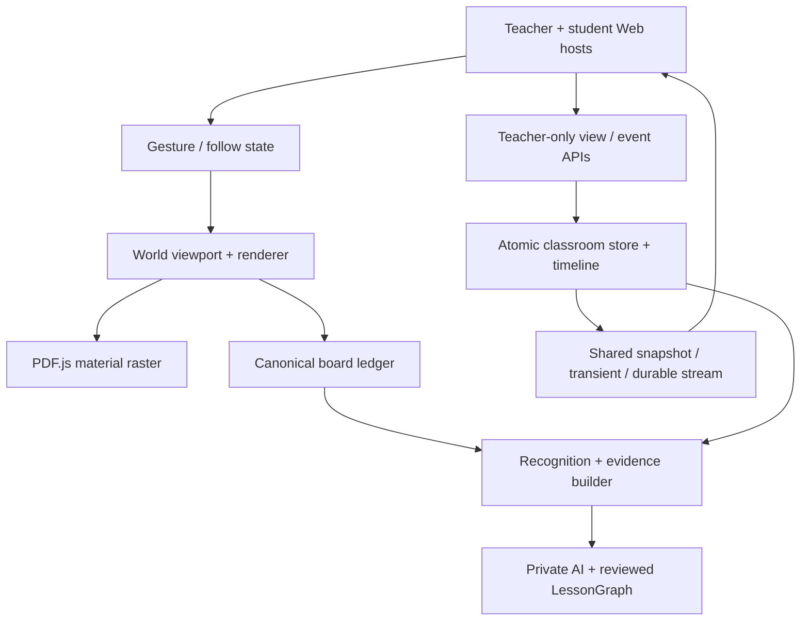

# feat: Add Per-Textbook-Page Infinite Teaching Canvases

## Overview

把已经完成的教师/学生双 Web 课堂从“PDF 内层滚动区 + 固定归一化 SVG 板书”增量改造成单一教学视口：每个教材页拥有一张独立的无限点阵画布，教材页固定在该页世界坐标的原点附近，页内标注和页外推导在同一坐标系中一起平移、缩放和同步。教师用笔或鼠标书写，用双指或空格拖动平移，用捏合或滚轮缩放；学生默认跟随教师，也可保持自己的自由浏览视角并明确返回。

本计划只改造教材/板书空间、视角同步、来源定位和相关资源边界。既有公式识别、教师单向音频、字幕、学生私人解释/总结/练习和 `LessonGraph` 审核继续复用，只有它们依赖的空间引用需要兼容世界坐标。已执行的 `docs/plans/2026-07-18-001-feat-middle-school-math-multimodal-classroom-plan.md` 不回滚、不覆盖。

## Problem Frame

现有课堂已经能同步真实教材、页码、缩放、焦点和板书，但主教学区域仍由外层页面、教材 frame、可滚动 page layer 和固定 `viewBox="0 0 1000 625"` 的 SVG 组成。教材的 PDF 尺寸、板书的 0–1 归一化坐标和浏览器滚动各自维护空间，导致大块空白、双重滚动、缩放层级不一致，也无法自然地在教材页外继续推导。

目标是让教师和学生看到同一张“教材页 + 四周点阵板书”的教学桌面，同时保留已验收课堂事实链：笔画只存一份，公式/AI/LessonGraph 仍能定位原始证据，重连后仍能恢复，学生自由浏览不会被教师视角强拉。（见源需求 R1-R5、R29-R32。）

## Requirements Trace

- **R1 单一教学视口：** 教师端和学生端都只有一个裁剪视口，没有教材内层滚动；教材初始居中，平移后可离开屏幕中心。
- **R2 同一坐标空间：** 教材、页内标注、页外板书、确认焦点和来源高亮使用同一页世界坐标；旧 scratch 能确定性投影到关联页，不再要求进入独立白板。
- **R3 输入与缩放：** 笔/鼠标书写，双指或空格拖动平移，捏合/滚轮以锚点缩放；点阵连续且缩放层级稳定。
- **R4 每页独立恢复：** 每个 material/page 独立保存笔画、视角中心和缩放；翻页、刷新、服务重启后恢复。
- **R5 学生自主浏览：** 学生默认跟随；自由浏览时继续收共享板书但不应用教师页面/视角，只提示“老师视角已更新”；一键返回最新教师视角。
- **R29-R31 共享投影与焦点：** 教师共享视角包含页、世界中心和缩放；学生不能修改共享状态；焦点经教师确认后以稳定世界区域发布；重连不丢来源关系。
- **R32 教材异常：** 无教材、下载失败、PDF decode/render 失败都有可操作状态；点阵和已同步板书继续可用，恢复后重新对齐。
- **R6-R9、R15-R23 空间兼容：** 公式识别、框选、解释、总结、练习和 `LessonGraph` 能读取新世界区域，也能读取历史归一化区域；不改变其信任、隐私和审核规则。
- **R24-R28 连续性与冻结边界：** 课堂权限、删除、HTTPS、外部 AI 最小化、会议/阅读冻结规则不变；改造不得把学生本地视角或私人选择广播到共享流。

## Scope Boundaries

- “无限”是可持续平移的 UX，不是无界数值和无界存储；服务端仍执行坐标、点数、速率、页/课堂容量限制。
- 一个教材页对应一张独立世界，不把整本书铺在同一画布，不允许单独拖动教材对象。
- 不增加对象选择、编组、便签、图片拖入、多人共同编辑、橡皮擦对象模型或通用设计白板能力。
- 学生只浏览、框选和触发私人后处理，不写共享笔画。
- 不新增视频，不改动教师单向音频/字幕方案，不重做已经验收的公式识别和 AI 生成逻辑。
- 不把真实电子纸、AI Pen/Capture Surface 或公网远程课堂纳入本计划硬门槛；本阶段先在两个 Web 入口和 iPad/桌面浏览器上验收。
- 不把未声明许可的 ChinaTextbook 教材纳入可分发构建；真实教材只保留本地 demo，自动验收继续使用有权分发的讲义。

### Deferred to Separate Tasks

- 外部 ASR/AI 供应商的保留期限、禁止训练、删除传播和证明：沿用多模态计划的隐私轨道单独落地；课堂本地删除不能被表述为已删除第三方副本。
- 通用白板对象模型、空间索引服务端查询、跨页画布、电子纸视口和远程公网媒体：未来独立规划。

## Context & Research

### Relevant Code and Patterns

- `packages/runtime-schema/src/index.ts`：`ClassroomTeacherView` 当前只有页和 25%–300% zoom；`ClassroomBoardEvent` 依赖 `InkLoopStroke` 的 0–1 `x_norm/y_norm`；`ClassroomConfirmedFocus`、recognition 和 evidence selection 也只有 `bbox_norm`。这是主要契约迁移面。
- `examples/ai-annotation-demo/src/classroom/board-renderer.ts`：固定 1000×625 SVG 并按 surface 过滤路径；`BoardModel` 的 sequence/gap/preview 增量语义应保留，但坐标和可见路径管理需要替换。
- `examples/ai-annotation-demo/src/classroom/textbook-renderer.ts`：PDF.js 页按容器直接改变 layer 宽高，适合嵌套滚动，不适合世界变换；其 render revision 和 PDF destroy 竞态保护可复用。
- `examples/ai-annotation-demo/src/classroom/classroom-follow-state.ts`：已有 `follow_teacher/free_browse` 状态机和 pending teacher update，作为学生视角行为基线扩展成每页本地 viewport。
- `examples/ai-annotation-demo/server/classroom-store.ts`、`classroom-service.ts`、`classroom-handler.ts`：课堂级串行写、原子 metadata、append-only timeline、teacher view revision fence、teacher-only projection API 和 SSE snapshot/cursor 是唯一同步路径。
- `examples/ai-annotation-demo/scripts/smoke-education-classroom-browser.ts`：已有 1 教师 + 3 学生、晚加入、自由浏览、重启、隐私、删除和延迟验收；应在原脚本上扩展，不建立第二套演示事实。
- `examples/ai-annotation-demo/src/surface/page-layout.ts`：已有 PDF fit/zoom 纯计算可用于初始 fit，但新的世界/屏幕变换必须独立于阅读场景全局状态。

### Institutional Learnings

- `docs/solutions/integration-issues/runtime-sync-canonical-path-2026-07-02.md`：课堂 board ledger 继续是笔画唯一事实源；世界坐标迁移不能另建一份“无限画布笔画”账本。
- `docs/solutions/integration-issues/obsidian-ink-rendering-stability-2026-06-28.md`：本地落笔结束后不要整棵重绘；临时笔迹应平滑转为已提交路径，远端增量追加，只有 gap/snapshot 才重建可见投影。
- `docs/reviews/2026-07-19-education-classroom-phase-1-implementation.md`：timeline 只引用 board event，不复制 points；该不变量继续成立。
- `docs/reviews/2026-07-20-education-classroom-unit-8-hard-acceptance.md`：`x² + 4x - 5 = 0` 是当前规范验收题，本计划的空间回归继续用同一案例。

### External References

- [MDN: `touch-action`](https://developer.mozilla.org/en-US/docs/Web/CSS/touch-action)：教学视口显式接管触控，且只在视口内阻止浏览器默认平移/缩放。
- [MDN: Pointer events pinch zoom gestures](https://developer.mozilla.org/en-US/docs/Web/API/Pointer_events/Pinch_zoom_gestures)：使用活动 pointer 集合、距离和中点处理双指缩放，并覆盖 pointer cancel/capture 丢失。
- [MDN: `WheelEvent`](https://developer.mozilla.org/en-US/docs/Web/API/WheelEvent)：wheel delta 需要按 `deltaMode` 归一化，缩放保持指针下的世界锚点不动。
- [MDN: `PointerEvent.pointerType`](https://developer.mozilla.org/en-US/docs/Web/API/PointerEvent/pointerType)：用 `pen`、`touch`、`mouse` 仲裁书写与导航，而不是根据 User-Agent 猜设备。

## Key Technical Decisions

| Decision | Chosen direction | Rationale |
| --- | --- | --- |
| 世界单位 | PDF.js 在 scale=1 时的页面单位；100% 时 1 世界单位映射 1 CSS px | 与 PDF 原生页尺寸稳定对应，独立于 DPR 和浏览器窗口 |
| 视角表达 | `{center_x_world, center_y_world, zoom_scale}`，不是屏幕像素 pan | 不同尺寸教师/学生屏幕共享相同中心与尺度，同时允许各自显示更多边缘 |
| 教材位置 | 页面 base box 的中心固定在世界 `(0,0)` | 初始 fit 居中；平移改变相机，不移动教材事实 |
| 笔画契约 | 新增 versioned classroom board record 的 world geometry 分支；旧 normalized record 由只读适配器投影 | 不改写通用 `InkEvent`/`InkLoopStroke`，不把页外坐标伪装成 0–1，也不双写两份笔画 |
| 视角同步 | 交互中节流 transient projection；手势结束/静止后写一份 durable view | 跟随足够实时，同时不把每个移动像素写进 timeline |
| 每页恢复 | 服务器保存 material/page → durable viewport；snapshot 返回当前教师视角和页视角投影 | 刷新与进程重启后仍能回到每页上次状态 |
| 来源坐标 | board/focus/selection 使用 world region；教材来源按与教材 box 的交集派生 `bbox_norm` | 页外板书可定位，页内教材来源仍兼容既有 AI 和审核展示 |
| 渲染 | 单一 clipped viewport + 一个 world transform；PDF、ink、focus 共用 transform | 消除内层滚动和多坐标层漂移 |

1. **世界坐标按 surface 分区。** 每个 `{material_id, page_index}` 是独立 `classroom_page_world_v1`；页面 base box 为 `[-pageWidth/2, -pageHeight/2, pageWidth, pageHeight]`。坐标不跨页比较，surface ref 始终与 world geometry 一起出现。
   `pageWidth/pageHeight` 来自 material 发布时由服务端 PDF.js 在 scale=1、应用页面 rotation 后记录的不可变 page geometry；教师和学生只消费该权威元数据，不各自根据 canvas CSS 尺寸猜测。历史 material 缺 page geometry 时由服务端从原 PDF bytes 懒加载派生并原子缓存，content hash/material ID 不变。
2. **屏幕/世界变换只有一份纯模型。** screen → world、world → screen、zoom-at-anchor、pan、fit-page、world bbox 交集和安全 clamp 放进无 DOM 模块。教师、学生、笔画、框选、焦点和 source jump 都调用它，禁止各自手写变换公式。
3. **旧数据不批量重写。** 历史 `textbook_page` 归一化笔迹映射到教材 base box；历史 linked scratch 映射到教材右侧固定的 legacy scratch box；没有教材关联的 `teacher_board` 保留白板兼容视图。适配只发生在读取/渲染/evidence 构建边界，原 JSONL sequence、event ID 和 digest 不变。
4. **新世界笔迹是唯一新事实，通用 AI Pen 合约保持不变。** 新增 versioned classroom board record union：legacy 分支继续包裹当前 `InkEvent`/`InkLoopStroke`，world 分支使用课堂专属 world points/bbox 和相同稳定 event/stroke identity。新事件只写 world 分支，不制造占位 `bbox_norm`；timeline 仍只引用 event ID、sequence 和 surface。会议、阅读和 AI Pen 消费的通用 `InkEvent`/`InkLoopStroke` 不因课堂无限画布改变。
   `ClassroomPreview` 使用相同的 legacy/world geometry discriminator，但仍是有 TTL 的瞬时数据，不进入 board ledger 或 timeline。
5. **教师 transient 和 durable revision 分离。** 教师本地每帧更新；最多 12 Hz 向服务端发布 transient 视角，带 interaction ID、单调 transient sequence 和 durable base revision。服务端只转发最新有效 transient，静止 200 ms 或收到显式 final 后，以 interaction/final 幂等键将最后一个合法视角合并成一次 durable teacher view；旧 base revision、乱序 sequence 和已结束/删除课堂被拒绝。服务重启最多丢失尚未静止的瞬时手势，不丢最后 durable view；客户端超时重试同一个 final 不追加第二条 timeline entry。
6. **学生状态分三层。** `teacher_view` 是最新共享投影，`page_viewports` 是该学生设备本地每页视角，`visible_view` 由 follow mode 决定。自由浏览只写 localStorage，不调用共享 API；共享 board events 始终增量应用。返回教师视角时丢弃当前页的临时 visible projection、复制最新 teacher view 并恢复 follow。
7. **焦点和框选成为世界区域。** 新确认焦点、识别 bbox、学生 selection 和 ink source ref 携带 surface + world bbox。区域落在教材内部时 evidence builder 额外派生 material `bbox_norm`；完全页外时教材 source 保留 material/page 且明确为 page context，board source 使用准确 world bbox，不伪造页内 bbox。
8. **视觉缩放与 PDF 清晰度解耦。** CSS/world transform 立即响应手势；PDF renderer 在 zoom 稳定后异步请求匹配 DPR 的栅格，保留上一张 bitmap 直到新 revision 完成，并限制 raster scale，避免捏合时重复 decode 和闪白。
9. **手势规则可预测。** pen 始终书写；教师鼠标左键书写，按住 Space 再拖动才平移；两个 touch pointer 的中点/距离同时控制平移和缩放；wheel 以指针为锚缩放；学生在显式“框选”模式下才用单指/鼠标拖动选择，避免与浏览手势冲突。`pointercancel`、窗口失焦和 capture 丢失都结束临时状态但不提交半笔。
10. **视口之外不等于不存在。** 客户端按 world bbox 进行 viewport + overscan culling，保留 BoardModel/账本完整 sequence；返回区域时重新挂载路径。culling 不删除事实、不改变 recognition/source refs。

## Performance and Capacity Budgets

这些是受信任 LAN 原型的强制保护和验收预算，不是学校规模生产承诺：

- world 坐标和 bbox 必须是有限数，绝对值不超过 `1,000,000` world units；zoom 连续范围为 50%–400%。
- 单笔最多 4,096 points、序列化 world geometry 最多 128 KiB；超长连续书写由客户端按时间顺序分段并共享 stroke group，不静默截点。
- teacher view transient 最多 12 次/秒；board preview 最多 15 次/秒；committed stroke 使用每教师 20 次/秒、burst 40 的 token bucket。
- 每页最多 5,000 committed strokes / 8 MiB geometry；每课堂最多 10,000 strokes / 16 MiB geometry。达到上限后保留已提交事实，拒绝新提交并给教师明确的可恢复提示。容量取序列化后的 canonical record bytes，不以客户端声明值计数。
- 正常交互时 DOM/SVG 只挂载 viewport + 一屏 overscan 内的路径，目标上限 3,000 个可见 path；超出时提示缩小范围或降低细节，不整页冻结。
- 平移/缩放本地反馈以 60 fps 为目标；教师 durable view 到跟随学生 P95 ≤ 500 ms；完整 committed stroke 到学生渲染继续保持 P95 ≤ 300 ms。
- PDF raster DPR 及 scale 设上限，手势稳定后再精化；教材渲染失败不能阻塞点阵、板书同步或视角操作。

## Open Questions

### Resolved During Planning

- **世界坐标单位：** 使用 PDF.js scale=1 页面单位，页面中心为世界原点；zoom 是 CSS px/world unit 的倍率。
- **页面几何权威来源：** material 发布时由服务端记录每页应用 rotation 后的 scale=1 width/height；历史 material 懒派生并缓存，所有 host/evidence adapter 使用同一 metadata。
- **教师 pan 的持久表达：** 保存 camera center + zoom，而不是与具体视口尺寸绑定的 screen translation。
- **旧 normalized strokes：** 原课堂 record 原样保留，通过 surface-aware 适配器投影；不做启动时 destructive migration，也不修改通用 `InkEvent`/`InkLoopStroke`，新笔迹写 versioned world record。
- **教师视角写入频率：** transient latest-wins + 200 ms idle/explicit final durable snapshot；timeline 只记 durable view。
- **每页视角保存：** 服务端 metadata 保存教师 page viewport projection；学生自由浏览的 page viewport 只在本人浏览器 localStorage 保存。
- **页外来源：** world region 是 board/focus/selection 的权威空间来源；教材来源由 world region 与教材 box 交集派生，页外仅保留 page context。
- **无教材/渲染失败：** 允许继续使用点阵和已有板书；禁止发布不存在页，UI 显示加载/上传或重试入口。
- **资源边界：** 使用本计划的有限坐标、点/字节、速率、页/课堂 quota 和 culling 预算；超限返回稳定错误且不破坏已提交内容。

### Deferred to Implementation

- **路径空间索引实现：** 先用按 surface 的 bbox bucket/轻量索引满足 3,000 可见 path 门槛；是否需要 R-tree 由 fixture profile 决定，不改变 world contract。
- **笔迹采样阈值：** 用 PointerEvent coalesced samples、距离/时间/压力变化保点；具体阈值由鼠标和 Apple Pencil 实测调整，但 4,096/128 KiB 服务端上限不变。
- **触控板 wheel 设备差异：** contract 只规定归一化 wheel anchored zoom；Safari/Chrome 的 delta 灵敏度曲线在真实设备验收中校准，不用 User-Agent 分支。
- **PDF raster cache 大小：** 根据两页往返和 200 页材料内存 profile 决定 LRU 页数；必须在 material 切换/destroy 时释放。
- **极端密集笔迹降级外观：** 若 3,000 visible path 仍不足，实施中比较 path batching 与分层 bitmap cache；无论选择哪种，都不能改变 source 定位和原始账本。

## Output Structure

```text
examples/ai-annotation-demo/src/classroom/
  classroom-world-model.ts             # 浏览器 camera/grid/visible-rect 纯模型
  classroom-world-model.test.ts
  classroom-gesture-controller.ts       # pointer/touch/wheel 仲裁
  classroom-gesture-controller.test.ts
  classroom-teaching-viewport.ts        # 单一视口组合与增量/culling
  classroom-teaching-viewport.test.ts
examples/ai-annotation-demo/shared/classroom/
  classroom-spatial.ts                  # browser/server 共用 geometry/legacy adapter
  classroom-spatial.test.ts
```

这是预期增量结构；其余改动落在现有 schema、renderer、teacher/student host、store/service/handler 和验收脚本中。

## High-Level Technical Design

> *This illustrates the intended approach and is directional guidance for review, not implementation specification. The implementing agent should treat it as context, not code to reproduce.*



View semantics by mode:

| Student mode | Teacher page/view update | Shared stroke update | Student local pan/zoom | Return action |
| --- | --- | --- | --- | --- |
| `follow_teacher` | Immediately apply valid transient/durable projection | Always apply | Enters `free_browse` | Not shown |
| `free_browse` | Store latest teacher projection; keep visible page/view; show notice | Always apply, including off-screen/page events | Update per-page local viewport | Atomically apply latest teacher page/center/zoom/focus |
| reconnect after free browse | Restore local visible page/view, then mark pending if server teacher revision is newer | Rebuild ledger then continue incrementally | Remains local | Same as above |

## Phased Delivery

### Phase 0 — Contract and compatibility gate

- Units 1–2 establish discriminated geometry, spatial refs, pure transforms and legacy characterization without changing visible classroom layout.

### Phase 1 — Teacher single viewport

- Units 3–4 replace nested rendering and input on the teacher Web; completion means real textbook, page-external writing and per-page restore work locally and through the canonical API.

### Phase 2 — Student follow and evidence parity

- Units 5–7 add durable/transient server projection, student view modes, world-aware recognition/evidence/source jumps and resource protections.

### Phase 3 — Multi-browser and device acceptance

- Unit 8 extends the hard acceptance to 1 teacher + 3 students, restart/failure/security/performance and desktop/iPad HTTPS checks.

## Implementation Units



- [x] **Unit 1: Define world-coordinate classroom contracts and legacy projection**

**Goal:** 为新笔画、视角、焦点、框选和来源建立稳定 world contract，同时保证历史 normalized 课堂无需重写即可读取。

**Requirements:** R1-R4, R6-R9, R19, R29-R31

**Dependencies:** 已完成的多模态课堂 Unit 1–8 基线

**Files:**
- Modify: `packages/runtime-schema/src/index.ts`
- Modify: `packages/runtime-schema/src/runtime-schema.test.ts`
- Modify: `packages/runtime-schema/README.md`
- Create: `examples/ai-annotation-demo/shared/classroom/classroom-spatial.ts`
- Create: `examples/ai-annotation-demo/shared/classroom/classroom-spatial.test.ts`
- Create: `examples/ai-annotation-demo/src/classroom/classroom-world-model.ts`
- Create: `examples/ai-annotation-demo/src/classroom/classroom-world-model.test.ts`
- Modify: `examples/ai-annotation-demo/src/classroom/board-renderer.test.ts`
- Modify: `examples/ai-annotation-demo/server/classroom-evidence.test.ts`
- Modify: `examples/ai-annotation-demo/server/classroom-materials.ts`
- Modify: `examples/ai-annotation-demo/server/classroom-materials.test.ts`
- Modify: `examples/ai-annotation-demo/server/classroom-store.ts`
- Modify: `examples/ai-annotation-demo/server/classroom-store.test.ts`
- Modify: `examples/ai-annotation-demo/server/classroom-service.ts`
- Modify: `examples/ai-annotation-demo/server/classroom-service.test.ts`
- Modify: `examples/ai-annotation-demo/server/classroom-handler.ts`
- Modify: `examples/ai-annotation-demo/server/classroom-handler.test.ts`

**Approach:**
- 增加 finite world point/bbox、page viewport 和 spatial region 类型；新增 versioned classroom board record union，legacy 分支继续接受当前 `ClassroomBoardEvent` shape，world 分支使用课堂专属 geometry。不要放宽或改写共享 `InkEvent`/`InkLoopStroke` 的 0–1 不变量。新 shape 必须带 `classroom_page_world_v1` 和 matching surface。
- material metadata 增加不可变的 per-page base geometry（应用 PDF rotation 后的 scale=1 width/height）。publish 时提取；历史 material 在读取时由原 bytes 懒派生并原子缓存。legacy adapter 不允许依赖客户端 viewport 或 CSS canvas 尺寸。
- 扩展 teacher view 为 current page viewport，并为 snapshot 增加教师每页 durable viewport projection；zoom validator 对新 world view 使用 0.5–4.0，旧 `zoom_percent` 继续兼容读取。
- confirmed focus、recognition、evidence selection 和 ink source ref 接受 discriminated spatial region；`material_page.bbox_norm` 保留为教材内部来源。
- 在 browser/server 均可导入、无 DOM/Node 副作用的 shared spatial 模块实现 region intersection/union/canonical serialization 和 legacy adapter：textbook normalized → page base box，linked scratch → page 右侧 deterministic legacy box，teacher board → legacy 1000×625 fallback world。adapter 不修改 event ID、sequence、time 或原文件；浏览器 camera/grid 逻辑留在 `src/classroom/classroom-world-model.ts`。
- `ClassroomPreview` 与 committed board record 使用同一 geometry discriminator；world preview 通过既有 TTL/revision 规则替换，永不持久化。
- 保证 timeline entry 仍为 point-free board ref；schema 文档明确新旧 branch 的写入边界和禁止双写规则。

**Execution note:** 先锁定当前 JSONL/snapshot fixture 的 characterization tests，再开放新 world branch。

**Patterns to follow:**
- `validateClassroomBoardEvent` 的运行时边界校验和 path-specific issues。
- `runtime-sync-canonical-path` 的单一事实与兼容投影原则。

**Test scenarios:**
- Happy path：page width 600、height 800 时，world 原点映射页中心，页角和页外负/正坐标 round-trip 误差在浮点容差内。
- Compatibility：现有 textbook normalized stroke `[0,0]→[1,1]` 投影到教材 base box 对角线；原序列化事件不被改写。
- Material geometry：横向/纵向/旋转页面由服务端记录正确 base width/height；历史 material 首次读取派生后重启结果一致。
- Compatibility：linked scratch 的同一 normalized bbox 在重启前后投影到同一页右侧 legacy box；无链接 teacher board 仍能在 fallback world 显示。
- Validation：NaN、Infinity、越过 ±1,000,000、负尺寸 bbox、world geometry 与 surface page 不匹配、同时出现 legacy/world 两份 geometry 都被拒绝。
- Preview：world preview 通过 validation 和 transient stream 后可替换相同 client/revision 路径，但 snapshot/timeline/store 中没有 preview geometry。
- Source parity：页内 world region 可派生准确 material `bbox_norm`；完全页外 region 不生成伪造页内 bbox，但保留 page context 与准确 ink world region。
- Public-contract regression：会议、阅读和 AI Pen 的 `InkEvent`/`InkLoopStroke` validator 与导出类型不变；只有课堂 record union 新增 world 分支。
- Timeline invariant：world board record 写入的 timeline projection 不含 points、stroke 或重复 geometry。

**Verification:**
- 新旧课堂事件、snapshot、focus、recognition 和 evidence 都能通过 runtime validation；旧 fixture digest 与 sequence 不变。

- [x] **Unit 2: Build the pure per-page viewport and camera model**

**Goal:** 建立所有教师/学生/renderer 共用的 screen↔world、pan、anchor zoom、fit 和每页视角状态机。

**Requirements:** R1-R5, R29-R31

**Dependencies:** Unit 1

**Files:**
- Modify: `examples/ai-annotation-demo/src/classroom/classroom-world-model.ts`
- Modify: `examples/ai-annotation-demo/src/classroom/classroom-world-model.test.ts`
- Modify: `examples/ai-annotation-demo/src/surface/page-layout.ts`
- Modify: `examples/ai-annotation-demo/src/surface/page-layout.test.ts`

**Approach:**
- 以 camera center、zoom scale、CSS viewport size 计算唯一 affine transform；DPR 仅用于 raster 清晰度，不进入世界事实。
- zoom-at-anchor 在 clamp 前后保持鼠标/双指中点下的 world point 不动；pan 使用 screen delta/zoom 换算 world center。
- 初次进入页时按教材 base box + 安全边距 fit；之后从 material/page viewport map 恢复。容器 resize 保持 world center/zoom，不重新 fit，除非用户明确选择“适合页面”。
- 点阵间距使用 1/2/5×10ⁿ 层级选择，在屏幕约 16–40 px 的区间切换；major/minor dots 共用 world origin，缩放切换不漂移。
- 为 visible world rect 和一屏 overscan 提供纯计算，供 path culling、PDF raster 和 source jump 使用。

**Execution note:** 纯数学模块 test-first；DOM 接线前把不变量覆盖完整。

**Patterns to follow:**
- `src/surface/page-layout.ts` 的纯函数、clamp 和 fit 模式测试。

**Test scenarios:**
- Happy path：多组 viewport/page 尺寸下 screen→world→screen round-trip；不同 DPR 结果相同。
- Anchor zoom：在 50%、100%、400% 和 clamp 边界缩放时，指定 screen anchor 对应 world point 保持不动。
- Pan：相同 screen drag 在 50% 与 200% 下产生正确成比例的 world center delta，且不越过安全中心范围。
- Page restore：page 1 和 page 2 各自 pan/zoom，往返后恢复各自 center/zoom；新页只执行一次 initial fit。
- Resize：桌面缩到 iPad 尺寸时 center/zoom 不变，显示范围变化但教材/笔迹相对位置不变。
- Grid：连续跨过缩放层级时 major/minor dot 锚定同一 world origin，间距始终落在视觉预算范围。
- Error path：0×0 viewport、无效页面尺寸和非有限输入返回明确不可渲染状态，不产生 CSS NaN。

**Verification:**
- renderer、gesture 和 follow state 不需要再实现自己的坐标公式；相同 world view 在不同 viewport 上中心/尺度语义一致。

- [x] **Unit 3: Compose textbook, dot grid, ink, focus, and selection in one viewport**

**Goal:** 移除嵌套滚动和固定 1000×625 viewBox，使用一个裁剪教学视口组合教材、点阵和所有 overlay，并按可见世界增量渲染。

**Requirements:** R1-R3, R31-R32

**Dependencies:** Units 1–2

**Files:**
- Create: `examples/ai-annotation-demo/src/classroom/classroom-teaching-viewport.ts`
- Create: `examples/ai-annotation-demo/src/classroom/classroom-teaching-viewport.test.ts`
- Modify: `examples/ai-annotation-demo/src/classroom/textbook-renderer.ts`
- Modify: `examples/ai-annotation-demo/src/classroom/textbook-renderer.test.ts`
- Modify: `examples/ai-annotation-demo/src/classroom/board-renderer.ts`
- Modify: `examples/ai-annotation-demo/src/classroom/board-renderer.test.ts`
- Modify: `examples/ai-annotation-demo/src/classroom/classroom.css`

**Approach:**
- 构建唯一 `overflow: hidden` viewport；点阵为 camera-aware 背景，world layer 使用一份 transform，教材 canvas、committed/preview ink、focus、selection/source highlight 均放在同一 world layer。
- TextbookRenderer 输出 scale=1 的 base page size 和可替换 raster，不再改变可滚动 layer 尺寸；zoom idle 后异步精化 raster，revision guard 防止旧页覆盖新页。
- BoardModel 保留完整 sequence、previews 和 surface facts；renderer 为每条 geometry 缓存 world bbox，只挂载当前 surface 且与 overscan 相交的路径。snapshot/gap 才允许重建，local commit/remote event 增量更新。
- 线宽默认保持稳定屏幕观感，但 geometry 与 bbox 是 world facts；highlighter/pen 的视觉差异和 persisted style 不因重挂载丢失。
- 空材料显示“加载内置教材/上传 PDF”；下载/decode/render 失败保留 grid/ink 并显示原因、重试和当前 page context，成功后复用同一 transform 自动对齐。

**Execution note:** 先为当前 renderer 的 sequence、preview replacement、source focus 和 surface filtering 加 characterization，再替换 DOM 组合。

**Patterns to follow:**
- `TextbookRenderer.renderRevision`/`destroy` 的异步竞态保护。
- `BoardModel.applyBoardEvent` 的 duplicate/gap 语义。
- `obsidian-ink-rendering-stability` 的 local mutation 不整页重绘原则。

**Test scenarios:**
- Happy path：教材 base box、页内笔画、页外笔画和 focus 在 pan/zoom 后共享同一 transform，屏幕采样点保持对齐。
- Layout：教师/学生 DOM 只有一个教学 viewport；不存在可滚动 textbook inner layer，页面外层不会因画布世界尺寸增长。
- Incremental：本地 preview → committed event 只替换对应 path；远端单事件只追加；duplicate 不增加 path；gap 请求 snapshot。
- Culling：路径离开 overscan 后从 DOM 卸载但仍在 BoardModel；返回原区域后路径和 source focus 可恢复，sequence 不变。
- PDF race：快速翻页/缩放时迟到 raster 不覆盖当前页；旧 bitmap 保持到新 raster ready，失败时 grid/ink 不消失。
- Empty/error：无教材、404 PDF、decode error、page out of range 都显示可操作状态；不存在页不能成为 published teacher view。
- Performance fixture：5,000 page strokes 中只有可见范围进入 DOM，目标不超过 3,000 path，pan/zoom 不触发全量 PDF decode。

**Verification:**
- 常见桌面/iPad viewport 首屏教材可见且无无意义顶部空白、双滚动或层级错位；缩放期间所有视觉层保持空间一致。

- [x] **Unit 4: Add teacher writing, pan, pinch, wheel zoom, and per-page workspace**

**Goal:** 让教师在单一视口内可靠地书写和导航，并把每页 world stroke/view 送入既有课堂同步路径。

**Requirements:** R3-R4, R29-R32

**Dependencies:** Units 2–3

**Files:**
- Create: `examples/ai-annotation-demo/src/classroom/classroom-gesture-controller.ts`
- Create: `examples/ai-annotation-demo/src/classroom/classroom-gesture-controller.test.ts`
- Modify: `examples/ai-annotation-demo/src/classroom/teacher-main.ts`
- Modify: `examples/ai-annotation-demo/src/classroom/teacher-main.test.ts`
- Modify: `examples/ai-annotation-demo/src/classroom/classroom-client.ts`
- Modify: `examples/ai-annotation-demo/src/classroom/classroom.css`

**Approach:**
- Gesture controller 管理 active pointers、pointer capture、Space key、wheel normalization 和 interaction lifecycle，输出 write/pan/zoom/cancel 意图，不直接访问课堂 API。
- `pen` down 创建 world stroke；mouse left 默认相同；Space+mouse drag 只改变 camera；两个 touch pointers 从当前笔迹状态独立进入 pan/pinch，不允许 touch 误提交笔迹。
- 键盘可聚焦 viewport 支持 `+/-` 锚定中心缩放、方向键平移、`0`/“适合页面”回到教材，并提供可见 focus ring 和屏幕阅读器可读的页码/缩放/跟随状态；所有工具按钮满足触控目标尺寸，Space 手势不拦截输入框/按钮默认行为。
- 本地 camera 每 animation frame 更新；teacher host 先通过现有 teacher-view 路径只提交 gesture final/durable view，Unit 5 再接入 transient coalescer。翻页先 final 当前页 view，再恢复目标页 durable/default view，保证该单元可在 transient 服务尚未落地时独立验证。
- 笔迹使用 coalesced pointer samples 转 world points；超过点/字节上限前按顺序分段，保留 group/time 连续性；post 失败保留本地 failed stroke 和重试，不因 view 改变而重算 geometry。
- scratch 控件迁移为当前页周围画布的 source jump/兼容入口；新书写不再创建独立 scratch surface。旧 linked scratch 通过 Unit 1 adapter 可见。
- 视口显式 `touch-action: none`，但只在 viewport 处理 owned gestures；工具栏和页面其余区域保留正常浏览器行为。

**Execution note:** 手势仲裁 test-first，特别覆盖曾出现的“开始上课后画笔不能画”回归。

**Patterns to follow:**
- 当前 teacher host 的 optimistic preview、failed stroke retry 和 live-status guard。
- `classroom-client.ts` 的 credential、abort lifecycle 和稳定错误处理。

**Test scenarios:**
- Writing：live 课堂中 pen/mouse 左键在教材内外都提交 world geometry；draft/ended/student 状态不能提交。
- Regression：点击“开始上课”后 frame overlay、PDF canvas 和 focus layer 都不截断 pointerdown，首笔成功进入 ledger。
- Arbitration：pen+触摸手掌、双 touch、Space+mouse、普通 mouse、wheel 分别只触发预期 write/pan/zoom；touch 不产生共享 stroke。
- Accessibility：键盘能聚焦 viewport、平移、缩放和回到教材；工具栏可读标签/状态正确，Space 在文本输入和按钮上不触发 canvas pan。
- Anchor zoom：wheel 和 pinch 中点下的教材/笔迹 world point 在屏幕保持不动；50%/400% clamp 无跳变。
- Cancellation：pointercancel、lost capture、window blur、Space keyup 和第二指中途离开清理临时状态；半笔不提交，最后 durable camera 不出现 NaN。
- Page lifecycle：两页分别写字并设置 view，往返/刷新后恢复；快速翻页会 final 当前 view，不把 page 1 transient 写到 page 2。
- Submission error：429/quota/invalid coordinate 时已提交笔迹保持，本地失败笔迹可重试，UI 显示稳定错误而非清空画布。

**Verification:**
- 教师能用桌面鼠标完整写出规范配方法六行，在 iPad 用 Pencil 书写且双指导航不误画；每页视角和笔迹独立。

- [x] **Unit 5: Persist and stream revision-fenced page views with resource guards**

**Goal:** 让 transient/durable 教师视角、多页恢复和 world 笔迹在服务重启、乱序和恶意/异常输入下保持一致与有界。

**Requirements:** R4-R5, R24-R25, R27-R32

**Dependencies:** Units 1, 4

**Files:**
- Modify: `examples/ai-annotation-demo/server/classroom-store.ts`
- Modify: `examples/ai-annotation-demo/server/classroom-store.test.ts`
- Modify: `examples/ai-annotation-demo/server/classroom-service.ts`
- Modify: `examples/ai-annotation-demo/server/classroom-service.test.ts`
- Modify: `examples/ai-annotation-demo/server/classroom-handler.ts`
- Modify: `examples/ai-annotation-demo/server/classroom-handler.test.ts`
- Modify: `examples/ai-annotation-demo/server/classroom-auth.test.ts`
- Modify: `examples/ai-annotation-demo/src/classroom/classroom-client.ts`
- Modify: `examples/ai-annotation-demo/src/classroom/classroom-client.test.ts`

**Approach:**
- Store metadata 维护 current durable teacher view 和 material/page viewport map；一次课堂 serialize 临界区按“幂等键检查 → timeline append → metadata projection”推进。启动时以 timeline 为权威重放/修复 meta，处理 timeline 已写但 meta 未写；同一 interaction/final 幂等键重试返回原 durable view，不重复追加。旧 metadata 缺 map 时从 current teacher view/initial fit 推导。
- Service 接收 transient interaction，校验 teacher auth、class live、surface/page existence、base revision、sequence、world/zoom bounds；只在内存保留每课堂最新 transient，12 Hz publish，并在 idle/final 合并一次 durable store write。client coalescer 在此单元接入 Unit 4 已完成的 gesture lifecycle，不把节流逻辑塞回 renderer。
- transient SSE 与 durable SSE 明确区分；snapshot 只包含 durable page map。订阅者用 durable revision + transient sequence 拒绝乱序，durable 到达后清除对应 interaction transient。
- world event append 前执行 body、points、geometry bytes、coordinate、rate 和 page/class quota；计数/bytes 在课堂串行临界区更新并在 restart 从 ledger 校验/重建，不能只信客户端或可漂移 cache。
- stable errors 区分 coordinate invalid、stroke too large、rate limited、page quota、classroom quota、stale view 和 missing page；handler 不回显文件路径、凭证或请求正文。
- deletion/tombstone 清理 transient timers/maps；迟到 idle commit 和事件 append 经 classroom generation/existence fence 拒绝，不复活课堂。

**Execution note:** 先做 store/service failure injection 和 restart characterization，再添加 transient coalescer。

**Patterns to follow:**
- `JsonClassroomStore.serialize`、`writeJsonAtomic`、teacher view revision fence 和 classroom generation fence。
- `classroom-audio.ts` 的 payload/rate limits 与 stable error mapping。

**Test scenarios:**
- Durable view：page 1/page 2 的 final view 各写一次，restart 后 current 和 page map 完整恢复，timeline 只含 durable entries；相同 final 超时重试返回原 revision，不增加 timeline。
- Coalescing：同一 interaction 100 次有效 transient 只转发有界更新并最终写一条 durable view；explicit final 立即写且取消 idle timer。
- Ordering：重复/乱序 transient、stale base revision、旧 durable revision 都被忽略或返回 stable conflict，不覆盖更新视角。
- Authorization：participant/无 credential 不能发布 transient、durable view 或 world stroke；自由浏览 local state 不出现在 shared snapshot/SSE。
- Validation：NaN/Infinity、超界 bbox、>4,096 points、>128 KiB、错误 surface/page 和不存在 material page 被原子拒绝，ledger/timeline/quota counters 都不增加。
- Rate/quota：超过 transient、preview、commit token bucket，或达到 page/class stroke/byte quota 时返回 429/容量错误；等待窗口或切换未满页后可恢复，旧内容仍可读。
- Recovery：分别模拟 view timeline append 后 meta 未写、board append 后 quota metadata 未写、meta 写临时文件后崩溃和损坏 JSONL 尾行；restart 从 timeline/board canonical ledgers 单向收敛且不重复 view/event。
- Deletion race：删除课堂后触发 pending idle timer、迟到 stroke 和 reconnect，均不能写入 tombstone；共享/私有删除不变量保持。

**Verification:**
- 高频平移不会膨胀 timeline；最终每页视角可恢复；所有 world 写入有服务端有限边界且错误可恢复。

- [x] **Unit 6: Extend student follow/free browse in the single viewport**

**Goal:** 让学生在同一无限视口中可靠跟随或自由浏览，始终接收共享笔迹，并在教材异常或重连后恢复正确状态。

**Requirements:** R5, R24, R29-R32

**Dependencies:** Units 3, 5

**Files:**
- Modify: `examples/ai-annotation-demo/src/classroom/classroom-follow-state.ts`
- Modify: `examples/ai-annotation-demo/src/classroom/classroom-follow-state.test.ts`
- Modify: `examples/ai-annotation-demo/src/classroom/student-main.ts`
- Modify: `examples/ai-annotation-demo/src/classroom/student-main.test.ts`

**Approach:**
- follow state 保存最新 teacher durable/transient view、visible view、每页 local viewport、visible/teacher focus 和 pending revision。只要学生主动 pan/zoom/page browse 即进入 free mode；共享 strokes 不参与 mode 判断。
- transient 仅在 follow mode 且 base durable revision 匹配时显示；durable snapshot/SSE 为恢复权威。free mode 收到任何较新 teacher page/view/focus 只更新 pending notice。
- student localStorage 按 classroom + 当前 participant ID（不使用昵称）namespace 保存 schema-versioned free-browse page map；损坏、越界或已删除 material entry 丢弃，credential 清除/课堂删除/另一参与者在同一浏览器加入时一并清除，避免共用设备串状态。
- 学生导航复用 gesture controller 的 touch/wheel/keyboard navigation 子集，但永不启用 shared writing；显式框选仍作为独立工具模式，交给 Unit 7 转成 world source。
- 学生没有 material bytes 或 PDF render 失败时仍能收到/缓存 world strokes 和 teacher view；material 恢复后按同一 base box 对齐，不重新解释 geometry。

**Execution note:** follow state 先写纯状态测试，再接 DOM、gesture navigation 和 SSE。

**Patterns to follow:**
- 现有 `applyTeacherProjection`、`enterFreeBrowse`、`returnToTeacher` 的显式状态转换。
- Unit 3 的同一 viewport/renderer，学生端不维护第二套坐标或 PDF layer。

**Test scenarios:**
- Follow：教师连续 pan/pinch/翻页时 follow 学生应用最新有效 transient/final，教材/ink/focus 对齐；不同屏幕尺寸共享 center/zoom 语义。
- Free browse：学生在 page 2 浏览时教师在 page 1 移动和书写；学生不跳页，但 board event 已进入 model，显示“老师视角已更新”。
- Return：一次操作应用教师最新 page/center/zoom/focus，清除 pending，并继续接收后续 transient。
- Reconnect：follow 学生从 durable snapshot 恢复；free 学生恢复本地 visible view，若教师 revision 更新则 pending；损坏 localStorage 安全回到 follow。
- Shared device：同一浏览器先后用两个 participant credential 加入时，后一个学生看不到前一个学生的 page map、selection 或 pending 状态。
- Student navigation：touch/wheel/keyboard 只更新 local view 并进入 free mode，永不发 board event 或 teacher view API。
- Privacy：学生 page map、selection、practice anchor 和 AI job 不进入 shared stream、teacher snapshot 或其他学生响应。
- Material failure：学生 PDF 404/decode failure 时 board sequence 继续收敛；重试成功后教材与既有 strokes 自动对齐。

**Verification:**
- 三个学生可分别处于 follow/free 状态但拥有相同共享 board ledger；local navigation 从不改变教师或其他学生视角。

- [x] **Unit 7: Migrate recognition, evidence, AI, and source navigation to spatial regions**

**Goal:** 让框选、公式识别、实时解释、总结、练习和教师 `LessonGraph` 全链读取 world/legacy 空间证据，并能跳回真实教材/板书位置。

**Requirements:** R6-R9, R15-R23, R30-R31

**Dependencies:** Units 1, 6

**Files:**
- Modify: `examples/ai-annotation-demo/src/classroom/classroom-recognition-client.ts`
- Modify: `examples/ai-annotation-demo/src/classroom/classroom-recognition-client.test.ts`
- Modify: `examples/ai-annotation-demo/src/classroom/student-main.ts`
- Modify: `examples/ai-annotation-demo/src/classroom/student-main.test.ts`
- Modify: `examples/ai-annotation-demo/server/classroom-recognition.ts`
- Modify: `examples/ai-annotation-demo/server/classroom-recognition.test.ts`
- Modify: `examples/ai-annotation-demo/server/classroom-evidence.ts`
- Modify: `examples/ai-annotation-demo/server/classroom-evidence.test.ts`
- Modify: `examples/ai-annotation-demo/server/classroom-ai.ts`
- Modify: `examples/ai-annotation-demo/server/classroom-ai.test.ts`
- Modify: `examples/ai-annotation-demo/server/classroom-lesson.ts`
- Modify: `examples/ai-annotation-demo/server/classroom-lesson.test.ts`
- Modify: `examples/ai-annotation-demo/server/classroom-handler.ts`
- Modify: `examples/ai-annotation-demo/server/classroom-handler.test.ts`

**Approach:**
- 显式框选模式把 screen drag 转 world bbox + surface；source jump 先切 material/page，再让 camera fit 带 padding 的 world region。旧 normalized source 先经 Unit 1 adapter 转换。
- recognition client 的分组/栅格裁图、server recognition 校验、AI prompt evidence 序列化、lesson candidate fallback、bbox intersection 和 evidence selection 全部改用统一 spatial helper；不得在任一入口直接读取 `event.bbox_norm` 或解构 `x_norm/y_norm`。
- 页内 region 同时产生 material normalized ref 和 world ink ref；跨教材边界仅对交集部分产生 material bbox；完全页外只产生 material page context + world ink ref，不伪造教材区域。
- recognition/AI provider payload 在发送前把 world 笔迹平移/缩放到请求局部坐标，仅发送被选事件和最小裁图；不泄露无限世界绝对位置以外的其他页/区域。
- 公式/字幕 correction、stale fingerprint、private job、三类来源和 LessonGraph trust gate 不改变；fingerprint 对 legacy/world 使用 canonical spatial serialization。

**Execution note:** 先为 legacy/world region 的同一 evidence 语义写双 fixture，再迁移所有直接 normalized 字段消费者。

**Patterns to follow:**
- `classroom-evidence.ts` 的统一 evidence bundle 与 source fingerprint，不为无限画布另建 AI 输入。
- `classroom-recognition.ts` 的服务端 event ID/surface 校验和最小外部 provider payload。

**Test scenarios:**
- Selection/source jump：页内、跨教材边界和完全页外三个 world selection 都生成正确 board/material refs；点击来源切到正确页并聚焦，不只显示内部 ID。
- Recognition：world line grouping 和 crop 只包含同 surface/相交 events；legacy normalized fixture 得到相同公式和视觉 crop。
- Provider minimization：外部 recognition/AI payload 只含选中事件、局部归一化 points、当前教材交集和需要的字幕，不含其他页、学生 local view 或私人结果。
- Pipeline audit：对 classroom frontend/server 做直接 `bbox_norm`、`selection_bbox_norm`、`x_norm/y_norm` 消费扫描；除 legacy adapter、教材-derived norm 和明确旧 fixture 外，新 world 路径无旁路读取。
- AI regression：规范 `x² + 4x - 5 = 0` 的 live explanation、missed segment、summary、practice 和 reviewed LessonGraph 继续使用可信公式/字幕且来源 fingerprint 稳定。
- Staleness/privacy：formula correction 仍使受影响结果 stale；学生 selection/job 不进入 shared stream 或其他学生空间。
- Error path：空 region、不同 surface events、越界/非有限 bbox、缺 page geometry 和 material render failure 返回明确不足/不可用状态，不猜测来源。

**Verification:**
- 所有既有教育后处理能消费 world record，并可回到教材页、准确 world 板书区域和字幕时段；旧课堂输出保持兼容。

- [x] **Unit 8: Extend multi-browser, failure, performance, and device acceptance**

**Goal:** 用同一规范数学课验证教师/学生无限视口、旧数据兼容、重启、错误、资源边界和桌面/iPad 手势，同时保留已有教育、会议和阅读回归门槛。

**Requirements:** 全部本计划要求

**Dependencies:** Units 1–7

**Files:**
- Modify: `examples/ai-annotation-demo/scripts/smoke-education-classroom-browser.ts`
- Modify: `examples/ai-annotation-demo/scripts/analyze-classroom-browser-latency.ts`
- Modify: `examples/ai-annotation-demo/scripts/education-completing-square-acceptance.ts`
- Modify: `examples/ai-annotation-demo/server/education-completing-square-acceptance.test.ts`
- Modify: `examples/ai-annotation-demo/package.json`
- Modify: `docs/project/inkloop-ai-pen-kickstarter/source/education-classroom-completing-square-acceptance-script.md`
- Modify: `docs/project/inkloop-ai-pen-kickstarter/source/education-classroom-validation-runbook.md`
- Create: `docs/reviews/2026-07-20-education-infinite-canvas-acceptance.md`

**Approach:**
- 扩展现有 4-profile smoke，不创建简化页面：教师在 page 1 教配方法并在教材右侧写推导，切 page 2 再写，往返恢复；student 1 follow、student 2 free browse、student 3 late join/reconnect。
- 浏览器断言单 viewport/no nested scroll、world geometry、path alignment、per-page views、pending/return、old normalized fixture、material failure recovery、invalid coordinate/quota rejection、restart/deletion fence 和 privacy。
- 延迟证据新增 transient teacher view、durable teacher view 和 world stroke 三类记录；分别计算 P95，不把 local animation 时间伪装成网络同步时间。
- 手工 HTTPS 矩阵覆盖桌面 Chrome/Safari 与 iPad Safari：Pencil 书写、双指 pan/pinch、Space+mouse、wheel anchored zoom、页面不被误滚、麦克风/字幕原能力不回归。
- 自动化继续执行规范公式识别/解释/总结/练习/LessonGraph；meeting/reading 只跑既有回归，不改其 UI/契约。

**Execution note:** 先保留当前 smoke assertions，再逐项增加 world-canvas assertions，避免用新脚本掩盖旧验收丢失。

**Patterns to follow:**
- 当前 browser smoke 的 teacher + 3 isolated profiles、真实 store restart、latency artifact 和删除传播。
- `education-classroom-validation-runbook.md` 的 fixture/真实 AI/真实设备证据分层。

**Test scenarios:**
- End-to-end：教师在教材内标题、页外写六行配方法，三学生在各自模式看到相同 shared digest；公式/AI/LessonGraph 仍正确。
- Per-page：page 1/page 2 的 world strokes 与 camera 各自恢复；page 1 event 不在 page 2 可见 surface 中出现。
- Follow matrix：student 1 跟随 transient/final，student 2 free 不被拉回但持续收 stroke，student 3 晚加入从 durable snapshot 恢复并能返回教师视角。
- Failure：PDF 404→retry、API restart、SSE reconnect、pointercancel、stale transient、invalid world coordinate、rate/quota 超限均产生预期可恢复终态。
- Legacy：载入旧 normalized classroom fixture 后视觉位置、source jump、recognition 和 evidence 仍成立；写入的新笔迹只有 world geometry。
- Layout/device：桌面和 iPad 都只有一个滚动归属；首屏教材居中，能放大到 400%、缩小到 50%、平移到教材完全离屏并一键回教材/教师。
- Security/privacy：学生共享写入仍 403，local view/selection/private AI 不泄露，错误响应/日志不包含 credential、PDF正文或原始 AI payload。
- Regression：教师音频/字幕、公式 correction/stale、课堂删除、会议/阅读入口和 runtime sync 既有门槛继续通过。

**Verification:**
- 自动 browser smoke 输出 world/follow/per-page/restart/privacy/latency 全部 `true`；手工设备记录明确区分通过、降级和未测，未有真实 iPad/Pencil 证据时不得宣称设备门槛通过。

## System-Wide Impact



- **Interaction graph:** gesture controller 更新本地 world model；教师 host 发布 world stroke/view；handler 鉴权后进入 service/store；store/SSE 回到学生 follow state；renderer 组合 PDF/ink/focus；evidence builder 为公式和 AI 输出建立来源。
- **Error propagation:** gesture 错误留在当前 interaction；invalid/quota/stale 返回稳定 API code；PDF 错误只降级教材 raster；SSE gap 触发 snapshot；识别/AI 错误继续沿用既有 trust/fallback，不关闭课堂。
- **State lifecycle risks:** transient timer 与 durable revision、翻页时 final、旧 normalized/new world 共存、quota metadata 与 ledger、PDF late render、culling mount/unmount、课堂 deletion generation fence 是重点竞态。
- **API surface parity:** Vite dev、standalone 和 LAN HTTPS 必须装配同一 classroom handler/service；不能再次出现页面从 8872 调到错误的 8731/HTTP API。teacher/student 页面使用同源或明确允许的 HTTPS origin。
- **Integration coverage:** 纯函数不能证明 DOM hit testing、PDF raster、Pointer Events、iPad Safari、SSE 乱序和四浏览器 digest；Unit 8 负责真实集成门。
- **Unchanged invariants:** root SDK side-effect-free；board ledger/timeline 单一事实；学生私人结果不进 shared stream；会议/阅读冻结；音频、字幕、公式信任和 LessonGraph 审核语义不变。

## Alternative Approaches Considered

| Approach | Benefit | Why not selected |
| --- | --- | --- |
| 一个整本教材的无限画布 | 跨页总览直观 | 页来源、每页恢复和学生跟随复杂；违背已确定的“一页一画布” |
| 教材固定在屏幕中心，只有板书移动 | 实现简单 | 教材与板书不再共享真实世界变换，平移语义和来源对齐错误 |
| 继续使用 nested PDF scroll，旁边加大白板 | 复用当前 DOM 最多 | 保留双滚动、空白和两个坐标层，不能解决用户反馈的核心问题 |
| Canvas 2D 全量栅格化所有笔画 | 单节点、短期性能好 | source focus、增量 path、可访问 DOM 和高倍率清晰度复杂；先以 culling SVG + PDF raster 满足原型 |
| 为新 world strokes 双写 normalized stroke | 旧 AI 无需改动 | 页外无法真实归一化，形成两份冲突事实，违反 canonical ledger 原则 |
| 每个 pan move 都持久化 timeline | 崩溃时视角最接近当前 | 高频磁盘写和 SSE/历史膨胀；transient + final durable 更符合视角事实价值 |
| 学生自由浏览时停止共享 stroke | 保持屏幕完全静止 | 会造成 ledger 缺口和返回教师视角时突变；只冻结相机，不冻结共享事实 |

## Dependencies / Prerequisites

- 现有多模态课堂未提交文件先作为明确基线保留；实施不得误删或覆盖用户当前工作树改动。
- 内置教材/验收讲义须有分发权；ChinaTextbook excerpt 只作本机 demo，许可证未确认前不进入发布包。
- Unit 8 的 iPad/Pencil、Safari 手势和受信 LAN HTTPS 需要真实设备与证书信任；自动 CDP mouse/touch fixture 不能替代物理门。
- 现有真实 AI/ASR 供应商可用性不是无限画布实现前置条件，但规范语义回归若只跑 deterministic fixture，必须标记为 fixture 证据。

## Risk Analysis & Mitigation

| Risk | Likelihood | Impact | Mitigation |
| --- | --- | --- | --- |
| 契约同时承载 legacy normalized 和 world geometry，消费者漏适配 | High | High | versioned classroom record union、不改通用 Ink contracts、禁止双写、共享 spatial helper、直接字段消费 audit、schema/evidence/browser fixture 全链覆盖 |
| iPad Pencil/手掌/双指仲裁导致不能写或误画 | High | High | pointerType + active pointer state、touch-action scope、cancel tests、真实 iPad 门 |
| 高频 pan/zoom 写爆 timeline 或乱序拉扯学生 | Medium | High | 12 Hz latest-wins transient、base revision、200 ms/final durable、乱序/重连测试 |
| 大量页外笔迹使 SVG/内存卡顿 | High | High | world bbox culling、overscan、3,000 path 门、页/课堂 byte quota、profile 后再决定 batching |
| PDF raster 精化闪白或晚到覆盖新页 | Medium | Medium | CSS transform 即时反馈、保留旧 bitmap、render revision、DPR/scale cap、LRU |
| 旧 scratch/teacher board 在新空间位置不清楚 | Medium | Medium | deterministic legacy boxes、兼容标签/source jump，不把新笔迹写回旧 scratch |
| 世界区域破坏公式识别和 AI 三类来源 | Medium | High | spatial helper 在 evidence 边界派生教材 norm bbox；规范方程全链回归 |
| quota metadata 或 page viewport meta 与 append-only ledger 漂移 | Medium | High | 课堂串行更新、幂等 final、timeline/board ledger 为权威、单向 restart reconciliation/failure injection |
| 本地真实教材被误打包分发 | Medium | High | demo-only 路径审计、构建/验收使用自制讲义、文档明确许可证状态 |
| 外部 AI 保留副本与本地删除承诺混淆 | Medium | High | UI/文档区分本地删除和供应商删除；供应商治理留在明确独立任务 |

## Success Metrics

- 教师和学生主区域各只有一个 clipped teaching viewport，常见桌面/iPad 没有 nested scroll 和无意义顶部空白。
- 教材、页内/页外板书、focus 和 selection 在 50%–400% 缩放、任意平移和窗口 resize 后保持同一 world 对齐。
- 两页往返、刷新和服务重启后，每页独立 world strokes 与 durable teacher view 完整恢复。
- follow 学生 teacher view P95 ≤ 500 ms、world stroke P95 ≤ 300 ms；free 学生不被强拉且不缺 shared strokes。
- 5,000-stroke page fixture 保持有界 DOM，invalid/oversize/rate/quota 输入被原子拒绝且课堂可继续。
- 历史 normalized fixture 视觉/source/recognition/evidence 不回归，新提交只包含 world geometry。
- 规范 `x² + 4x - 5 = 0` 的实时解释、总结、练习和 reviewed LessonGraph 继续正确且可跳回教材、世界板书和字幕来源。
- 真实 iPad/Pencil 与桌面鼠标/触控验收分别有证据；未测设备不以自动 fixture 代替。

## Documentation / Operational Notes

- 更新 validation runbook，加入单一视口、手势表、per-page restore、free browse、source jump、quota/error 和 legacy fixture 步骤。
- 运行证据记录浏览器/设备、viewport、DPR、输入类型、HTTPS origin、teacher durable revision、transient/drop 数和 P95；不记录 PDF 正文、credential、学生私人结果或完整 AI payload。
- UI 把 `material_missing`、`material_render_failed`、`view_stale`、`stroke_rate_limited`、`page_quota_reached`、`classroom_quota_reached` 显示为可操作状态，不能退化成大块空白或泛化“请求失败”。
- LAN HTTPS 手工验收必须让 teacher/student/API 同源或均为受信 HTTPS；旧 HTTP 端口只保留无敏感数据开发验证。
- 实施完成后若形成可复用的 Pointer Events/世界坐标兼容经验，整理到 `docs/solutions/`，不要只留在验收报告。

## Sources & References

- **Origin document:** `docs/brainstorms/2026-07-18-middle-school-math-multimodal-classroom-requirements.md`
- **Executed multimodal plan:** `docs/plans/2026-07-18-001-feat-middle-school-math-multimodal-classroom-plan.md`
- **Current acceptance:** `docs/project/inkloop-ai-pen-kickstarter/source/education-classroom-completing-square-acceptance-script.md`
- **Validation runbook:** `docs/project/inkloop-ai-pen-kickstarter/source/education-classroom-validation-runbook.md`
- **Canonical sync learning:** `docs/solutions/integration-issues/runtime-sync-canonical-path-2026-07-02.md`
- **Renderer stability learning:** `docs/solutions/integration-issues/obsidian-ink-rendering-stability-2026-06-28.md`
- **External browser docs:** [MDN touch-action](https://developer.mozilla.org/en-US/docs/Web/CSS/touch-action), [MDN pinch zoom gestures](https://developer.mozilla.org/en-US/docs/Web/API/Pointer_events/Pinch_zoom_gestures), [MDN WheelEvent](https://developer.mozilla.org/en-US/docs/Web/API/WheelEvent), [MDN pointerType](https://developer.mozilla.org/en-US/docs/Web/API/PointerEvent/pointerType)
