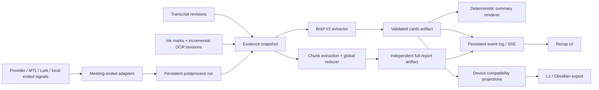
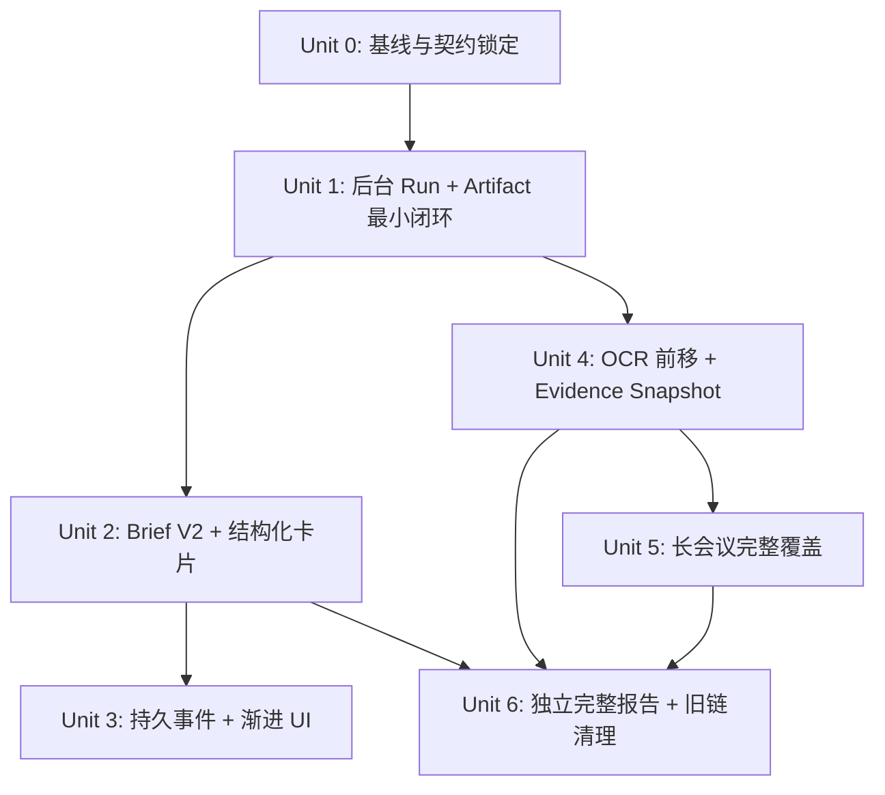

# 会议后处理 V2 落地计划

> **2026-07-22 产品决策：**完整报告能力已下线。当前生产链路只生成 `meeting.summary_cards` 与由其确定性渲染的 `meeting.summary`；本文关于 full report 的设计保留为历史决策记录，不再代表当前产品行为。旧 schema 仅用于读取兼容，旧 API 返回 `410 full_report_retired`，遗留任务在恢复时取消。

## 0. 计划结论

本计划把现有“进入 recap 后才生成、一次生成大而慢的完整 JSON”改造成后台自动、短结果优先、可渐进展示、可恢复和可追溯的后处理流水线。

实施拆成 7 个 unit。依赖顺序不按 UI 页面划分，而按可独立验证的数据能力划分：先锁契约和基线，再证明“用户不打开 recap 也会生成”，之后逐步引入结构化卡片、持久事件、前置 OCR、长会议归并和完整报告。原计划以 Unit 0–1 为首轮 Gate；本分支已在 Gate 通过后完成 Unit 2–6。

每个 unit 都按同一套 4 步闭环推进：

1. **契约与表征测试**：冻结输入、输出、身份、状态和现有行为。
2. **最小实现**：只实现该 unit 的最小垂直能力，不提前夹带后续单元。
3. **接线与迁移**：接入真实生产入口、兼容旧读写面，并处理重启、重试和旧数据。
4. **验证与放量**：完成 happy path、边界、错误、集成验证，观测指标后再扩大开关。

## 1. 背景与问题

当前主路径位于 `examples/ai-annotation-demo/src/mobile/meeting-recap.ts`：用户进入 recap 后，客户端刷新转写、等待最多 10 秒板书 OCR，再以最长 600 秒请求 `/api/meetings/summary`。客户端对转写有约 48k 字符上限；服务端 `server/infer.ts` 又以约 64k 字符截断输入、允许约 32k 输出 token，并在流式模型响应全部结束后解析一个大型 JSON。结果同时包含摘要和长报告，导致首个可读结果等待时间长、负载和输出体积大，而且长会议尾部可能完全缺失。

Provider 同步链路已经具备 persisted job、轮询、single-flight、late artifact backfill 和 meeting-ended callback 等零件，但它们尚未组成一个由 Hub 拥有、重启安全、幂等的会议后处理运行时。板书 OCR 已有 mark fingerprint 和 in-flight 去重，却仍主要由 recap 触发且按页面串行。现有 SSE 主要是进程内通知，不足以提供可恢复的后处理进度。

本计划的目标不是替换所有会议功能，而是建立可靠的会后产品闭环：

> `meeting.ended` → 收敛证据 → 尽快生成 brief/cards → 渐进显示 → 独立生成 full report → 用 artifact 和 source refs 保持可追溯。

## 2. 目标与非目标

### 2.1 目标

- 用户无需打开 recap，会议结束后即自动开始处理。
- 先生成短、清晰的 brief/cards，完整报告异步低优先级生成。
- 普通会议与访谈共享商务 brief schema；教育后处理继续独立。
- 手写证据通常在 brief 前可用；未就绪时有清晰的 provisional/final 语义。
- 长会议全量覆盖，不再依赖头部截断。
- run、snapshot、artifact 和 event 可持久、幂等、恢复、审计和删除。
- 新旧 meeting、recap、L1/Obsidian export 在迁移期可共存。
- 用真实基线决定性能门槛，不在计划阶段臆造数字。

### 2.2 非目标

- 本计划不迁移 education-classroom 的提示词或业务 schema。
- 不把整个 Runtime Sync、Provider 或 Cloud Hub 重写为新框架。
- 不在首版持久化 token-by-token 的自然语言 delta。
- 不在 Unit 0–1 重做卡片 UI、OCR 或长会议算法。
- 不盲目覆盖用户手工编辑过的 `meeting.summary`。
- 不要求 Unit 6 之前立即删除所有 legacy 字段；迁移先双读、后停写、再清理。

## 3. 需求追踪

| ID | 来源要求 | 落地 unit | 可观察验收 |
|---|---|---|---|
| R1 | 不打开 recap 也自动处理 | U0, U1 | 结束事件后后台 run 创建并完成；recap 从 artifact 读取 |
| R2 | 首个结果短且快 | U0, U2 | `meeting.summary` 与 cards 先 ready，尺寸和时延进入指标 |
| R3 | 卡片可渐进显示 | U2, U3 | validated card events 可恢复；断线重连不丢、不重放越权数据 |
| R4 | brief 通常包含手写 | U0, U4 | snapshot 记录 OCR revision、缺失原因和最终性 |
| R5 | 会议/访谈共用 brief | U2 | 使用同一 Prompt、schema 和 renderer；输入可携带会议类型元数据但不分叉链路 |
| R6 | full report 独立 | U6 | brief 不等待 report；report 可独立失败/重试/缓存 |
| R7 | 结论可追溯到证据 | U0, U2, U4, U5 | cards/artifacts 带 source refs 与 snapshot fingerprint |
| R8 | 幂等、版本化、可重跑 | U0, U1 | 同一 occurrence + fingerprint + pipeline version 不重复生成 |
| R9 | 长会议完整覆盖 | U5 | 尾部事实进入归并；chunk cache 支持局部重算 |
| R10 | Provider 晚到资料可修订 | U1, U4, U5 | provisional artifact 可按 revision 升级为 final |
| R11 | 旧数据/导出兼容 | U2, U6 | recap、L1/Obsidian 在迁移期双读；旧用户编辑不被覆盖 |
| R12 | meeting 与 education 边界清楚 | 全部 | 基础设施可复用，业务实现和迁移只服务 meeting |
| R13 | 事件与 artifact 安全 | U0, U1, U3 | tenant/user/meeting 授权、cursor 绑定、保留与删除测试通过 |

## 4. 当前链路地图

| 阶段 | 当前输入 | 当前处理 | 当前输出/状态 | 主要问题 |
|---|---|---|---|---|
| 会议结束识别 | MTL、Lark、Google/Zoom 同步、本地推断 | 多入口分别更新 meeting | `ended_at`、Provider job 状态 | 没有统一、强度分级的 ended occurrence |
| 转写收敛 | Provider transcript、live cues | 同步/轮询/late backfill | cue/transcript cache | 晚到资料与 summary 重算没有统一 revision |
| 板书 OCR | marks、page/bbox、图片 | recap 内等待、页面串行 OCR | handwriting snippets | OCR 发生过晚，超时后 brief 丢手写 |
| 摘要入口 | recap 页面 | 客户端组装输入并请求 `/api/meetings/summary` | `meeting.summary`、`summary_source` | 打开页面才开始，客户端拥有编排 |
| AI 推理 | transcript + handwriting + prompt | 单次大上下文、大 JSON、结束后整体 parse | `panel_summary`，含 digest/report | 首屏慢、输出大、失败粒度粗 |
| UI/同步 | local meeting state | recap 读取/刷新；后台通知有限 | recap、unread、L1 export | artifact 非 canonical，进度不可恢复 |

## 5. 关键技术决策

### 5.1 数据所有权

Hub 持久化的 postprocess run、evidence snapshot、artifact 和 event 是 canonical state。设备侧 `meeting.summary`、`summary_source`、`panel_summary` 在迁移期是兼容 projection/cache。原因是自动处理、重启恢复和 Provider 晚到资料都发生在后台，若让打开页面的设备状态拥有流程，就无法形成可靠的唯一运行状态。

### 5.2 最小可靠底座前置到 Unit 1

run/artifact/idempotency 不能等到 SSE 阶段。仅把现有摘要函数塞进 `meeting.ended` callback 会造成进程重启丢任务、多个结束信号重复调用以及 late artifact 覆盖不一致。Unit 1 必须先证明持久任务和 artifact 的最小闭环，随后 U2–U6 才能安全迭代。

### 5.3 occurrence 与结束事件

`meeting.ended` 是标准化后的领域事件，不假设仓库已有单一权威来源。MTL/Lark 的显式 ended、Provider reconciliation 与弱推断信号经过 adapter，映射到稳定 occurrence identity；弱推断默认只触发 reconciliation，不直接宣告最终证据已齐。

### 5.4 brief 的 canonical 输出

`MeetingSummaryCardsV2` 是 brief 的 canonical AI 输出，`meeting.summary` 由代码确定性渲染。摘要文字和卡片不能分别让模型生成，否则同一个 action 的 owner/due、proposal/decision 容易互相矛盾。空 owner/due 必须保留为 `null`，不得为了“完整”而推断。

### 5.5 provisional 与 final

artifact finality 由 evidence snapshot 决定，而不是由“模型成功返回”决定。Provider transcript 或 OCR 尾部尚未收敛时可生成 provisional brief；后续 snapshot revision 改变且 policy 判定信息实质增加时，创建新 artifact revision，不原地篡改历史结果。

### 5.6 SSE 粒度

首版持久事件以 run 状态、OCR 进度、validated card、artifact ready/failed 为粒度。自然语言 token delta 不持久化；如 UI 保留预览，必须标记 provisional，并在 cards ready 后由确定性 renderer 替换。

### 5.7 full report 调度

full report 是独立 artifact、独立预算、独立失败域，并始终低于 brief 优先级。是否生成由 policy 控制；会议与访谈使用同一 Prompt/schema，不再分叉成两套互斥流水线。

### 5.8 用户编辑保护

legacy `meeting.summary` 需要记录 origin/revision/user patch 语义。自动 projection 只能覆盖未编辑的 AI projection，或产生可供用户选择的新版本；不得用新 artifact 盲写用户内容。

### 5.9 安全与生命周期

run/artifact/event 查询和 SSE 都必须在 tenant + user + meeting access 上授权；resume cursor 绑定调用者身份和 stream scope。事件保留、敏感字段 redaction、artifact 删除及其投影清理属于数据模型的一部分，不作为上线后的补丁。

## 6. 高层技术设计



建议模块边界（最终文件名可在 Unit 0 契约评审中微调，但职责不得重新混回 recap）：

```text
examples/ai-annotation-demo/server/meeting-postprocess/
  contracts.ts                 # run/snapshot/artifact/event/finality contracts
  identity.ts                  # occurrence、fingerprint、pipeline version
  store.ts                     # persistent runs, artifacts and events
  ended-adapters.ts            # 多来源 ended 信号标准化
  scheduler.ts                 # enqueue, retry, priority, single-flight
  evidence-snapshot.ts         # transcript/handwriting revision 收敛
  brief-v2.ts                  # prompt 调用、schema validate
  summary-renderer.ts          # cards -> meeting.summary
  event-stream.ts              # persisted SSE + resume/auth
  long-meeting.ts              # utterance/chunk/reducer/cache
  full-report.ts               # 独立 report policy 和生成
```

共享 schema 如需要被 Web/Desktop/Obsidian 同时消费，应提升到现有 `src/core` 或合适的 `packages/*` 产品契约层；server-only 存储实现留在 demo server。不要让 SDK 根入口产生副作用。

## 7. Unit 依赖与交付边界



- **Delivery A（首轮 Gate，已完成）**：U0–U1，证明无页面触发的可靠自动生成。
- **Delivery B**：U2–U3，证明短结果优先和渐进可见。
- **Delivery C**：U4–U5，证明手写和长会议证据完整性。
- **Delivery D**：U6，拆离 full report 并关闭 legacy 新写入。

## 8. Implementation Units

### Unit 0 — 基线与契约锁定

**目标**：在不改变产品行为的前提下，建立可复现基线和后续单元共同依赖的数据语义。

**覆盖需求**：R1、R2、R4、R7、R8、R10、R13。

**依赖**：无。必须先于所有功能单元。

**文件**

- Create：`examples/ai-annotation-demo/server/meeting-postprocess/contracts.ts`
- Create：`examples/ai-annotation-demo/server/meeting-postprocess/identity.ts`
- Create：`examples/ai-annotation-demo/server/meeting-postprocess/contracts.test.ts`
- Create：`examples/ai-annotation-demo/server/meeting-postprocess/fixtures/*`
- Modify：`examples/ai-annotation-demo/src/core/store-format.ts`（仅在共享契约确需暴露时）
- Test/characterize：`src/mobile/meeting-recap-google.test.ts`、`meeting-recap-zoom.test.ts`、`server/google-meet-records.test.ts`、`zoom-meeting-records.test.ts`、`src/capture/board-ocr.test.ts`

**4 步执行**

1. 契约与表征测试：保存普通会议、访谈、长会议、Provider 晚到资料、含手写五类脱敏 fixture；记录当前输入大小、等待时序、输出大小、尾部缺失和错误行为。
2. 最小实现：定义 `PostprocessRun`、`EvidenceSnapshot`、`PostprocessArtifact`、`PostprocessEvent`、`MeetingUtterance`、`HandwritingEvidence` 的序列化契约；固定 occurrence identity、artifact kind、pipeline/prompt/schema version 与 finality。
3. 接线与迁移：只增加可被测试调用的 canonicalization/fingerprint helper，不切换生产入口；明确 legacy meeting 字段到新 artifact 的映射表。
4. 验证与放量：fixture 可稳定重放；相同 evidence 排序差异不改变 fingerprint；敏感字段不进入日志快照；确认生产行为无变化。

**模式**：沿用 `google-meet-records.ts` / `zoom-meeting-records.ts` 的 occurrence-aware persisted state，以及 `board-ocr.ts` 的 fingerprint 思路；identity 规则集中实现，禁止各 adapter 自行拼 key。

**测试场景**

- Happy：同一会议相同 evidence 得到稳定 fingerprint 和 occurrence。
- Edge：跨午夜、Provider ID 缺失、乱序 cue、重复 cue、空手写、手写 revision 更新。
- Error：未知 schema version fail closed；损坏 fixture 给出可定位错误。
- Integration：现有 Google/Zoom/MTL fixture 可投影成 snapshot，不改变现有 recap 断言。

**退出条件**：契约评审完成；五类 fixture 和基线报告可重复；后续 unit 不需重新决定 ownership、identity 或 finality。

### Unit 1 — 后台 Run + Artifact 最小垂直闭环

**目标**：复用现有短摘要行为，证明会议结束后不打开 recap 也能可靠生成和读取 artifact。

**覆盖需求**：R1、R8、R10、R13；为 R2 提供运行底座。

**依赖**：U0。

**文件**

- Create：`server/meeting-postprocess/store.ts`、`ended-adapters.ts`、`scheduler.ts`、`evidence-snapshot.ts`
- Create：对应 `*.test.ts` 和 process-restart integration test
- Modify：`server/mtl-receiver.ts`、`server/lark-realtime-meeting-store.ts`
- Modify：`server/google-meet-records.ts`、`server/zoom-meeting-records.ts`、`server/provider-artifact-poller.ts`
- Modify：`server/standalone.ts`（只做唯一 store/scheduler 装配和 route 接线）
- Modify：`src/mobile/meeting-recap.ts`（先读 artifact，legacy 生成保留在 feature flag fallback）

**4 步执行**

1. 契约与表征测试：先固定现有 summary 成功/失败、late transcript、重复 ended、进程重启和 recap fallback 行为。
2. 最小实现：持久化 run/artifact；用唯一键 `scope + occurrence + artifact kind + evidence fingerprint + pipeline version` 幂等 enqueue；worker 首版调用现有短摘要能力。
3. 接线与迁移：MTL/Lark/Google/Zoom adapters 发标准 ended signal；弱结束信号先 reconcile；recap 优先读取 artifact，未命中时保留旧路径；late Provider revision 按 policy 产生新 run。
4. 验证与放量：feature flag 从内部 fixture 到单租户，再到小比例会议；重启后 pending/running 可恢复，重复信号不产生重复模型调用，关闭开关可回退到旧 recap 路径。

**模式**：复用 Provider job store、`createDeadlineSingleFlight`、poller/backfill；装配遵循现有 store 单例模式，HTTP 和 worker 不得创建两个内存视图。

**首个支持拓扑**：Delivery A 明确只支持一个 active worker 领取任务，持久状态沿用仓库现有文件型 store 的串行写/原子替换模式；第二进程只能作为重启后的接替者，不能并行领取。多 active worker 上线前必须把唯一键和租约迁移到具备原子约束的存储，并重新通过竞争领取测试。

**测试场景**

- Happy：显式 ended → run queued/running/succeeded → artifact ready，全程不打开 recap。
- Edge：Google/Zoom/Lark/MTL 同一 occurrence 重复结束；Provider transcript 晚到；active worker 重启后由新进程接替；用户随后打开 recap。
- Error：模型超时、损坏 artifact、worker 崩溃、写盘失败、最大重试耗尽；状态可解释且不 busy-loop。
- Integration：重启测试、adapter→scheduler→store→artifact、recap artifact-first + legacy fallback、跨用户访问拒绝。

**退出条件 / Delivery A Gate**

- 五类 U0 fixture 至少覆盖普通自动生成、重复 ended、重启恢复和 late artifact。
- 未打开 recap 的会议能得到 artifact；打开 recap 不再触发第二次相同推理。
- run 和 artifact 可按 tenant/user/meeting 授权读取；失败可重试、可审计。
- 基线指标已采集，U2 性能目标由真实数据锁定。
- 未满足以上条件时，禁止进入卡片、SSE 或 OCR 重构。

### Unit 2 — Brief V2 与结构化卡片

**目标**：以 cards 为 canonical AI 输出，生成小而直观、证据可追溯的首个结果。

**覆盖需求**：R2、R5、R7、R11。

**依赖**：U1。

**文件**

- Create：共享 `MeetingSummaryCardsV2` schema（最终目录由 U0 契约评审决定）
- Create：`server/meeting-postprocess/brief-v2.ts`、`summary-renderer.ts` 及 tests
- Modify：`server/prompts.ts`、`src/core/prompt-versions.ts`、`server/infer.ts`
- Modify：`src/mobile/meeting-recap.ts`、`src/integration/inksurface/meeting-export.ts`
- Modify：Obsidian/runtime projection 的 meeting summary consumer（以代码检索确认的实际文件为准）

**4 步执行**

1. 契约与表征测试：为 decision、proposal、action、owner/due null、personal note isolation 建立 golden cases。
2. 最小实现：模型仅输出 validated cards；代码按固定顺序和格式渲染 `meeting.summary`；validation 失败允许有限修复/重试，不接受部分非法对象冒充 ready。
3. 接线与迁移：recap、L1/Obsidian 优先 V2；legacy summary 保留 origin/user-patch；会议与访谈使用同一 Prompt/schema/renderer，会议类型只作为输入上下文而非分流开关。
4. 验证与放量：shadow 比较 V1/V2 的尺寸、事实一致性和误报；先读 V2、再逐步打开 V2 写入，保留 artifact 级回滚。

**测试场景**

- Happy：有决策、有明确 owner/due 的 action、访谈 insight 均生成稳定卡片和文本。
- Edge：owner/due 未提及保持 null；proposal 不升级为 decision；个人笔记不冒充共识；零 action 仍合法。
- Error：schema 不合法、source ref 不存在、模型多余字段、renderer 输入版本未知。
- Integration：cards→summary→recap/export 一致；meeting/interview parity；用户编辑 summary 不被后台覆盖。

**退出条件**：cards 和 summary 事实一致；首结果体积显著低于基线；误报与幻觉指标达到 U0 锁定门槛。

### Unit 3 — 持久事件与渐进 UI

**目标**：用户可看到可恢复的处理进度和逐步就绪的有效卡片，刷新/断线不丢状态。

**覆盖需求**：R3、R13。

**依赖**：U2。

**文件**

- Create：`server/meeting-postprocess/event-stream.ts` 及 tests
- Modify：`server/meeting-postprocess/store.ts`、`brief-v2.ts`
- Modify：Cloud Hub route/handler 装配文件和 `src/mobile/meeting-recap.ts`
- Test：新增 SSE auth/resume/retention integration tests；参考 `server/cloud-library-handler.ts`

**4 步执行**

1. 契约与表征测试：固定事件 ID、顺序、scope、redaction、retention、resume 和 terminal-state 语义。
2. 最小实现：事务性追加 run/card/artifact events；SSE 支持 `Last-Event-ID`，断线后从持久 log 续传。
3. 接线与迁移：recap 只负责展示和订阅，不再拥有生成；validated card 才可进入稳定 UI，provisional preview 明确替换规则。
4. 验证与放量：断网、刷新、多标签页、过期 cursor、身份变化和 artifact 删除演练；监测 resume success 和积压。

**交互状态契约**

| 状态 | recap 首屏 | 用户动作 |
|---|---|---|
| 无 run / 等待自动触发 | 显示“会议资料同步中”，不伪装成空结果 | 可刷新资料；不手动创建重复 run |
| collecting/running 且无 card | 显示阶段、已等待时间和可离开提示 | 可离开页面；后台继续 |
| provisional cards | 显示已验证卡片并标“初步结果/仍在补齐资料” | 可查看证据；不把 provisional 当 final 导出 |
| final artifact | 确定性渲染完整 brief | 可查看、导出、发起显式重生成 |
| failed | 保留已成功的旧 artifact，展示本次失败原因类别 | 有权限时重试；不清空旧结果 |
| empty but succeeded | 明确“未识别到决定或行动项”，区别于加载失败 | 可查看原始证据 |

移动端/桌面端沿用现有可访问控件与焦点顺序；状态变化使用语义化 live region，不能只靠颜色区分 provisional、failed 和 final。

**测试场景**

- Happy：progress→cards→ready 有序到达，重连从最后事件继续。
- Edge：重复连接、慢 consumer、cursor 正好在 retention 边界、artifact revision 切换。
- Error：伪造 cursor、跨用户/会议订阅、事件存储不可用；fail closed 且不泄漏 payload。
- Integration：worker 写事件、HTTP 恢复、recap 去重渲染、删除 artifact 后事件不可再取敏感内容。

**退出条件**：SSE resume 指标达到 U0 后锁定目标；UI 刷新不触发生成、不重复卡片；授权/删除生命周期通过测试。

### Unit 4 — OCR 前移与 Evidence Snapshot

**目标**：把板书 OCR 从 recap 时等待改为会议中增量处理，让后台 Hub 在会后拥有可用于 brief 的完整证据快照。

**覆盖需求**：R4、R7、R10、R13。

**依赖**：U1；可与 U2 后半段错峰，但上线前需与 U2 artifact 语义对齐。

**文件**

- Modify：`src/capture/board-ocr.ts`、`src/capture/board-ocr.test.ts`
- Modify：`src/features/meeting/meeting-summary-handwriting.ts` 及 tests
- Create/Modify：Hub handwriting evidence sync handler/store 和 integration tests
- Modify：`server/meeting-postprocess/evidence-snapshot.ts`、scheduler policy
- Modify：runtime sync host，仅传输必要 bbox/mark/OCR evidence，不复制 renderer

**4 步执行**

1. 契约与表征测试：固定 mark/bbox fingerprint、OCR revision/confidence/manual correction、删除和 session tail 行为。
2. 最小实现：会议中按变化区域增量 OCR，受控并发、独立失败；同步 evidence revision 到 Hub。
3. 接线与迁移：ended 时等待有界 tail OCR；超时生成 provisional snapshot 并记录缺失原因；后续 OCR revision 可触发实质变化重算。
4. 验证与放量：高频笔迹、分页、重复 marks、OCR 失败、离线后补传；监测 partial rate、队列延迟与成本。

**测试场景**

- Happy：新增 bbox 只 OCR 变化区域，brief source refs 指向对应 handwriting evidence。
- Edge：80+ items、跨页、擦除/重写、手工纠正、同 fingerprint 回放、结束瞬间仍有 in-flight OCR。
- Error：单页 OCR 超时不阻塞其他页；断网重连后幂等补传；敏感图像按生命周期删除。
- Integration：device evidence sync→Hub snapshot→brief revision；无设备手写时仍能正常完成。

**退出条件**：大多数 eligible 会议在 brief snapshot 中包含已知手写；partial 原因可观察；OCR 失败不拖垮整个 run。

### Unit 5 — 长会议完整覆盖

**目标**：消除 48k/64k 头部截断，以稳定 utterance、分块抽取和全局 reducer 覆盖整场会议。

**覆盖需求**：R7、R9、R10。

**依赖**：U4（snapshot/revision）；复用 U2 cards schema。

**文件**

- Create：`server/meeting-postprocess/long-meeting.ts` 及 tests/fixtures
- Modify：transcript canonicalization、`evidence-snapshot.ts`、`brief-v2.ts`
- Modify：`server/infer.ts`，移除新链路 head-only truncation
- Test：普通/长/极长会议、late tail revision、chunk cache integration tests

**4 步执行**

1. 契约与表征测试：定义 `MeetingUtterance` 稳定 ID、speaker/time/source；用尾部埋点 fixture 量化当前 recall。
2. 最小实现：按 token/时间/语义边界分块，保留小重叠；每块产出同一结构化候选，global reducer 去重、合并和冲突标注。
3. 接线与迁移：chunk hash 缓存抽取；late revision 仅重算受影响 chunk 和 reducer；普通会议仍走简路径但输出同 schema。
4. 验证与放量：对照头、中、尾证据覆盖、重复 action、跨 chunk 决策、speaker 修订和成本；达到门槛后关闭新链路截断。

**测试场景**

- Happy：尾部 action/decision 被 cards 捕获，source ref 精确回链。
- Edge：事实跨 chunk 边界、speaker 更名、静音大间隔、重复转写、单句超长、全部低信息量。
- Error：某 chunk 模型失败可独立重试；reducer 输入缺块不得误标 final；cache 损坏自动失效。
- Integration：late tail transcript 只使相关 chunk hash 改变；普通与长会议 renderer 保持一致。

**退出条件**：tail-content recall 达到 U0 锁定目标；没有 head-only silent truncation；局部修订不强制全量重复推理。

### Unit 6 — 独立完整报告与旧链清理

**目标**：把 `meeting.full_report` 从首结果中完全拆开，并有序停止 `meeting.panel_summary` 新写入和 recap 巨型 JSON 路径。

**覆盖需求**：R2、R6、R11、R12、R13。

**依赖**：U2、U4、U5；U3 用于进度展示但不是 report 计算正确性的硬依赖。

**文件**

- Create：`server/meeting-postprocess/full-report.ts` 及 tests
- Modify：`server/prompts.ts`、`server/infer.ts`、scheduler priority/policy
- Modify：`src/core/store-format.ts`、`src/mobile/meeting-recap.ts`
- Modify：`src/integration/inksurface/meeting-export.ts` 和 Obsidian compatibility consumer
- Delete/retire（最后一步）：新链路对 `panel_summary` 的生成入口；旧字段读取按迁移窗口保留

**4 步执行**

1. 契约与表征测试：固定 legacy `panel_summary.report_markdown`、用户编辑 summary、无 report 权限/eligibility 的表现。
2. 最小实现：独立 `meeting.full_report` artifact、动态预算、低优先级队列、独立 retry/failure/cache；brief ready 不等待它。
3. 接线与迁移：双读新 artifact/legacy report；先停新 `panel_summary` 写入，再迁移 eligible 历史 projection；删除 recap 触发的大 JSON 生成路径。
4. 验证与放量：压力下验证 brief 不被 report 饥饿；灰度停写、回滚开关、旧数据抽样；完成保留/删除和用户编辑保护审计。

**测试场景**

- Happy：brief 先 ready，report 后 ready；访谈和普通会议按 policy 生成。
- Edge：不 eligible、用户只看 brief、旧 meeting 只有 panel report、report 基于 provisional snapshot 后 revision。
- Error：report 超时/超预算不改变 brief success；迁移中断可重入；legacy 数据无法解析时保留原文。
- Integration：recap/export 双读一致；队列优先级保证 brief；停止 legacy 写后全仓测试不再依赖新 panel output。

**退出条件**：首结果链路没有 full-report 成本；旧数据可读、用户编辑安全；新会议不再写 `panel_summary`；legacy 清理有明确日期和 owner。

## 9. 系统级影响

### 9.1 接口与入口

- 会议结束：MTL callback、Lark store、Google/Zoom reconciliation、本地 meeting 状态。
- AI：`/api/meetings/summary` 由主生成入口退为兼容入口；新增 Hub run/artifact/event 读写面。
- 客户端：recap 从“编排器”变为“artifact reader + event subscriber”。
- 导出：L1/Obsidian 从 meeting projection 读取，最终应能识别 artifact version/origin。
- Runtime Sync：只承载必要 evidence/projection，不变成另一套后处理引擎。

### 9.2 状态生命周期

推荐状态：`queued → collecting_evidence → running → succeeded|failed|cancelled|superseded`。artifact immutable；revision 通过新 artifact 表达。snapshot 保存输入引用、hash、finality 和缺失原因，不无期限复制整份原始音视频。删除 meeting 时，run、artifact、events、OCR evidence 和设备 projection 必须按策略级联/墓碑化。

### 9.3 失败传播

- transcript/OCR 某一路失败可产生带缺失说明的 provisional brief，不应把所有任务永久卡住。
- brief 失败不会启动 full report；full report 失败不回滚 brief。
- event stream 故障不改变 artifact 持久结果；UI 可通过 REST snapshot 恢复。
- Provider late artifact 只创建新 revision，不篡改已读 artifact 或用户编辑。

### 9.4 并发与一致性

- 单 active worker 阶段由持久状态、串行写和过期租约保证重启接替；扩展到多 active worker 前必须升级为 compare-and-set 等等价原子领取语义。single-flight 只是进程内优化，不是持久幂等保障。
- occurrence 和 artifact 唯一键由持久层约束；不能依靠客户端“不要重复点”。
- event ID 单调只需在 stream scope 内成立；resume 必须同时验证 identity/scope。

## 10. 验证策略

### 10.1 测试层次

- Contract：schema、identity、fingerprint、version/finality、renderer golden tests。
- Characterization：锁定现有 recap/Provider/OCR/legacy export 行为。
- Unit：store state machine、scheduler、adapter、prompt validation、chunk reducer。
- Integration：ended→run→snapshot→artifact→recap；restart/retry/late revision/SSE resume。
- Security/data lifecycle：跨租户读取、伪造 cursor、删除、retention/redaction。
- Performance：基于固定脱敏 fixtures 记录阶段耗时、输入/输出 token、artifact 大小和队列等待。

每个 unit 先跑受影响 package 的 targeted tests；提交前遵守仓库门槛：`npm run check`、`npm run lint:ci`、`npm test`、`npm run build`。外部模型性能测试必须与确定性测试分开，避免 CI 依赖真实 provider。

### 10.2 指标与门槛制定

U0 先测基线，Delivery A 结束前再锁数值目标：

- meeting end → run start
- evidence ready → first card
- evidence ready → summary ready
- OCR partial rate
- duplicate run/model-call rate
- SSE resume success
- tail-content recall
- decision/action false-positive rate
- owner/due hallucination rate
- summary size / 首屏数
- full report 输入输出 token 降幅
- meeting end → OCR ready
- summary ready → report start / report ready
- summary cache hit rate
- full report open rate
- summary edit rate

指标必须按普通会议、访谈、长会议、Provider 晚到和含手写分桶；只看平均值会掩盖长尾。

## 11. 发布、迁移与运维

- Feature flags 至少区分：background run、artifact-first read、brief V2、persistent events、incremental OCR、long-meeting、full report。
- 先 shadow write artifact，不改变 UI；再 artifact-first read；稳定后才停 legacy write。
- run dashboard/日志至少显示 occurrence、snapshot revision、artifact kind/version、状态、重试、缺失证据原因和耗时；不打印原始 transcript/手写正文。
- 所有新 route/SSE 只经 TLS 暴露；artifact、event 和 OCR evidence 继承 Hub 的静态加密/磁盘访问策略，fixture 必须脱敏。第三方 Provider 文本按不可信输入处理，进入 prompt/schema 前做长度、类型和控制字符限制。
- run 创建、重试、SSE 连接和 replay 均设置每用户/租户配额与速率限制，避免超长会议或伪造 cursor 形成模型成本与存储型 DoS。
- worker 启动时扫描可恢复任务和过期租约；队列需要 backpressure、优先级和每租户并发限制。
- 回滚以“停止新 enqueue/切回 legacy read”为主，不删除已生成 artifact；schema reader 至少兼容一个迁移窗口。
- 数据保留策略覆盖 transcript reference、OCR 图像/文本、events 和 artifacts；用户删除或租户策略变更必须可传播。

## 12. 风险与缓解

| 风险 | 影响 | 缓解 |
|---|---|---|
| 多来源 ended 重复/错配 occurrence | 重复调用或串会 | U0 identity fixture；持久唯一约束；弱信号只 reconcile |
| 后台 Hub 没有设备手写 | brief 事实不完整 | U4 evidence sync；provisional/final；缺失原因显式化 |
| 新 artifact 覆盖用户 summary | 用户数据丢失 | origin/user-patch；immutable revision；迁移抽样 |
| SSE cursor 泄漏跨用户信息 | 严重隐私问题 | identity-bound cursor；每次 resume 重新授权；payload redaction |
| 长会议 map/reduce 成本失控 | 更慢更贵 | chunk hash cache、动态并发、低信息过滤、预算监控 |
| full report 抢占 brief worker | 首结果继续慢 | 独立优先级/配额；brief terminal 前不调度 report |
| provisional 重算过于频繁 | 成本和 UI 抖动 | evidence revision debounce + material-change policy + superseded artifact |
| 文件存储多进程一致性不足 | 重复领取/损坏状态 | U1 先明确单进程边界；需要扩容前采用具备原子约束的持久层，不伪装文件锁等同数据库事务 |
| 计划顺手迁移 education | 范围膨胀 | generic interface 只做必要抽象；本计划实现/验收只针对 meeting |

## 13. 已解决与延期决策

### 13.1 计划阶段已解决

- canonical owner：Hub run/artifact；设备字段为兼容 projection。
- 首轮范围：U0–U1，只证明后台自动闭环。
- cards 是 brief canonical output；summary 由代码渲染。
- run/artifact/idempotency 必须前置，不能等 U3。
- meeting/interview 共用 schema；education 不在本计划迁移。
- full report 独立、低优先级、policy-controlled。
- SSE 必须持久且具备身份绑定、保留、redaction、删除语义。
- legacy summary 迁移必须保护用户编辑。

### 13.2 延期到实现期但不阻塞 U0–U1

- 持久 store 最终采用现有文件存储还是生产数据库：U1 可基于当前部署形态做最小可靠实现，但在多实例放量前必须做容量与原子性 Gate。
- provisional 等待 OCR/Provider 的具体时间窗：由 U0 基线和成本数据决定。
- full report 默认 eligibility：由产品 policy 配置，不改变 brief 共用流程。
- event/artifact 精确保留天数：由隐私和运营政策确定；U3 数据模型必须先支持配置与删除。
- V2 cards 在共享包中的最终落点：U0 根据实际消费者确认，不能为“未来复用”无条件扩大 SDK 公共 API。

## 14. 文档维护

- 架构源文档：`docs/project/inkloop-ai-pen-kickstarter/source/InkLoop_会议纪要后处理最佳实践方案_V2.md`。
- 本文件是执行与验收索引；若产品目标改变，先更新 source，再同步 requirement trace。
- 每个 delivery 完成后，在 `docs/solutions/` 提炼可复用的幂等后台任务、证据 revision、可恢复 SSE 或长文本归并经验。
- 若引入新的公共 schema/route，同步对应 README、API contract 和数据删除说明。

## 15. 执行清单

- [x] U0：基线与契约锁定
- [x] U1：后台 Run + Artifact 最小闭环
- [x] Delivery A Gate：确认无 recap 自动生成；性能指标已接线，生产数值门槛留待真实流量校准
- [x] U2：Brief V2 与结构化卡片
- [x] U3：持久事件与渐进 UI
- [x] U4：OCR 前移与 Evidence Snapshot
- [x] U5：长会议完整覆盖（chunk-local refs、全局 reducer、tail-only revision 与 handwriting cache invalidation 均有直接测试）
- [x] U6：完整报告退役与旧链清理（生成器、调度、客户端请求和 UI 已移除；旧 API 返回 410，历史 schema 只读兼容）
- [x] 全量迁移审计：Provider 注册与 Hub-only 离线触发、删除传播、stage timing/artifact bytes 调试输出均已接线；真实模型阈值作为验收环境校准项记录

## 16. Sources & References

- `docs/project/inkloop-ai-pen-kickstarter/source/InkLoop_会议纪要后处理最佳实践方案_V2.md`
- `docs/solutions/integration-issues/runtime-sync-canonical-path-2026-07-02.md`
- `docs/solutions/best-practices/source-file-centered-v1-product-boundary-2026-07-02.md`
- `examples/ai-annotation-demo/src/mobile/meeting-recap.ts`
- `examples/ai-annotation-demo/server/infer.ts`
- `examples/ai-annotation-demo/server/prompts.ts`
- `examples/ai-annotation-demo/src/features/meeting/meeting-summary-handwriting.ts`
- `examples/ai-annotation-demo/src/capture/board-ocr.ts`
- `examples/ai-annotation-demo/server/google-meet-records.ts`
- `examples/ai-annotation-demo/server/zoom-meeting-records.ts`
- `examples/ai-annotation-demo/server/mtl-receiver.ts`
- `examples/ai-annotation-demo/server/lark-realtime-meeting-store.ts`
- `examples/ai-annotation-demo/server/background-worker.ts`
- `examples/ai-annotation-demo/server/cloud-library-handler.ts`
