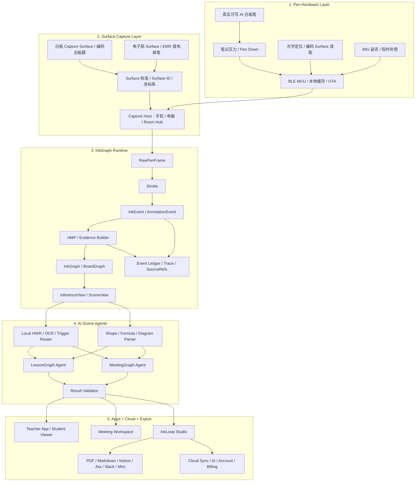
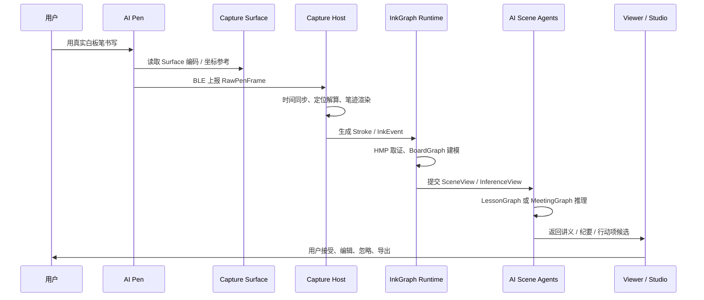
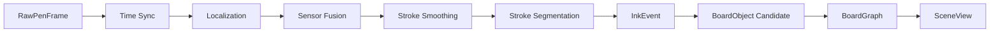
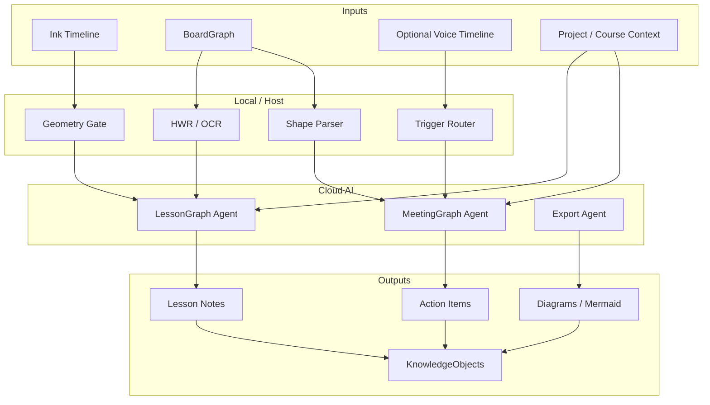

# InkLoop AI Pen 系统架构设计

版本：v0.1  
日期：2026-07-02

---

## 1. 架构结论

新系统采用：

# InkLoop Surface Intelligence OS

这是一个 **Pen-first** 的多 Surface 智能建模系统。第一 Surface 是真实白板，第二 Surface 是电子纸。系统不以聊天框为入口，而以 **真实书写动作** 为入口。

核心闭环：

```text
真实书写
→ 笔端采集
→ Surface 坐标定位
→ 笔迹事件化
→ InkGraph 建模
→ 教育 / 会议场景 AI
→ 讲义 / 纪要 / 决策 / 行动项
→ 用户确认后进入 KnowledgeObject
```

---

## 2. 总体架构图



---

## 3. 系统分层

| 层级 | 职责 | 不承担的职责 |
|---|---|---|
| Pen Hardware Layer | 真实书写、pen down/up、定位读取、IMU、通信、缓存 | 不做复杂 AI，不做长期知识管理 |
| Surface Capture Layer | 提供稳定坐标系、Surface ID、校准、尺寸映射 | 不承担业务语义 |
| Capture Host / Hub | 接收 BLE、时间同步、实时渲染、session 缓存、AI job queue | 不把硬件信号直接暴露给 AI |
| InkGraph Runtime | 将笔迹事件化、对象化、关系化，生成可追溯 scene graph | 不生成最终业务结论 |
| AI Scene Agents | 识别文字、公式、图形、步骤、决策、行动项 | 不伪造 source_refs，不直接吐裸坐标 |
| Studio / Cloud / Export | 回放、编辑、导出、同步、权限、计费 | 不把外部工具当唯一真相源 |

---

## 4. 两个产品闭环

## 4.1 闭环一：白板 + 真实墨水 AI 笔

这是 Kickstarter 首发主闭环。

| 模块 | 设计 |
|---|---|
| 使用方式 | 老师 / 会议主持人在真实白板或 Capture Surface 上正常写 |
| 核心硬件 | AI 白板笔、Capture Surface、手机 / 电脑 Host |
| 核心价值 | 实时数字化、远程可见、回放、AI 结构化 |
| 首发人群 | 在线老师、培训师、产品 / 工程 / 设计会议团队 |
| 首发边界 | 单笔、单 Surface、教育 + 商务双 demo |

### 端到端链路



---

## 4.2 闭环二：电子纸 + 电容笔 / EMR 笔

这是第二产品闭环，不作为 Kickstarter 首发主承诺。

| 模块 | 设计 |
|---|---|
| 使用方式 | 用户在电子纸上读 PDF、写题、批注、画图 |
| 核心硬件 | 电子纸设备、电容笔或 EMR 笔、本地 Runtime Host |
| 核心价值 | 阅读标注、题目推导、知识卡片、本地知识沉淀 |
| 复用模块 | InkEvent、SurfaceIndex、HMP、MarkGraph、InferenceView、KnowledgeObject |
| 差异 | 电子纸自带精确坐标和文档上下文，不需要白板定位膜 |

### 与白板闭环的关系

白板闭环解决“实时教学和会议协作”。电子纸闭环解决“个人学习、研究、备课和文档标注”。两者共享同一套 InkGraph 和 Knowledge Runtime。

---

## 5. 核心运行时链路

```text
RawPenFrame
→ Time Sync
→ Surface Coordinate Resolver
→ Sensor Fusion
→ Stroke Smoothing
→ Stroke Segmentation
→ InkEvent
→ HMP / Evidence Builder
→ BoardObject Candidate
→ BoardGraph
→ SceneView / InferenceView
→ AI Agent
→ Result Validator
→ KnowledgeObject
```

---

## 6. Capture Runtime 模块图



### 关键职责

| 模块 | 职责 |
|---|---|
| Time Sync | 对齐笔、Host、语音、视频、AI job 时间戳 |
| Localization | 将光学 / Surface / IMU 数据转为 Surface 坐标 |
| Sensor Fusion | IMU 补偿丢点、手抖、短时失锁 |
| Stroke Smoothing | 平滑笔迹但保留公式、箭头、草图细节 |
| Stroke Segmentation | 切分字、词、公式、图形、箭头和区域 |
| Eventization | 生成稳定 InkEvent，进入事件账本 |
| Replay | 支持课程 / 会议按时间回放 |

---

## 7. InkGraph Runtime：护城河核心

InkGraph 不只是 OCR 前处理，而是把连续书写过程恢复成人类正在构建的空间模型和语义模型。

### 对象层级

| 层级 | 对象 | 示例 |
|---|---|---|
| Stroke | 原始笔画 | 一条线、一个字母、一段公式 |
| Glyph / Word | 字符或词 | `x^2`、API、用户登录 |
| Shape | 图形对象 | 方框、圆、箭头、泳道、时序线 |
| Region | 空间区域 | 题目区、推导区、结论区 |
| Relation | 空间 / 语义关系 | A 指向 B、下一步、包含、依赖 |
| Scene | 白板整体状态 | 这一堂课 / 这场会议 |
| Graph | 场景图 | LessonGraph / MeetingGraph / ArchitectureGraph |
| KnowledgeObject | 可复用知识单元 | 讲义片段、会议决策、行动项、架构草案 |

---

## 8. AI Agent 架构



---

## 9. 与现有墨水屏方案的复用关系

| 现有模块 | 复用度 | 新系统变化 |
|---|---:|---|
| `runtime-schema` | 高 | 扩展 SurfaceSession / InkEvent / BoardGraph |
| `surface-model` | 高 | 从文档页面对象扩展到白板对象 |
| `surface-web` | 高 | 做 Live Board Viewer、学生端、会议端 |
| `offline-store` | 高 | 存课程 / 会议 session、笔迹、AI 结果 |
| `sync-client` | 高 | 多端同步、断网补传、云端 cursor |
| `native-bridge` | 中高 | 从电子纸桥扩展到 Pen / Host bridge |
| `AnnotationEvent` | 高 | 升级为通用 InkEvent |
| `HMP` | 高 | 从页面取证扩展到白板 / 会议取证 |
| `MarkGraph` | 高 | 升级为 InkGraph / BoardGraph |
| `InferenceView` | 高 | 升级为 SceneView，供 AI 场景智能体消费 |
| `KnowledgeObject` | 高 | 作为讲义、纪要、任务、图解知识的统一沉淀对象 |
| 电子纸推屏桥 | 部分 | 仅用于 InkLoop Paper，不用于白板实时直播 |

---

## 10. 部署形态

| 形态 | 阶段 | 组件 |
|---|---|---|
| Web / Desktop Demo | 7-8 月 | AI Pen 模拟 / BLE 接入、Live Board、AI mock / cloud |
| Teacher Starter Kit | Kickstarter 首发 | AI Pen、A2 Capture Surface、Teacher App、Student Viewer |
| Meeting Kit Beta | Kickstarter 高客单 / Beta | 2 支 AI Pen、大 Surface、Meeting Workspace |
| Room Hub | 后续 | 多笔接收、房间绑定、会议室网络、权限 |
| InkLoop Paper | 后续 | 电子纸、EMR / 电容笔、文档标注、知识卡片 |
| InkLoop Cloud | 持续 | Auth、Sync、AI jobs、Billing、Team Workspace |

---

## 11. 架构原则

1. **笔是第一入口。** Surface 可以辅助定位，但用户心智必须是“我拿起笔写”。
2. **事件账本是真相源。** UI、AI 结果和导出物都是派生物。
3. **模型不吐坐标。** AI 只消费 SceneView 和 source_refs，坐标由前端 / Runtime 确定。
4. **证据先于推理。** HMP / InkEvent / BoardGraph 必须先稳定，再让 AI 解释。
5. **结果可编辑、可拒绝、可追溯。** 只有用户确认后的结果进入 KnowledgeObject。
6. **本地优先，云端增强。** 书写、缓存、低级识别和 source_refs 校验尽量本地；高质量讲义 / 纪要走云端。
7. **Kickstarter 首发讲清边界。** 不用“任意白板完美适配”这类高风险承诺换短期关注。
