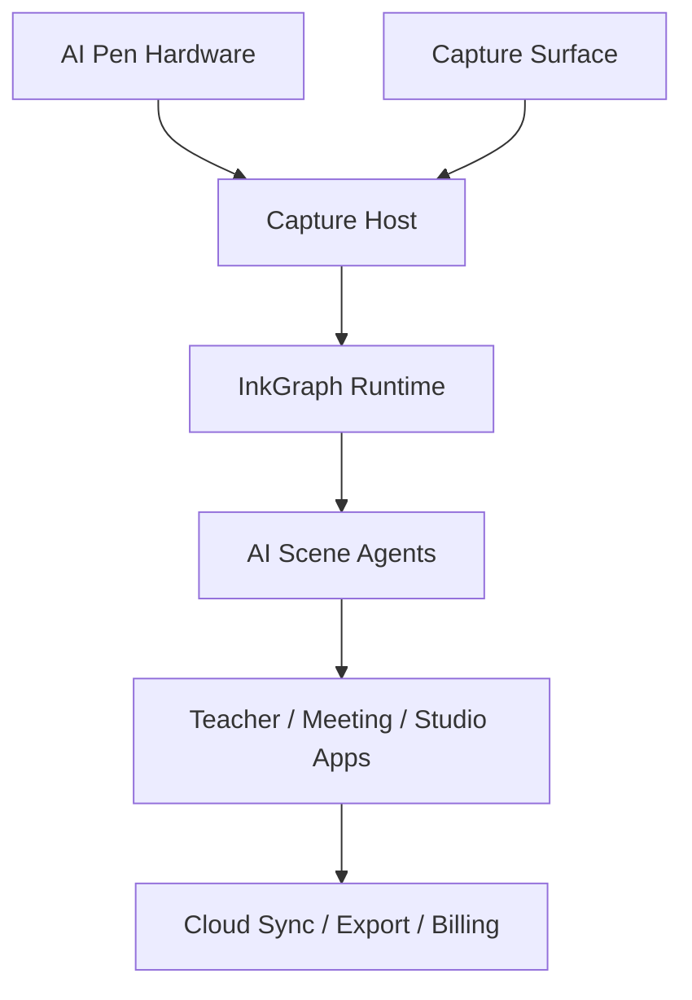
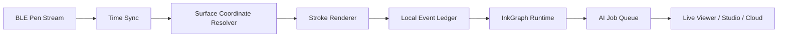

# InkLoop AI Pen 各模块技术方案

版本：v0.1  
日期：2026-07-02

---

## 1. 模块总览



| 模块 | 核心产物 | Kickstarter 前优先级 |
|---|---|---:|
| AI Pen Hardware | 可真实写字、稳定输出坐标流的工程样机 | P0 |
| Capture Surface | A3/A2 可擦写定位 Surface | P0 |
| Capture Host | 手机 / 电脑接收、实时渲染、缓存 | P0 |
| InkGraph Runtime | InkEvent、BoardGraph、source_refs | P0 |
| Education Agent | 课后讲义、步骤回放、公式说明 | P0 |
| Meeting Agent | 行动项、决策、风险、图解 Beta | P0 |
| InkLoop Studio | 回放、编辑、导出、AI 结果确认 | P0 |
| Cloud Sync | 账号、session 同步、AI job queue | P1 |
| Room Hub | 多笔、会议室部署 | P2 / Beta |
| InkLoop Paper | 电子纸闭环 | Roadmap |

---

# 2. AI Pen Hardware 模块

## 2.1 目标

做一支 **真实可写、可替换白板笔芯、能实时输出坐标和笔迹事件的 AI 白板笔**。

## 2.2 方案

| 子模块 | 技术方案 | 10 月底必须达到 | 众筹后优化 |
|---|---|---|---|
| 笔身结构 | 3D 打印 / CNC 工程样机，白板笔芯可替换 | 可以真实写字，外观接近最终形态 | 注塑结构、重心优化、防干墨 |
| 笔芯 | 干擦白板笔芯，优先黑色 | 写感接近普通白板笔 | 多色笔芯 / 颜色识别 |
| Pen Down | 微动开关 / 压力传感器 / 电容接触 | 稳定识别落笔 / 抬笔 | 压力曲线、笔迹粗细 |
| 光学定位 | 笔尖附近小型传感器读取 Capture Surface 编码 | A3/A2 Surface 稳定出坐标 | 大尺寸、多角度容错 |
| IMU | 6 轴 IMU | 平滑、丢点补偿、姿态估计 | 动态 tip-offset 补偿 |
| MCU | BLE MCU，优先 Nordic nRF52/nRF53 或 ESP32-S3 PoC | 100Hz 以上数据上报，本地缓存 30 分钟 | 低功耗、小 PCB、OTA |
| 通信 | BLE 5.x 到手机 / 电脑 / Hub | 端到端显示 P50 < 150ms | 多笔、多房间、专用 Hub |
| 电池 | 小型锂电 + USB-C / 磁吸充电 | 连续演示 2 小时以上 | 6 小时以上真实使用 |
| 反馈 | LED + 按键 | 连接、录制、电量、模式提示 | 震动反馈、颜色模式 |

## 2.3 数据帧

```ts
type RawPenFrame = {
  pen_id: string;
  session_id: string;
  surface_id?: string;
  ts_device_ms: number;
  ts_host_ms?: number;

  tip_state: "down" | "hover" | "up";
  pressure?: number;

  optical?: {
    x_raw?: number;
    y_raw?: number;
    pattern_id?: string;
    quality: number;
  };

  imu?: {
    ax: number; ay: number; az: number;
    gx: number; gy: number; gz: number;
  };

  battery?: number;
  firmware_version: string;
};
```

## 2.4 10 月底硬件验收

| 指标 | Kickstarter Demo 目标 |
|---|---:|
| 小 Surface 坐标误差 | ≤ 5mm |
| 实时笔迹延迟 | P50 ≤ 150ms，P95 ≤ 300ms |
| 丢点率 | ≤ 1% |
| 单次连续书写 | ≥ 30 分钟稳定 |
| 电池演示续航 | ≥ 2 小时 |
| 白板墨水遮挡后可读性 | 至少完成 3 种墨水、3 次擦除循环测试 |
| 原型数量 | ≥ 5 支可演示样机，至少 2 支可外借拍摄 |

---

# 3. Capture Surface 模块

## 3.1 目标

让普通白板获得稳定坐标系统，但不把产品变成昂贵智能白板。

## 3.2 推荐路线

**编码白板 Surface / 低可见度定位膜 + 光学 AI 笔。**

产品说法：

> InkLoop works with our Capture Surface. You still write with real dry-erase ink, but the surface gives the pen the spatial reference needed for accurate digital capture.

内部口径：

> 笔为主，Surface 做极小锚定。

## 3.3 模块方案

| 子模块 | 技术方案 | 10 月底必须达到 |
|---|---|---|
| Surface 材料 | 可擦写白板膜，低反光，低可见 / 红外可见编码 | A3/A2 样片稳定可用 |
| Surface ID | 每张 Surface 有唯一 ID | App 能识别并绑定 session |
| 校准点 | 四角校准点 / QR / 标定图形 | 30 秒内完成校准 |
| 尺寸 | Starter Kit：A3/A2；Meeting Kit：A1 或拼接 | 至少 A2 可稳定演示 |
| 耐擦写 | 干擦、湿擦、酒精测试 | 早期材料测试报告 |
| 供应链 | 印刷 / 覆膜 / 裁切供应商 | 至少 2 家供应商报价 |

## 3.4 最大风险

> 白板墨水覆盖、反光、擦除残留会不会影响光学读取。

必须在 7 月完成材料样片测试，不能拖到 9 月。

测试矩阵：

| 测试 | 维度 |
|---|---|
| 墨水颜色 | 黑、蓝、红 |
| 擦除方式 | 干擦、湿擦、酒精 |
| 反光 | 暖光、冷光、窗边、会议室顶灯 |
| 角度 | 正握、侧握、低角度书写 |
| 磨损 | 100 / 500 / 1000 次擦写 |
| 尺寸 | A3、A2、A1 拼接 |

---

# 4. Capture Host / Hub 模块

## 4.1 目标

Starter Kit 不做重 Hub，用手机 / 电脑承担 Host。Meeting Kit 后续再上 Room Hub。

## 4.2 形态

| 形态 | 用户 | 技术方案 |
|---|---|---|
| Mobile Host | 老师、个人用户 | 手机接 BLE，WebView / App 渲染白板 |
| Desktop Host | 老师、会议主持人 | Mac / Windows App 接 BLE，支持屏幕共享 |
| Room Hub | 商业会议室 | 专用 Hub 接多笔、多 Surface，后续做 |
| Web Viewer | 学生、远程参会者 | 链接打开即可看实时板书 |
| Studio | 会后整理 | 回放、编辑、导出、AI 产物确认 |

## 4.3 Host 职责



## 4.4 10 月底必须做到

| 能力 | 目标 |
|---|---|
| 实时接收笔迹 | 单笔稳定，后续多笔 |
| 实时白板 Viewer | 远程链接可看 |
| Session 录制 | 笔迹按时间线回放 |
| AI 任务队列 | 课后 / 会后生成结构化结果 |
| 导出 | PDF / Markdown / PNG / 分享链接 |
| 失败降级 | 网络断了不丢笔迹，恢复后补处理 |

---

# 5. InkGraph Runtime 模块

## 5.1 目标

把连续书写过程从“点序列”变成“空间对象 + 关系图 + 场景语义”。

## 5.2 链路

```text
RawPenFrame
→ Stroke
→ InkEvent
→ HMP / Evidence Builder
→ BoardObject Candidate
→ BoardGraph
→ SceneView / InferenceView
→ AI Agent
→ Result Validator
→ KnowledgeObject
```

## 5.3 核心对象

```ts
type InkEvent = {
  event_id: string;
  trace_id: string;
  session_id: string;
  surface_id: string;
  pen_id: string;

  event_type: "stroke" | "erase" | "gesture" | "mode_change";
  bbox_norm: [number, number, number, number];
  stroke_ref: string;

  ts_start_ms: number;
  ts_end_ms: number;

  source: {
    device: "ai_pen";
    localization: "encoded_surface" | "imu_fusion" | "epaper_digitizer";
    confidence: number;
  };
};
```

```ts
type BoardObject = {
  object_id: string;
  session_id: string;
  type:
    | "text"
    | "formula"
    | "shape"
    | "arrow"
    | "diagram_node"
    | "diagram_edge"
    | "region"
    | "decision"
    | "action_item";
  bbox_norm: [number, number, number, number];
  stroke_refs: string[];
  text_candidate?: string;
  confidence: number;
};
```

```ts
type BoardGraph = {
  graph_id: string;
  session_id: string;
  nodes: BoardObject[];
  edges: Array<{
    from: string;
    to: string;
    relation:
      | "contains"
      | "points_to"
      | "next_step"
      | "depends_on"
      | "contrasts_with"
      | "assigned_to"
      | "causes"
      | "supports";
    evidence_refs: string[];
    confidence: number;
  }>;
};
```

## 5.4 运行时指标

| 指标 | 目标 |
|---|---:|
| InkEvent 生成延迟 | P95 < 50ms |
| BoardObject 候选生成 | P95 < 300ms |
| source_refs 可追溯率 | ≥ 90% |
| 30 分钟 session 不崩溃 | ≥ 95% |
| 断网缓存完整率 | ≥ 99% |

---

# 6. AI 模块

## 6.1 总原则

AI 不直接吃原始坐标，不直接猜 bbox，不直接改事实账本。AI 只消费 `SceneView / InferenceView`，输出结构化候选结果，再由 Result Validator 校验。

## 6.2 分层

| 层级 | 运行位置 | 职责 |
|---|---|---|
| Geometry Gate | Host 本地 | 识别线、圈、箭头、擦除、区域 |
| Local HWR / OCR | Host 本地优先 | 手写候选、触发词、局部文字 |
| Trigger Router | Host 本地 | 判断 `why?`、`risk`、`next`、`todo`、`=` 等是否触发 AI |
| Shape Parser | Host / Cloud | 方框、箭头、流程图、架构图 |
| Formula Parser | Cloud 优先 | 公式识别、LaTeX、推导步骤 |
| LessonGraph Agent | Cloud | 课程讲义、步骤解释、练习题草案 |
| MeetingGraph Agent | Cloud | 会议纪要、决策、风险、行动项 |
| Result Validator | Host 本地 | 校验 source_refs、confidence、引用对象 |
| Export Agent | Cloud / Host | PDF、Markdown、Mermaid、SVG 等 |

## 6.3 教育 Agent

| 模块 | 输入 | 输出 |
|---|---|---|
| Lesson Timeline | 笔迹时间线、语音可选 | 可回放课程 |
| StepGraph | 连续推导、公式、箭头、区域 | 分步骤讲义 |
| FormulaGraph | 数学 / 理科公式 | LaTeX、变量解释 |
| ConceptGraph | 标题、定义、例题、结论 | 知识点卡片 |
| Exercise Generator | 讲解路径和知识点 | 相似题 / 课后练习草案 |
| Student Share | 课程 session | 学生链接、PDF、图片 |

首发必须有：

1. Live Board
2. Lesson Notes
3. Step Replay

## 6.4 商务 Meeting Agent

| 模块 | 输入 | 输出 |
|---|---|---|
| Meeting Timeline | 笔迹时间线、会议时间轴 | 白板会议回放 |
| DiagramGraph | 架构图、流程图、箭头 | Mermaid / SVG / 可编辑图 Beta |
| DecisionGraph | 圈选、对比、结论、语音可选 | 决策记录 |
| ActionGraph | `next`、`todo`、负责人、截止时间 | 待确认行动项 |
| RiskGraph | `risk`、红框、风险区域 | 风险清单 |
| Export Adapter | MeetingGraph | Notion / Jira / Slack / Teams / Miro 后续适配 |

---

# 7. App / Studio 模块

## 7.1 Teacher App

| 功能 | 10 月 Demo | v1 交付 |
|---|---|---|
| 创建课程 session | 必须 | 必须 |
| 连接 AI Pen | 必须 | 必须 |
| 实时白板直播 | 必须 | 必须 |
| 学生链接观看 | 必须 | 必须 |
| 课程回放 | 必须 | 必须 |
| 课后讲义生成 | 必须 | 必须 |
| 公式 / 步骤识别 | Demo 可半自动 | v1 优化 |
| LMS 集成 | 不承诺 | 后续 |
| 作业 / 练习生成 | Demo 可展示 | 后续付费功能 |

## 7.2 Meeting App

| 功能 | 10 月 Demo | v1 交付 |
|---|---|---|
| 创建 meeting session | 必须 | 必须 |
| 实时白板共享 | 必须 | 必须 |
| 会议回放 | 必须 | 必须 |
| 行动项提取 | 必须 | 必须 |
| 决策 / 风险提取 | 必须 | 必须 |
| 架构图 / 流程图导出 | Demo 必须有 | v1 优化 |
| Zoom / Teams 深集成 | 不承诺 | 后续 |
| Jira / Slack / Notion | Demo 可导出，不承诺深集成 | 分阶段 |

## 7.3 InkLoop Studio

| 模块 | 职责 |
|---|---|
| Session Library | 课程 / 会议历史 |
| Replay | 按时间回放笔迹 |
| AI Results Queue | AI 讲义 / 纪要 / 行动项候选 |
| Editor | 用户接受、编辑、忽略 |
| Export | PDF、Markdown、PNG、Mermaid |
| KnowledgeObject | 被确认的内容进入知识库 |
| Trace Debug | 开发 / 内测可见，普通用户隐藏 |

---

# 8. Cloud / Sync / Export 模块

## 8.1 云端职责

| 模块 | 职责 |
|---|---|
| Auth | 用户、设备、团队空间 |
| Session Sync | 课程 / 会议 session 同步 |
| AI Job Queue | LessonGraph / MeetingGraph 任务队列 |
| Storage | 笔迹摘要、AI 结果、导出文件、source_refs |
| Billing | AI credits、订阅、团队 workspace |
| Export Jobs | PDF、Markdown、Mermaid、SVG、集成任务 |
| Admin / Telemetry | 错误、延迟、用户反馈、漏斗指标 |

## 8.2 最小上云原则

- 原始笔迹尽量本地保存。
- 云端只拿 AI 必要的 SceneView、OCR 片段、对象引用和必要上下文。
- source_refs 不可由模型编造。
- 用户可删除 session 和导出物。
- 企业版后续支持团队空间和权限隔离。

---

# 9. 研发优先级

| 优先级 | 模块 | 原因 |
|---|---|---|
| P0 | Pen 坐标流 + Live Board | 没有这个，众筹视频无法成立 |
| P0 | Capture Surface 材料验证 | 最大硬件风险，必须前置 |
| P0 | Session Replay | 教育和商务都需要，且可展示可信度 |
| P0 | Lesson Notes | 教育首发核心价值 |
| P0 | Meeting Actions | 商务首发核心价值 |
| P0 | source_refs / Trace | AI 可信度和产品护城河 |
| P1 | Formula / Diagram Parser | 增强差异化，但可半自动演示 |
| P1 | Export | Markdown / PDF / PNG 必须先做，深集成后做 |
| P2 | Multi-pen | 商务高客单需要，但不作为基础承诺 |
| P2 | Room Hub | 会议室商业化需要，众筹后验证 |
