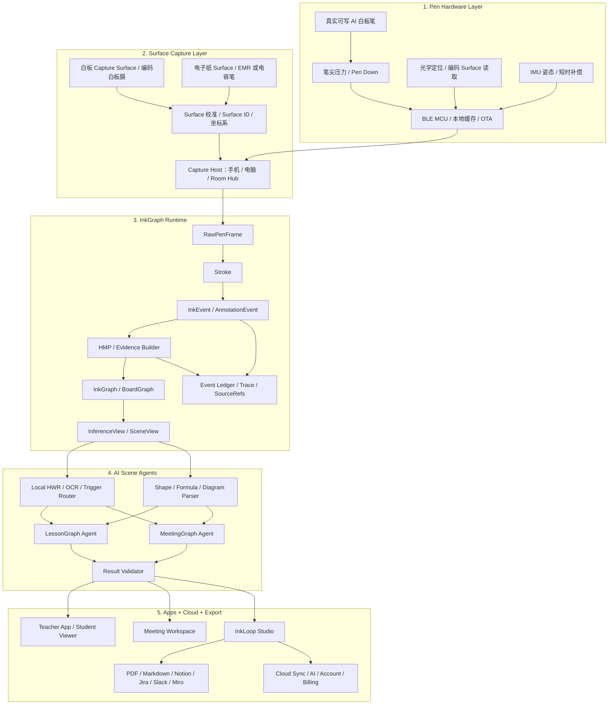
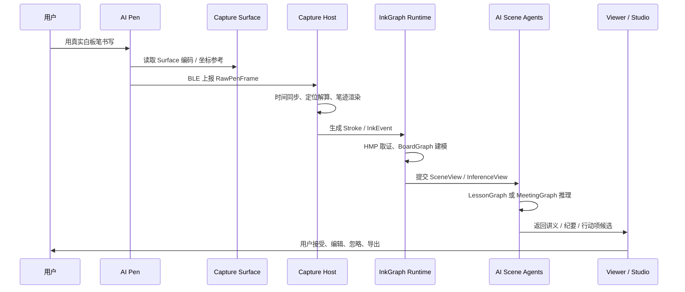
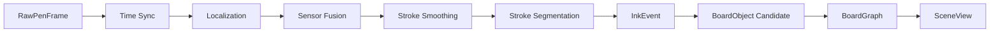
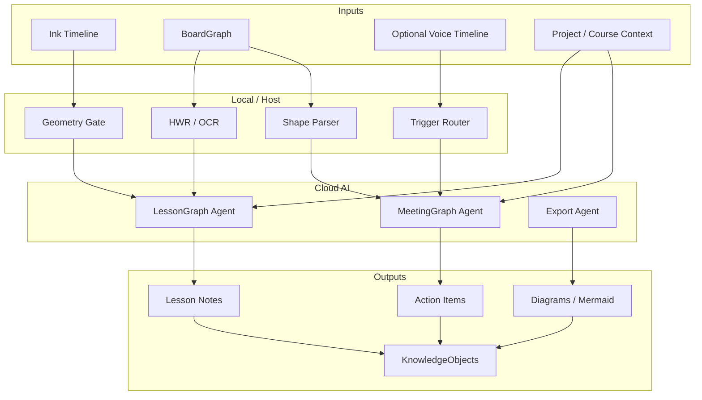
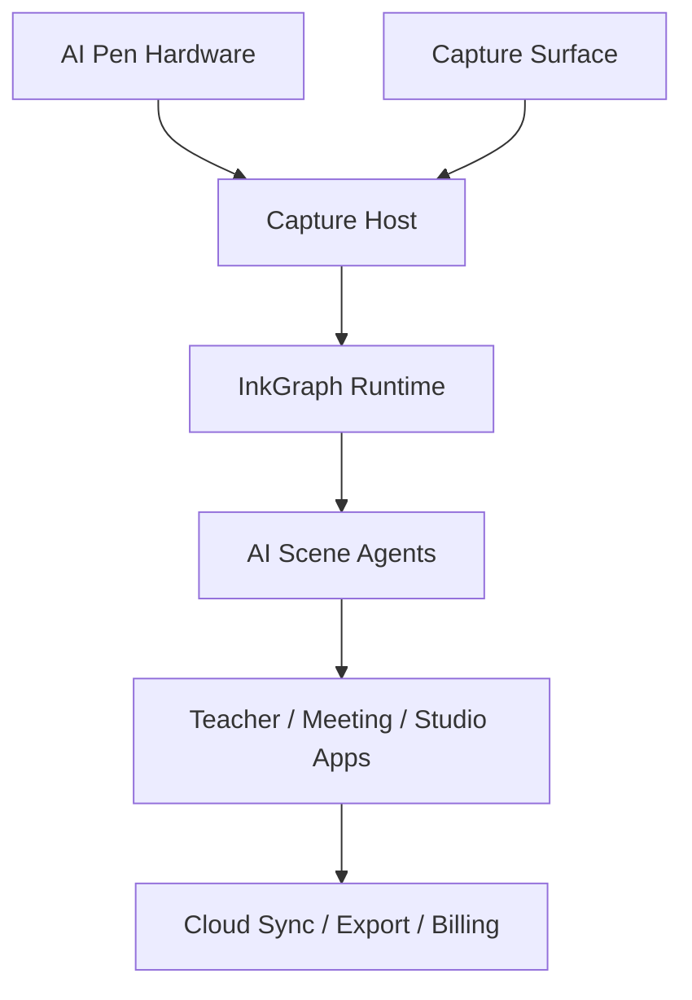
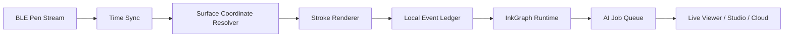

<!-- Source file: 00_README.md -->

# InkLoop AI Pen Kickstarter 文档包

版本：v0.1  
日期：2026-07-02  
目标：把“AI 笔 + 教育 + 商务会议 + 10 月底 Kickstarter 上线”的新方案落成可执行 Markdown 文档。

---

## 这包文档解决什么

这包文档把当前项目从“AI 墨水屏标注识别设备”主线，收敛为更适合 Kickstarter 首发的 **InkLoop AI Pen** 主线：

> 一支真实可写的 AI 白板笔，配合轻量 Capture Surface 和 App，把课堂与会议白板变成实时数字内容、结构化笔记、图解、决策和行动项。

核心取舍：

1. **Kickstarter 首发主角是 AI 笔，不是电子纸平板。**
2. **首发场景聚焦教育 + 商务会议。**
3. **第一硬件闭环是白板 + 真实墨水 AI 白板笔 + Capture Surface。**
4. **第二产品闭环是电子纸 + 电容笔 / EMR 笔，作为产品矩阵，不作为 10 月底众筹主承诺。**
5. **护城河不是 OCR、语音整理或普通 AI 总结，而是 InkGraph：连续笔迹事件 + Surface 坐标 + 空间关系 + 时间线 + 场景图建模 + source_refs 可追溯。**

---

## 文件目录

| 文件 | 作用 |
|---|---|
| `01_产品战略与Kickstarter总方案.md` | 产品定位、众筹主张、产品矩阵、首发范围和不承诺范围 |
| `02_系统架构设计.md` | Pen-first Surface Intelligence OS 总架构、端到端链路、现有系统复用关系 |
| `03_各模块技术方案.md` | AI 笔硬件、Capture Surface、Host/Hub、InkGraph、AI Agent、App/Cloud 等模块方案 |
| `04_AI与InkGraph数据契约.md` | RawPenFrame、InkEvent、BoardGraph、LessonGraph、MeetingGraph、KnowledgeObject 等数据契约 |
| `05_目标与里程碑_10月底Kickstarter倒排.md` | 10 月底上线倒排、Gate、KRs、周/月里程碑、验收指标 |
| `06_Kickstarter_GTM与众筹页面方案.md` | Kickstarter 页面结构、奖励档、预热、视频脚本、渠道增长和运营动作 |
| `07_风险_验收指标_降级方案.md` | 技术风险、众筹风险、供应链风险、验收指标和降级策略 |
| `08_依据与变更记录.md` | 内部文档依据、外部 Kickstarter 官方资料、从墨水屏到 AI Pen 的变更说明 |
| `InkLoop_AI_Pen_Kickstarter_方案合集.md` | 以上所有文档合并版，方便一次性阅读 |

---

## 建议阅读顺序

1. 先读 `01_产品战略与Kickstarter总方案.md`，确认方向与首发范围。
2. 再读 `02_系统架构设计.md`，确认新系统如何复用原有标注证据链。
3. 然后读 `03_各模块技术方案.md` 和 `04_AI与InkGraph数据契约.md`，给研发、硬件、AI 和前端拆任务。
4. 最后读 `05_目标与里程碑_10月底Kickstarter倒排.md`、`06_Kickstarter_GTM与众筹页面方案.md`、`07_风险_验收指标_降级方案.md`，用于执行和周会追踪。

---

## 当前版本的强制结论

### 1. 首发产品

**InkLoop AI Pen Starter Kit**

包含：

- 真实可写 AI 白板笔
- Capture Surface / 编码白板膜
- 手机 / 电脑端 Capture Host
- Live Board Viewer
- InkLoop Studio
- 教育 AI Notes
- 商务 AI Actions / Decisions / Diagrams Beta

### 2. Kickstarter 主张

英文建议标题：

> InkLoop AI Pen: Turn Real Whiteboard Writing into Live Notes, Diagrams & Action Items

副标题：

> A real dry-erase smart pen and capture surface for teachers, tutors, and hybrid teams.

### 3. 首发必须演示

| 场景 | 必须演示 |
|---|---|
| 教育 | 老师真实白板书写 → 学生端实时看清 → 课后自动讲义 / 步骤回放 |
| 商务 | 会议主持人画架构图 / 流程图 → 远程成员实时看 → 会后决策 / 行动项 / 图解导出 |

### 4. 10 月底前必须冻住的范围

必须做：

- 单笔真实书写
- A3/A2 Capture Surface 稳定捕捉
- Web / Desktop 实时白板
- Session 录制和回放
- 教育讲义生成
- 商务行动项 / 决策候选生成
- source_refs 可追溯
- Kickstarter 真实原型视频

暂不承诺：

- 任意普通白板无配置适配
- 完美多笔多色
- 深度 Zoom / Teams API 集成
- 完美公式识别
- 完整电子纸平板首发交付
- 全本地 LLM

---

## 工作口径

这包文档是 Kickstarter 倒排版，不是长期理想版。所有内容服务于一个硬目标：

> 2026 年 10 月底正式上线 Kickstarter，且页面、原型、供应链、演示、GTM 和风险披露足够可信。


---


<!-- Source file: 01_产品战略与Kickstarter总方案.md -->

# InkLoop AI Pen 产品战略与 Kickstarter 总方案

版本：v0.1  
日期：2026-07-02

---

## 1. 战略结论

当前项目应从“AI 墨水屏标注设备”升级为：

# Pen-first Surface Intelligence Platform

第一款众筹产品为：

# InkLoop AI Pen

一句话定位：

> 一支真实可写的 AI 白板笔，把课堂和会议白板变成实时数字内容、结构化笔记、图解、决策和行动项。

Kickstarter 首发不应主推电子纸平板。电子纸方案继续保留为第二产品闭环，但不要让它成为 10 月底众筹的交付包袱。

---

## 2. 为什么首发必须是 AI 笔

### 2.1 需求更直观

教育和商务会议里的白板痛点非常容易被视频解释：

- 老师写公式，学生端实时看清。
- 课后自动生成步骤讲义。
- 产品 / 工程团队画架构图，远程同事同步看。
- 会后自动生成决策、风险和行动项。

这比“AI 墨水屏标注设备”更适合 Kickstarter，因为视频第一眼能懂。

### 2.2 技术可复用

原方案里最有价值的部分不是电子纸硬件本身，而是：

```text
Stroke
→ AnnotationEvent
→ HMP / Evidence Builder
→ MarkGraph
→ InferenceView
→ AI Result
→ ScreenOverlay
→ KnowledgeObject
```

新方案应把这套链路抽象为：

```text
RawPenFrame
→ Stroke
→ InkEvent
→ HMP / Evidence Builder
→ InkGraph / BoardGraph
→ SceneView / InferenceView
→ LessonGraph / MeetingGraph
→ KnowledgeObject
```

也就是说，原系统不是推倒重来，而是从“电子纸文档标注系统”上升为“笔迹事件与 Surface 智能建模平台”。

### 2.3 众筹故事更强

Kickstarter backer 不会先买复杂架构，他们先买一个能感知的改变：

> 我还是用真实白板笔写，但内容自动数字化、实时共享、会后整理。

这比“买一台新的电子纸平板”更有记忆点，也更容易拉开和 reMarkable、Supernote、Boox、Kindle Scribe 的差异。

---

## 3. 首发产品定义

## InkLoop AI Pen Starter Kit

| 模块 | 描述 |
|---|---|
| AI 白板笔 | 真实可写、可替换白板笔芯、内置定位 / IMU / MCU / BLE |
| Capture Surface | 可贴在普通白板上的轻量定位膜 / 捕捉 Surface |
| Capture Host | 手机 / 电脑 App，接收笔迹流、渲染白板、缓存 session |
| Live Board Viewer | 学生 / 远程成员通过链接实时看白板 |
| InkLoop Studio | 会后回放、编辑、AI 结果确认、导出 |
| AI Lesson Notes | 教育场景：步骤讲义、公式说明、课程回放 |
| AI Meeting Actions | 商务场景：会议纪要、决策、风险、行动项、图解 Beta |

---

## 4. 产品矩阵

| 产品 | Kickstarter 角色 | 用户 | 核心场景 | 形态 |
|---|---:|---|---|---|
| InkLoop AI Pen Starter Kit | 首发英雄产品 | 老师、培训师、会议主持人 | 白板书写实时捕捉 + AI 整理 | 智能笔 + Capture Surface + App |
| InkLoop AI Pen Meeting Kit | 高客单奖励档 / Beta | 产品、工程、设计、项目团队 | 会议白板 + 决策 + 行动项 | 多笔预留 + 大 Surface + 团队 Workspace |
| InkLoop Studio | 必须交付的软件核心 | 教育 / 商务通用 | 回放、编辑、导出、分享、AI 结果管理 | Web / Desktop / Mobile |
| InkLoop Cloud | 众筹后订阅 / 增值 | 高频用户 / 团队 | 同步、AI credits、团队空间、导出 | 云服务 |
| InkLoop Paper | 路线图，不做首发主承诺 | 学生、研究者、老师 | PDF 阅读标注、题解、知识沉淀 | 电子纸 + 笔 |

---

## 5. 目标用户

## 5.1 教育人群：第一切入口

### 用户画像

- 在线数学 / 理科老师
- 一对一 / 小班课补习老师
- 技术培训师 / 认证讲师
- 编程 / 工程类课程讲师
- 课程内容创作者

### 核心痛点

| 痛点 | 产品回应 |
|---|---|
| iPad 写课件不如站立白板自然 | 保留真实白板书写动作 |
| 文档摄像头 / 手机拍白板反光、遮挡、不清晰 | 笔迹对象流实时同步，不依赖拍照 |
| 软件白板写公式和推导摩擦大 | 真实白板笔 + Capture Surface |
| 课后资料整理耗时 | 自动生成步骤讲义、截图、PDF / Markdown |
| 历史课程难搜索 | 笔迹 + OCR + AI 结构化 |

### 首发承诺

> 像普通白板笔一样讲课，学生端实时看清，课后自动得到步骤化讲义和回放。

---

## 5.2 商务会议人群：高客单扩展

### 用户画像

- 软件 / 平台工程团队
- 产品经理 / 技术项目经理
- 设计 / UX / 研究团队
- 架构师 / 技术负责人
- 咨询 / 跨职能工作坊团队

### 核心痛点

| 痛点 | 产品回应 |
|---|---|
| 远程成员看不清实体白板 | Live Board 实时共享 |
| 白板内容会后丢失 | Session 录制、回放、导出 |
| 架构图 / 流程图无法转成文档 | DiagramGraph / Mermaid / SVG Beta |
| 会议决策和行动项靠人工整理 | MeetingGraph Agent |
| 软件白板不如实体白板快 | 保留实体白板输入，软件做后处理 |

### 首发承诺

> 继续用实体白板开会，让远程成员实时看清，并在会后得到可编辑的会议纪要、决策和行动项。

---

## 6. Kickstarter 首发范围

### 6.1 Must-have

| 模块 | 必须交付能力 |
|---|---|
| AI Pen | 单笔真实书写、稳定 pen down/up、坐标流、BLE 通信、本地缓存 |
| Capture Surface | A3/A2 样片稳定定位，可擦写，可校准 |
| Live Board | 学生 / 远程成员通过链接看实时笔迹 |
| Session Replay | 按时间回放课程 / 会议白板 |
| 教育 AI | 课后步骤讲义、截图、关键词、可编辑结果 |
| 商务 AI | 行动项、风险、决策、会议摘要候选 |
| Studio | 历史 session、回放、AI 结果确认、导出 |
| Trace | AI 结果可反查笔迹、区域、时间戳、source_refs |

### 6.2 Should-have

| 模块 | 能力 |
|---|---|
| 公式识别 | 常见数学表达式转 LaTeX / 文字说明 |
| 图形识别 | 方框、箭头、流程图、架构图节点关系 |
| Markdown 导出 | 课程讲义 / 会议纪要导出 Markdown |
| PDF 导出 | 课后讲义 PDF |
| Mermaid 导出 | 商务图解 Beta |
| 云同步 | 基础账号和 session 云端备份 |

### 6.3 Could-have / Stretch

| 模块 | 能力 |
|---|---|
| 多笔多色 | Meeting Kit Beta |
| 专用 Room Hub | 商务会议室扩展 |
| Slack / Notion / Jira | 先做导出或半自动 adapter，不做深度承诺 |
| 电子纸闭环 | Roadmap / Developer Preview |
| 任意白板适配 | 后续研发路线，不作为首发承诺 |

### 6.4 明确不承诺

- 不承诺在任意普通白板上无需 Capture Surface 即可高精度定位。
- 不承诺 10 月底完成完整电子纸平板交付能力。
- 不承诺完美识别所有手写、公式、图形和语音。
- 不承诺首发即深度接入 Zoom / Teams / Google Meet API。
- 不承诺多笔多色作为基础档稳定交付。

---

## 7. 推荐 Kickstarter 标题与主张

### 标题

> InkLoop AI Pen: Turn Real Whiteboard Writing into Live Notes, Diagrams & Action Items

### 副标题

> A real dry-erase smart pen and capture surface for teachers, tutors, and hybrid teams.

### 中文内部主张

> 像普通白板笔一样写，远程实时看清，会后自动生成讲义、会议纪要、图解和待办。

### 30 秒电梯稿

InkLoop AI Pen lets teachers and teams keep using real whiteboards while capturing every stroke digitally. Write with real dry-erase ink, share the board live, replay the session, and let AI turn lessons and meetings into notes, diagrams, decisions, and action items.

---

## 8. 奖励档建议

| 档位 | 内容 | 目标 |
|---|---|---|
| Supporter | 感谢、内测社区、软件 beta 资格 | 建社区 |
| Educator Early Bird | 1 支 AI Pen + A2 Capture Surface + App + AI credits | 主销量、限量制造稀缺 |
| Educator Kit | 1 支 AI Pen + 大 Surface + 更高 AI credits | 标准档 |
| Meeting Kit Beta | 2 支 AI Pen + 大 Surface + Team Workspace | 高客单、商务场景验证 |
| Founder Edition | 限量编号、API/SDK 早期权限、Founder 社群 | 高信任用户 |
| Pilot Pack | 5-10 套试点包 | 小机构、培训团队、创业团队 |

> 定价必须用 BOM、运费、坏件率、售后 buffer、Kickstarter 平台费和 Stripe 支付处理费倒推，不能只按心理价定。

---

## 9. 成功定义

10 月底上线时，成功不是“页面写得好看”，而是同时满足：

1. **真实原型能演示。**
2. **教育和商务两个视频 demo 能看懂。**
3. **首发范围清楚，不虚假承诺。**
4. **供应链和交付计划可信。**
5. **预热受众足以支撑首日转化。**
6. **AI 输出可追溯、可编辑、可拒绝，不是黑箱总结。**

---

## 10. 一句话战略备忘

> AI Pen 是主角。Capture Surface 是可信定位底座。InkGraph 是护城河。教育是第一切入口。商务是高客单扩展。电子纸是第二闭环，不是首发包袱。


---


<!-- Source file: 02_系统架构设计.md -->

# InkLoop AI Pen 系统架构设计

版本：v0.1  
日期：2026-07-02

---

## 1. 架构结论

新系统采用：

# InkLoop Surface Intelligence OS

这是一个 **Pen-first** 的多 Surface 智能建模系统。第一 Surface 是真实白板，第二 Surface 是电子纸。系统不以聊天框为入口，而以 **真实书写动作** 为入口。

核心闭环：

```text
真实书写
→ 笔端采集
→ Surface 坐标定位
→ 笔迹事件化
→ InkGraph 建模
→ 教育 / 会议场景 AI
→ 讲义 / 纪要 / 决策 / 行动项
→ 用户确认后进入 KnowledgeObject
```

---

## 2. 总体架构图



---

## 3. 系统分层

| 层级 | 职责 | 不承担的职责 |
|---|---|---|
| Pen Hardware Layer | 真实书写、pen down/up、定位读取、IMU、通信、缓存 | 不做复杂 AI，不做长期知识管理 |
| Surface Capture Layer | 提供稳定坐标系、Surface ID、校准、尺寸映射 | 不承担业务语义 |
| Capture Host / Hub | 接收 BLE、时间同步、实时渲染、session 缓存、AI job queue | 不把硬件信号直接暴露给 AI |
| InkGraph Runtime | 将笔迹事件化、对象化、关系化，生成可追溯 scene graph | 不生成最终业务结论 |
| AI Scene Agents | 识别文字、公式、图形、步骤、决策、行动项 | 不伪造 source_refs，不直接吐裸坐标 |
| Studio / Cloud / Export | 回放、编辑、导出、同步、权限、计费 | 不把外部工具当唯一真相源 |

---

## 4. 两个产品闭环

## 4.1 闭环一：白板 + 真实墨水 AI 笔

这是 Kickstarter 首发主闭环。

| 模块 | 设计 |
|---|---|
| 使用方式 | 老师 / 会议主持人在真实白板或 Capture Surface 上正常写 |
| 核心硬件 | AI 白板笔、Capture Surface、手机 / 电脑 Host |
| 核心价值 | 实时数字化、远程可见、回放、AI 结构化 |
| 首发人群 | 在线老师、培训师、产品 / 工程 / 设计会议团队 |
| 首发边界 | 单笔、单 Surface、教育 + 商务双 demo |

### 端到端链路



---

## 4.2 闭环二：电子纸 + 电容笔 / EMR 笔

这是第二产品闭环，不作为 Kickstarter 首发主承诺。

| 模块 | 设计 |
|---|---|
| 使用方式 | 用户在电子纸上读 PDF、写题、批注、画图 |
| 核心硬件 | 电子纸设备、电容笔或 EMR 笔、本地 Runtime Host |
| 核心价值 | 阅读标注、题目推导、知识卡片、本地知识沉淀 |
| 复用模块 | InkEvent、SurfaceIndex、HMP、MarkGraph、InferenceView、KnowledgeObject |
| 差异 | 电子纸自带精确坐标和文档上下文，不需要白板定位膜 |

### 与白板闭环的关系

白板闭环解决“实时教学和会议协作”。电子纸闭环解决“个人学习、研究、备课和文档标注”。两者共享同一套 InkGraph 和 Knowledge Runtime。

---

## 5. 核心运行时链路

```text
RawPenFrame
→ Time Sync
→ Surface Coordinate Resolver
→ Sensor Fusion
→ Stroke Smoothing
→ Stroke Segmentation
→ InkEvent
→ HMP / Evidence Builder
→ BoardObject Candidate
→ BoardGraph
→ SceneView / InferenceView
→ AI Agent
→ Result Validator
→ KnowledgeObject
```

---

## 6. Capture Runtime 模块图



### 关键职责

| 模块 | 职责 |
|---|---|
| Time Sync | 对齐笔、Host、语音、视频、AI job 时间戳 |
| Localization | 将光学 / Surface / IMU 数据转为 Surface 坐标 |
| Sensor Fusion | IMU 补偿丢点、手抖、短时失锁 |
| Stroke Smoothing | 平滑笔迹但保留公式、箭头、草图细节 |
| Stroke Segmentation | 切分字、词、公式、图形、箭头和区域 |
| Eventization | 生成稳定 InkEvent，进入事件账本 |
| Replay | 支持课程 / 会议按时间回放 |

---

## 7. InkGraph Runtime：护城河核心

InkGraph 不只是 OCR 前处理，而是把连续书写过程恢复成人类正在构建的空间模型和语义模型。

### 对象层级

| 层级 | 对象 | 示例 |
|---|---|---|
| Stroke | 原始笔画 | 一条线、一个字母、一段公式 |
| Glyph / Word | 字符或词 | `x^2`、API、用户登录 |
| Shape | 图形对象 | 方框、圆、箭头、泳道、时序线 |
| Region | 空间区域 | 题目区、推导区、结论区 |
| Relation | 空间 / 语义关系 | A 指向 B、下一步、包含、依赖 |
| Scene | 白板整体状态 | 这一堂课 / 这场会议 |
| Graph | 场景图 | LessonGraph / MeetingGraph / ArchitectureGraph |
| KnowledgeObject | 可复用知识单元 | 讲义片段、会议决策、行动项、架构草案 |

---

## 8. AI Agent 架构



---

## 9. 与现有墨水屏方案的复用关系

| 现有模块 | 复用度 | 新系统变化 |
|---|---:|---|
| `runtime-schema` | 高 | 扩展 SurfaceSession / InkEvent / BoardGraph |
| `surface-model` | 高 | 从文档页面对象扩展到白板对象 |
| `surface-web` | 高 | 做 Live Board Viewer、学生端、会议端 |
| `offline-store` | 高 | 存课程 / 会议 session、笔迹、AI 结果 |
| `sync-client` | 高 | 多端同步、断网补传、云端 cursor |
| `native-bridge` | 中高 | 从电子纸桥扩展到 Pen / Host bridge |
| `AnnotationEvent` | 高 | 升级为通用 InkEvent |
| `HMP` | 高 | 从页面取证扩展到白板 / 会议取证 |
| `MarkGraph` | 高 | 升级为 InkGraph / BoardGraph |
| `InferenceView` | 高 | 升级为 SceneView，供 AI 场景智能体消费 |
| `KnowledgeObject` | 高 | 作为讲义、纪要、任务、图解知识的统一沉淀对象 |
| 电子纸推屏桥 | 部分 | 仅用于 InkLoop Paper，不用于白板实时直播 |

---

## 10. 部署形态

| 形态 | 阶段 | 组件 |
|---|---|---|
| Web / Desktop Demo | 7-8 月 | AI Pen 模拟 / BLE 接入、Live Board、AI mock / cloud |
| Teacher Starter Kit | Kickstarter 首发 | AI Pen、A2 Capture Surface、Teacher App、Student Viewer |
| Meeting Kit Beta | Kickstarter 高客单 / Beta | 2 支 AI Pen、大 Surface、Meeting Workspace |
| Room Hub | 后续 | 多笔接收、房间绑定、会议室网络、权限 |
| InkLoop Paper | 后续 | 电子纸、EMR / 电容笔、文档标注、知识卡片 |
| InkLoop Cloud | 持续 | Auth、Sync、AI jobs、Billing、Team Workspace |

---

## 11. 架构原则

1. **笔是第一入口。** Surface 可以辅助定位，但用户心智必须是“我拿起笔写”。
2. **事件账本是真相源。** UI、AI 结果和导出物都是派生物。
3. **模型不吐坐标。** AI 只消费 SceneView 和 source_refs，坐标由前端 / Runtime 确定。
4. **证据先于推理。** HMP / InkEvent / BoardGraph 必须先稳定，再让 AI 解释。
5. **结果可编辑、可拒绝、可追溯。** 只有用户确认后的结果进入 KnowledgeObject。
6. **本地优先，云端增强。** 书写、缓存、低级识别和 source_refs 校验尽量本地；高质量讲义 / 纪要走云端。
7. **Kickstarter 首发讲清边界。** 不用“任意白板完美适配”这类高风险承诺换短期关注。


---


<!-- Source file: 03_各模块技术方案.md -->

# InkLoop AI Pen 各模块技术方案

版本：v0.1  
日期：2026-07-02

---

## 1. 模块总览



| 模块 | 核心产物 | Kickstarter 前优先级 |
|---|---|---:|
| AI Pen Hardware | 可真实写字、稳定输出坐标流的工程样机 | P0 |
| Capture Surface | A3/A2 可擦写定位 Surface | P0 |
| Capture Host | 手机 / 电脑接收、实时渲染、缓存 | P0 |
| InkGraph Runtime | InkEvent、BoardGraph、source_refs | P0 |
| Education Agent | 课后讲义、步骤回放、公式说明 | P0 |
| Meeting Agent | 行动项、决策、风险、图解 Beta | P0 |
| InkLoop Studio | 回放、编辑、导出、AI 结果确认 | P0 |
| Cloud Sync | 账号、session 同步、AI job queue | P1 |
| Room Hub | 多笔、会议室部署 | P2 / Beta |
| InkLoop Paper | 电子纸闭环 | Roadmap |

---

# 2. AI Pen Hardware 模块

## 2.1 目标

做一支 **真实可写、可替换白板笔芯、能实时输出坐标和笔迹事件的 AI 白板笔**。

## 2.2 方案

| 子模块 | 技术方案 | 10 月底必须达到 | 众筹后优化 |
|---|---|---|---|
| 笔身结构 | 3D 打印 / CNC 工程样机，白板笔芯可替换 | 可以真实写字，外观接近最终形态 | 注塑结构、重心优化、防干墨 |
| 笔芯 | 干擦白板笔芯，优先黑色 | 写感接近普通白板笔 | 多色笔芯 / 颜色识别 |
| Pen Down | 微动开关 / 压力传感器 / 电容接触 | 稳定识别落笔 / 抬笔 | 压力曲线、笔迹粗细 |
| 光学定位 | 笔尖附近小型传感器读取 Capture Surface 编码 | A3/A2 Surface 稳定出坐标 | 大尺寸、多角度容错 |
| IMU | 6 轴 IMU | 平滑、丢点补偿、姿态估计 | 动态 tip-offset 补偿 |
| MCU | BLE MCU，优先 Nordic nRF52/nRF53 或 ESP32-S3 PoC | 100Hz 以上数据上报，本地缓存 30 分钟 | 低功耗、小 PCB、OTA |
| 通信 | BLE 5.x 到手机 / 电脑 / Hub | 端到端显示 P50 < 150ms | 多笔、多房间、专用 Hub |
| 电池 | 小型锂电 + USB-C / 磁吸充电 | 连续演示 2 小时以上 | 6 小时以上真实使用 |
| 反馈 | LED + 按键 | 连接、录制、电量、模式提示 | 震动反馈、颜色模式 |

## 2.3 数据帧

```ts
type RawPenFrame = {
  pen_id: string;
  session_id: string;
  surface_id?: string;
  ts_device_ms: number;
  ts_host_ms?: number;

  tip_state: "down" | "hover" | "up";
  pressure?: number;

  optical?: {
    x_raw?: number;
    y_raw?: number;
    pattern_id?: string;
    quality: number;
  };

  imu?: {
    ax: number; ay: number; az: number;
    gx: number; gy: number; gz: number;
  };

  battery?: number;
  firmware_version: string;
};
```

## 2.4 10 月底硬件验收

| 指标 | Kickstarter Demo 目标 |
|---|---:|
| 小 Surface 坐标误差 | ≤ 5mm |
| 实时笔迹延迟 | P50 ≤ 150ms，P95 ≤ 300ms |
| 丢点率 | ≤ 1% |
| 单次连续书写 | ≥ 30 分钟稳定 |
| 电池演示续航 | ≥ 2 小时 |
| 白板墨水遮挡后可读性 | 至少完成 3 种墨水、3 次擦除循环测试 |
| 原型数量 | ≥ 5 支可演示样机，至少 2 支可外借拍摄 |

---

# 3. Capture Surface 模块

## 3.1 目标

让普通白板获得稳定坐标系统，但不把产品变成昂贵智能白板。

## 3.2 推荐路线

**编码白板 Surface / 低可见度定位膜 + 光学 AI 笔。**

产品说法：

> InkLoop works with our Capture Surface. You still write with real dry-erase ink, but the surface gives the pen the spatial reference needed for accurate digital capture.

内部口径：

> 笔为主，Surface 做极小锚定。

## 3.3 模块方案

| 子模块 | 技术方案 | 10 月底必须达到 |
|---|---|---|
| Surface 材料 | 可擦写白板膜，低反光，低可见 / 红外可见编码 | A3/A2 样片稳定可用 |
| Surface ID | 每张 Surface 有唯一 ID | App 能识别并绑定 session |
| 校准点 | 四角校准点 / QR / 标定图形 | 30 秒内完成校准 |
| 尺寸 | Starter Kit：A3/A2；Meeting Kit：A1 或拼接 | 至少 A2 可稳定演示 |
| 耐擦写 | 干擦、湿擦、酒精测试 | 早期材料测试报告 |
| 供应链 | 印刷 / 覆膜 / 裁切供应商 | 至少 2 家供应商报价 |

## 3.4 最大风险

> 白板墨水覆盖、反光、擦除残留会不会影响光学读取。

必须在 7 月完成材料样片测试，不能拖到 9 月。

测试矩阵：

| 测试 | 维度 |
|---|---|
| 墨水颜色 | 黑、蓝、红 |
| 擦除方式 | 干擦、湿擦、酒精 |
| 反光 | 暖光、冷光、窗边、会议室顶灯 |
| 角度 | 正握、侧握、低角度书写 |
| 磨损 | 100 / 500 / 1000 次擦写 |
| 尺寸 | A3、A2、A1 拼接 |

---

# 4. Capture Host / Hub 模块

## 4.1 目标

Starter Kit 不做重 Hub，用手机 / 电脑承担 Host。Meeting Kit 后续再上 Room Hub。

## 4.2 形态

| 形态 | 用户 | 技术方案 |
|---|---|---|
| Mobile Host | 老师、个人用户 | 手机接 BLE，WebView / App 渲染白板 |
| Desktop Host | 老师、会议主持人 | Mac / Windows App 接 BLE，支持屏幕共享 |
| Room Hub | 商业会议室 | 专用 Hub 接多笔、多 Surface，后续做 |
| Web Viewer | 学生、远程参会者 | 链接打开即可看实时板书 |
| Studio | 会后整理 | 回放、编辑、导出、AI 产物确认 |

## 4.3 Host 职责



## 4.4 10 月底必须做到

| 能力 | 目标 |
|---|---|
| 实时接收笔迹 | 单笔稳定，后续多笔 |
| 实时白板 Viewer | 远程链接可看 |
| Session 录制 | 笔迹按时间线回放 |
| AI 任务队列 | 课后 / 会后生成结构化结果 |
| 导出 | PDF / Markdown / PNG / 分享链接 |
| 失败降级 | 网络断了不丢笔迹，恢复后补处理 |

---

# 5. InkGraph Runtime 模块

## 5.1 目标

把连续书写过程从“点序列”变成“空间对象 + 关系图 + 场景语义”。

## 5.2 链路

```text
RawPenFrame
→ Stroke
→ InkEvent
→ HMP / Evidence Builder
→ BoardObject Candidate
→ BoardGraph
→ SceneView / InferenceView
→ AI Agent
→ Result Validator
→ KnowledgeObject
```

## 5.3 核心对象

```ts
type InkEvent = {
  event_id: string;
  trace_id: string;
  session_id: string;
  surface_id: string;
  pen_id: string;

  event_type: "stroke" | "erase" | "gesture" | "mode_change";
  bbox_norm: [number, number, number, number];
  stroke_ref: string;

  ts_start_ms: number;
  ts_end_ms: number;

  source: {
    device: "ai_pen";
    localization: "encoded_surface" | "imu_fusion" | "epaper_digitizer";
    confidence: number;
  };
};
```

```ts
type BoardObject = {
  object_id: string;
  session_id: string;
  type:
    | "text"
    | "formula"
    | "shape"
    | "arrow"
    | "diagram_node"
    | "diagram_edge"
    | "region"
    | "decision"
    | "action_item";
  bbox_norm: [number, number, number, number];
  stroke_refs: string[];
  text_candidate?: string;
  confidence: number;
};
```

```ts
type BoardGraph = {
  graph_id: string;
  session_id: string;
  nodes: BoardObject[];
  edges: Array<{
    from: string;
    to: string;
    relation:
      | "contains"
      | "points_to"
      | "next_step"
      | "depends_on"
      | "contrasts_with"
      | "assigned_to"
      | "causes"
      | "supports";
    evidence_refs: string[];
    confidence: number;
  }>;
};
```

## 5.4 运行时指标

| 指标 | 目标 |
|---|---:|
| InkEvent 生成延迟 | P95 < 50ms |
| BoardObject 候选生成 | P95 < 300ms |
| source_refs 可追溯率 | ≥ 90% |
| 30 分钟 session 不崩溃 | ≥ 95% |
| 断网缓存完整率 | ≥ 99% |

---

# 6. AI 模块

## 6.1 总原则

AI 不直接吃原始坐标，不直接猜 bbox，不直接改事实账本。AI 只消费 `SceneView / InferenceView`，输出结构化候选结果，再由 Result Validator 校验。

## 6.2 分层

| 层级 | 运行位置 | 职责 |
|---|---|---|
| Geometry Gate | Host 本地 | 识别线、圈、箭头、擦除、区域 |
| Local HWR / OCR | Host 本地优先 | 手写候选、触发词、局部文字 |
| Trigger Router | Host 本地 | 判断 `why?`、`risk`、`next`、`todo`、`=` 等是否触发 AI |
| Shape Parser | Host / Cloud | 方框、箭头、流程图、架构图 |
| Formula Parser | Cloud 优先 | 公式识别、LaTeX、推导步骤 |
| LessonGraph Agent | Cloud | 课程讲义、步骤解释、练习题草案 |
| MeetingGraph Agent | Cloud | 会议纪要、决策、风险、行动项 |
| Result Validator | Host 本地 | 校验 source_refs、confidence、引用对象 |
| Export Agent | Cloud / Host | PDF、Markdown、Mermaid、SVG 等 |

## 6.3 教育 Agent

| 模块 | 输入 | 输出 |
|---|---|---|
| Lesson Timeline | 笔迹时间线、语音可选 | 可回放课程 |
| StepGraph | 连续推导、公式、箭头、区域 | 分步骤讲义 |
| FormulaGraph | 数学 / 理科公式 | LaTeX、变量解释 |
| ConceptGraph | 标题、定义、例题、结论 | 知识点卡片 |
| Exercise Generator | 讲解路径和知识点 | 相似题 / 课后练习草案 |
| Student Share | 课程 session | 学生链接、PDF、图片 |

首发必须有：

1. Live Board
2. Lesson Notes
3. Step Replay

## 6.4 商务 Meeting Agent

| 模块 | 输入 | 输出 |
|---|---|---|
| Meeting Timeline | 笔迹时间线、会议时间轴 | 白板会议回放 |
| DiagramGraph | 架构图、流程图、箭头 | Mermaid / SVG / 可编辑图 Beta |
| DecisionGraph | 圈选、对比、结论、语音可选 | 决策记录 |
| ActionGraph | `next`、`todo`、负责人、截止时间 | 待确认行动项 |
| RiskGraph | `risk`、红框、风险区域 | 风险清单 |
| Export Adapter | MeetingGraph | Notion / Jira / Slack / Teams / Miro 后续适配 |

---

# 7. App / Studio 模块

## 7.1 Teacher App

| 功能 | 10 月 Demo | v1 交付 |
|---|---|---|
| 创建课程 session | 必须 | 必须 |
| 连接 AI Pen | 必须 | 必须 |
| 实时白板直播 | 必须 | 必须 |
| 学生链接观看 | 必须 | 必须 |
| 课程回放 | 必须 | 必须 |
| 课后讲义生成 | 必须 | 必须 |
| 公式 / 步骤识别 | Demo 可半自动 | v1 优化 |
| LMS 集成 | 不承诺 | 后续 |
| 作业 / 练习生成 | Demo 可展示 | 后续付费功能 |

## 7.2 Meeting App

| 功能 | 10 月 Demo | v1 交付 |
|---|---|---|
| 创建 meeting session | 必须 | 必须 |
| 实时白板共享 | 必须 | 必须 |
| 会议回放 | 必须 | 必须 |
| 行动项提取 | 必须 | 必须 |
| 决策 / 风险提取 | 必须 | 必须 |
| 架构图 / 流程图导出 | Demo 必须有 | v1 优化 |
| Zoom / Teams 深集成 | 不承诺 | 后续 |
| Jira / Slack / Notion | Demo 可导出，不承诺深集成 | 分阶段 |

## 7.3 InkLoop Studio

| 模块 | 职责 |
|---|---|
| Session Library | 课程 / 会议历史 |
| Replay | 按时间回放笔迹 |
| AI Results Queue | AI 讲义 / 纪要 / 行动项候选 |
| Editor | 用户接受、编辑、忽略 |
| Export | PDF、Markdown、PNG、Mermaid |
| KnowledgeObject | 被确认的内容进入知识库 |
| Trace Debug | 开发 / 内测可见，普通用户隐藏 |

---

# 8. Cloud / Sync / Export 模块

## 8.1 云端职责

| 模块 | 职责 |
|---|---|
| Auth | 用户、设备、团队空间 |
| Session Sync | 课程 / 会议 session 同步 |
| AI Job Queue | LessonGraph / MeetingGraph 任务队列 |
| Storage | 笔迹摘要、AI 结果、导出文件、source_refs |
| Billing | AI credits、订阅、团队 workspace |
| Export Jobs | PDF、Markdown、Mermaid、SVG、集成任务 |
| Admin / Telemetry | 错误、延迟、用户反馈、漏斗指标 |

## 8.2 最小上云原则

- 原始笔迹尽量本地保存。
- 云端只拿 AI 必要的 SceneView、OCR 片段、对象引用和必要上下文。
- source_refs 不可由模型编造。
- 用户可删除 session 和导出物。
- 企业版后续支持团队空间和权限隔离。

---

# 9. 研发优先级

| 优先级 | 模块 | 原因 |
|---|---|---|
| P0 | Pen 坐标流 + Live Board | 没有这个，众筹视频无法成立 |
| P0 | Capture Surface 材料验证 | 最大硬件风险，必须前置 |
| P0 | Session Replay | 教育和商务都需要，且可展示可信度 |
| P0 | Lesson Notes | 教育首发核心价值 |
| P0 | Meeting Actions | 商务首发核心价值 |
| P0 | source_refs / Trace | AI 可信度和产品护城河 |
| P1 | Formula / Diagram Parser | 增强差异化，但可半自动演示 |
| P1 | Export | Markdown / PDF / PNG 必须先做，深集成后做 |
| P2 | Multi-pen | 商务高客单需要，但不作为基础承诺 |
| P2 | Room Hub | 会议室商业化需要，众筹后验证 |


---


<!-- Source file: 04_AI与InkGraph数据契约.md -->

# InkLoop AI 与 InkGraph 数据契约

版本：v0.1  
日期：2026-07-02

---

## 1. 契约目标

InkLoop AI Pen 的数据契约必须服务三个目标：

1. **实时还原书写过程。** 每一笔都有坐标、时间、设备、Surface 和状态。
2. **让 AI 看懂场景，而不是直接猜原始笔迹。** AI 消费的是 SceneView / InferenceView。
3. **所有结果可追溯。** 讲义、纪要、行动项、图解都能反查到原始笔迹、区域、时间戳和 source_refs。

---

## 2. 事件层级

```text
RawPenFrame
→ Stroke
→ InkEvent
→ HMP / Evidence
→ BoardObject
→ BoardGraph
→ SceneView
→ AI Result
→ KnowledgeObject
```

| 层级 | 真相源 | 说明 |
|---|---|---|
| RawPenFrame | 笔端 / Host | 原始硬件帧 |
| Stroke | Capture Runtime | 一次连续落笔 |
| InkEvent | Event Ledger | 标准事件，进入账本 |
| HMP / Evidence | Evidence Builder | 手势取证，不做 AI 推断 |
| BoardObject | InkGraph Runtime | 文本、公式、图形、箭头、区域等对象 |
| BoardGraph | InkGraph Runtime | 对象之间的空间和语义关系 |
| SceneView | AI Input Builder | 给模型的精简视图 |
| AI Result | AI Agent | 候选结果，需校验 |
| KnowledgeObject | 用户确认后 | 长期知识沉淀 |

---

## 3. RawPenFrame

```ts
type RawPenFrame = {
  pen_id: string;
  session_id: string;
  surface_id?: string;

  ts_device_ms: number;
  ts_host_ms?: number;

  tip_state: "down" | "hover" | "up";
  pressure?: number;

  optical?: {
    x_raw?: number;
    y_raw?: number;
    pattern_id?: string;
    quality: number;
  };

  imu?: {
    ax: number; ay: number; az: number;
    gx: number; gy: number; gz: number;
  };

  color_id?: string;
  battery?: number;
  firmware_version: string;
};
```

### 规则

- `ts_device_ms` 必填，`ts_host_ms` 由 Host 对齐。
- `tip_state` 是笔迹切分的第一依据。
- `optical.quality` 低于阈值时可使用 IMU 短时补偿，但必须降低 confidence。
- 原始帧不直接上云，除非用户启用 debug 上传。

---

## 4. Stroke

```ts
type StrokePoint = {
  x_norm: number;
  y_norm: number;
  t_ms: number;
  pressure?: number;
  quality?: number;
};

type Stroke = {
  stroke_id: string;
  session_id: string;
  surface_id: string;
  pen_id: string;
  points: StrokePoint[];
  bbox_norm: [number, number, number, number];
  ts_start_ms: number;
  ts_end_ms: number;
  source_frame_refs?: string[];
};
```

### 规则

- 坐标一律归一化到 Surface `[0,1]`。
- `bbox_norm` 是渲染、取证和 AI 锚定的基础。
- Stroke 可本地缓存，不一定全部上云。

---

## 5. InkEvent

```ts
type InkEvent = {
  event_id: string;
  trace_id: string;
  session_id: string;
  surface_id: string;
  pen_id: string;

  event_type:
    | "stroke"
    | "erase"
    | "gesture"
    | "mode_change"
    | "session_marker";

  stroke_refs: string[];
  bbox_norm: [number, number, number, number];
  ts_start_ms: number;
  ts_end_ms: number;

  source: {
    device: "ai_pen" | "epaper" | "web_demo";
    localization: "encoded_surface" | "imu_fusion" | "epaper_digitizer" | "manual_mock";
    confidence: number;
  };

  metadata?: {
    color?: string;
    tool?: "pen" | "highlighter" | "eraser";
    mode?: "teach" | "meeting" | "paper";
  };
};
```

### 规则

- `event_id` 幂等，重复上传不能生成重复卡片。
- `trace_id` 贯穿 AI 请求、结果、导出和 debug。
- `source.confidence` 低于阈值时，AI 结果必须标注低置信或待确认。

---

## 6. HMP / Evidence

HMP 是一次手势的取证记录，只保存事实，不保存 AI 推断。

```ts
type HmpEvidence = {
  hmp_id: string;
  event_refs: string[];
  session_id: string;
  surface_id: string;

  mode: "anchored" | "self_content" | "mixed" | "unknown";
  action:
    | "underline"
    | "circle"
    | "arrow"
    | "freehand"
    | "erase"
    | "tap"
    | "write";

  target_region: [number, number, number, number];
  target_object_refs: string[];

  object_hint:
    | "text"
    | "formula"
    | "diagram"
    | "image_region"
    | "blank"
    | "unknown";

  text_hint?: string;
  crop_ref?: string;
  vector_ref?: string;
  confidence: number;

  recognition?: {
    recognizer_source:
      | "none"
      | "geometry"
      | "digital_ink"
      | "local_ocr"
      | "local_classifier"
      | "cloud_vlm_fallback";

    gate_decision:
      | "store_only"
      | "trigger_ai"
      | "ask_confirm"
      | "fallback_later"
      | "ignore";

    raw_candidates?: Array<{ text: string; score?: number; source: string }>;
    selected_text?: string;
    selected_score?: number;
    trigger_type?: string;
    fallback_reason?: string;
    latency_ms?: number;
  };
};
```

---

## 7. BoardObject

```ts
type BoardObject = {
  object_id: string;
  session_id: string;
  surface_id: string;

  type:
    | "text"
    | "formula"
    | "shape"
    | "arrow"
    | "diagram_node"
    | "diagram_edge"
    | "region"
    | "decision"
    | "risk"
    | "action_item"
    | "question";

  bbox_norm: [number, number, number, number];
  stroke_refs: string[];
  hmp_refs: string[];

  text_candidate?: string;
  normalized_text?: string;
  confidence: number;

  created_at_ms: number;
  updated_at_ms: number;
};
```

---

## 8. BoardGraph

```ts
type BoardGraph = {
  graph_id: string;
  session_id: string;
  surface_id: string;
  version: string;

  nodes: BoardObject[];

  edges: Array<{
    edge_id: string;
    from: string;
    to: string;
    relation:
      | "contains"
      | "points_to"
      | "next_step"
      | "depends_on"
      | "contrasts_with"
      | "assigned_to"
      | "causes"
      | "supports"
      | "replaces"
      | "nearby";
    evidence_refs: string[];
    confidence: number;
  }>;

  updated_at_ms: number;
};
```

---

## 9. SceneView / InferenceView

AI 不直接读取 RawPenFrame、Stroke 和内部几何分数，而读取经过蒸馏的 SceneView。

```ts
type SceneView = {
  scene_id: string;
  session_id: string;
  mode: "teach" | "meeting" | "paper";

  narrative: string;

  anchors: Array<{
    anchor_id: string;
    object_refs: string[];
    bbox_norm: [number, number, number, number];
    label?: string;
  }>;

  marked: Array<{
    object_ref: string;
    text?: string;
    object_type: string;
    confidence: number;
  }>;

  graph_summary: {
    node_count: number;
    edge_count: number;
    key_relations: string[];
  };

  time_window: {
    start_ms: number;
    end_ms: number;
  };

  recall?: Array<{
    source: "session" | "course_history" | "project_memory";
    title: string;
    snippet: string;
    source_ref: string;
  }>;

  source_refs: InkLoopSourceRef[];
};
```

---

## 10. LessonGraph

```ts
type LessonGraph = {
  lesson_id: string;
  session_id: string;
  title?: string;

  steps: Array<{
    step_id: string;
    order: number;
    kind: "definition" | "example" | "derivation" | "formula" | "diagram" | "conclusion";
    content: string;
    latex?: string;
    board_object_refs: string[];
    source_refs: InkLoopSourceRef[];
    confidence: number;
  }>;

  concepts: Array<{
    concept_id: string;
    name: string;
    explanation: string;
    source_refs: InkLoopSourceRef[];
  }>;

  exports: {
    markdown?: string;
    pdf_ref?: string;
  };
};
```

### 教育输出规则

- 每个 step 必须引用至少一个 board object 或 ink event。
- 公式识别低置信时，输出应标为 “needs_review”。
- 课后讲义默认可编辑，不直接写死为最终答案。

---

## 11. MeetingGraph

```ts
type MeetingGraph = {
  meeting_id: string;
  session_id: string;
  title?: string;

  decisions: Array<{
    decision_id: string;
    content: string;
    alternatives?: string[];
    rationale?: string;
    source_refs: InkLoopSourceRef[];
    confidence: number;
  }>;

  actions: Array<{
    action_id: string;
    content: string;
    owner?: string;
    due_date?: string;
    status: "candidate" | "confirmed" | "dismissed";
    source_refs: InkLoopSourceRef[];
    confidence: number;
  }>;

  risks: Array<{
    risk_id: string;
    content: string;
    severity?: "low" | "medium" | "high";
    source_refs: InkLoopSourceRef[];
    confidence: number;
  }>;

  diagrams: Array<{
    diagram_id: string;
    type: "architecture" | "flowchart" | "timeline" | "unknown";
    mermaid?: string;
    svg_ref?: string;
    source_refs: InkLoopSourceRef[];
    confidence: number;
  }>;
};
```

### 会议输出规则

- 行动项默认是 `candidate`，需要用户确认后再进入任务系统。
- 不能只有语音 source_ref；白板场景至少应有 ink / board source_ref。
- 图解导出 Beta 必须显式标注置信度。

---

## 12. SourceRefs

```ts
type InkLoopSourceRef =
  | {
      type: "ink_event";
      session_id: string;
      event_id: string;
      ts_start_ms: number;
      ts_end_ms: number;
      bbox_norm?: [number, number, number, number];
    }
  | {
      type: "board_object";
      session_id: string;
      object_id: string;
      object_type: string;
      bbox_norm: [number, number, number, number];
    }
  | {
      type: "audio_segment";
      session_id: string;
      start_ms: number;
      end_ms: number;
      speaker?: string;
      transcript_ref?: string;
    }
  | {
      type: "project_memory";
      memory_id: string;
      kind: string;
      title: string;
    };
```

### 校验规则

| 结果类型 | 最低 source_refs 要求 |
|---|---|
| Lesson step | 至少 1 个 ink_event 或 board_object |
| Formula explanation | 至少 1 个 formula / text / ink_event |
| Meeting decision | 至少 1 个 board_object 或 ink_event；有语音则可补 audio_segment |
| Action item | 至少 1 个 ink_event / board_object；owner / due_date 低置信时需用户确认 |
| Diagram export | 至少 2 个 diagram_node / arrow / shape 或对应 ink_event |

---

## 13. KnowledgeObject

```ts
type KnowledgeObject = {
  ko_id: string;
  workspace_id?: string;
  session_id: string;

  kind:
    | "lesson_note"
    | "formula_step"
    | "meeting_action"
    | "meeting_decision"
    | "meeting_risk"
    | "diagram"
    | "summary"
    | "question";

  title: string;
  content: string;
  status: "accepted" | "edited" | "follow_up" | "dismissed";

  source_refs: InkLoopSourceRef[];

  created_at_ms: number;
  updated_at_ms: number;
  created_by: "user" | "ai" | "system";

  export_refs?: Array<{
    target: "markdown" | "pdf" | "notion" | "jira" | "slack" | "miro";
    external_id?: string;
    url?: string;
  }>;
};
```

### 沉淀规则

- `dismissed` 不进入长期知识库。
- `accepted`、`edited`、`follow_up` 可以进入长期知识库。
- source_refs 无法反查的结果只能进入 debug，不进入可信 KnowledgeObject。

---

## 14. Result Validator

```ts
type ValidationResult = {
  ok: boolean;
  result_id: string;
  errors: Array<{
    code:
      | "missing_source_refs"
      | "broken_source_ref"
      | "low_confidence"
      | "unsupported_export"
      | "schema_mismatch"
      | "unsafe_action";
    message: string;
  }>;
  display_state: "trusted" | "needs_review" | "debug_only" | "hidden";
};
```

### 验证策略

1. schema 必须通过。
2. source_refs 必须可反查。
3. 低置信但可用的结果进入 `needs_review`。
4. 行动项、外部任务创建等必须用户确认。
5. AI 不能覆盖原始事件账本。

---

## 15. AI Prompt 输入原则

模型输入应该长这样：

```json
{
  "mode": "teach",
  "narrative": "用户在左上写了二次方程，并在下方连续推导配方步骤...",
  "marked": [
    {"object_ref": "obj_formula_12", "text": "x^2 + 2x + 1", "object_type": "formula"}
  ],
  "graph_summary": {
    "key_relations": ["formula_step", "next_step", "boxed_conclusion"]
  },
  "source_refs": [
    {"type": "ink_event", "event_id": "evt_001", "ts_start_ms": 1200, "ts_end_ms": 2500}
  ],
  "output_schema": "LessonGraph.v1"
}
```

模型不应该拿到：

- 全量原始坐标点
- 未脱敏调试日志
- 不必要的完整课程 / 会议内容
- 内部置信算法细节
- 设备密钥或用户私密配置

---

## 16. 隐私与数据边界

| 数据 | 默认处理 |
|---|---|
| RawPenFrame | 本地保存 / debug 可选上传 |
| Stroke | 本地保存，必要时摘要上云 |
| InkEvent | 本地账本，云同步可选 |
| SceneView | 可上云推理，最小化上下文 |
| OCR / HWR 结果 | 本地优先，云 fallback 需用户授权 |
| 语音 | 非首发主链路，可选接入 |
| AI 结果 | 用户空间内保存，可删除 |
| KnowledgeObject | 用户确认后沉淀，可导出 / 删除 |

---

## 17. 指标

| 指标 | 目标 |
|---|---:|
| source_refs 可追溯率 | ≥ 90% |
| AI 结果 schema 通过率 | ≥ 95% |
| AI 有用性：接受 / 编辑 / 二次追问率 | ≥ 30% |
| 行动项误触发率 | < 5% |
| 公式步骤 needs_review 标注率 | 100% 覆盖低置信结果 |
| 断网后事件补传成功率 | ≥ 99% |


---


<!-- Source file: 05_目标与里程碑_10月底Kickstarter倒排.md -->

# InkLoop AI Pen 目标与里程碑：10 月底 Kickstarter 倒排

版本：v0.1  
日期：2026-07-02

---

## 1. 北极星目标

> 在 2026 年 10 月底正式上线 Kickstarter，使用真实 AI Pen 工程样机完成教育和商务双场景演示，并在上线前积累足够的 pre-launch 受众、可信原型证据和供应链交付计划。

推荐正式上线窗口：

- 首选：2026-10-27 或 2026-10-28 美国时间
- 次选：2026-10-29
- 最晚 fallback：2026-10-30
- 不建议：2026-10-31 周六首发

---

## 2. 10 月底 Launch KRs

| 类型 | 最低门槛 | 理想门槛 |
|---|---:|---:|
| AI Pen 工程样机 | 5 支可演示 | 10 支可外借 / 拍摄 |
| Capture Surface 样片 | A2 稳定演示 | A1 / A2 两尺寸 |
| 教育 Demo | 1 个完整 5-8 分钟课程样片 | 3 个不同老师样片 |
| 商务 Demo | 1 个完整会议白板样片 | 3 个团队会议样片 |
| 试用用户 | 20 个教育用户 + 10 个商务用户 | 50 个教育 + 20 个商务 |
| 推荐语 / 证言 | 8 条可公开 | 20 条可公开 |
| Kickstarter 预热 followers | 300+ | 1,000+ |
| Email list | 1,000+ | 5,000+ |
| 付费 / 押金 / LOI | 10 个 | 50 个 |
| BOM | Starter Kit 粗 BOM 锁定 | 双供应商报价 |
| AI 有用性 | 接受 / 编辑 / 二次追问率 ≥ 30% | ≥ 40% |
| 端到端体验 | 笔迹实时 + AI 结果可追溯 | 可公开无剪辑演示 |

---

## 3. 总时间线

当前日期：2026-07-02  
距离 10 月底上线约 17 周。

| Gate | 时间 | 目标 | 不通过时降级 |
|---|---|---|---|
| G0 | 7/02-7/07 | 众筹范围冻结 | 砍掉电子纸首发承诺 |
| G1 | 7/08-7/21 | P0 AI Pen 可采点 | 缩小 Surface 尺寸，先 A3 |
| G2 | 7/22-8/10 | 教育场景端到端 Demo | AI 先半自动，笔迹必须真 |
| G3 | 8/11-8/31 | 商务 Demo + 5 支样机 | Room Hub 延后，先 Desktop Host |
| G4 | 9/01-9/20 | 试用、素材、供应链、预热页 | 没用户证据就不能加大广告 |
| G5 | 9/21-10/15 | Kickstarter 页面、视频、FAQ、披露 | 不承诺未验证功能 |
| G6 | 10/16-10/30 | Launch 冻结 + 正式上线 | 最晚 10/30 手动上线 |

---

# 4. 7 月目标：从新方向变成能跑的 AI Pen Demo

## 4.1 月目标

把产品从墨水屏主线正式切到 AI Pen Kickstarter 主线，并跑通真实笔迹到 Live Board 的第一条链路。

## 4.2 里程碑

| 日期 | 交付物 | 验收 |
|---|---|---|
| 7/05 | Kickstarter 产品范围冻结 | 只承诺 AI Pen + Capture Surface + App |
| 7/07 | 新架构 v0.4 文档冻结 | 架构、模块、数据契约统一 |
| 7/10 | PenFrame / InkEvent schema 冻结 | Web / 固件 / AI 使用同一数据结构 |
| 7/15 | P0 笔硬件样机 | 能输出 pen down/up + 坐标 / 模拟坐标 |
| 7/18 | Capture Surface 材料测试 1 | 墨水、反光、擦除、定位质量记录 |
| 7/21 | Live Board Demo | 写字能实时显示到 Web Viewer |
| 7/31 | P0 教育 Demo | 老师写 3 分钟，生成简版课后笔记 |

## 4.3 7 月必须砍掉

| 事项 | 处理 |
|---|---|
| 自研电子纸平板首发承诺 | 砍掉，放路线图 |
| 任意白板无配置适配 | 砍掉，改成 Capture Surface |
| 多笔多色 | 只做技术预留 |
| 深度 Zoom / Teams 集成 | 先用屏幕共享 + 链接 |
| 全自动公式完美识别 | 不承诺，只展示部分场景 |

## 4.4 7 月周计划

| 周 | 产品 / GTM | 硬件 | 软件 / AI | 验收 |
|---|---|---|---|---|
| 7/02-7/07 | 定位、页面主张、奖励档草案 | 硬件路线冻结 | 数据 schema 草案 | 范围冻结 |
| 7/08-7/14 | 教育 Demo 脚本 | P0 笔样机搭建 | Live Board mock | pen down/up 可见 |
| 7/15-7/21 | 首批老师访谈 | Surface 样片测试 | BLE / Web Viewer | 笔迹实时显示 |
| 7/22-7/31 | 预热视频脚本 v0 | 材料测试报告 | Lesson Notes Alpha | 3 分钟课程 Demo |

---

# 5. 8 月目标：做出 Kickstarter 能拍视频的工程样机

## 5.1 月目标

完成教育 + 商务双场景端到端演示，并做出 5 支可拍摄样机。

## 5.2 里程碑

| 日期 | 交付物 | 验收 |
|---|---|---|
| 8/05 | P1 AI Pen 结构样机 | 真实白板笔芯 + 电子模块 |
| 8/10 | Teacher App Alpha | 实时看板 + session 录制 |
| 8/15 | LessonGraph Agent Alpha | 自动生成步骤化讲义 |
| 8/20 | Meeting App Alpha | 会议白板 + 行动项候选 |
| 8/25 | MeetingGraph Agent Alpha | 生成决策 / 风险 / 行动项 |
| 8/31 | 5 支可演示工程样机 | 可拍摄、可给用户试用 |

## 5.3 8 月关键指标

| 指标 | 目标 |
|---|---:|
| 30 分钟课程 / 会议不崩溃 | ≥ 90% |
| 实时笔迹延迟 | P50 ≤ 150ms |
| AI 输出 source_refs 可追溯 | ≥ 85% |
| 教育用户试用 | ≥ 10 人 |
| 商务用户试用 | ≥ 5 组 |
| 可公开 demo 视频素材 | ≥ 10 条 |

## 5.4 8 月周计划

| 周 | 产品 / GTM | 硬件 | 软件 / AI | 验收 |
|---|---|---|---|---|
| 8/01-8/07 | 教育 landing page 初稿 | P1 结构样机 | Teacher App Alpha | 课程录制可回放 |
| 8/08-8/14 | 老师试用招募 | A2 Surface 优化 | LessonGraph Alpha | 自动讲义可编辑 |
| 8/15-8/21 | 商务 demo 脚本 | 样机小批装配 | Meeting App Alpha | 行动项候选可见 |
| 8/22-8/31 | 视频拍摄素材库 | 5 支样机 | 双场景端到端 | 可拍摄演示 |

---

# 6. 9 月目标：从 Demo 变成众筹可信资产

## 6.1 月目标

完成 Kickstarter 页面、真实原型视频、供应链证据、用户证言和 pre-launch 准备。

## 6.2 里程碑

| 日期 | 交付物 | 验收 |
|---|---|---|
| 9/05 | EVT BOM v0.1 | 核心元件、供应商、风险、交期 |
| 9/08 | 工业设计 v0.1 | 笔身、Surface 包装、Starter Kit 形态 |
| 9/10 | Kickstarter 页面草稿 | 标题、视频脚本、奖励档、FAQ |
| 9/12 | AI 使用披露草稿 | 模型、数据、隐私、人工原创部分 |
| 9/15 | Pre-launch page 准备 | Kickstarter 审核和页面内容准备 |
| 9/20 | 试用证言第一批 | ≥ 8 条可公开 |
| 9/25 | 主视频初剪 | 必须包含真实原型演示 |
| 9/30 | Launch Readiness Review | 技术、供应链、页面、素材全部过门槛 |

## 6.3 9 月关键指标

| 指标 | 目标 |
|---|---:|
| Email list | ≥ 500 |
| KS pre-launch followers | ≥ 150 |
| 公开试用证言 | ≥ 8 |
| 教育样片 | ≥ 2 |
| 商务样片 | ≥ 1 |
| BOM 完整度 | ≥ 80% |
| 供应商报价 | ≥ 2 家核心供应商 |
| Kickstarter 页面完成度 | ≥ 90% |

---

# 7. 10 月目标：上线

## 7.1 月目标

10 月只做三件事：

1. 预热转化
2. 页面最终审核
3. 正式上线

## 7.2 里程碑

| 时间 | 动作 | 目标 |
|---|---|---|
| 10/01-10/07 | Pre-launch page 公开推广 | KS followers 破 300 |
| 10/08-10/15 | 发布老师 / 会议 demo、创始人视频、FAQ | Email list 破 1,000 |
| 10/16-10/20 | 页面冻结、价格冻结、风险披露冻结 | 不再加新功能 |
| 10/21-10/24 | 媒体 / 社群 / 种子用户 launch 通知 | 首日支持名单锁定 |
| 10/27 或 10/28 | 正式上线 Kickstarter | 避免拖到周末 |
| 10/29-10/30 | 首轮 Update + FAQ + 评论维护 | 第一波信任建设 |
| 10/31 | 最后 fallback | 不建议首选 |

## 7.3 10 月 Launch 冻结清单

| 项目 | 冻结标准 |
|---|---|
| 页面标题 | 不再改主定位 |
| 奖励档 | 价格、数量、预计交付、运费策略冻结 |
| 视频 | 最终版上传，含真实原型演示 |
| 风险披露 | 定位、材料、供应链、AI 准确率、交付风险都写清楚 |
| AI 披露 | AI 使用、数据、隐私、用户控制说明完整 |
| FAQ | 兼容性、Surface、是否任意白板、续航、隐私、交付时间 |
| 供应链 | BOM、核心供应商、备选供应商、交付时间线 |
| 客服脚本 | 评论区高频问题回答模板 |

---

# 8. Launch Readiness Gate

## 8.1 技术 Gate

| Gate | 通过标准 |
|---|---|
| G-Tech-1 | 5 支样机可连续演示 30 分钟 |
| G-Tech-2 | A2 Surface 误差 ≤ 5mm |
| G-Tech-3 | Live Board P50 ≤ 150ms |
| G-Tech-4 | Session replay 稳定 |
| G-Tech-5 | AI 结果 source_refs 可追溯 ≥ 90% |

## 8.2 市场 Gate

| Gate | 通过标准 |
|---|---|
| G-Mkt-1 | Email list ≥ 1,000 |
| G-Mkt-2 | KS pre-launch followers ≥ 300 |
| G-Mkt-3 | 公开证言 ≥ 8 |
| G-Mkt-4 | 教育 / 商务 demo 均完成 |
| G-Mkt-5 | 首日支持名单 ≥ 50 人 |

## 8.3 供应链 Gate

| Gate | 通过标准 |
|---|---|
| G-Supply-1 | BOM v0.2 完成 |
| G-Supply-2 | 核心元件至少 2 家供应 / 备选 |
| G-Supply-3 | Surface 材料测试通过 |
| G-Supply-4 | 生产 / 组装路线有报价和交期 |
| G-Supply-5 | 包装、运费、售后 buffer 进入财务模型 |

---

# 9. 团队工作流

| 战线 | 核心产物 | 每周检查 |
|---|---|---|
| Product / GTM | 定位、页面、奖励档、用户证言 | 页面完成度、用户证据、预热数据 |
| Pen Hardware | 样机、Surface、BOM、供应链 | 稳定小时数、误差、材料风险 |
| Capture Runtime | BLE、实时白板、坐标、event ledger | 延迟、丢点、回放稳定性 |
| AI / InkGraph | LessonGraph、MeetingGraph、source_refs | AI 有用性、追溯率、schema 通过率 |
| Campaign Ops | Landing page、KS prelaunch、邮件、社群、视频 | leads、followers、内容发布节奏 |

---

# 10. 每周例会看板

| 指标 | 当前 | 目标 | 风险 | 下周动作 |
|---|---:|---:|---|---|
| 可演示 AI Pen 样机数 |  | 5+ |  |  |
| A2 Surface 稳定性 |  | ≤ 5mm |  |  |
| Live Board 延迟 P50 |  | ≤ 150ms |  |  |
| 30 分钟稳定 session 数 |  | ≥ 90% |  |  |
| 教育试用用户数 |  | 20+ |  |  |
| 商务试用团队数 |  | 10+ |  |  |
| 可公开证言 |  | 8+ |  |  |
| Email list |  | 1,000+ |  |  |
| KS followers |  | 300+ |  |  |
| AI 有用性 |  | ≥ 30% |  |  |
| source_refs 追溯率 |  | ≥ 90% |  |  |
| BOM 完成度 |  | ≥ 80% |  |  |

---

# 11. 最终验收定义

10 月底正式上线前，必须能现场完成：

1. 拿起 AI Pen 在 Capture Surface 上写。
2. 远端 Web Viewer 实时看到笔迹。
3. 结束 session 后回放笔迹过程。
4. 教育场景生成可编辑课后讲义。
5. 商务场景生成待确认行动项 / 决策。
6. 点击 AI 结果可反查原始笔迹区域和时间。
7. Kickstarter 页面清楚说明当前原型、交付计划和风险。


---


<!-- Source file: 06_Kickstarter_GTM与众筹页面方案.md -->

# Kickstarter GTM 与众筹页面方案

版本：v0.1  
日期：2026-07-02

---

## 1. GTM 结论

Kickstarter 页面不要讲“一个很复杂的 AI 硬件平台”，而要讲一个强场景故事：

> Write naturally on a real whiteboard. InkLoop captures your writing live and turns lessons and meetings into AI notes, diagrams, decisions, and action items.

中文内部口径：

> 像普通白板笔一样写，远程实时看清，会后自动生成讲义、会议纪要、图解和待办。

---

## 2. 众筹页面标题

### 推荐标题

> InkLoop AI Pen: Turn Real Whiteboard Writing into Live Notes, Diagrams & Action Items

### 推荐副标题

> A real dry-erase smart pen and capture surface for teachers, tutors, and hybrid teams.

### 避免标题

不要说：

- Works on any whiteboard with perfect AI transcription.
- The world’s first fully autonomous AI whiteboard pen.
- Replace every whiteboard camera, tablet, and meeting tool.

这些都容易引发信任和交付风险。

---

## 3. 页面结构

| 顺序 | 模块 | 内容 |
|---|---|---|
| 1 | Hero GIF | 老师真实白板书写 → 学生端实时显示 → AI 讲义 |
| 2 | Problem | 白板自然，但远程看不清、会后整理痛苦 |
| 3 | Product | AI Pen + Capture Surface + App |
| 4 | Education Demo | 数学 / 理科讲解 → 步骤讲义 |
| 5 | Business Demo | 架构图 / 流程图 → 决策 + 行动项 |
| 6 | How It Works | 笔迹捕捉、InkGraph、AI 整理、source_refs |
| 7 | Hardware Prototype | 原型实拍、内部结构、当前限制 |
| 8 | Software | Live Board、Replay、Studio、Export |
| 9 | Rewards | Educator Starter / Meeting Kit / Founder Edition |
| 10 | Timeline | EVT、DVT、PVT、量产、发货 |
| 11 | Risks | 定位、材料、供应链、AI 准确率、交付 |
| 12 | AI & Privacy | AI 使用、数据来源、是否上传、用户控制 |
| 13 | Team | 为什么你们能做出来 |

---

## 4. Hero 模块文案

### Hero 标题

> Turn every whiteboard session into live notes, diagrams, and action items.

### Hero 副文案

InkLoop AI Pen is a real dry-erase smart pen and capture surface for teachers, tutors, and hybrid teams. Write naturally. Share your board live. Replay every stroke. Let AI organize the session afterward.

### CTA

- Notify me on launch
- Watch the prototype demo
- See how it works

---

## 5. Problem 模块

### 教育问题

Whiteboards are still the fastest way to teach math, science, engineering, and technical topics. But remote students often cannot see clearly, and teachers spend extra time turning board work into notes, screenshots, and follow-up materials.

### 商务问题

Teams still use physical whiteboards for architecture, product planning, design reviews, and workshops. But remote teammates miss details, and the whiteboard usually becomes a blurry photo instead of editable decisions, diagrams, and action items.

### 统一洞察

The problem is not that whiteboards are outdated. The problem is that whiteboard content does not enter the digital workflow cleanly.

---

## 6. Product 模块

### What’s in the Starter Kit

- InkLoop AI Pen
- A2 Capture Surface
- Capture Host App
- Live Board Viewer
- InkLoop Studio
- AI credits for lesson notes and meeting summaries

### How It Works

```text
1. Place the Capture Surface on your whiteboard.
2. Write with real dry-erase ink.
3. InkLoop captures strokes and shares them live.
4. Replay the session anytime.
5. AI turns it into notes, diagrams, decisions, and action items.
```

---

## 7. 教育 Demo 脚本

### 目标

证明老师不用改变讲课方式，就能完成实时直播和课后讲义。

### 视频结构：60-90 秒

| 时间 | 画面 | 文案 |
|---|---|---|
| 0-10s | 老师拿起 AI Pen 在白板写公式 | “Teach naturally on a real whiteboard.” |
| 10-25s | 学生端 Web Viewer 同步显示笔迹 | “Students see every stroke live.” |
| 25-45s | 老师连续推导一个步骤题 | “InkLoop records the full reasoning process.” |
| 45-65s | Studio 回放笔迹时间线 | “Replay the lesson stroke by stroke.” |
| 65-90s | AI 生成步骤讲义 / PDF | “After class, get editable lesson notes automatically.” |

### Demo 题材建议

- 二次方程配方法
- 物理受力分析
- 化学反应式配平
- 编程架构图讲解

---

## 8. 商务 Demo 脚本

### 目标

证明实体白板可以进入团队工作流，不只是被拍照保存。

### 视频结构：60-90 秒

| 时间 | 画面 | 文案 |
|---|---|---|
| 0-10s | 会议主持人在白板画架构图 | “Keep the speed of a physical whiteboard.” |
| 10-25s | 远程成员在浏览器看到实时图解 | “Remote teammates can follow live.” |
| 25-45s | 主持人写 risk / next / todo | “Mark decisions and next steps as they happen.” |
| 45-65s | Studio 展示回放和 AI 会议结果 | “Turn board work into meeting memory.” |
| 65-90s | 导出 Markdown / Mermaid / action items | “Export diagrams, decisions, and action items.” |

### Demo 题材建议

- API Gateway → Services → Database 架构图
- 产品上线流程图
- 用户旅程图
- Sprint planning whiteboard

---

## 9. 奖励档设计

| 档位 | 内容 | 目的 |
|---|---|---|
| $5-$19 Supporter | 感谢、社区更新、wall of backers | 建社区和社会证明 |
| Educator Early Bird | 1 支 AI Pen + A2 Capture Surface + App + AI credits | 主销量，限量 |
| Educator Kit | 1 支 AI Pen + A2/A1 Surface + 更多 AI credits | 标准档 |
| Meeting Kit Beta | 2 支 AI Pen + 大 Surface + Team Workspace Beta | 高客单商务验证 |
| Founder Edition | 限量编号、Founder 社群、API/SDK 早期权限 | 高信任用户 |
| Pilot Pack | 5-10 套试点包 | 小机构 / 培训团队 / 创业团队 |

### 定价计算必须包含

- BOM
- 组装和测试
- 包装
- 运费
- 关税和税费 buffer
- 坏件率
- 售后换新
- Kickstarter 平台费
- Stripe 支付处理费
- Pledge manager / late pledge 工具成本
- AI credits 成本

---

## 10. 预热计划

## 10.1 目标

在正式上线前获得：

- 1,000+ email leads
- 300+ Kickstarter pre-launch followers
- 8+ 公开证言
- 50+ 首日潜在 backer

## 10.2 渠道

| 渠道 | 目标人群 | 内容 |
|---|---|---|
| YouTube Shorts / TikTok / Instagram Reels | 老师、创作者 | 真实书写 + AI 讲义 Before/After |
| LinkedIn | 产品、工程、设计、创业团队 | 白板会议 → 行动项 / 图解 |
| Reddit | 教育技术、online tutoring、productivity、whiteboard | 原型反馈帖，不硬广 |
| Hacker News / X | 技术团队、创业者 | “physical whiteboard to structured meeting memory” |
| Teacher communities | 在线老师、补习老师 | 试用招募、课程 demo |
| Product / Engineering communities | 商务场景 | 架构图 demo、会议后链路 |
| Email list | 所有 lead | 每周原型进展、demo、FAQ、launch 通知 |

## 10.3 内容节奏

| 时间 | 内容 |
|---|---|
| 9/01-9/07 | “Why whiteboards still win” 问题叙事 |
| 9/08-9/14 | 教育 demo 1：数学题实时直播 + AI 讲义 |
| 9/15-9/21 | 商务 demo 1：架构图 + 行动项 |
| 9/22-9/30 | 原型透明帖：硬件、Surface、限制、风险 |
| 10/01-10/07 | Pre-launch page 公开，集中导流 Notify me |
| 10/08-10/15 | 用户证言、FAQ、奖励档说明 |
| 10/16-10/24 | Launch 倒计时、Founder story、媒体 outreach |
| 10/27-10/30 | 正式上线、首日转化、评论区维护 |

---

## 11. Kickstarter 页面 FAQ

### Does it work on any whiteboard?

InkLoop works with our Capture Surface. You can place it on a regular whiteboard and write with real dry-erase ink. The Capture Surface gives the pen the spatial reference needed for accurate digital capture.

### Is it a camera?

No. InkLoop captures pen strokes directly instead of recording a video of your whiteboard. That means the system can replay strokes, search content, and generate structured notes and action items.

### Does the pen use real ink?

Yes. The goal is to preserve natural whiteboard writing. The prototype uses a real dry-erase writing module.

### Do I need the cloud?

Live capture and recording should work locally through the Host App. AI-generated notes and meeting outputs may use cloud processing in the first version. We will provide clear privacy controls and explain what data is sent.

### Will it support multiple pens?

Single-pen capture is the core Kickstarter commitment. Multi-pen and multi-color workflows are planned for Meeting Kit Beta and future versions.

### Can it export to Notion / Jira / Slack / Miro?

The first version will prioritize Markdown, PDF, PNG, and diagram exports. Deep integrations will roll out after the core capture and AI workflow is stable.

### What happens if AI is wrong?

AI outputs are editable, dismissible, and traceable. The system keeps source references to the original strokes and board regions so users can verify results.

---

## 12. AI & Privacy 披露草案

### AI Disclosure

InkLoop uses AI to help organize captured whiteboard sessions into editable lesson notes, meeting summaries, diagrams, decisions, and action item candidates. The AI does not replace the creator’s original teaching or meeting content. It processes the writing and context captured by the user’s own session.

### Data Use

By default, InkLoop aims to upload only the minimum necessary context for AI processing, such as recognized text snippets, structured scene summaries, and source references. Raw whiteboard video is not required because InkLoop captures pen strokes directly.

### User Control

Users can review, edit, accept, or dismiss AI-generated results. Only accepted or edited results are intended to become long-term KnowledgeObjects. Users should be able to delete sessions and exports.

---

## 13. 风险披露草案

需要在页面明确写：

- 当前原型状态
- Capture Surface 是必需组件
- 任意白板无配置适配不是首发承诺
- 多笔多色不是基础档承诺
- AI 识别存在错误，需要用户确认
- 供应链、材料、量产和认证可能导致延期
- 公式 / 图形识别将分阶段优化
- 深度第三方集成会分阶段推出

---

## 14. 官方 Kickstarter 运营注意事项

截至 2026-07-02，官方公开资料显示：

- Kickstarter 支持 pre-launch page，潜在 backer 可以点击 “Notify me on launch”，官方建议至少在预定上线前一周分享 pre-launch page。
- Kickstarter 项目上线是手动过程，不能预设自动定时上线。
- 项目成功后 Kickstarter 收取 5% 平台费，Stripe 收取约 3%-5% 支付处理费；未达成目标则不收取这些费用。
- Kickstarter 项目最长可设置 60 天，官方建议 30 天或更短通常更有紧迫感和成功率。
- 使用 AI 生成内容或创建 AI 技术的项目，需要在提交和项目页面中披露 AI 使用方式、哪些部分由 AI 生成、哪些部分为原创。

来源见 `08_依据与变更记录.md`。

---

## 15. Launch Day 运营脚本

### 上线前 24 小时

- 给种子用户发邮件：上线时间、奖励档、Early Bird 数量。
- 给试用用户发提醒，请他们上线后留言或分享。
- 准备评论区 FAQ 模板。
- 检查页面、奖励档、运费、风险披露、视频播放。
- 确认创始人 / 团队在线轮班。

### 上线当天

| 时间 | 动作 |
|---|---|
| T-2h | 最后一封 “launch soon” 邮件 |
| T | 手动上线 Kickstarter |
| T+5m | 邮件 blast |
| T+15m | 社交媒体发布 |
| T+30m | 私信种子支持者 |
| T+1h | 评论区第一轮答疑 |
| T+3h | 发布 short demo clip |
| T+6h | 首轮进度 update / FAQ 补充 |
| T+12h | 复盘转化、调整页面上方 FAQ |
| T+24h | 发布首日感谢 update |

---

## 16. 核心 GTM 判断

Kickstarter 的胜负点不是“AI 多强”，而是：

1. Backer 是否相信这支笔真的能写、能捕捉、能交付。
2. 老师是否一眼觉得它能省课后整理时间。
3. 团队是否一眼觉得它能让白板进入会议工作流。
4. 页面是否清楚说明限制，而不是过度承诺。
5. 上线前是否已有足够 pre-launch audience。


---


<!-- Source file: 07_风险_验收指标_降级方案.md -->

# InkLoop AI Pen 风险、验收指标与降级方案

版本：v0.1  
日期：2026-07-02

---

## 1. 风险控制总原则

10 月底 Kickstarter 不是理想产品发布，而是可信众筹发布。所有风险控制都围绕：

1. **能演示。** 原型必须真实工作。
2. **能解释。** 用户能理解为什么需要 Capture Surface。
3. **能交付。** 供应链和量产路径不能只停在概念。
4. **能降级。** 每个高风险功能都有退路。
5. **不虚假承诺。** 页面要清楚写当前限制。

---

# 2. 技术风险

| 风险 | 概率 | 影响 | 早期信号 | 降级 / 控制方案 |
|---|---:|---:|---|---|
| 光学定位不稳定 | 高 | 高 | 笔迹漂移、丢点、边缘误差大 | 缩小首发 Surface 尺寸，先 A3/A2；提升校准点密度 |
| 墨水遮挡编码 | 高 | 高 | 写过区域坐标质量下降 | 调整编码波段、图案密度、光学窗口位置；限定墨水类型 |
| Surface 反光影响读取 | 中 | 高 | 会议室灯光下 quality 下降 | 材料哑光处理；增加光学滤波；视频中展示限制 |
| 笔身太粗 / 重心差 | 中 | 中高 | 用户试写反馈差 | P0 接受偏粗；P1 优先结构、握持和重心 |
| BLE 延迟 / 丢包 | 中 | 中 | Live Board 不流畅 | Host 端补点平滑；本地缓存；必要时专用 2.4G / Hub 路线 |
| IMU 补偿漂移 | 中 | 中 | 丢定位后笔迹偏移 | IMU 仅短时补偿，不承担主定位 |
| AI 公式识别不稳定 | 高 | 中 | LaTeX 错误、步骤错误 | 先输出步骤讲义 + needs_review；不承诺完美公式识别 |
| 图形识别不稳定 | 高 | 中 | Mermaid 图错误 | 图导出设为 Beta；先输出会议纪要 / 行动项 |
| 多笔同步复杂 | 高 | 中高 | pen_id / 时间线冲突 | 首发主打单笔；Meeting Kit 多笔标 Beta |
| 云端 AI 延迟高 | 中 | 中 | 课后生成慢 | AI 后处理异步；Live Board 不依赖云端 |
| source_refs 断裂 | 中 | 高 | AI 结果无法反查 | Result Validator 拦截；无 source_refs 只进 debug |

---

# 3. 硬件与供应链风险

| 风险 | 影响 | 控制动作 |
|---|---|---|
| 关键传感器采购周期长 | 样机 / 量产延期 | 7 月锁定 2 家备选；优先买现货评估板 |
| Capture Surface 材料供应不稳定 | 成本和质量波动 | 至少 2 家印刷 / 覆膜供应商报价 |
| 结构件小批打样延期 | 视频和试用延迟 | 3D 打印 + CNC 双路线 |
| 电池和充电安全认证 | 交付风险 | 使用成熟电池和充电方案，避免首版自研复杂电源 |
| 量产装配一致性差 | 坏件率高 | EVT 阶段设计治具和测试流程 |
| 包装 / 运输损坏 | 售后成本高 | Surface 卷曲 / 平铺包装方案提前验证 |
| BOM 失控 | 毛利不足 | 每周更新 BOM，目标 BOM 不超过目标售价 45% |

---

# 4. 众筹风险

| 风险 | 表现 | 控制方案 |
|---|---|---|
| 页面像概念片 | Backer 不信 | 放真实原型无剪辑演示，展示当前限制 |
| Backer 误以为任意白板适配 | 评论区质疑 | 页面明确 Capture Surface 是必需组件 |
| AI washing | 觉得只是普通总结 | 展示 source_refs、回放、可编辑结果 |
| 奖励档定价过低 | 亏损交付 | 用 BOM + fee + shipping + failure buffer 倒推价格 |
| 功能过度承诺 | 交付延期 | 页面只承诺 Live Board、Replay、AI Notes / Actions |
| 评论区质疑隐私 | 信任下降 | 明确最小上云、用户删除、AI 可控 |
| 首日冷启动 | 排名和转化差 | 预热 email list、KS followers、首日支持名单 |
| 供应链披露不足 | Backer 担心交付 | 写清 EVT / DVT / PVT / 量产时间线 |

---

# 5. 验收指标

## 5.1 笔和定位指标

| 指标 | 10 月 Demo 目标 | v1 目标 |
|---|---:|---:|
| 实时笔迹端到端延迟 | P50 < 150ms，P95 < 300ms | P50 < 120ms |
| 定位误差 | ≤ 5mm | ≤ 2-3mm |
| 丢点率 | ≤ 1% | ≤ 0.3% |
| 采样率 | ≥ 100Hz | 120-200Hz |
| 连续演示稳定性 | ≥ 30 分钟 | ≥ 2 小时 |
| 演示续航 | ≥ 2 小时 | ≥ 6 小时 |
| 首次校准 | ≤ 2 分钟 | ≤ 30 秒 |
| 断网可用 | 本地缓存不丢 | 完整离线记录 |

## 5.2 Surface 指标

| 指标 | 10 月 Demo 目标 |
|---|---:|
| A3 / A2 定位稳定 | ≥ 95% session 可用 |
| 墨水覆盖后读取 | 3 种墨水通过基础测试 |
| 擦除循环 | ≥ 3 轮基础测试 |
| 反光场景 | 至少 3 种光照测试 |
| 校准时间 | ≤ 2 分钟 |
| 供应商报价 | ≥ 2 家 |

## 5.3 AI 建模指标

| 指标 | 教育版目标 | 商务版目标 |
|---|---:|---:|
| source_refs 可追溯率 | ≥ 90% | ≥ 90% |
| 课后讲义接受 / 编辑率 | ≥ 30% | - |
| 行动项接受 / 编辑率 | - | ≥ 30% |
| 手写文字可用率 | ≥ 80% | ≥ 75% |
| 公式识别可用率 | ≥ 70% 起步 | 非核心 |
| 图形 / 箭头识别准确率 | ≥ 75% | ≥ 80% |
| AI schema 通过率 | ≥ 95% | ≥ 95% |

## 5.4 Kickstarter 指标

| 指标 | 最低门槛 | 理想门槛 |
|---|---:|---:|
| Email list | 1,000+ | 5,000+ |
| KS pre-launch followers | 300+ | 1,000+ |
| 首日支持名单 | 50+ | 200+ |
| 公开证言 | 8+ | 20+ |
| 可公开 demo | 教育 1 + 商务 1 | 教育 3 + 商务 3 |
| 试用用户 | 30+ | 70+ |
| 付费 / 押金 / LOI | 10+ | 50+ |

---

# 6. 降级矩阵

| 功能 | 理想状态 | 降级状态 | 页面表述 |
|---|---|---|---|
| Surface 尺寸 | A1 / 大白板 | A2 / A3 Starter | “Starter Kit includes a portable Capture Surface.” |
| 白板兼容 | 任意普通白板 | 需 Capture Surface | “Works with our Capture Surface.” |
| 多笔 | 多笔多色稳定 | 单笔稳定，多笔 Beta | “Multi-pen support is planned / beta.” |
| 公式识别 | 自动 LaTeX | 步骤讲义 + 公式 needs_review | “AI notes are editable and reviewable.” |
| 图解导出 | 可编辑图形 | Mermaid / SVG Beta | “Diagram export is beta.” |
| 深度集成 | Jira / Slack / Notion API | Markdown / PDF / PNG 导出 | “Integrations will roll out after core capture.” |
| Room Hub | 专用会议室硬件 | Desktop Host / screen share | “Room workflows start with desktop sharing.” |
| 云同步 | 完整团队空间 | 本地 session + 基础账号 | “Team workspace is in development.” |
| 语音对齐 | 白板 + 语音完整对齐 | 白板为主，语音可选 | “Voice features are optional / future.” |
| 电子纸 | 第二硬件闭环 | Roadmap | “InkLoop Paper is on our roadmap.” |

---

# 7. 风险披露建议

Kickstarter 页面应写清楚：

## Prototype Status

InkLoop AI Pen is currently in functional prototype development. The campaign video shows real prototype capture, but industrial design, battery optimization, manufacturing tooling, and final certification are still ahead.

## Capture Surface Requirement

The first version requires our Capture Surface for accurate positioning. We are exploring broader whiteboard compatibility, but it is not part of the core Kickstarter commitment.

## AI Accuracy

AI-generated notes, diagrams, and action items are editable and reviewable. Recognition quality may vary depending on handwriting, lighting, board layout, and subject complexity.

## Manufacturing Risks

Final delivery depends on component availability, Surface material yield, assembly testing, firmware stability, certifications, and logistics. We will share updates through EVT, DVT, PVT, and manufacturing stages.

---

# 8. P0 问题处理机制

## P0 定义

以下问题为 P0，必须在上线前关闭或公开降级：

- AI Pen 无法稳定输出坐标流。
- A2 Capture Surface 在演示场景漂移严重。
- Live Board 延迟不可接受。
- 30 分钟 session 容易崩溃。
- AI 结果无法追溯 source_refs。
- 页面承诺和真实能力不一致。
- BOM / 供应链无法支持奖励档价格。

## P0 处理流程

```text
发现问题
→ 24 小时内记录 owner / 影响 / 复现方式
→ 48 小时内给出修复或降级方案
→ 7 天内关闭、降级或写入 Kickstarter 风险披露
```

---

# 9. 每周风险看板

| 风险 | 概率 | 影响 | Owner | 当前状态 | 下周动作 | 是否影响上线 |
|---|---:|---:|---|---|---|---|
| 光学定位稳定性 | 高 | 高 |  |  |  |  |
| Surface 材料 | 高 | 高 |  |  |  |  |
| 笔身结构 | 中 | 中 |  |  |  |  |
| BLE 延迟 | 中 | 中 |  |  |  |  |
| AI 有用性 | 中 | 高 |  |  |  |  |
| source_refs | 中 | 高 |  |  |  |  |
| BOM | 中 | 高 |  |  |  |  |
| Prelaunch followers | 中 | 高 |  |  |  |  |
| Kickstarter 页面审核 | 中 | 中 |  |  |  |  |

---

# 10. 最终上线判断

只有同时满足以下条件，才建议正式上线：

1. **真实原型可信。** 视频里不是纯概念动画。
2. **首发承诺可信。** 没有把 Beta 功能写成确定交付。
3. **供应链可信。** 至少核心元件和 Surface 有报价、风险和备选。
4. **用户证据可信。** 有老师 / 团队真实试用反馈。
5. **GTM 可信。** 有足够 pre-launch followers 和 email list。
6. **风险披露可信。** 页面公开写明限制和交付风险。

如果有任何一项不满足，不是放弃上线，而是降级首发范围。


---


<!-- Source file: 08_依据与变更记录.md -->

# 依据与变更记录

版本：v0.1  
日期：2026-07-02

---

## 1. 内部文档依据

本次 AI Pen Kickstarter 文档包基于以下已上传文档重构：

| 文档 | 用途 |
|---|---|
| `技术方案总览(1).md` | 原技术主线、MVP、标注链路、会议事件链路、数据真相源 |
| `系统架构设计(1).md` | 标注驱动端云协同架构、SDK 模块、会议时间轴、核心链路职责 |
| `AI_EInk_PRD_Software_Hardware_Solution_v0.3(1).md` | AI 墨水屏 PRD、标注闭环、OCR、云端推理、硬件路线 |
| `AI墨水屏标注识别智能设备 — 完整软硬件产品方案.md` | 完整软硬件方案、竞品、OCR、硬件和路线图 |
| `飞书会议时间轴接入方案.md` | 会议时间轴、MeetingEventMark、SchemaAlignedEvent、PostProcessContext |
| `前端标注链路-技术文档(1).md` | Stroke、AnnotationEvent、HMP、MarkGraph、InferenceView、ScreenOverlay |
| `AI-Annotation-demo端侧B组接入方案.md` | 端侧 provider、Local HWR/OCR、Trigger Router、VLM fallback 策略 |
| `2026H2_目标与里程碑.md` | H2 目标、项目里程碑、样机和推广节奏 |
| `2026H2_量化目标与月度追踪.md` | 北极星指标、量化目标、月度目标和验收表 |
| `us_persona_demand_report.html` | 美国智能白板笔教育与商业人群需求拆分、早期用户判断 |

---

## 2. 外部 Kickstarter 官方资料

以下资料用于更新 Kickstarter 相关执行口径，访问日期：2026-07-02。

| 主题 | 官方资料 | 关键结论 |
|---|---|---|
| Pre-launch page | `https://help.kickstarter.com/hc/en-us/articles/360034769114-Setting-up-your-project-s-pre-launch-page` | 可设置 pre-launch page；建议至少上线前一周分享；上线是手动过程，不能自动定时；关注者可点击 Notify me on launch |
| Fees | `https://help.kickstarter.com/hc/en-us/articles/115005028634-What-are-the-fees` | 成功后 Kickstarter 收 5% 平台费，Stripe 约 3%-5% 支付处理费；未达成目标不收费 |
| Funding goal | `https://help.kickstarter.com/hc/en-us/articles/115005134293-How-to-set-the-right-funding-goal-for-your-Kickstarter-campaign` | 设定目标时应考虑费用；未达成不收取费用 |
| Project duration | `https://help.kickstarter.com/hc/en-us/articles/115005128434-What-is-the-maximum-project-duration` | 项目可持续 1-60 天；官方建议 30 天或更短通常更有紧迫感和成功率 |
| AI policy | `https://help.kickstarter.com/hc/en-us/articles/16848396410267-Can-I-use-AI-generated-content-or-create-AI-technology-in-my-project` | 使用 AI 生成内容或创建 AI 技术需披露 AI 使用方式、原创部分和 AI 生成部分 |
| Rules | `https://www.kickstarter.com/rules` | 技术项目应清楚解释产品、风险和 AI 使用方式 |

---

## 3. 从墨水屏主线到 AI Pen 主线的核心变化

| 原主线 | 新主线 |
|---|---|
| AI 墨水屏标注设备 | InkLoop AI Pen Starter Kit |
| 电子纸 / PDF 是第一 Surface | 真实白板 + Capture Surface 是第一 Surface |
| EMR / 电容笔是输入设备 | AI 白板笔是第一感知入口 |
| 主要场景是文档阅读标注 | 主要场景是教育板书 + 商务白板会议 |
| AI 输出是 overlay / 侧边卡片 | AI 输出是讲义、纪要、决策、行动项、图解 |
| MarkGraph 围绕页面标注 | InkGraph 围绕 Surface / Board / Lesson / Meeting |
| Kickstarter 叙事较难一眼看懂 | Kickstarter 视频可直接展示真实书写到 AI 产物 |

---

## 4. 保留的核心资产

这次转向不是推翻原项目，而是复用并升级：

| 原资产 | 新用法 |
|---|---|
| Stroke 采集 | AI Pen / 电子纸共享笔迹基础 |
| AnnotationEvent | 升级为 InkEvent |
| HMP | 从页面取证扩展到白板取证 |
| MarkGraph | 升级为 InkGraph / BoardGraph |
| InferenceView | 升级为 SceneView，供教育 / 会议 Agent 使用 |
| Result Validator | 校验 AI 结果 source_refs 和置信度 |
| KnowledgeObject | 统一沉淀讲义、纪要、任务、图解 |
| offline-store / sync-client | 用于 session 缓存、断网补传、多端同步 |
| native-bridge | 扩展到 Pen / Host / 电子纸 bridge |
| Adapter 思路 | Markdown / Notion / Jira / Slack / Miro 导出基础 |

---

## 5. 本次文档包新增内容

| 新增文档 | 新增内容 |
|---|---|
| `01_产品战略与Kickstarter总方案.md` | AI Pen 众筹定位、产品矩阵、奖励档和首发范围 |
| `02_系统架构设计.md` | Surface Intelligence OS、白板 + 电子纸双闭环架构 |
| `03_各模块技术方案.md` | AI 笔硬件、Capture Surface、Host、InkGraph、AI、App、Cloud 模块拆解 |
| `04_AI与InkGraph数据契约.md` | 新 RawPenFrame / InkEvent / BoardGraph / LessonGraph / MeetingGraph 契约 |
| `05_目标与里程碑_10月底Kickstarter倒排.md` | 17 周倒排、Gate、KRs、月周计划 |
| `06_Kickstarter_GTM与众筹页面方案.md` | 页面结构、视频脚本、预热、奖励档、FAQ、AI & Privacy 披露 |
| `07_风险_验收指标_降级方案.md` | 技术、众筹、供应链风险和降级方案 |

---

## 6. 决策记录

### 决策 1：首发主角从电子纸切到 AI Pen

原因：

- 视频表达更强。
- 教育和商务会议场景更清楚。
- 众筹故事更容易被 backer 理解。
- 原有标注链路可复用到 AI Pen。

### 决策 2：首发需要 Capture Surface

原因：

- 纯 IMU 定位容易漂移。
- 白板相机路线成本高且不是笔迹对象流。
- Capture Surface 能在工程可控性和用户低摩擦之间取得平衡。

### 决策 3：教育是第一切入口，商务是高客单扩展

原因：

- 教育购买链路短，个人老师和培训师能快速试用和付费。
- 商务场景收入上限高，但需要会议室部署、权限、安全和工具集成。

### 决策 4：电子纸保留为第二闭环

原因：

- 原墨水屏方案仍有价值。
- 电子纸适合个人学习、研究、备课和文档标注。
- 但 10 月底 Kickstarter 不应承诺完整电子纸硬件交付。

---

## 7. 待继续补充

| 待补充项 | Owner | 建议截止 |
|---|---|---|
| AI Pen 粗 BOM v0.1 | 硬件 | 2026-07-10 |
| Capture Surface 材料测试报告 | 硬件 / 供应链 | 2026-07-18 |
| PenFrame / InkEvent schema 正式版 | 软件 / 固件 | 2026-07-10 |
| Teacher Demo 视频脚本 | GTM / 产品 | 2026-07-15 |
| Meeting Demo 视频脚本 | GTM / 产品 | 2026-08-05 |
| Kickstarter 奖励档价格模型 | GTM / 财务 | 2026-08-15 |
| AI & Privacy 详细披露 | 产品 / 法务 | 2026-09-12 |
| 供应链 EVT/DVT/PVT 时间线 | 硬件 / 供应链 | 2026-09-20 |
