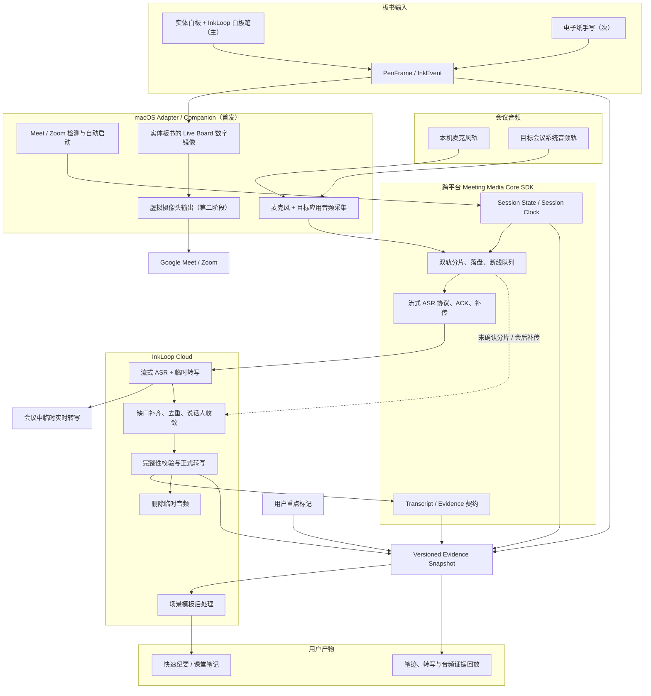

# InkLoop / No Desk AI 会议接入与自有事实链技术方案 V1

版本：v1.3
日期：2026-07-22
状态：整合技术基线，后续实施计划以本文为优先输入

> **v1.3 产品决策：完整报告已下线，脑图暂缓。** 当前后处理只生成结构化 Cards 与可读短摘要；旧完整报告仅作历史读取兼容，不生成、不展示、不产生模型费用。

## 1. 方案目标

InkLoop 需要同时完成两个方向相反、相互独立的能力：

1. **把实体板书送进会议**：老师在实体白板上使用 InkLoop 白板笔书写，Capture Surface / 传感链路取得笔迹并实时镜像到 Live Board，再把该画面作为标准摄像头画面提供给 Google Meet、Zoom，后续扩展到 Teams。电子纸手写是第二输入源，不替代实体白板主链路。
2. **把会议声音收回来**：在不要求用户购买会议平台高级套餐、不依赖平台私有媒体 API 的情况下，取得可调试、可重算的会议音频事实源。

这两条链路共用一个 macOS Companion 外壳、会话身份、权限引导和状态界面，但不能互相依赖。白板推流失败时仍可录制音频；音频处理失败时仍可共享白板。

最终课后/会后产物复用现有 InkLoop 事实链：

- 实时笔迹与页面时间线；
- 板书快照与 OCR 语义；
- 用户重点标记；
- InkLoop 自有音频转写；
- Google Meet / Zoom 转写或智能纪要（仅作对照与显式兜底）；
- 版本化 Evidence Snapshot、结构化 Cards 与可读短摘要；脑图暂缓，完整报告下线。

## 2. 原始方案与现有系统的差异

| 维度 | No Desk AI 原始方案 | InkLoop 当前能力/既定边界 | 整合结论 |
| --- | --- | --- | --- |
| 总体架构 | 虚拟摄像头、系统音频采集、课后处理三模块 | 已有 Live Board、笔迹回放、OCR、Provider 转写与会议后处理 | 采用三模块方向，但新增 Companion 后接入现有事实链，不另建课后处理孤岛 |
| 板书画面来源 | 白板摄像头视频 | AI Pen、Capture Surface、Live Board 与电子纸输入能力 | 实体白板上的 AI Pen 笔迹是首要输入；Live Board 是其实时数字镜像和投影视图，不是替代实体白板；电子纸手写为第二输入源，摄像头画面只作可选上下文 |
| 虚拟摄像头 | 注册为标准 UVC，macOS 以 CMIO System Extension 表述 | 仓库没有 macOS 原生目标或虚拟摄像头实现 | 作为独立阶段；按目标 macOS 版本研究 Camera Extension / Core Media I/O 正式路线，不预设为 UVC |
| 音频来源 | 系统扬声器 loopback 混音 | 既定需求要求可区分本地与远端、可重转写 | 采用麦克风＋目标会议系统音频双轨；原始轨独立本地保存 |
| Chrome Meet 音频范围 | 全系统输出 | 全系统音频会混入通知、音乐与其他标签 | 优先隔离 Chrome Meet 会议源；不能隔离时明确标为混合来源，不得伪装为完整会议事实 |
| ASR 定位 | 背景称首版不重复建设，正文又主张自建 ASR 和实时转写 | 已有会后后处理和 Artifact 管线，但没有实时 ASR 媒体链 | 首阶段即接入可替换的流式 ASR Provider；会议中输出临时转写，会后只做缺口补齐、正式收敛和智能纪要，不要求首版训练自有模型 |
| 说话人 | 系统混音，后续增强分离 | 已有远端聚类与身份信息基础 | 麦克风轨天然标记本机；远端轨做 diarization，并结合已知参会人和上下文自动匹配；低置信保留匿名标签 |
| 数据保留 | 未明确原始音频生命周期 | 已确定本地长期保留、云端转写成功校验后删除 | 采用本地权威源＋云端临时对象，保留删除状态与审计事件 |
| 平台范围 | macOS、Windows，Meet/Zoom/Teams | 首阶段选择 macOS、Chrome Meet、Zoom 桌面端 | 首发只实现 macOS Adapter，但会话、音频分片、流式传输、时间轴和 Evidence 数据流进入跨平台 Core SDK；后续平台只实现能力适配层 |
| 启动体验 | 日常启动 App 后直接工作 | 需要兼顾低心智负担、误录风险与透明状态 | 首次安装统一完成权限和“自动记录受支持会议”开关；开启后默认自动运行，不再逐场弹窗，但每次开始必须非阻塞通知并持续显示录制/转写状态，允许一键停止 |
| 后处理 | 产品验证阶段再定 | 已有 Meeting Postprocess V2、真实数据回归集、Cards 与可读摘要 | 直接扩展现有 Pipeline，新增模板路由与访谈结构；脑图暂缓，完整报告下线 |

## 3. 优缺点分析

### 3.1 原始方案的优点

1. **方向拆分正确**：板书输出与会议音频输入职责清楚，任何一条链路都能独立调试和降级。
2. **绕开平台付费和审批依赖**：不把核心体验绑定到用户的 Zoom / Google Workspace 套餐。
3. **客户端外壳复用合理**：权限检查、更新、会议检测和状态提示集中在一个桌面产品中。
4. **技术路径有行业先例**：虚拟摄像头和系统音频捕获都有 OBS 等成熟产品可参考。
5. **为跨平台保留空间**：Windows 的 WASAPI 与 macOS 的系统音频能力可落在同一抽象目标下。

### 3.2 原始方案的不足与风险

1. **ASR 范围冲突**：既说首版不建设语音识别，又要求自建、实时、流式 ASR；会导致里程碑失控。
2. **系统混音不是可靠事实源**：只录系统输出会漏掉本机麦克风，且可能混入非会议音频。
3. **板书输入关系没有说清**：实体白板书写本应是产品主场景；若只保存白板摄像头视频，会丢失 AI Pen 原始笔迹的清晰度、可编辑性和 source refs。Live Board 应是实体板书的实时数字镜像，而不是另一块虚构的输入白板。
4. **macOS 驱动描述过度简化**：虚拟摄像头的系统版本、扩展类型、签名、公证、更新和宿主兼容均需技术尖峰验证。
5. **默认后台运行仍需透明边界**：一次性系统权限可以减少操作，但若没有持续状态、即时停止、范围限制和参会人告知机制，就容易发生误录与合规风险。
6. **实时转写要求双路径可靠性**：网络抖动、分片顺序、断线恢复与字幕延迟会进入首版关键路径，因此实时发送必须与本地可靠落盘并行，不能用实时流替代原始事实保存。
7. **缺少音频、转写和云端临时对象生命周期**：无法保证隐私、重试幂等和问题复现。
8. **跨平台与三平台同时推进范围过大**：会稀释 macOS 首个可靠闭环的工程资源。

### 3.3 整合方案的优势

- 延续原方案最有价值的媒体双向架构，同时把范围压缩到可验证的 macOS 首阶段。
- 以老师在实体白板上使用 AI Pen 产生的原始笔迹作为首要板书事实；Live Board 和虚拟摄像头只是其实时数字镜像与投影。电子纸手写作为同一 InkGraph 契约下的第二来源。
- 以本地双轨音频作为可重算事实源，避免第三方转写偏差无法定位。
- 复用已落地的 Evidence Snapshot、队列、证据校验、版本 Artifact 和真实会议回归集。
- 本地落盘与实时转写并行：同一分段既写入本地事实源，又流式提交 ASR；网络失败后可从本地分段补传，不需要会议结束后从零开始处理。
- 首发实现 macOS，但平台无关的 Session、Clock、Media Chunk、Streaming、Evidence 契约进入通用 SDK，防止 Windows/Teams 扩展时复制业务链路。

### 3.4 整合方案的代价

- 新增原生 macOS Companion，是仓库当前没有的产品和发布能力。
- 系统音频隔离、时钟漂移、回声与重叠发言需要真实设备评测，而非只靠单元测试。
- 本地长期音频带来磁盘配额、加密、删除和用户支持责任。
- 双轨流式 ASR、回声/重复抑制、远端 diarization、断线补传与云端音频删除需要新的后端媒体任务链。
- 虚拟摄像头作为独立系统组件，会增加安装、公证、更新及 Meet/Zoom 兼容测试成本。

## 4. 最新总体架构

### 4.1 事实层与投影层

**事实层**长期保存能够复现与重算的源数据：

- 实体白板上的 InkLoop 白板笔产生的 PenFrame / InkEvent 与页面时间线（主板书来源）；
- 电子纸手写产生的 PenFrame / InkEvent（第二板书来源，保留设备与 surface 类型）；
- 麦克风原始轨和目标会议系统音频原始轨；
- 录制中断、暂停、权限和覆盖区间；
- 用户重点标记与手工修正；
- 每次 ASR / diarization 的版本化结果与来源。

**投影层**可以重算或替换：

- OCR 文本；
- 转写文本和说话人显示名；
- 快速纪要、访谈备忘录、教育笔记；
- Cards、可读摘要与 Markdown / PDF 导出；
- Live Board 视频帧和虚拟摄像头输出。

虚拟摄像头画面、OCR 和模型摘要都不能反过来成为唯一事实源。

### 4.2 跨平台 Meeting Media Core SDK

首发应用是 macOS，但数据流不能写死在 macOS Companion 中。通用 Core SDK 负责：

- 会话状态机、Session Clock、分片 ID、顺序、校验与 manifest 契约；
- 本地写入队列、实时发送队列、ACK、断线重连和缺片补传；
- Mic / Remote 轨道语义、覆盖区间、回声/重复标记和 transcript 版本；
- 临时 utterance、正式 utterance、Evidence Snapshot 与后处理触发协议；
- Provider 接口和平台 Adapter 接口，不直接依赖 ScreenCaptureKit、WASAPI 或某家 ASR SDK。

平台层只实现能力适配：会议检测、系统权限、麦克风/应用音频采集、安全存储和虚拟摄像头。首发实现 macOS Adapter；Windows 后续实现 WASAPI 等 Adapter，复用同一状态机和云端协议。这里抽象的是稳定的数据与生命周期，不强行统一各操作系统不同的媒体 API。

## 5. macOS 首发 Adapter 与 Companion

### 5.1 产品职责

Companion 负责：

- 检测 Chrome Google Meet 与 Zoom 桌面端会议活动；
- 首次设置完成且用户开启“自动记录受支持会议”后，在检测到会议时自动开始；同时保留手动开始入口；
- 显示非阻塞的开始通知与持续录制/转写状态，不要求逐场确认；
- 采集并独立落盘麦克风轨与目标会议系统音频轨；
- 维护统一 Session Clock，给音频分段、笔迹、快照和用户标记分配相对时间；
- 将已封存分片实时送入 ASR，并在断网时保留待补传队列；
- 在菜单栏和主界面持续显示录制、暂停、降级与错误状态；
- 会议结束后封存本地 manifest、补传缺片并触发正式转写收敛；
- 第二阶段承载虚拟摄像头扩展与画布输出。

### 5.2 会议开始与结束

首次安装向导统一申请系统所需权限，并由用户明确选择是否开启 **“自动记录并实时转写受支持的会议”**。这是长期产品偏好，不是每场会议的弹窗。开启后，开始入口包括：

1. 自动检测到支持的会议后直接启动记录与实时转写，并显示非阻塞通知；
2. 用户从菜单栏或 InkLoop 会议页手动点击“开始记录”。

用户可以全局关闭自动记录，也可以按应用关闭；自动模式只允许捕获明确识别到的目标会议应用/会话，不得退化成全天候后台录音。每次自动开始仍必须持续显示明显状态，提供暂停、立即停止和“以后不要自动记录此应用”。首次启用时应明确说明原始音频保存、实时云端处理范围及用户对参会人告知的责任；具体告知机制需按投放地区和组织政策审阅，但不以逐场阻塞弹窗增加操作负担。

检测器确认会议已经结束后 **立即自动停止**，不显示倒计时，也不要求用户再操作：

- 立即关闭新的音频采集，封存当前分片和本地 manifest；
- UI 以非阻塞通知说明“会议已结束，记录已自动停止”，并进入缺片补传与 formal 转写收敛；
- 自动停止和手动停止都写入会话事件，并记录触发停止的检测信号；
- 自动停止后不提供“继续原会议录制”。若用户确实还要记录后续内容，应手动开启一个新会话，避免把会后私人声音静默并入原会议；
- 只有明确的会议结束信号才能触发自动停止。窗口失焦、切换标签页、应用进入后台、短暂断网或音频静音都不是结束信号；各平台的明确结束条件必须在 Phase 0 实测后冻结。

偏好与会话事件至少记录：首次启用/关闭自动记录的时间与文案版本、每场自动或手动开始的会话 ID、实际采集轨道、暂停/停止动作和异常状态；只保存审计所需元数据，不在日志中复制音频或转写正文。

实时分片可在录制中上传；只有录制明确终止、manifest 封存且缺片补传完成后，才能把该次转写从 `provisional` 收敛为 `formal`。

### 5.3 双轨录制

- **Mic Track**：老师实际用于教学/开会的本机输入设备，例如 Mac 麦克风、耳麦或外接教学麦克风，主要代表本地教师或主持人。
- **Remote Track**：Zoom 应用音频或 Chrome Meet 会议音频，主要代表远端参会人。

在正常会议路由中，老师的麦克风是会议应用的**输入**，Remote Track 是会议应用播放到耳机/扬声器的**输出**，因此目标应用音频通常不包含本机老师的直送麦克风。但两种情况仍会造成重复：扬声器声音被教学麦克风再次拾取，或用户开启本地监听/使用特殊虚拟音频路由。

原始双轨始终按原样保存，AEC 和去重只生成派生的识别/合并结果，不覆盖原始事实。处理链不能简单混音或拼接两轨，必须：

1. 以 Remote Track 作为回声参考，对 Mic Track 做 AEC / 延迟估计；
2. 两轨分别进入流式 ASR，并保留各自 source refs；
3. 合并 utterance 时按时间重叠、声学指纹和文本相似度抑制残余重复；
4. 重复时默认保留 Mic Track 的本地老师发言、保留 Remote Track 的远端发言；低置信冲突标记待校验，不静默删除事实；
5. 耳机模式下仍保留双轨，因为它天然提供最干净的本地/远端分离。

优先捕获目标应用或会议源，而不是全系统音频。若目标系统版本无法精确隔离：

- 开始前明确展示实际捕获范围；
- manifest 标记 `mixed_system_audio`；
- 通知音、音乐或其他标签音频视为噪声候选，不得静默当成会议事实；
- 正式结果显示覆盖风险并允许用户裁剪区间后重新转写。

录音采用可恢复的分段容器，而不是把整场会议只写成一个直到结束才有效的大文件。每个分段应带轨道类型、单调时钟区间、校验值和关闭状态。应用异常后只损失当前未封存的最小分段。

### 5.4 时间同步

所有证据使用同一 Session Clock 映射：

- 原生采集端保存单调时钟，避免系统时间跳变影响顺序；
- 会话 manifest 记录单调时钟与 wall clock 的锚点；
- 暂停/恢复、设备切换、采样率变化和异常恢复形成显式事件；
- 音频处理保留每个分段的实际采样时长，用于检测长期漂移；
- 对齐超过验收阈值的区间降级为 `partial`，不能生成看似精确的证据跳转。

具体最大误差在技术尖峰实测后冻结，但计划必须分别覆盖起始偏差、90 分钟漂移、暂停恢复和崩溃恢复。

## 6. 云端媒体与转写链

### 6.1 首阶段模式

首阶段采用 **实时流式转写＋会后正式收敛**，而不是等会议结束后从零开始：

1. Mic / Remote Track 持续写入本地可恢复分片；
2. 已封存的短分片同时进入实时发送队列，携带 session、track、sequence、单调时钟和校验值；
3. 云端分别对两轨做流式 ASR，返回带稳定 ID 的 `provisional utterance`，会议中实时展示；
4. 客户端依据 ACK 释放发送队列；断网、乱序或服务不可用时继续本地录制，恢复后补传缺片；
5. 实时阶段持续做远端说话人聚类、回声/重复候选检测和增量主题预处理，但允许结果修订；
6. 会议结束后封存 manifest，只补传缺失或未确认分片，不重新上传和处理整场音频；
7. 服务端依据完整 manifest 完成重叠窗口重解码、标点收敛、去重、说话人聚类收敛和覆盖校验；
8. 生成 `formal Transcript / Diarization Artifact`，冻结 Evidence Snapshot；
9. 并行启动两个互不阻塞的任务：一边生成结构化 Cards 与可读短摘要，另一边删除云端临时音频和 Provider 侧临时媒体；不启动脑图或完整报告任务；
10. 云端删除失败只进入独立隐私状态与幂等重试，不能阻塞纪要可见。

实时转写与本地落盘是并行链路：实时链失败只影响“当场看见文字”，不能影响本地事实保存；本地链异常则必须立即显示降级状态。会后仍需要正式收敛，是因为流式 ASR 的尾部文字、标点、说话人和重叠发言可能被修订，但这一步是增量校验和后处理，不是会后从零再跑一遍。

“自有 ASR”在本方案中表示 InkLoop 控制采集、Provider 接缝、版本、评测和重算，不要求首版训练或自建基础语音模型。首阶段可接入第三方云端 ASR；Provider 可替换，事实层不随 Provider 改变。

### 6.2 空、缺失与部分证据

| 输入状态 | 处理规则 |
| --- | --- |
| 双轨均无有效语音，且无有效板书/重点 | 不调用纪要模型，显示“没有可用于生成纪要的证据” |
| 只有板书/重点 | 允许生成明确标记为 `partial` 的板书回顾，不声称覆盖口头讨论 |
| 只有 Mic 或 Remote Track | 允许生成 `partial` 纪要，并显示缺失轨道和覆盖区间 |
| 双轨存在局部空洞 | 保留缺失区间，相关结论不能声称完整；允许用户重传或裁剪后重算 |
| 第三方转写用于补足 | 每条补足内容保留 Provider 来源，不能与自有 utterance 混为同一可信等级 |

完整性校验阈值、最低有效语音量与 SLO 必须在 ASR Provider 尖峰和真实样本基准后冻结，不能由实现者临时猜测。

### 6.3 隐私与生命周期

- 原始双轨默认长期保存在用户 Mac 的应用容器，支持查看占用、定位、重转写和删除。
- 本地原始音频应使用系统提供的文件保护能力；应用日志不得包含音频正文、转写全文、签名 URL 或密钥。
- 上传必须加密传输；云端临时对象必须加密存储、按租户与会话隔离，并使用最小权限短期凭证或签名 URL。签名 URL、对象键、访问令牌与 Provider 凭证不得写入客户端或服务端普通日志。
- 临时对象必须同时具备应用层删除任务和服务端 TTL 生命周期规则；具体 TTL 在实施计划中冻结，超期对象不得继续用于新的处理任务。
- 仅当 Transcript / Diarization Artifact 已持久化且完整性校验达到可接受终态后，才标记云端音频可删除。
- 删除任务必须幂等，并保留不含音频内容的删除收据；删除失败需持续重试并向用户显示状态。
- 用户删除本地源文件前，界面必须说明这会失去重新转写和深度调试能力，并明确提供“仅删除原始音频”与“删除本场会议及全部派生产物”两个不同动作。后者必须按会话 ID 级联删除转写、说话人映射、Evidence Snapshot、Cards、摘要、历史兼容产物、缓存与云端临时对象，并保留不含内容的删除审计收据；仅删除原始音频时，现存派生产物必须显示其事实源已不可重算。

### 6.4 实时结果与正式结果

- 会议中显示 `provisional` 转写，允许最近一段因上下文、标点和说话人判断而修订。
- 客户端必须按 utterance 稳定 ID 做增量更新，不能把修订内容重复追加成新段落。
- 网络中断时显示“本地仍在记录，实时转写暂停”，恢复后按 sequence 补传并追平。
- 后处理只能消费明确版本的 Evidence Snapshot；会议中可做增量主题预处理，但正式纪要必须基于收敛后的 `formal` 转写。
- 从停止录制到正式转写的主要剩余耗时应只来自尾部分片、缺片补传、全局说话人/去重校验和后处理，而不是整场 ASR 时长。

## 7. 场景化后处理与脑图

### 7.1 与现有管线的集成

现有 Meeting Postprocess V2 已具备：

- Evidence Snapshot 和内容指纹；
- utterance / handwriting 证据校验；
- 快速结构化卡片与兼容摘要；
- 缓存、重试、事件流和版本 Artifact；
- 五份私有真实会议回归集。

整合时扩展而不是重建：

- utterance 来源增加 InkLoop 自有 ASR 与 Provider 对照来源；
- Evidence Snapshot 增加音频覆盖、轨道、Transcript / Diarization 版本和缺失区间引用；
- 模板选择、自动身份映射、用户会后引导和重点变化进入内容指纹；
- Artifact 区分**产物类型**与**版本状态**：Cards/可读摘要是类型；临时/正式/partial 是状态；历史脑图与完整报告类型仅作读取兼容；
- 说话人姓名映射绑定具体 Diarization Artifact 与 cluster ID，由系统结合已知参会人和上下文自动匹配；低置信迁移继续使用稳定匿名标签，不设置用户确认 Gate。

### 7.2 模板优先级

第一批：

1. **会议纪要专家**：采用三层金字塔；第一层为标题、核心摘要、结论/共识、实际待办；第二层为按议题讨论脉络和关键提取；第三层只在明确战略、重要分歧或风险信号时输出 `[分析]`。
2. **访谈备忘录**：按问题和发言人组织，仅保留实质发言；数字、专有名词、具体案例、确认事项与下一步分别输出。

第二批：

3. **大学课堂笔记**：概念、定义、讲授要点、案例、教师强调、问答、联系、复习主题、记忆辅助和可能考题。
4. **互动课堂**：按教学时间顺序组织术语、公式、例子与复习问题，过滤与课程无关内容。

“推理总结”是模板推荐和内部结构路由能力，不作为独立用户模板。

### 7.3 配置门与正式版本

- 会议中持续显示 **provisional 实时转写**；会议结束后音频补传与 formal/partial 转写收敛继续后台运行。
- 正式后处理前，用户先选择模板，并可选填“当场结论、最深感受、关注痛点”；这些内容标为 `user_supplied`，只引导优先级和组织方向，未获转写或板书支持时不得写成 confirmed fact/decision。
- 模板配置已提交且 formal 或明确 partial 转写已收敛后，自动生成**正式 Cards 与可读摘要**；说话人无需人工确认，低置信身份保留稳定匿名标签。
- 所有版本均保留，正式版本不覆盖临时版本。
- 脑图暂不生成；完整报告已下线。旧 schema 仅作历史读取兼容，旧生成 API 返回 `410 full_report_retired`。

### 7.4 脑图（暂缓）

脑图当前不生成、不展示。以下确定性投影约束保留为后续恢复能力时的设计输入：

- 中心节点为会议或课程主题；
- 会议节点来自结论、讨论、行动、风险和待确认；
- 访谈节点来自问题、受访者观点、洞察和后续行动；
- 教育节点来自概念、案例、问答和复习任务；
- 每个内容节点保留稳定 ID、排序和 source refs；
- 缺失类别直接省略，不生成空节点；
- 同时提供可访问的树形大纲视图，不能只依赖二维画布；
- 每个节点可跳转到转写时间或板书位置。

各模板必须输出足以确定性生成脑图的结构化契约；不得从最终 Markdown 反向猜结构。

## 8. 白板推流与虚拟摄像头

### 8.1 输出内容

这里的“Live Board 数字画布”是老师实体板书的实时数字镜像，不是让老师改到电脑画布上书写。来源优先级固定为：

1. 老师用 InkLoop 白板笔在实体白板上书写，由白板笔与配套捕获链路产生 PenFrame / InkEvent；
2. 会议场景中的电子纸手写，使用同一 InkGraph 契约但保留不同 surface 来源；
3. 白板摄像头或普通视频只作为可选视觉上下文，不替代前两类结构化笔迹。

虚拟摄像头默认把上述笔迹实时渲染成 Live Board 数字镜像：

- 矢量笔迹清晰、无摄像头透视与反光；
- 支持品牌边框、当前页、指示光标和可选教师小窗；
- 可以按会议分辨率输出稳定帧率；
- 画面是事实层的实时投影，不参与课后事实判定。

Google Meet 会把本机自己的摄像头预览左右镜像，但不会把同一虚拟摄像头媒体流镜像后发送给远端。包含板书文字的场景禁止为了修正本机预览而翻转 OBS / Camera Adapter 输出，否则远端参会者会看到真正的反字。Companion 提供单独的“教师监看（正向）”入口；会议软件侧优先隐藏或缩小自预览，远端方向必须通过第二参会端验收。

若硬件链路包含笔上摄像头或独立白板摄像头，其识别结果可以参与产生/校正 PenFrame，原始画面也可作为可选背景；但课后结构化板书仍以带设备、surface、坐标和时间戳的 InkEvent 为权威事实，而不是只保存视频像素。

### 8.2 macOS 路线

不提前把实现锁死为“UVC 驱动”。技术尖峰需针对目标最低 macOS 版本验证：

- Apple 支持的 Camera Extension / Core Media I/O 路线；
- Companion 与 Extension 间的帧传输方式；
- 签名、Entitlement、公证、安装、启用、升级和卸载；
- Zoom 桌面端和 Chrome Meet 的设备枚举、休眠恢复与版本兼容；
- 用户首次选择、默认摄像头记忆和故障降级。

虚拟摄像头属于独立第二阶段；首阶段继续通过 Live Board 链接或屏幕共享提供实时板书。

## 9. 用户体验状态

### 9.1 会议内

| 状态 | 用户必须知道 | 主要操作 |
| --- | --- | --- |
| 首次设置 | 系统权限、自动记录范围、本地保存与实时云处理 | 启用自动记录、仅手动记录、打开系统设置 |
| 自动检测并开始 | 哪个应用、正在采集哪些来源 | 停止本场、暂停、以后不自动记录此应用 |
| 正常录制与实时转写 | 两轨状态、转写延迟、时长、磁盘空间 | 查看实时文字、暂停、停止 |
| 网络中断 | 本地仍在记录、实时文字暂停、待补传量 | 继续本地记录、停止 |
| 部分录制 | 缺失哪一轨、从何时缺失 | 继续部分录制、修复权限、停止 |
| 暂停 | 不再采集、已保存到何处 | 继续、停止 |
| 已自动停止 | 检测到会议结束、记录已停止、正在封存/收敛 | 查看实时转写、手动开始新会话 |

### 9.2 会后

| 状态 | 用户必须知道 | 主要操作 |
| --- | --- | --- |
| 补传中 | 本地源安全、缺失分片与进度 | 后台继续、查看本地文件 |
| 正式转写收敛中 | 正在校正尾部、去重和说话人 | 离开页面、稍后查看 |
| 完整性校验中 | 正在确认覆盖与缺失 | 无需等待页面 |
| 删除临时音频中 | 转写已保存、云端音频正在删除 | 查看隐私状态 |
| 待配置 | 转写仍在后台收敛、尚未选择内容链路 | 选择模板、选填结论/感受/痛点 |
| 完成 | 正式版本、证据覆盖 | 查看 Cards/摘要、修改模板或关注方向 |
| 部分成功 | 哪些来源缺失 | 查看 partial 结果、修复后重算 |
| 失败 | 失败阶段、本地源仍保留 | 重试、查看源文件、联系支持 |

## 10. 分阶段落地

### Phase 0：原生与 ASR 技术尖峰

- 冻结最低 macOS 版本。
- 验证 Zoom 应用音频和 Chrome Meet 音频的可隔离程度。
- 验证麦克风与系统音频同步、回声/重复抑制、90 分钟漂移、暂停与异常恢复。
- 评测至少两种云端流式 ASR / diarization 方案的双轨能力、临时结果修订协议、准确率、端到端延迟、成本和删除接口。
- 冻结跨平台 Core SDK 与 macOS Adapter 的职责边界，验证 sequence / ACK / 断线补传协议。
- 验证 macOS 签名、公证和权限分发路径。

退出条件：真实 Meet 与 Zoom 各完成一场不少于 45 分钟的双轨录制与实时转写；网络中断不影响本地记录，恢复后能补传追平；重复发言指标、转写延迟和不能满足的系统限制均有实测记录。

### Phase 1：自有事实链 MVP

- 跨平台 Meeting Media Core SDK：Session、Clock、双轨分片、ACK、补传、Transcript / Evidence 契约和 Provider 接口。
- macOS Companion / Adapter、一次设置向导、自动记录开关与持续状态。
- 自动检测默认启动＋手动开始入口；不使用逐场阻塞确认。
- 双轨分段录制、本地 manifest、异常恢复，以及确认会议结束后立即自动停止并封存。
- 双轨实时 ASR、回声/重复抑制、断线补传、远端 diarization、正式收敛、完整性校验和云端音频删除。
- 与现有 Meeting Session / Evidence Snapshot / Postprocess V2 接通。
- 会议纪要专家＋访谈备忘录。
- 模板/用户引导配置门、自动身份匹配与正式 Cards/摘要版本。

退出条件：Chrome Meet 与 Zoom 均能在会议中显示低延迟临时转写，会议结束后仅做增量收敛即可生成可追溯纪要；不依赖平台转写，任何缺失轨道、网络中断、重复音频、空音频和删除失败都被正确暴露。

### Phase 2：虚拟摄像头

- Live Board 稳定视频渲染与帧输出。
- Camera Extension / Core Media I/O 组件。
- 安装、启用、升级、卸载和权限引导。
- Zoom / Chrome Meet 兼容矩阵与故障降级。

退出条件：远端参会者可在两种目标平台稳定看到 InkLoop 数字白板；摄像头失败不影响录音事实链。

### Phase 3：教育模板与平台扩展

- 大学课堂笔记与互动课堂模板。
- 课程结构化复习投影；脑图待产品重新确认后再排期。
- 基于通用 Core SDK 实现 Windows Adapter，并按证据决定是否扩展 Teams 和其他浏览器。
- 在稳定实时转写之上评估实时重点、实时章节和临时摘要，不让生成式任务阻塞字幕链路。

## 11. 验收与评测框架

### 11.1 采集可靠性

- Chrome Meet、Zoom 各覆盖本机发言、远端单人、远端多人、重叠发言、耳机/扬声器切换。
- 覆盖暂停恢复、权限撤销、应用崩溃、断电/强退、磁盘不足和会议检测误判。
- 记录每轨覆盖率、静音区间、丢帧/丢样、起始偏差和长期漂移。
- 分别验证耳机模式、扬声器外放和本地监听/虚拟路由场景，记录双轨重复率、AEC 后残余重复率和误删率。

### 11.2 转写质量

- 评测中文、英文、中英混合、课堂术语、专有名词和多人重叠。
- 分别记录 Mic / Remote Track 的字错率、时间边界误差、聚类错误率和空结果率。
- 记录首字延迟、稳定文本延迟、实时修订次数、断线追平耗时，以及 provisional 到 formal 的差异率。
- 第三方会议转写不进入后处理、Evidence Snapshot 或用户结果；若研发评测需要横向比较，必须在隔离评测环境中进行，不得写入生产事实链。

### 11.3 后处理质量

- 沿用五份私有历史会议回归集，并新增双轨、访谈和板书对齐样本。
- 所有 Cards 事实必须引用有效 utterance 或 handwriting ID。
- 用户重点不得遗漏；噪声和无实质板块不得为凑模板而输出。
- 自动身份映射、模板或用户引导变化后，正式版本正确重算且旧版本可追溯。

### 11.4 性能与成本

- 分别记录实时分片封存、上传、ASR、追平、正式收敛、聚类、校验与 Cards/摘要的阶段耗时。
- 基准至少覆盖 15、45、90 分钟会议及受限上行网络。
- 记录每会议本地存储、临时云存储、ASR 与模型成本。
- 具体 SLO 在 Phase 0 基准后冻结；在冻结前不得用未经测量的“实时”“无感”作为对外承诺。

## 12. 关键风险与降级

| 风险 | 降级策略 |
| --- | --- |
| Chrome Meet 音频无法隔离单一标签 | 捕获 Chrome 应用音频并显示混合来源风险；必要时 Phase 0 评估浏览器扩展，不静默扩大捕获范围 |
| Mic 拾取扬声器或特殊音频路由造成双轨重复 | Remote 作为 AEC 参考；分轨 ASR 后再以时序、声学和文本相似度去重；低置信冲突保留并标记，不直接丢弃 |
| 网络中断或流式 ASR 不可用 | 本地双轨继续分段落盘，UI 标记实时转写暂停；恢复后按 sequence 补传追平，会后正式结果不丢失 |
| 自动检测误触发录制 | 只对白名单会议应用和明确会议状态启用；立即通知、持续状态、一键停止、按应用禁用；不允许退化为全天系统录音 |
| 系统音频权限缺失 | 只录 Mic，产物标记 partial；允许用户修复权限后下一场恢复 |
| 麦克风权限缺失 | 只录 Remote Track，产物标记 partial，不把远端聚类当作完整会议成员 |
| ASR Provider 不支持双轨 | 分轨独立提交后在 InkLoop 合并；若时间戳不可对齐则更换 Provider，不回退为不可追溯文本 |
| 自有云端 ASR 失败 | 本地双轨事实源保留，可恢复上传和重试；平台转写不得作为后处理兜底 |
| 云端删除失败 | 后台幂等重试并显示隐私状态；服务端生命周期规则作为第二层兜底 |
| 虚拟摄像头不可用 | 使用 Live Board 链接或屏幕共享，音频事实链正常工作 |
| Meet 本机自预览镜像 | 保持 Camera Adapter 正向输出，不翻转板书；隐藏/缩小 Meet 自预览，并使用 Companion 的教师正向监看窗口；第二参会端验证远端方向 |
| 磁盘空间不足 | 提前预警并停止新分段，已封存内容保持可恢复，不循环覆盖源音频 |

## 13. 需要在实施计划冻结的技术决策

1. 最低 macOS 版本与支持的硬件架构。
2. Zoom 与 Chrome Meet 的目标音频捕获边界；是否需要 Chrome Extension。
3. 音频编码、分段时长、manifest、校验与本地加密策略。
4. 流式 ASR / diarization Provider、双轨提交方式、provisional 修订协议、时长与并发限制。
5. 完整性通过、partial 和失败的可测阈值。
6. 90 分钟会议的时间同步误差与各阶段 SLO。
7. 本地保留、用户删除与级联语义、云端临时对象 TTL 和删除收据契约。
8. Chrome Meet 与 Zoom 的“明确会议结束”检测条件、误判指标与触发停止的审计事件；窗口失焦、应用后台、短暂断网和静音不得单独触发停止。
9. 现有 Evidence Snapshot 与 Artifact 的版本升级和兼容迁移。
10. 会议/访谈结构化 Schema；脑图节点映射留待能力恢复时冻结。
11. 第二阶段 Camera Extension 的安装与发布路径。
12. 自动记录的会议检测置信条件、支持应用白名单、全局/按应用开关、状态常驻和适用市场告知机制。
13. 跨平台 Core SDK 的公共契约，以及 macOS / Windows Adapter 的能力声明和降级语义。

## 14. 结论

No Desk AI 原始方案提供了正确的产品级主骨架：虚拟摄像头负责把白板画面推进会议，系统媒体采集负责把会议声音收回，两条链路共用桌面客户端但互不依赖。

InkLoop 的完整整合不应照搬“只存摄像头视频＋全系统混音＋首版训练自有 ASR”，而应升级为：

> **实体白板上的 InkLoop 白板笔为主、电子纸手写为辅＋Live Board 实时数字镜像与投影＋Mic/目标会议音频双轨＋可替换流式 ASR＋会后增量收敛与现有可追溯后处理管线。**

首发应用仍聚焦 macOS，但 Session、Clock、Media Chunk、流式传输和 Evidence 生命周期进入跨平台 Meeting Media Core SDK。按 Phase 0 技术尖峰、Phase 1 实时自有事实链、Phase 2 虚拟摄像头、Phase 3 教育模板与平台扩展推进，可以保留原方案的通用性，同时把首阶段风险、隐私和范围控制在可验证边界内。
