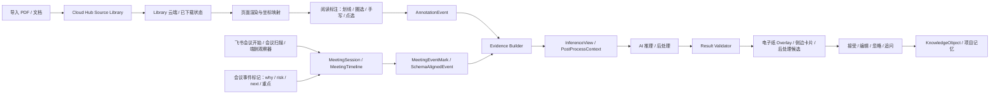

# 技术方案总览

## 一句话方案

出海墨水屏项目先用“市面低成本墨水屏 + 我们的软件”完成第一版 MVP，验证文档阅读标注和飞书会议事件标记两条链路；再在 7 月底冻结硬件选型和设计，8 月底完成样机装配和功能验证，9 月底完成最终版样机与最终版软件联调实测。

## 产品技术定位

当前不做通用电子纸平板，主线是 AI 贴片式研究助手：

- 用户在 PDF、文档或页面内容上划线、圈选、手写、点选。
- 用户在飞书会议中产生问题、风险、重点或待办标记，系统把标记落到真实会议时间轴。
- 系统把标注转成稳定事件，并绑定文档、页面、区域、笔迹和上下文。
- 会议场景只把会议事件标记进入 schema 对齐层，不把音频、字幕、议题、发言人作为主输入。
- 本地 OCR 或端侧解析先给出可追溯文本。
- 云端或本地 AI 生成问题、摘要、关联、下一步动作。
- 结果以电子纸友好的 overlay 或侧边卡片回到原文现场。
- 被接受、编辑或二次追问的结果才进入知识沉淀。

## 当前技术主线

| 模块 | 当前决策 | 验收标准 | 来源文档 |
| --- | --- | --- | --- |
| 系统架构 | 采用标注驱动的端云协同电子纸研究助手架构 | 硬件、SDK、证据流水线、AI、知识同步边界清晰 | `系统架构设计.md` |
| 产品化定位 | Web 负责输入，墨水屏负责阅读和思考标记，Obsidian 负责轻量知识输出和受控编辑，Cloud Hub 负责源文件库、同步、索引和设备状态 | 以源文件为单位组织 Library、标记、同步、Obsidian note 和回跳链接 | `../10_产品与PRD_6月方案/InkLoop_v1_产品化定位与三端体验.md` |
| Cloud Hub 源文件库 | 一个源文件云端保存一份，Web/桌面端和墨水屏端按需下载本地副本 | Library 能区分 `cloud_only`、`downloaded`、`pinned`、`uploading`、`failed`、`conflict` | `系统架构设计.md` / `../30_数据契约与外部投影_7月/InkLoop_Core_Schema_Adapter_Obsidian_Tech_Plan.md` |
| 会议场景 | 接入 Lark Meeting Timeline SDK，形成真实会议轴 + 会议事件标记 + schema 对齐 | 标记能落到会议 timeline，并能与墨水屏文档 schema 结合后处理 | `../20_软件原型与MVP_6-7月/飞书会议时间轴接入方案.md` |
| 第一版 MVP 硬件 | 使用市面低成本墨水屏设备，不等待自研硬件 | 7 月中旬可演示核心软件链路 | `../../00_项目总览/2026H2_目标与里程碑.md` |
| 自研硬件方向 | 7 月底冻结屏幕、主控、触控、供电、结构方案 | BOM、供应商、交期、风险齐全 | `../40_硬件选型与样机_7-8月/InkLoop_硬件选型页_屏幕适配增量版_html.md` |
| 核心交互 | 标注驱动，不把聊天框作为主入口 | 一次标注能触发 OCR、AI、回屏 | `../10_产品与PRD_6月方案/AI_EInk_PRD_Software_Hardware_Solution_v0.3.md` |
| 数据真相源 | Core Schema / event ledger 是真相源 | 所有结果可追溯到文档、页面、标注事件和会议事件标记 | `../30_数据契约与外部投影_7月/InkLoop_Core_Schema_Adapter_Obsidian_Tech_Plan.md` |
| 会议事件契约 | `MeetingEventMark -> SchemaAlignedEvent -> PostProcessContext -> KnowledgeObject` | 固定 source_refs、RuntimeSyncEvent v1.1 增量、SDK 接入子集和验收统计口径 | `../30_数据契约与外部投影_7月/InkLoop_Meeting_Event_Schema_Contract_v0.1.md` |
| 标注链路 | Stroke -> AnnotationEvent -> Mark/HMP -> InferenceView -> Overlay | 每条链路有 trace_id，可 debug | `../20_软件原型与MVP_6-7月/前端标注链路-技术文档.md` |
| AI 策略 | 先确定性解析，再模型推理；模型只引用对象不吐坐标 | AI 结果带 source_refs 和 confidence | `../20_软件原型与MVP_6-7月/AI-Annotation-demo端侧B组接入方案.md` |
| 外部投影 | KnowledgeObject 作为 Adapter 输入 | Obsidian/Notion 只消费稳定对象 | `../30_数据契约与外部投影_7月/InkLoop对齐文档-KnowledgeObject契约-v0.1.md` |

## 目录分层

| 功能域 | 迭代阶段 | 目录 | 当前作用 |
| --- | --- | --- | --- |
| 入口与决策 | 6 月方案收敛 | `00_入口与决策_6月方案/` | 统一技术路线和开放问题 |
| 产品/PRD | 6 月产品定义 | `10_产品与PRD_6月方案/` | 锁定产品范围、用户链路和软硬件一体边界 |
| 软件原型/MVP | 6-7 月软件闭环 | `20_软件原型与MVP_6-7月/` | 支撑软件原型和第一版 MVP |
| 数据契约/外部投影 | 7 月数据冻结 | `30_数据契约与外部投影_7月/` | 固定 Core Schema、会议事件 schema、KnowledgeObject 和 Adapter 口径 |
| 硬件选型/样机 | 7-8 月硬件验证 | `40_硬件选型与样机_7-8月/` | 支撑硬件选型、采购和样机装配验证 |
| 跨端形态/联调 | 9 月最终联调 | `50_跨端形态与最终联调_9月/` | 固定 Paper、Studio、Capture、Web 的边界 |

## 端到端链路

## MVP 范围

### 6 月底软件原型

| 能力 | 必须达到 |
| --- | --- |
| 文档导入 | 至少支持 PDF 或模拟文档输入 |
| 标注事件 | 至少支持划线、圈选、点选三类事件 |
| 会议事件标记 | 至少支持开放会议轴、开放标记接口、schema 对齐和 source_refs 校验 |
| OCR/文本抽取 | 至少能对区域或附近文本生成上下文 |
| AI 推理 | 能返回结构化卡片，不只是自由文本 |
| 回屏展示 | 能在页面附近或侧边队列显示结果 |
| Trace | 能从结果反查输入文档、页面、标注和推理请求 |

### 7 月中旬第一版 MVP

| 能力 | 必须达到 |
| --- | --- |
| 硬件承载 | 市面低成本墨水屏设备可承载演示 |
| 源文件库 | 至少单用户 `SourceFile / LibraryItem / DeviceManifest` 契约跑通，能看到云端可用和本地已下载状态 |
| 演示链路 | 至少 3 条阅读链路和 2 条会议事件标记链路可演示 |
| 会议链路 | 飞书会议轴、会中事件标记落轴、SSE 实时刷新、schema 对齐、RuntimeSyncEvent v1.1 入账跑通 |
| 失败降级 | 网络、OCR 或模型失败时不阻断标注 |
| 用户反馈 | 至少完成 3 次真实目标用户演示或试用反馈 |

### 9 月底最终联调

| 能力 | 必须达到 |
| --- | --- |
| 样机 | 最终版样机装配完成 |
| 软件 | 最终版软件完成实测 |
| 性能 | 标注到 AI 卡片 P50 <= 5 秒，P95 <= 10 秒 |
| 有用性 | AI 反馈接受/编辑/二次追问率 >= 30% |
| 问题闭环 | P0 问题关闭率 >= 90% |

## 技术风险

| 风险 | 影响 | 判断方式 | 应对 |
| --- | --- | --- | --- |
| 低成本市售墨水屏输入能力不足 | 7 月 MVP 演示受阻 | 是否支持稳定触控/笔迹/页面刷新 | 准备 Web/平板模拟演示备选 |
| 电子纸刷新慢导致 AI 反馈体验差 | 用户觉得系统迟钝 | P50/P95 延迟、卡片刷新体验 | 侧边队列、局部刷新、减少动画 |
| OCR 对手写/局部文本不稳定 | AI 结果不可用 | OCR 置信度、source_refs 命中率 | 先限定 PDF 印刷体和区域解析 |
| 飞书会议事件延迟或未投递 | 会议轴建立慢 | axis_source、event_axis、扫描兜底命中率 | 官方事件、当前用户扫描、端侧开放会话三入口并行 |
| 会议事件标记粒度不一致 | 后处理输入噪声增大 | mark kind、intent、payload、schema_refs、source_refs 完整率 | 固定会议事件 schema 合约和验收 fixtures |
| 数据契约过早膨胀 | 开发效率下降 | Schema 变更频率、字段未使用率 | v1 只保留核心对象和 trace |
| 自研硬件成本失控 | 商业验证失败 | BOM / 目标售价比例 | 目标 BOM <= 目标售价 45% |

## 文档阅读路线

| 要解决的问题 | 先看 | 再看 |
| --- | --- | --- |
| 系统架构怎么拆 | `系统架构设计.md` | `../20_软件原型与MVP_6-7月/AI-Annotation-demo端侧B组接入方案.md` |
| v1 产品化怎么收敛 | `../10_产品与PRD_6月方案/InkLoop_v1_产品化定位与三端体验.md` | `系统架构设计.md` |
| 会议场景怎么接 | `../20_软件原型与MVP_6-7月/飞书会议时间轴接入方案.md` | `系统架构设计.md` |
| 产品到底做什么 | `../10_产品与PRD_6月方案/AI_EInk_PRD_Software_Hardware_Solution_v0.3.md` | `../10_产品与PRD_6月方案/AI墨水屏标注识别智能设备 — 完整软硬件产品方案.md` |
| 软件闭环怎么跑 | `../20_软件原型与MVP_6-7月/前端标注链路-技术文档.md` | `../20_软件原型与MVP_6-7月/AI-Annotation-demo端侧B组接入方案.md` |
| 数据契约怎么定 | `../30_数据契约与外部投影_7月/InkLoop_Meeting_Event_Schema_Contract_v0.1.md` | `../30_数据契约与外部投影_7月/InkLoop对齐文档-KnowledgeObject契约-v0.1.md` |
| 硬件怎么选 | `../40_硬件选型与样机_7-8月/InkLoop_硬件选型页_屏幕适配增量版_html.md` | `../40_硬件选型与样机_7-8月/彩色电子纸硬件与云端AI出海产品立项调研.md` |
| 跨端形态怎么拆 | `../50_跨端形态与最终联调_9月/InkLoop_cross_platform_strategy_demo_html.md` | `../30_数据契约与外部投影_7月/InkLoop_KO_Adapter_Obsidian_Dev_Landing_Plan_v0.2.md` |

## 当前开放问题

| 问题 | 需要谁决策 | 截止时间 | 影响 |
| --- | --- | --- | --- |
| 第一版 MVP 使用哪款市售低成本墨水屏 | Ethan | 2026-07上旬 | 影响 7 月中旬演示 |
| 会议场景首版是否以飞书会议为唯一入口 | Ethan | 2026-07上旬 | 影响 Lark Meeting Timeline 接入和权限配置 |
| 最终样机目标尺寸和屏幕类型 | Ethan | 2026-07月底 | 影响硬件设计和 BOM |
| 首批目标用户优先级 | Ethan | 2026-07上旬 | 影响访谈、演示和市场素材 |
| AI 推理首版输出类型 | Ethan | 2026-07上旬 | 影响软件原型和验收 |
| 目标售价与 BOM 红线 | Ethan | 2026-07月底 | 影响供应链和商业模型 |
