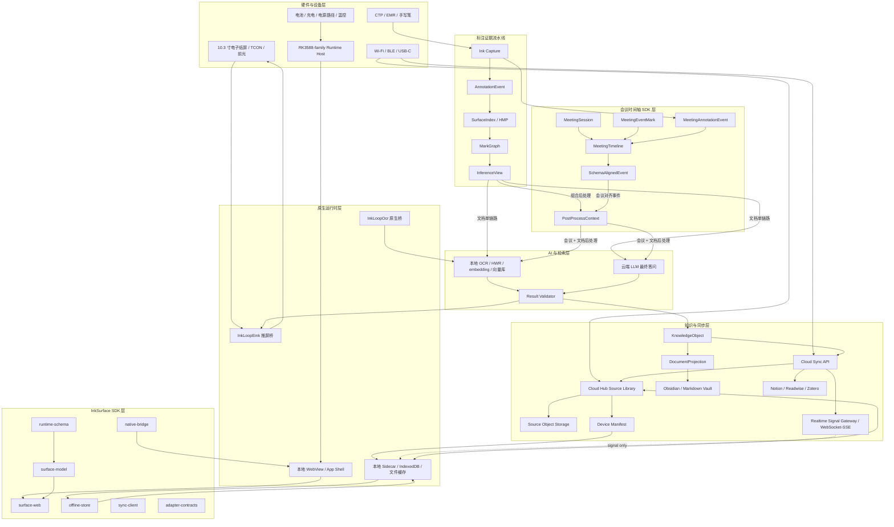
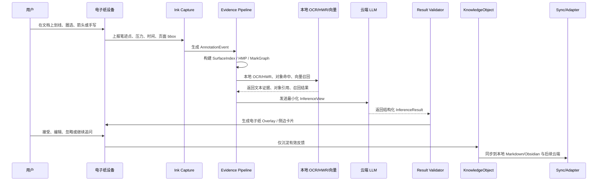
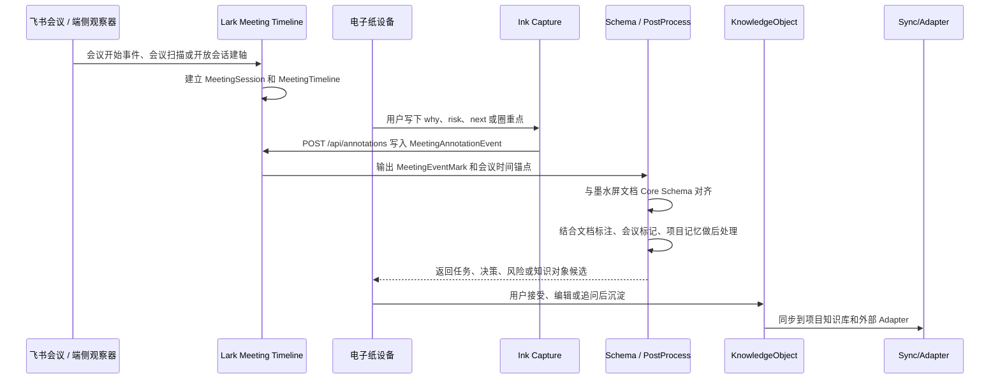
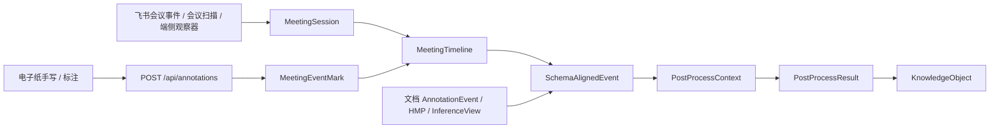
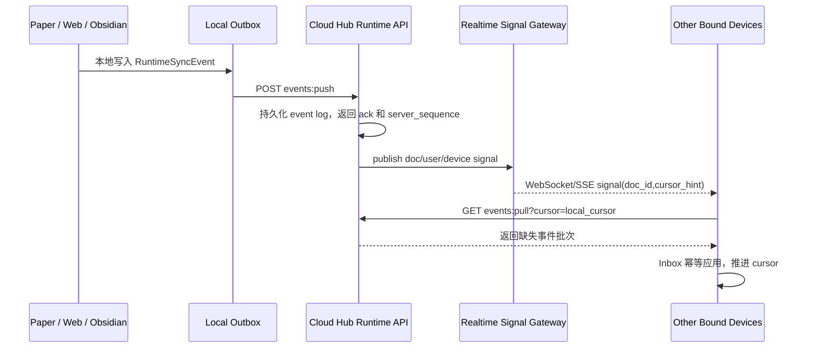

# 系统架构设计

## 架构结论

出海墨水屏项目采用“标注驱动的端云协同电子纸研究助手”架构。系统不做通用电子纸平板，也不把聊天框作为主入口；核心闭环分为两条输入链路：文档阅读场景以页面和 bbox 作为锚点，会议场景以会议中产生的事件标记作为时间轴锚点。两条链路都先进入同一套 schema 对齐层，再由统一后处理层结合文档标注、会议标记和项目记忆生成任务、决策、风险和知识对象。

第一版 MVP 使用市面低成本墨水屏设备承载软件闭环，并把 `xzq-xu/Lark-Meeting-Timeline` 作为会议时间轴 SDK 接入。自研样机主线采用 RK3588-family 端云协同：本地完成笔迹采集、页面对象表、会议事件标记落轴、schema 对齐、OCR/HWR、embedding、向量召回、证据蒸馏和离线缓存；云端完成高质量后处理。当前 10.3 寸 Good Display 黑白电子纸套件用于验证屏幕链路，不代表最终彩色屏和专业笔规格。最终产品形态以 10.3 寸彩色电子纸整屏 Stack、前光、CTP、EMR、TCON、主控、无线、电源、结构和安全闭环组成。

## 设计目标

| 目标 | 系统含义 | 验收口径 |
| --- | --- | --- |
| 标注即入口 | 用户通过划线、圈选、箭头、手写、点选触发 AI | 不依赖聊天框也能完成一次解释、关联或追问 |
| 会议即事件标记 | 用户在会议中写下问题、风险、重点或待办 | 标记能落到真实会议轴，并与墨水屏文档 schema 对齐 |
| 证据可追溯 | AI 结果必须绑定文档、页面、bbox、标注事件和 OCR/对象证据 | `trace_id` 可反查 `AnnotationEvent`、`InferenceView`、`InferenceResult` |
| 本地优先 | 原文、笔迹、缓存和知识沉淀先落本地；推理只上送最小化载荷，源文件按用户授权进入 Cloud Hub 对象存储 | 离线可继续阅读和标注，联网后补同步 |
| 源文件云端一份 | Cloud Hub 按 `content_hash` 保存源文件对象，各端只持本地副本和缓存 | Library 能区分云端可用、已下载、已固定、上传中、失败和冲突 |
| 电子纸友好 | UI 与刷新策略围绕慢刷新、局刷、灰阶和彩色残影设计 | 笔迹低延迟、AI 卡片轻量、整屏刷新受控 |
| Adapter 可扩展 | Obsidian/Markdown 是首批出口，后续扩展 Notion、Readwise、Zotero | 外部系统只消费稳定 KnowledgeObject / DocumentProjection |
| 硬件分阶段 | MVP 借市售设备，自研样机再验证屏幕、触控、主控和电源 | 7 月中旬 MVP，8 月底样机验证，9 月底最终联调 |

## 全局架构图

## 端到端运行链路

### 文档阅读链路

### 会议事件标记链路

## 分层边界

| 层级 | 职责 | 不承担的职责 |
| --- | --- | --- |
| 电子纸硬件层 | 显示刷新、触控/笔输入、前光、电源、无线和结构承载 | 不负责 AI 推理、不负责知识对象语义 |
| 原生运行时层 | WebView 宿主、原生 OCR/HWR 桥、电子纸推帧桥、本地资源与权限 | 不直接修改用户知识库语义 |
| InkSurface SDK 层 | 运行时契约、可视模型、Web 渲染、离线存储、同步客户端、原生桥协议 | 不解析 PDF、不调用模型、不管理宿主生命周期 |
| 标注证据流水线 | 笔迹分类、对象命中、HMP、MarkGraph、InferenceView | 不让模型直接处理坐标、原始笔迹和内部置信细节 |
| 会议时间轴层 | MeetingSession、MeetingEventMark、MeetingAnnotationEvent、SchemaAlignedEvent | 不处理会议音频、字幕、议题、发言人，不申请 minutes/transcript 主链路权限，不替代 InkLoop schema 对齐和后处理 |
| AI 与检索层 | 本地感知和召回、云端答问、结果校验 | 不创造无法追溯的 source_refs |
| 知识与同步层 | Cloud Hub 源文件库、KnowledgeObject、DocumentProjection、Adapter、冲突和同步 | 不把外部系统当作唯一真相源，不把 Runtime sync 当成文件传输协议 |

## 硬件架构

### MVP 与样机分工

| 阶段 | 硬件形态 | 目标 | 通过标准 |
| --- | --- | --- | --- |
| 2026-06-30 软件原型 | PC / Web / 模拟电子纸展示 | 跑通标注、OCR、AI、回屏展示 | 软件链路有 trace，核心交互可演示 |
| 2026-07-15 第一版 MVP | 市面低成本墨水屏 + 我们的软件 | 验证真实电子纸承载和用户演示 | 3 条高频链路可演示，失败不阻断标注 |
| 2026-07-31 硬件选型冻结 | RK3588-family 开发板 + 屏幕链路 | 固定主控、屏幕、触控、电源和采购清单 | BOM、接口、供应商、风险和交期齐全 |
| 2026-08-31 样机功能验证 | RK3588 + 10.3 寸电子纸套件 + 外设 | 验证刷新、触控、前光、OCR、本地服务和装配 | 样机完成装配，核心功能实测通过 |
| 2026-09-30 最终联调 | 最终版样机 + 最终版软件 | 验证软硬件一体体验和稳定性 | P50 <= 5 秒，P95 <= 10 秒，P0 关闭率 >= 90% |

### 硬件模块

| 模块 | 第一版主线 | 架构责任 | 关键验证 |
| --- | --- | --- | --- |
| 显示 | 10.3 寸电子纸，当前 EVT 用 DEJA-TC103 + GDEP103TC2-FT11 | 页面显示、全刷、局刷、灰阶/彩色刷新策略 | USB/SPI 推帧、GC16 全刷、A2 局刷、残影控制 |
| 触控/笔 | EVT 用 CTP；最终形态纳入 EMR 无源笔 | 笔迹输入、压力、hover、掌托误触、边缘触控 | 报点率、延迟、视差、触控与 EMR 共存 |
| 会议状态/事件 | 首版以飞书会议事件、会议扫描和端侧标记为主 | 建立会议轴、事件标记落轴、schema 对齐 | 会议开始、结束、事件来源、权限和延迟 |
| 主控 | RK3588-family 端云协同 | 本地 OCR/HWR、embedding、向量库、MCP、WebView、同步 | 8 小时长跑、空闲内存、降频、休眠恢复 |
| 存储 | 开发阶段 NVMe，产品阶段 eMMC + 本地缓存策略 | 文档缓存、向量库、OCR 缓存、日志和离线 sidecar | 读写寿命、断电一致性、缓存淘汰 |
| 无线 | Wi-Fi 5/6 + BLE 5.x | 云端推理、同步、配网、固件更新 | 弱网重试、BLE 配网、离线继续工作 |
| 电源 | 4000-5000mAh 软包电池 + fuel gauge + USB-C 充电 | 续航、温升、峰值供电、前光功耗 | 刷新峰值、电池温升、充电电流、power-path |
| 安全 | secure boot、TEE/RPMB、文件加密、擦除 | 设备身份、密钥、用户数据保护、OTA | 启动链、加密存储、恢复出厂、日志脱敏 |
| 结构 | 10.3 寸屏幕堆叠、前光、触控、EMR、电池和主板 | 厚度、重量、散热、维护和装配 | 屏幕保护、视差、天线、散热和跌落风险 |

### 主控路线

| 档位 | 用途 | 计算分配 | 进入 v1 的判断 |
| --- | --- | --- | --- |
| A 纯云 | 成本下限和软件对照 | 本地只采集和展示，OCR/HWR/答问走云端 | 作为 MVP 对照，不作为长期主线 |
| B 端云协同 | v1 主线 | 本地看懂，云端答好 | 主线进入硬件设计和样机验证 |
| C 全本地 | 离线高端和隐私储备 | OCR/HWR/embedding/向量/答问全部本地 | 不进 v1，Jetson 只量质量天花板 |

RK3588-family 是 v1 主线，因为它能承载本地 OCR/HWR、embedding、向量库、MCP 和 WebView，同时把最终答问交给云端。32GB RAM 与 NVMe 属于开发验证裕量，目标是降低向量库、OCR 缓存和长跑测试噪声；最终 BOM 需在实测后回收内存和存储规格。

## 软件架构

### 软件模块图

```mermaid
flowchart LR
  PDF["PDF / 文档 / 页面"] --> INDEX["Page Renderer + SurfaceIndex"]
  INDEX --> INK["Ink Capture"]
  INK --> EVT["AnnotationEvent"]
  EVT --> TARGET["Target Resolver / HMP"]
  TARGET --> GRAPH["MarkGraph"]
  GRAPH --> VIEW["InferenceView"]
  VIEW --> OCR["Local OCR/HWR"]
  VIEW --> VEC["Embedding / Vector Recall"]
  OCR --> VIEW2["Evidence Distillation"]
  VEC --> VIEW2
  VIEW2 --> LLM["Cloud LLM"]
  LLM --> RESULT["InferenceResult"]
  RESULT --> VAL["Result Validator"]
  VAL --> OVERLAY["ScreenOverlay"]
  VAL --> KO["KnowledgeObject"]
  KO --> DP["DocumentProjection"]
  DP --> MD["Markdown / Obsidian"]
```

### 会议事件标记软件模块图

### SDK 与现有代码映射

| 架构模块 | 代码位置 | 责任 |
| --- | --- | --- |
| 运行时契约 | `/Users/ethan/AI-Annotation-demo/packages/runtime-schema` | `RuntimeDocumentSnapshot`、surface block、annotation、stroke、sync event |
| 可视模型 | `/Users/ethan/AI-Annotation-demo/packages/surface-model` | `InkLoopVisualModel`、block、annotation、stroke、纯函数编辑 |
| Web 渲染 | `/Users/ethan/AI-Annotation-demo/packages/surface-web` | DOM/SVG 渲染与样式安装 |
| 离线存储 | `/Users/ethan/AI-Annotation-demo/packages/offline-store` | file sidecar、IndexedDB、缓存状态、缺失资产处理 |
| 同步客户端 | `/Users/ethan/AI-Annotation-demo/packages/sync-client` | outbox、dedupe、retry、ack、cursor 和 inbox 应用 |
| 原生桥 | `/Users/ethan/AI-Annotation-demo/packages/native-bridge` | WebView 与 Runtime Host 的 typed message 协议 |
| Adapter 权限 | `/Users/ethan/AI-Annotation-demo/packages/adapter-contracts` | `client_local`、`cloud_api`、`hybrid` 的责任边界 |
| 标注契约 | `/Users/ethan/AI-Annotation-demo/examples/ai-annotation-demo/src/core/contracts.ts` | `AnnotationEvent`、`OCRResult`、`InferenceView`、`ScreenOverlay` 等 |
| 处理流水线 | `/Users/ethan/AI-Annotation-demo/examples/ai-annotation-demo/src/core/pipeline.ts` | 事件生成、HMP 增益、MarkGraph、InferenceView、AI 调用 |
| 推理视图 | `/Users/ethan/AI-Annotation-demo/examples/ai-annotation-demo/src/evidence/inference-view.ts` | 把标注图确定性蒸馏成模型输入 |
| 电子纸推屏 | `/Users/ethan/AI-Annotation-demo/examples/ai-annotation-demo/src/surface/eink.ts` | `pageReady` 全刷与 `inkArea` 局刷桥接 |
| 会议时间轴 SDK | `/Users/ethan/Documents/Codex/2026-06-29/y/work/external/Lark-Meeting-Timeline` | 建立飞书会议轴、接收开放标记、输出会议事件序列、SSE 实时刷新 |
| 会议事件 schema 合约 | `/Users/ethan/Desktop/出海墨水屏项目文档/01_技术方案/30_数据契约与外部投影_7月/InkLoop_Meeting_Event_Schema_Contract_v0.1.md` | 冻结 MeetingEventMark、SchemaAlignedEvent、PostProcessContext、source_refs 和 RuntimeSyncEvent 增量 |

### 核心链路职责

| 链路 | 输入 | 输出 | 关键规则 |
| --- | --- | --- | --- |
| Ink Capture | pointer/stylus points、pressure、time | stroke | 笔用于标注，触控用于导航；保留压力和时间 |
| Classifier | stroke geometry | event_type | 先做确定性几何分类，不直接推断用户意图 |
| AnnotationEvent | stroke + 页面状态 | 标准事件 | 坐标统一归一化到页面 `[0,1]` |
| SurfaceIndex/HMP | 页面对象表 + 标注区域 | 目标对象、动作、文本线索 | 先结构命中，再局部 OCR/HWR 补证 |
| MarkGraph | session 内多个 mark | 空间、时间、语义边 | 区分同一动作、扫读、回访、另起 |
| InferenceView | MarkGraph + page text + recall | 最小化模型输入 | 丢弃坐标、stroke、内部分数，只保留文字叙事和锚点引用 |
| MeetingAnnotationEvent | 电子纸标注 + captured_at_ms + meeting_session | 会议时间轴原始事件 | 以真实会议时间为锚点，保留设备、意图、手写候选和 mark 信息 |
| MeetingEventMark | MeetingTimeline + 标注时间 | 会议中产生的事件标记 | 会中先落轴，迟到事件按 captured_at_ms 归一化 |
| SchemaAlignedEvent | MeetingEventMark + 文档 schema refs | 统一 schema 对齐事件 | 与墨水屏文档 Core Schema 对齐后进入后处理；字段以会议事件 schema 合约为准 |
| PostProcessContext | SchemaAlignedEvent + 文档标注 + 项目记忆 | 后处理输入 | 结合阅读标注和会议事件标记生成候选结果，source_refs 至少包含 document 与 meeting_mark |
| Cloud LLM | InferenceView | InferenceResult | 输出结构化结果，不生成裸坐标 |
| Result Validator | result + source evidence | ScreenOverlay / error | `source_refs` 必须来自证据层 |
| KnowledgeObject | 用户接受/编辑/追问 | 稳定知识对象 | 忽略和失败结果不进入知识沉淀 |

## 数据架构

### 核心对象

| 对象 | 作用 | 真相源 |
| --- | --- | --- |
| `PDFDocumentRecord` | 文档身份、hash、页数、来源和版本 | 本地文档库 / runtime schema |
| `PDFPageRecord` | 页尺寸、旋转、DPI 和页身份 | 渲染器 |
| `SurfaceIndex` | 页面上的结构对象表 | 页面渲染时提交 |
| `AnnotationEvent` | 一次标准标注事件 | Ink Capture |
| `HMP` | 一次手势的取证记录 | Target Resolver |
| `MarkGraph` | 一段 session 的标注图 | Evidence Pipeline |
| `InferenceView` | 模型消费的精简推理载荷 | Evidence Pipeline |
| `MeetingSession` | 一场真实会议轴 | Lark Meeting Timeline |
| `MeetingEventMark` | 会议中产生的事件标记 | Lark Meeting Timeline / 端侧宿主 |
| `MeetingAnnotationEvent` | 会中电子纸或外部设备标注 | Ink Capture / Lark Meeting Timeline |
| `SchemaAlignedEvent` | 会议标记与文档 Core Schema 对齐后的事件 | Schema Alignment |
| `PostProcessContext` | 文档标注、会议标记、项目记忆的后处理输入 | Evidence Pipeline |
| `OCRResult` | OCR/HWR 文本证据 | 本地或云端 OCR |
| `InferenceResult` | AI 结构化结果 | AI Service |
| `ScreenOverlay` | 回屏卡片或提示 | Result Validator |
| `KnowledgeObject` | 可同步、可投影的知识单元 | 用户有效反馈 |
| `DocumentProjection` | 外部 Markdown/Obsidian 的文档视图 | Adapter Core |
| `RuntimeSyncEvent` | 设备间同步事件 | Sidecar Runtime / RuntimeSyncEvent v1.1 增量 |

### 会议事件契约边界

| 契约 | 入账位置 | 同步规则 |
| --- | --- | --- |
| `MeetingEventMark` | `meeting_alignment_ledger` | 建轴后立即本地落账；没有活动文档绑定时进入待修复队列 |
| `SchemaAlignedEvent` | `RuntimeSyncEvent v1.1` | `schema_refs` 可校验且 `doc_id` 可确定后进入文档同步队列 |
| `PostProcessResult` | KnowledgeObject builder 输入 | 用户接受、编辑或追问后生成 KnowledgeObject |
| `InkLoopSourceRef` | PostProcessResult / KnowledgeObject | 保留 document、meeting_mark、project_memory 三类组合证据 |

### 数据原则

| 原则 | 具体规则 |
| --- | --- |
| 原文原生 | 用户文档留在原宿主或本地文件中，InkLoop 状态进入隐藏 sidecar |
| 事件优先 | 标注、AI 结果、编辑和同步都记录为事件或可追溯对象 |
| 坐标归一 | 所有 bbox 使用页面归一化坐标，屏幕像素只在渲染层换算 |
| 证据先行 | 模型只消费 InferenceView，不直接消费原始 stroke 和内部几何分数 |
| 最小上云 | 云端 payload 只包含答问所需文本、锚点引用和必要上下文 |
| 接受后沉淀 | 只有 accepted、edited、follow-up 类反馈进入长期知识对象 |
| 外部可编辑 | Markdown/Obsidian 展示层保持原生可编辑，生成区和可编辑区分离 |
| 冲突显式 | 外部修改生成区形成 conflict，不静默覆盖运行时事实 |

## AI 计算分层

| 能力 | 运行位置 | v1 取舍 |
| --- | --- | --- |
| 页面对象表 | 本地 | 渲染时产生轻量对象表，是定位和取证基础 |
| 笔迹分类 | 本地 | 几何分类必须低延迟，不等待云端 |
| OCR/HWR | 本地优先，云端 fallback | 印刷体和区域 OCR 走本地；困难图像或手写走 fallback |
| 会议事件标记落轴 | 本地服务 | 会中标记先落轴，迟到标记按 captured_at_ms 归一化 |
| Schema 对齐 | 本地 | 由 MeetingEventMark 对齐到文档 Core Schema，形成 SchemaAlignedEvent |
| 统一后处理 | 本地优先，云端增强 | 结合文档标注、会议标记、项目记忆生成任务、决策、风险和知识对象候选 |
| embedding / 向量召回 | 本地 | 支撑主题召回、附近旧标注召回和弱网可用 |
| 证据蒸馏 | 本地 | 由 MarkGraph 到 InferenceView，保证模型输入稳定 |
| 最终答问 | 云端 | v1 追求质量和成本平衡，不把 7-14B 本地 LLM 放进主线 |
| 结果校验 | 本地 | source_refs、confidence、overlay 类型和错误降级在端侧校验 |

## 同步与知识沉淀

### Cloud Hub 源文件库

Cloud Hub 提供类似 iCloud 的源文件层：每个用户的源文件在云端按 `content_hash` 保存一份，Web/桌面端、墨水屏端只保存本地副本、缓存和离线 sidecar。Library 不是简单文件列表，而是 `LibraryItem + DeviceManifest` 的合成视图，必须告诉用户哪些文件只在云端、哪些已经下载到当前设备、哪些被固定离线、哪些正在上传或同步失败。

Cloud Hub 与 Runtime sync 的边界：

| 链路 | 传输对象 | 典型触发 | 不负责 |
| --- | --- | --- | --- |
| Cloud Hub Source Library | `SourceBlob`、`LibraryItem`、`DocumentRecord`、`DeviceManifest` | Web/桌面导入、墨水屏首次打开云端文件、设备启动拉库 | 标注事件合并、Obsidian 受控区回写 |
| Runtime sync | `AnnotationEvent`、`ReadingProgress`、`MeetingEventMark`、`KnowledgeObject` 增量 | 阅读标记、会议标记、Obsidian 状态回写 | PDF/EPUB/Markdown 文件字节传输 |
| Realtime Signal | `doc_id`、`cursor_hint`、`event_count`、`origin_device_id` 等轻量提示 | Cloud Hub 收到 RuntimeSyncEvent 后通知同用户同文档设备 | 承载原文、标注 payload、知识对象内容，不作为最终一致性来源 |
| Adapter sync | `DocumentProjection`、Markdown/Obsidian 受控区 | 用户接受知识对象、Task/Risk 状态变化 | 作为 Core Schema 的真相源 |

阶段上，v1 演示闭环可以先用单用户对象存储或本地开发云模拟 Cloud Hub，但对象契约必须先固定，避免后续 Web 导入、墨水屏自动出现、Obsidian 回跳各做一套文件身份。

### Magic Sync 实时同步架构

V1 产品级跨端同步不应长期依赖 `500ms` 轮询。500ms polling 可用于本地 demo 和调试兜底，但在真实产品中会带来空请求、耗电、后台不稳定和多端扩展成本。正式方案采用“事件推送 + 实时 signal + cursor 补拉”的混合模式：广播只负责提示“有新事件”，各端仍通过自己的 cursor 从 Cloud Hub 拉取权威事件，保证断线、重启、后台恢复后不丢数据。

#### 同步原则

| 原则 | 规则 |
| --- | --- |
| Signal 只做提示 | WebSocket/SSE 消息不承载标注内容，只包含 `tenant_id`、`user_id`、`doc_id`、`origin_device_id`、`cursor_hint`、`event_count` 和 `reason` |
| Pull 才是权威 | 其他端收到 signal 后必须用本地 cursor 调 `events:pull`，由 Runtime Inbox 做幂等、冲突和 cursor 推进 |
| Push 立即确认 | 标注、阅读进度、会议事件、Obsidian 受控回写进入 outbox 后立即 push；失败进入 retry，不阻断本地阅读 |
| 前台实时，后台省电 | 前台维持 WebSocket/SSE；后台使用 Android keep-alive service、系统唤醒或低频补拉 |
| 断线可恢复 | WebSocket/SSE 断开后不丢事实，恢复时先按 cursor 补拉，再重新订阅 signal |
| 用户与设备隔离 | Signal channel 按 `tenant_id/user_id/device_group/doc_id` 分区，服务端过滤 `origin_device_id`，避免 A 用户事件推给 B 用户 |
| 文件与事件分离 | SourceBlob 文件字节仍走 Cloud Hub Source Library；Runtime sync 只同步事件、进度和知识对象增量 |

#### 传输形态

| 场景 | 推荐机制 | 降级 |
| --- | --- | --- |
| Web / 桌面前台 | WebSocket，或 SSE 单向 signal + HTTP push/pull | 5-30 秒自适应 polling |
| 电子纸 App 前台 | WebSocket/SSE signal + HTTP pull 补齐 | 低频 polling + 页面可见时立即补拉 |
| 电子纸后台 | Android keep-alive service 维持轻量连接；必要时只保留本地 outbox | 网络恢复、App 回前台、设备唤醒时补推/补拉 |
| Obsidian 插件 | WebSocket/SSE signal；插件不可稳定长连时使用低频 polling | 手动同步、文件变更触发同步 |
| 局域网 Cloud Hub | 局域网 WebSocket/SSE；mDNS 仅用于发现 Cloud Hub 地址 | 固定 IP/端口配置 |
| 公网 Cloud Hub | WebSocket/SSE + 云端事件日志；移动后台后续可接 FCM/APNs 唤醒 | cursor 补拉 |

#### 不采用的方案

| 方案 | 不作为主方案的原因 |
| --- | --- |
| 500ms 纯轮询 | 空请求多、耗电、后台不可靠，多设备扩展后 Cloud Hub 压力不必要 |
| BroadcastChannel | 只适合同浏览器同 origin，不能跨设备、跨 App |
| UDP multicast | 移动系统和跨网络限制多，不可靠，不适合作为用户数据同步 |
| mDNS/Bonjour | 适合发现局域网 Cloud Hub，不适合同步运行时事件 |
| 纯 WebRTC | 连接和信令复杂度过高，端到端一致性仍需要 Cloud Hub event log |

#### 验收口径

| 指标 | V1 目标 |
| --- | --- |
| 同端前台事件感知 | P50 <= 300ms，P95 <= 1000ms，从 Cloud Hub ack 到其他前台端收到 signal |
| 端到端可见 | P95 <= 1000ms，前台设备从标注入账到另一端 UI 可见 |
| Cursor 补拉可靠性 | 断线、重启、后台恢复后无丢事件、无重复卡片 |
| 空转成本 | 无事件时前台不做 500ms HTTP 空轮询；后台最多低频健康检查 |
| 安全隔离 | 跨用户、跨 tenant、跨设备组事件不可见；origin device 不回显自身 signal |

本地编辑优先于云端展示。设备端保留 runtime sidecar、outbox 和缓存；联网后通过 Sync Client 推送事件，并从 Cloud Sync API 拉取远端事件。会议场景先把 MeetingEventMark 落到本地 `meeting_alignment_ledger`，再与文档 Core Schema 对齐形成 SchemaAlignedEvent；只有 `schema_refs` 可校验的对齐事件进入 RuntimeSyncEvent v1.1 增量和文档同步队列。用户确认后的后处理结果沉淀为 KnowledgeObject。Adapter Core 把 KnowledgeObject 和 DocumentProjection 投影到 Obsidian/Markdown，后续同一对象模型扩展到 Notion、Readwise、Zotero。

| 同步对象 | 同步方式 | 冲突处理 |
| --- | --- | --- |
| 标注事件 | outbox push + ack | event id 幂等 |
| 会议事件标记 | meeting alignment ledger | mark id 幂等，迟到标记按 captured_at_ms 重算；未绑定文档时不进入 RuntimeSyncEvent |
| SchemaAlignedEvent | RuntimeSyncEvent v1.1 + schema alignment ledger | 文档 schema refs 失效时进入待修复队列 |
| AI 结果 | result + source_refs | source_refs 无法校验则降级为 error |
| 用户编辑 | editable region 外部编辑记录 | 进入 external edit |
| 生成区修改 | generated region 被改写 | 进入 conflict |
| 文档缓存 | 本地离线缓存 | 缺失大资产进入 partial state |
| 适配器输出 | KnowledgeObject / DocumentProjection 投影 | Adapter 不反向覆盖核心事实 |

## 部署形态

| 形态 | 用途 | 组件 |
| --- | --- | --- |
| Web/PC 原型 | 6 月底软件原型和快速演示 | Web App、PDF mock、Ink Capture、云端 AI、本地 IndexedDB |
| 市售墨水屏 MVP | 7 月中旬用户演示 | 市售设备、WebView/浏览器、简化推屏、云端 AI、Markdown 输出 |
| 飞书会议事件标记 MVP | 7 月中旬会议场景演示 | Lark Meeting Timeline、本地服务、开放会议轴、开放标记、SSE、schema 对齐 |
| RK3588 EVT 样机 | 8 月底功能验证 | RK3588、DEJA-TC103、GDEP103TC2-FT11、CTP、前光、本地 OCR/HWR |
| 最终样机 | 9 月底最终联调 | 彩色电子纸 Stack、EMR、前光、电池、结构、App Shell、Sync API |
| Cloud Backend | 跨设备同步、源文件库和云端适配 | Auth、source object storage、Library manifest、device cursor、event ordering、asset auth、cloud adapter jobs |

## 验收指标

| 指标 | 2026-07 MVP | 2026-09 最终联调 |
| --- | --- | --- |
| 标注到 AI 卡片延迟 | P50 <= 8 秒，P95 <= 15 秒 | P50 <= 5 秒，P95 <= 10 秒 |
| 局部 OCR/HWR 延迟 | P95 <= 1500 ms | P95 <= 1000 ms |
| source_refs 命中率 | >= 80% | >= 90% |
| AI 有效反馈率 | >= 20% | >= 30% |
| 离线标注成功率 | >= 95% | >= 99% |
| 同步事件幂等 | 无重复卡片 | 无重复卡片且冲突显式 |
| 会议标记落轴 | 写入后 1 秒内进入 sequence | 写入后 1 秒内进入 sequence，并能迟到补传 |
| 会议实时刷新 | SSE 2 秒内广播最新 timeline | SSE 2 秒内广播最新 timeline，页面和设备状态一致 |
| 会议 schema 对齐成功率 | >= 80%：分母为有效且具备活动文档绑定的 MeetingEventMark，分子为 aligned 且 schema_refs 可反查的 SchemaAlignedEvent | >= 90%，同一口径；无活动文档绑定单独记录 unbound_mark_count |
| 电子纸局刷 | 可手动触发 | 抬笔后局刷稳定 |
| 样机长跑 | 2 小时不崩溃 | 8 小时不崩溃、不明显降频 |
| P0 问题关闭率 | >= 80% | >= 90% |

## 工程分解

| 时间 | 工程重点 | 交付物 |
| --- | --- | --- |
| 2026-06-30 | 方案整理、硬件采购、软件原型 | 技术总览、采购清单、可演示软件原型 |
| 2026-07-15 | 第一版 MVP | 市售墨水屏承载的标注到 AI 回屏链路，飞书会议事件标记到 schema 对齐链路，source_refs 校验链路 |
| 2026-07-31 | 硬件选型和设计冻结 | 主控、屏幕、触控/笔、电源、结构、BOM、风险表，MeetingEventMark/SchemaAlignedEvent/RuntimeSyncEvent v1.1 契约冻结 |
| 2026-08-31 | 样机功能验证和装配 | 屏幕链路、触控、前光、本地 OCR/HWR、基础装配 |
| 2026-09-30 | 最终样机和最终软件实测 | 端到端延迟、稳定性、AI 有用性、同步和知识沉淀 |
| 2026-11-30 | 市场推广运营 | 用户试用、案例、内容素材、渠道反馈 |
| 2026-12-31 | 年末复盘 | 指标复盘、技术债、量产/转向决策 |

## 风险控制

| 风险 | 影响 | 控制动作 |
| --- | --- | --- |
| 屏幕链路复杂 | 样机刷新、触控和前光集成延期 | PC + DEJA 先点亮，再接 RK3588；USB/SPI、GT9110、VCOM、前光分项验证 |
| EMR 叠层视差 | 书写体验不达标 | 样品阶段验证 hover、报点率、视差、掌托误触和贴合结构 |
| 本地 OCR/HWR 不稳定 | AI 输入质量波动 | 印刷体 PDF 与局部区域先过线，困难场景走云端 fallback |
| 飞书会议事件延迟 | 会议轴建立慢或漏建 | 官方事件、当前用户会议扫描、端侧开放会话三入口并行；source 字段区分证据等级 |
| 会议标记粒度不一致 | 后处理输入噪声增大 | 固定 MeetingEventMark 类型、intent、payload、schema_refs 和 source_refs 规则，按会议事件 schema fixtures 校验 |
| 向量库占用过高 | 内存和存储压垮样机 | 开发板用 32GB + NVMe 压测，最终 BOM 再回收规格 |
| 电子纸刷新慢 | 结果反馈显得迟钝 | 采用侧边卡片、轻量 overlay、A2 局刷和延迟合并 |
| 云端隐私风险 | 用户原文和手写内容泄露 | InferenceView 最小化、脱敏、日志隔离、用户授权和可审计 |
| Adapter 冲突 | Obsidian/Markdown 修改覆盖事实 | generated/editable 区域分离，冲突显式记录 |
| 全本地路线诱惑 | 成本、功耗和质量失衡 | v1 固定 B 端云协同，C 只做质量预言机 |

## 资料来源

| 类型 | 路径 |
| --- | --- |
| 技术总览 | `/Users/ethan/Desktop/出海墨水屏项目文档/01_技术方案/00_入口与决策_6月方案/技术方案总览.md` |
| 产品与 PRD | `/Users/ethan/Desktop/出海墨水屏项目文档/01_技术方案/10_产品与PRD_6月方案/AI_EInk_PRD_Software_Hardware_Solution_v0.3.md` |
| 软件原型 | `/Users/ethan/Desktop/出海墨水屏项目文档/01_技术方案/20_软件原型与MVP_6-7月/前端标注链路-技术文档.md` |
| SDK 架构 | `/Users/ethan/AI-Annotation-demo/docs/architecture.md` |
| SDK 代码 | `/Users/ethan/AI-Annotation-demo/packages/` |
| 标注流水线 | `/Users/ethan/AI-Annotation-demo/examples/ai-annotation-demo/src/core/pipeline.ts` |
| 飞书会议时间轴 SDK | `/Users/ethan/Documents/Codex/2026-06-29/y/work/external/Lark-Meeting-Timeline` |
| 会议标注契约 | `/Users/ethan/Documents/Codex/2026-06-29/y/work/external/Lark-Meeting-Timeline/public/annotation-schema.json` |
| 会议事件 schema 合约 | `/Users/ethan/Desktop/出海墨水屏项目文档/01_技术方案/30_数据契约与外部投影_7月/InkLoop_Meeting_Event_Schema_Contract_v0.1.md` |
| 硬件选型 | `/Users/ethan/Desktop/出海墨水屏项目文档/01_技术方案/40_硬件选型与样机_7-8月/InkLoop_硬件选型页_屏幕适配增量版_html.md` |
| 采购与 BOM | `/Users/ethan/Desktop/出海墨水屏项目文档/05_合规与商务/硬件采购清单.md` |
| 竞品规格 | `/Users/ethan/Downloads/竞品技术规格静态表.html` |
| PKM 需求线索 | `/Users/ethan/Downloads/reddit_pkm_discussions_report.html` |
