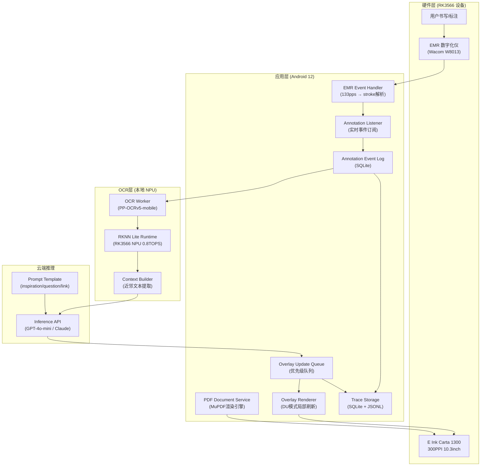

# AI墨水屏标注识别智能设备 — 完整软硬件产品方案

> **文档版本**: v1.0 · **日期**: 2026-06-12 · **状态**: 第一版正式版

***

## 目录

1. [执行摘要](#1-执行摘要)
2. [市场与竞品分析](#2-市场与竞品分析)
3. [产品需求文档（PRD）](#3-产品需求文档prd)
4. [应用层 UI 视觉设计规范](#4-应用层-ui-视觉设计规范)
5. [OCR 本地推理方案](#5-ocr-本地推理方案)
6. [云端推理方案](#6-云端推理方案)
7. [本地算力硬件设计](#7-本地算力硬件设计)
8. [固件与软件栈](#8-固件与软件栈)
9. [端到端闭环架构](#9-端到端闭环架构)
10. [风险与路线图](#10-风险与路线图)

***

## 1. 执行摘要

本方案为一款以 **"标注即理解"** 为核心交互范式的 AI 墨水屏智能设备。用户在 PDF 或手写内容上完成一次标注后，设备即刻通过本地 OCR 提取语义，联动云端大模型推理，将灵感、问题、关联要求实时回传至屏幕 overlay，形成认知增强闭环。

与 reMarkable、Supernote、Boox、Kindle Scribe 等竞品的根本差异在于：**本产品的 AI 不是事后工具，而是标注过程的实时响应伙伴。**

市场层面，2025 年全球电子墨水平板市场规模约 12 亿美元，预计 2034 年达到 25 亿美元，年复合增长率约 9.2%。AI 功能已成为新一代设备的核心差异化方向。[^1][^2]

***

## 2. 市场与竞品分析

### 2.1 主要竞品硬件规格对比

| 维度 | reMarkable Paper Pro | Supernote A5X | Boox Note Air3 | Kindle Scribe 2025 | **本产品目标** |
|------|---------------------|---------------|----------------|---------------------|----------------|
| 屏幕 | 11.8" Canvas Color | 10.3" Mobius Carta | 10.3" Carta 1200 | 11" Carta 1200 | 10.3" Carta 1300 |
| 分辨率 | 2160×1620 / 229PPI | 1404×1872 / 226PPI | 2480×1860 / 300PPI | 300PPI | **2480×1860 / 300PPI** |
| SoC | 未公开（高端） | Cortex-A35 四核 | Snapdragon 680 八核 | MediaTek 四核 | **RK3566 四核A55+NPU** |
| RAM | 64GB存储 | 2GB / 32GB | 4GB / 64GB | 1GB / 16-64GB | **4GB / 64GB** |
| 触控笔 | Marker Plus 4096级 | Wacom EMR | BOOX 4096级 | 专属笔 | **Wacom EMR 4096级** |
| 写入延迟 | 12ms | ~15ms | ~20ms | ~20ms | **目标 ≤15ms** |
| AI能力 | 云端手写转文字（订阅制）| 端内OCR搜索 | 无原生AI | 摘要（云端）| **本地OCR + 实时云推理** |
| 离线OCR | ✗（需联网）| ✓ 有限 | ✓ | ✗ | **✓ 完全离线** |
| 推理反馈 | ✗ | ✗ | ✗ | ✗ | **✓ 实时 overlay** |
| 订阅依赖 | 高（Connect服务）| 低 | 低 | 中 | **本地功能无订阅** |
| 价格 | $629起 | ~$499 | $399 | $499 | **目标 $499-599** |

**数据来源：** reMarkable Paper Pro 12ms 写入延迟，Boox Note Air3 Snapdragon 680，Kindle Scribe 2025 四核处理器，Supernote A5X Cortex-A35。[^3][^4][^5][^6][^7][^8]

### 2.2 竞品软件能力分析

**reMarkable（reMarkable Paper Pro）**：以极简 Codex Linux OS 著称，写字手感最接近纸张（12ms 延迟），但 AI 功能完全依赖 Connect 订阅云服务，PDF 导入依赖格式转换，注释功能相对基础。handwriting-to-text 依靠云端，准确率高但需要网络。[^9][^10][^11][^8]

**Supernote A5X**：运行定制 Android 8.1（Chauvet OS），OCR 搜索已内置且可离线，支持 EPUB 原生渲染（不转换 PDF），注释包含实际文本提取。多语言支持强（中日文），整体 AI 能力偏保守。[^10][^3]

**Boox Note Air3**：搭载完整 Android 12，应用生态最丰富，Snapdragon 680 算力最强，但无专属 AI 推理闭环，更像是 Android 平板的墨水屏版本。[^12][^4][^13]

**Kindle Scribe 2025**：Amazon 生态加持，11 英寸 300PPI 显示，支持 Google Drive/OneDrive 同步，AI 摘要基于 Alexa+，但强依赖云服务，无本地 OCR，写字手感和文档能力弱于 Supernote/reMarkable。[^6][^7]

**Viwoods AiPaper**：Carta 1300 屏幕 / 300PPI，八核 2GHz SoC，4GB RAM，是目前 AI 集成最激进的竞品，内置 ChatGPT-5/Gemini/DeepSeek 接入；但 AI 功能本质是 WebView 链接而非深度集成，且缺乏标注→OCR→推理→回屏的闭环。[^14][^15][^16]

**iFlytek AINOTE 2**：世界最薄 4.2mm / 295g，集成 ChatGPT-5，支持语音转文字+会议记录+翻译+OCR，是目前 AI 功能最丰富的竞品，但同样依赖云端，本地算力薄弱。[^17]

### 2.3 竞争差异定位

本产品的核心差异化三角：

```
[^1] 本地实时OCR（离线可用，中英日手写/印刷皆支持）
        ↓
[^2] 标注驱动的上下文感知推理（非对话式，而是标注触发）
        ↓  
[^3] 屏幕原生 overlay 回传（结果渲染在PDF内容旁，而非独立窗口）
```

这三者的组合目前在任何商业竞品中均未完整实现。

***

## 3. 产品需求文档（PRD）

### 3.1 产品愿景

> **"每一次标注，都是一次思考的起点。"**

打造一款 AI-native 的墨水屏标注设备：用户阅读 PDF 时划线、圈注、写批语，设备即刻理解语义，输出灵感/问题/关联/行动要求，让阅读与思考形成正向飞轮。

### 3.2 目标用户

| 用户类型 | 使用场景 | 核心需求 |
|----------|----------|----------|
| 研究人员/学者 | 阅读论文、标注假设、发现关联 | 深度语义理解 + 跨文档链接 |
| 产品经理/设计师 | PRD review、竞品分析批注 | 快速提炼要点 + 行动项生成 |
| 律师/金融分析师 | 合同标注、研报分析 | 专业词汇 OCR + 数字识别 |
| 学生 | 教材精读、备考整理 | 知识点关联 + 复习卡生成 |
| 知识工作者 | 书籍/报告精读 | 个人知识库沉淀 |

### 3.3 功能优先级矩阵

| 优先级 | 功能模块 | 描述 | MVP |
|--------|----------|------|-----|
| P0 | PDF 标注实时闭环 | 上传→标注→OCR→推理→overlay | ✓ |
| P0 | 本地离线 OCR | 设备断网可完成识别 | ✓ |
| P0 | 屏幕 overlay 渲染 | 推理结果贴合文档页面显示 | ✓ |
| P1 | 手写笔记 OCR | 自由书写页面的识别转换 | ✓ |
| P1 | 多文档关联推理 | 跨文档发现关联内容 | △ |
| P1 | 知识库沉淀 | 接受/拒绝 insight 存入个人知识图谱 | △ |
| P2 | 模板市场 | 论文/PRD/法律等专用标注模板 | ✗ |
| P2 | MCP/API 对外读取 | 供外部 AI 工具读取知识库 | ✗ |
| P3 | 多人协作 | 共享标注、评论 | ✗ |
| P3 | 订阅增值服务 | 高级模型/无限云推理 | ✗ |

### 3.4 核心数据协议（延续第一周计划）

#### PDFDocument v1

```json
{
  "document_id": "uuid-v7",
  "file_hash": "sha256",
  "filename": "paper.pdf",
  "page_count": 24,
  "uploaded_at": "ISO8601",
  "source_type": "upload | device_export | sample",
  "local_original_path": "/data/docs/sha256.pdf",
  "cloud_object_key": "optional",
  "language_hint": "zh-CN | en | ja | auto",
  "template_id": "optional"
}
```

#### AnnotationEvent v1

```json
{
  "event_id": "uuid-v7",
  "document_id": "...",
  "page_id": "...",
  "event_type": "stroke|highlight|circle|underline|arrow|margin_note|tap_region|eraser",
  "geometry": {
    "bbox": [x, y, w, h],
    "polygon": [[x,y]],
    "stroke_points": [{"x":0,"y":0,"t":0,"pressure":0.5}]
  },
  "text_note": "optional",
  "created_at": "ISO8601",
  "device_id": "...",
  "session_id": "...",
  "pen_type": "wacom_emr | finger | unknown",
  "version": "1"
}
```

#### OCRResult v1

```json
{
  "ocr_result_id": "...",
  "event_id": "...",
  "page_id": "...",
  "scope": "full_page | region | stroke_neighborhood",
  "text_blocks": [
    {
      "text": "identified text",
      "bbox": [x, y, w, h],
      "confidence": 0.95,
      "language": "zh-CN",
      "block_type": "print | handwrite"
    }
  ],
  "model_name": "PP-OCRv5-mobile",
  "model_version": "5.0.0",
  "runtime": "local_npu | local_cpu | cloud_fallback",
  "latency_ms": 120,
  "created_at": "ISO8601"
}
```

#### InferenceRequest v1

```json
{
  "request_id": "...",
  "event_id": "...",
  "document_context": {
    "title": "...", "abstract": "...", "section": "..."
  },
  "page_context": {
    "page_index": 5,
    "nearby_text": "...surrounding text..."
  },
  "annotation_event": { "...": "AnnotationEvent" },
  "ocr_blocks": ["...OCRResult.text_blocks"],
  "user_profile_stub": {},
  "output_modes": ["inspiration","question","connection","summary","action"],
  "model_preference": "gpt-4o | claude-3-5 | deepseek-v3",
  "max_tokens": 512
}
```

#### InferenceResult v1

```json
{
  "result_id": "...",
  "request_id": "...",
  "result_type": "inspiration|question|connection|summary|action|error",
  "content": "这段内容与第3页的X理论形成对比...",
  "source_refs": {
    "page_id": "...",
    "bbox": [x, y, w, h],
    "ocr_block_ids": ["..."],
    "event_id": "..."
  },
  "confidence": 0.87,
  "created_at": "ISO8601",
  "model_name": "gpt-4o-mini",
  "model_version": "2025-01"
}
```

#### ScreenOverlay v1

```json
{
  "overlay_id": "...",
  "page_id": "...",
  "result_id": "...",
  "overlay_type": "note|highlight|link|question|suggestion_card",
  "geometry": {
    "anchor_bbox": [x, y, w, h],
    "position": "right_margin | bottom | inline",
    "offset": [dx, dy]
  },
  "display_text": "💡 这里暗含了...",
  "icon": "lightbulb | question | link | pencil",
  "style": {
    "background": "#F5F5F0",
    "border": "1px dashed #888",
    "font_size": 11,
    "max_width": 180
  },
  "dismissible": true,
  "auto_dismiss_after_ms": 30000,
  "created_at": "ISO8601"
}
```

### 3.5 非功能需求

| 指标 | 目标值 | 测量方法 |
|------|--------|----------|
| 标注→OCR 延迟 | ≤500ms（本地NPU） | 端到端 trace |
| OCR→推理请求 | ≤200ms（构造包） | span latency |
| 云端推理返回 | ≤3s（P95） | API latency |
| overlay 上屏 | ≤500ms（E-ink刷新） | screen timestamp |
| 全链路 P0 延迟 | ≤5s | 用户可感知 |
| 本地 OCR 准确率 | ≥85%（印刷体）/ ≥75%（手写） | ground truth 集 |
| 断网可用性 | OCR 100%可用 | 离线测试 |
| 设备续航 | ≥10天（2h/天使用） | 实测 |

***

## 4. 应用层 UI 视觉设计规范

### 4.1 设计原则

墨水屏设备的 UI 设计与普通触屏设备有本质区别：

- **低刷新成本优先**：全局刷新（GC16）耗时 ~500ms，应最小化全屏刷新频率
- **灰阶克制**：仅使用 4 档灰阶（白/浅灰/深灰/黑），避免渐变、阴影
- **信息密度低**：E-ink 分辨率虽高，但响应速度低，交互元素间距要大
- **墨水感美学**：字体选用衬线体 / 手写体，线条用铅笔质感

### 4.2 颜色体系

```
背景色:    #F8F6F0  (纸白，略暖)
主文字:    #1A1A1A  (接近黑)
次要文字:  #555555  (中灰)
边框/分割: #C0BDB8  (浅灰)
AI Overlay背景: #F0EDE6  (浅暖灰)
AI Overlay边框: #888580  (中暖灰，虚线)
高亮标注:  #D4CFCA  (浅灰高亮，E-ink友好)
选中状态:  #2A2A2A  (黑色反色块)
```

### 4.3 字体规范

```
正文阅读:     Noto Serif CJK / Source Han Serif  16-18sp
UI 标签:      Noto Sans CJK  13sp
AI Overlay:   Noto Sans CJK Light  11-12sp
手写识别结果: Noto Serif  14sp (斜体)
代码/数字:    Noto Mono  13sp
```

### 4.4 主要界面设计规范

#### 界面 1：文档列表页（Home）

```
┌────────────────────────────────────────────────────┐
│  ≡  我的文档                    🔍  ⊕             │
├────────────────────────────────────────────────────│
│  最近                                               │
│  ┌──────┐  论文：Transformer架构演进               │
│  │ PDF  │  标注 12处 · 洞察 8条 · 昨天             │
│  └──────┘                                          │
│  ┌──────┐  产品PRD: 标注设备v2                     │
│  │ PDF  │  标注 45处 · 洞察 31条 · 今天             │
│  └──────┘                                          │
├────────────────────────────────────────────────────│
│  知识库  ·  模板  ·  设置                          │
└────────────────────────────────────────────────────┘
```

#### 界面 2：PDF 阅读/标注主界面

```
┌─────────────────────────────────────────────────────┐
│ ← 返回   论文.pdf  第5/24页    ☁ 已同步   ···       │
├──────────────────────────┬──────────────────────────│
│                          │  💡 AI洞察               │
│  正文内容渲染区           │  ─────────────────────  │
│                          │  这段对"注意力机制"的    │
│  ████████████████████   │  描述与第3页的残差连接    │
│  ███████ [用户划线] ████ │  理论互为补充             │
│  ████████████████████   │  ─────────────────────  │
│                          │  ❓ 这里的O(n²)复杂度    │
│  ████████████████████   │  如何在长序列中优化？      │
│  ████████████████████   │  ─────────────────────  │
│                          │  🔗 关联文档:            │
│  ████████████████████   │  "Flash Attention论文"   │
│                          │  ✕ 关闭                  │
├──────────────────────────┴──────────────────────────│
│  ✏️  ⭕  ━━  T  ╱  ↩  橡皮  │  ← 第5页 →           │
└─────────────────────────────────────────────────────┘
```

#### 界面 3：标注工具栏（浮动）

```
工具栏固定在底部，包含：
[铅笔] [高亮] [圆圈] [直线] [文字注释] [撤销] [橡皮]

每个工具图标尺寸 48×48dp，间距 16dp
当前选中工具反色显示（白字黑底）
笔迹粗细：细/中/粗 三档
```

#### 界面 4：AI Overlay 卡片设计

```
┌─ - - - - - - - - - - - - ─┐   ← 虚线边框，背景 #F0EDE6
│ 💡 灵感                    │
│ 该论文的注意力机制可与您     │
│ 4月标注的"记忆网络"概念     │
│ 结合，形成混合架构假设       │
│                             │
│ [接受→知识库]  [暂不]       │
└─ - - - - - - - - - - - - ─┘

卡片宽度: 屏幕宽度的38%（右侧margin区域）
卡片最大高度: 200dp
最大显示同时: 3张（超出折叠为计数角标）
```

#### 界面 5：知识库 / 洞察汇总

```
┌──────────────────────────────────────────────────┐
│  ← 返回   论文.pdf 洞察汇总            导出      │
├──────────────────────────────────────────────────│
│  12处标注  ·  8条灵感  ·  3个问题  ·  2个关联    │
├──────────────────────────────────────────────────│
│  第5页 · 高亮                                    │
│  「注意力机制的O(n²)复杂度...」                  │
│  💡 可结合Flash Attention优化方案                 │
│  [查看原文] [删除]                               │
├──────────────────────────────────────────────────│
│  第8页 · 圆圈注释                                │
│  「Transformer编码器结构图」                     │
│  ❓ 与第12页解码器的差异是什么？                  │
│  [查看原文] [删除]                               │
└──────────────────────────────────────────────────┘
```

#### 界面 6：设置 / 推理引擎配置

```
推理模式
  ● 本地优先（OCR本地 + 推理云端，需WiFi）
  ○ 纯本地（OCR本地 + 推理本地，算力受限）
  ○ 纯云端（高质量，高延迟）

OCR 语言
  ☑ 简体中文   ☑ 英文   ☑ 日文   □ 繁体中文

云端推理模型
  ● GPT-4o mini（选定，速度/质量平衡）
  ○ Claude 3 Haiku
  ○ DeepSeek-V3
  ○ 自定义 API

隐私设置
  ○ 文档内容不上传云端（纯本地模式）
  ● 仅标注区域上传（默认）
  ○ 上传整页（最高推理质量）
```

### 4.5 刷新策略

| 操作 | 刷新模式 | 预计耗时 |
|------|----------|----------|
| 笔迹渲染（实时） | A2（快速） | ~120ms |
| 翻页 | GL16（灰阶） | ~250ms |
| overlay 出现 | DU（局部） | ~80ms |
| 全屏内容更新 | GC16（全清） | ~500ms |
| 设置/列表页 | GC16 | ~500ms |

***

## 5. OCR 本地推理方案

### 5.1 模型选型

本地 OCR 的核心挑战是：在 4GB RAM / RK3566 NPU（0.8TOPS）的资源约束下，实现 ≤500ms 的识别延迟，同时支持中英日混排及手写体。

**方案：PaddleOCR PP-OCRv5-mobile**

PP-OCRv5-mobile 方案专为边缘部署优化：[^18]

| 模型组件 | 型号 | 大小 | CPU推理时间 | GPU/NPU推理时间 |
|----------|------|------|-------------|-----------------|
| 文本检测 | PP-OCRv5_mobile_det | 4.7MB | 57.77ms | 10.67ms |
| 文本识别 | PP-OCRv5_mobile_rec | 16MB | 21.20ms | 5.43ms |
| 合计（两阶段）| — | ~21MB | ~79ms | ~16ms |

识别精度：PP-OCRv5_mobile_rec 在混合语言场景下达到 **81.29% 平均准确率**，支持简体中文、繁体中文、英文、日文四语言单模型，覆盖手写、竖排、拼音等复杂场景。[^18]

另一备选方案为 **OnnxOCR（PP-OCRv4 ONNX 版本）**，在 ARM 架构上推理速度比 PaddlePaddle 框架快 4-5 倍，无框架依赖，适合固件嵌入场景。[^19]

### 5.2 部署架构

```
用户标注触发
    ↓
OCR 任务队列（AsyncQueue）
    ↓
图像预处理（裁剪 bbox / 灰度化 / 归一化）
    ↓
┌──────────────────────────────────────┐
│  Stage 1: 文本检测（PP-OCRv5_det）   │
│  输入: 整页图像 (1240×1860, uint8)   │
│  输出: text box bbox 列表            │
│  推理引擎: ONNX Runtime + RKNN       │
│  预计延迟: ~60ms（NPU加速）          │
└──────────────────────────────────────┘
    ↓
┌──────────────────────────────────────┐
│  Stage 2: 文本识别（PP-OCRv5_rec）  │
│  输入: 每个 text box 裁剪图          │
│  输出: 文字 + confidence + language  │
│  推理引擎: ONNX Runtime + RKNN       │
│  预计延迟: ~80ms（批量NPU加速）      │
└──────────────────────────────────────┘
    ↓
后处理（合并文本块 / 语言检测 / 段落重构）
    ↓
OCRResult v1 JSON 输出
```

### 5.3 RKNN NPU 部署步骤

RK3566 内置 0.8TOPS NPU，支持 INT8 量化推理。对比测试显示，NPU 加速比 CPU 降低 80% 延迟，能耗降低 94%。[^20][^21]

```bash
# 步骤1：模型转换（开发机）
pip install rknn-toolkit2

# ONNX → RKNN
from rknn.api import RKNN
rknn = RKNN()
rknn.config(mean_values=[[127.5]], std_values=[[127.5]], 
            target_platform='rk3566')
rknn.load_onnx(model='ppocr_det.onnx')
rknn.build(do_quantization=True, dataset='./calib_data.txt')
rknn.export_rknn('./ppocr_det.rknn')

# 步骤2：设备端推理
from rknnlite.api import RKNNLite
rknn_lite = RKNNLite()
rknn_lite.load_rknn('./ppocr_det.rknn')
rknn_lite.init_runtime()
outputs = rknn_lite.inference(inputs=[img_array])
```

### 5.4 离线 OCR Worker 设计

```python
# ocr_worker.py（设备端服务）

class OCRWorker:
    def __init__(self):
        self.det_model = load_rknn("ppocr_det.rknn")
        self.rec_model = load_rknn("ppocr_rec.rknn")
        self.queue = asyncio.Queue()
    
    async def process(self, annotation_event: AnnotationEvent) -> OCRResult:
        # 1. 根据 scope 决定处理范围
        scope = self.decide_scope(annotation_event)
        image = self.get_page_image(annotation_event.page_id, scope)
        
        # 2. 检测文本区域
        boxes = self.det_model.infer(image)
        
        # 3. 批量识别
        texts = self.rec_model.batch_infer([crop(image, b) for b in boxes])
        
        # 4. 构建结果
        return OCRResult(
            event_id=annotation_event.event_id,
            scope=scope,
            text_blocks=merge_blocks(boxes, texts),
            runtime="local_npu",
            latency_ms=elapsed()
        )
    
    def decide_scope(self, event: AnnotationEvent) -> str:
        """
        stroke / highlight → stroke_neighborhood（bbox扩展50%）
        circle / tap_region → region（bbox内容）
        margin_note → region（笔迹bbox）
        全文标注 → full_page
        """
        if event.event_type in ("stroke", "highlight", "underline"):
            return "stroke_neighborhood"
        elif event.event_type in ("circle", "tap_region"):
            return "region"  
        return "full_page"
```

### 5.5 OCR 性能优化策略

1. **预渲染页面缓存**：打开 PDF 时后台异步渲染所有页面为 PNG，存入 LRU 缓存（默认缓存最近 5 页），避免标注时实时渲染。
2. **增量 OCR**：对 `stroke_neighborhood` 模式，只裁剪 annotation bbox ±50% 区域，减少输入图像尺寸。
3. **OCR 结果缓存**：同一页面的 OCR 结果缓存 5 分钟，标注同一页时直接复用，仅补充新 bbox。
4. **Batching**：连续快速标注时合并任务，避免并发推理争抢 NPU。

***

## 6. 云端推理方案

### 6.1 推理架构设计

云端推理的职责是将 OCR 提取的结构化文本 + 标注上下文，通过大模型推理转化为有价值的洞察 overlay。

```
设备端
  OCRResult + AnnotationEvent
      ↓（WiFi/4G）
云端推理服务
  ┌─────────────────────────────────────────┐
  │  Context Builder                        │
  │  - 近似文本提取（±300 tokens）           │
  │  - 文档元数据（title/section/abstract）  │
  │  - 用户历史 profile stub（v1暂为空）     │
  │  - output_mode 指令                     │
  └─────────────────────────────────────────┘
      ↓
  ┌─────────────────────────────────────────┐
  │  Prompt Template Engine                 │
  │  模式: inspiration/question/connection  │
  │       /summary/action                  │
  │  语言: 自动检测输入语言，输出同语言       │
  └─────────────────────────────────────────┘
      ↓
  ┌─────────────────────────────────────────┐
  │  LLM 路由层                             │
  │  - 默认: GPT-4o-mini                   │
  │  - 备选: Claude 3 Haiku                │
  │  - 备选: DeepSeek-V3                   │
  │  - 超时: 5s → 降级 mock 结果           │
  └─────────────────────────────────────────┘
      ↓（structured JSON）
  InferenceResult v1
      ↓（WebSocket推送）
  设备端 overlay renderer
```

### 6.2 Prompt 模板设计

#### inspiration 模式

```
系统提示词：
你是一个学术阅读助手。用户正在阅读文档，并对某段内容做了标注。
请根据标注的文本和上下文，给出一条简短的"灵感触发"：
- 该内容与哪些理论/概念有潜在联系？
- 这里有哪些值得深挖的假设？
- 输出不超过50字，中文，一句话，以"这里..." 开头。

用户上下文：
文档标题：{{document_title}}
当前段落：{{nearby_text}}
标注内容（OCR识别）：{{ocr_text}}
标注类型：{{event_type}}
```

#### question 模式

```
系统提示词：
根据用户标注的文本，提出一个深刻的批判性问题。
- 问题应该促进更深思考，不是简单的定义问题。
- 不超过30字，以问号结尾。
```

#### connection 模式

```
系统提示词：
根据用户当前标注，在以下历史标注中识别关联：
{{recent_annotations_summary}}
如有关联，指出关联点；无关联时返回 null。
```

### 6.3 API 接口规范

```typescript
// POST /api/v1/inference
interface InferenceRequest {
  request_id: string;
  event_id: string;
  document_context: {
    title?: string;
    section?: string;
    nearby_text: string;          // ±300 tokens
  };
  ocr_blocks: Array<{
    text: string;
    confidence: number;
    block_type: "print" | "handwrite";
  }>;
  output_modes: ("inspiration"|"question"|"connection"|"summary"|"action")[];
  user_profile_stub?: object;
  model_preference?: string;
  max_latency_ms?: number;         // 客户端超时提示，默认5000
}

// Response（流式，Server-Sent Events）
interface InferenceStreamChunk {
  result_type: string;
  content_delta: string;
  is_final: boolean;
  result_id?: string;             // 仅 is_final=true 时包含
}
```

### 6.4 降级与容错策略

| 故障场景 | 处理方式 |
|----------|----------|
| WiFi 断开 | OCR 继续本地运行，推理跳过，overlay 显示"离线模式" |
| 推理 API 超时（>5s） | 返回"正在思考中..."，后台继续重试1次 |
| 模型返回空结果 | 改用 mock 规则推理（关键词匹配） |
| 推理 API 500 错误 | 自动降级到备用模型（Haiku→DeepSeek） |
| 设备存储满 | 自动清理 14 天前的 overlay 缓存 |

### 6.5 隐私与数据安全

- 默认仅上传**标注区域** OCR 文本（非原始图像），不上传完整 PDF
- 用户可选择"纯本地推理"（使用 on-device 小模型，质量受限）
- 云端数据不跨用户共享，不用于模型训练（默认）
- 传输层：TLS 1.3，端到端加密
- 本地存储：SQLite + 文件系统，可选 AES-256 加密

***

## 7. 本地算力硬件设计

### 7.1 SoC 选型：Rockchip RK3566

**选型理由**：

| 维度 | RK3566 | RK3588 | Snapdragon 680 |
|------|--------|--------|----------------|
| CPU | 四核 Cortex-A55 1.8GHz | 四核A76+四核A55 2.4GHz | 八核 2.4GHz |
| NPU | 0.8 TOPS | 6 TOPS | 无专用NPU |
| GPU | Mali-G52 | Mali-G610 | Adreno 610 |
| eINK TCON | **原生支持** | 不直接支持 | 不支持 |
| 功耗 | ~2W（典型） | ~5-8W | ~3W |
| 成本 | 低（$8-12） | 高（$25+） | 中（$15-20） |
| E-ink 应用案例 | **Boox、多款智能本** | 无主流E-ink案例 | Boox Note Air3 |

RK3566 内置 EPD（电子纸显示）时序控制器接口，可直接驱动 E-ink 面板无需额外 TCON 芯片，显著降低 BOM 成本和 PCB 复杂度。NPU 0.8TOPS 足以运行 INT8 量化的 PP-OCRv5-mobile（~21MB），NPU 加速延迟降低 80%+。[^21][^20]

### 7.2 显示屏选型：E Ink Carta 1300

选用 10.3 英寸 E Ink Carta 1300 面板（与 Viwoods AiPaper 同代屏幕）：[^15]

| 参数 | 规格 |
|------|------|
| 对角线 | 10.3 inch |
| 分辨率 | 2480 × 1860 |
| PPI | 300 |
| 灰阶 | 16级 |
| 刷新速率 | 全刷 ~500ms，A2 ~120ms |
| 接口 | 39-pin FPC |
| 功耗（刷新） | ~4.5mW |
| 待机功耗 | ~0.003mW |
| 前光 | 可选集成（LED背光条） |

7英寸 Carta 1300 模块尺寸为 151.6×124.3×1.87mm，重 62g，10.3英寸版本面积约 2.4× 。[^22][^23]

### 7.3 触控笔/数字化仪：Wacom EMR

Wacom EMR（Electro-Magnetic Resonance）无源电磁技术：[^24]

- **无源无电池**：笔内无电池，通过电磁共振供电，续航=主机续航[^24]
- **分辨率**：2540 LPI（0.01mm 精度）
- **感应高度**：笔悬浮 4-14mm 即可感知[^25]
- **压力采样率**：133 pps[^25]
- **压力等级**：4096 级（需配合控制器）
- **传输频率**：531 kHz 电磁场[^24]

**EMR 数字化仪板（Sensor Board）设计要点**：

```
传感器板 PCB 设计规范：
1. 矩形 Sensor Board，不可圆角
2. 非感应区域四边最少 4mm
3. 铜线圈格栅：X方向24条 + Y方向32条（10.3"尺寸）
4. 线圈间距：约3.2mm
5. 磁场屏蔽层置于线圈下方
6. 变压器/线圈远离感应区或置于屏蔽层下
```

EMR 控制芯片选定：**Wacom W8001/W8013** 或兼容替代方案（ELAN 数字化芯片）

### 7.4 主板 PCB 设计规范

#### 7.4.1 整体架构

```
┌─────────────────────────────────────────────────────┐
│                    主板 PCB                          │
│                                                      │
│  ┌─────────┐  ┌─────────┐  ┌──────────────────┐   │
│  │ RK3566  │  │ LPDDR4X │  │ eMMC 5.1 / 64GB │   │
│  │  SoC    │  │  4GB    │  │                  │   │
│  └────┬────┘  └─────────┘  └──────────────────┘   │
│       │                                              │
│  ┌────▼────────────────────────────────────────┐   │
│  │              系统总线                         │   │
│  └──┬──────┬──────┬──────┬──────┬──────┬──────┘   │
│     │      │      │      │      │      │            │
│  ┌──▼──┐ ┌─▼──┐ ┌─▼──┐ ┌─▼──┐ ┌─▼──┐ ┌─▼──┐    │
│  │ EPD │ │WiFi│ │USB │ │PMIC│ │I2C │ │UART│    │
│  │TCON │ │BT  │ │-C  │ │PMU │ │EMR │ │DBG │    │
│  │接口 │ │5.0 │ │OTG │ │    │ │CTL │ │    │    │
│  └─────┘ └────┘ └────┘ └────┘ └────┘ └────┘    │
│                                                      │
│  ┌──────────┐  ┌──────────┐  ┌──────────────────┐  │
│  │ 电源管理 │  │  电池    │  │  充电管理 IC     │  │
│  │ TPS65132 │  │ 4500mAh  │  │  BQ25895/PD      │  │
│  └──────────┘  └──────────┘  └──────────────────┘  │
└─────────────────────────────────────────────────────┘
```

#### 7.4.2 主要电子元件清单（BOM 正式版）

| 类别 | 元件 | 型号/规格 | 数量 |
|------|------|-----------|------|
| SoC | 主处理器 | Rockchip RK3566 | 1 |
| 内存 | LPDDR4X RAM | 4GB（2×2GB Samsung K4U6E3S4AA） | 2 |
| 存储 | eMMC 5.1 | 64GB（Samsung KLM8G1GETF） | 1 |
| 显示 | E Ink 面板 | 10.3" Carta 1300 300PPI | 1 |
| 显示驱动 | EPD TCON | IT8951H（如RK3566 TCON不足） | 1 |
| WiFi/BT | 无线模块 | Realtek RTL8821CE（WiFi5+BT5.0） | 1 |
| 触控 | 电容触摸 | Goodix GT9895 | 1 |
| 数字化仪 | EMR 控制芯片 | Wacom W8013 或 ELAN compatible | 1 |
| 数字化仪 | Sensor PCB | Flex PCB 线圈格栅（10.3" EMR） | 1 |
| 电源管理 | PMIC | RK806（Rockchip配套） | 1 |
| 电源管理 | EPD 电源 | TPS65132（±15V/±22V 供EPD高压） | 1 |
| 充电 | 充电管理 | BQ25895（USB-C PD 快充） | 1 |
| 电池 | LiPo 电池 | 3.7V 4500mAh（LiPo）双排 | 1 |
| 连接 | USB-C | USB 2.0 OTG + 充电合并 | 1 |
| 传感器 | 加速计 | STMicro LIS2DH12 | 1 |
| 传感器 | 环境光传感器 | VISHAY VEML7700 | 1 |
| 音频 | 扬声器驱动 | TI TAS5805M | 1 |
| 音频 | MIC | MEMS 麦克风 × 2（可选） | 2 |
| 存储辅助 | MicroSD | TF 卡槽（最大 1TB） | 1 |
| 物理按键 | 电源 + 音量 | 侧边轻触按键 × 3 | 3 |

#### 7.4.3 PCB 层叠设计

选定 **6层 PCB** 设计（成本与性能平衡）：

```
Layer 1: TOP    - 元件面，信号线（高频 DDR、eMMC）
Layer 2: GND    - 完整地平面
Layer 3: Signal - 内层信号（低频 I2C、SPI、UART）
Layer 4: Power  - 电源平面（3.3V、1.8V、1.1V）
Layer 5: Signal - 内层信号（GPIO、控制线）
Layer 6: BOT    - 底面，元件（SMD被动元件）
```

关键布局规则：
- RK3566 SoC 与 LPDDR4X 内存尽量靠近，DDR 总线等长约束（±10mil）
- EPD TCON 接口走线远离 WiFi 天线区域（≥10mm 间距）
- EMR Sensor PCB 通过 FFC/FPC 连接，地线需完整连接
- 电源芯片（PMIC/充电IC）靠近电池连接器，避免大电流线穿越信号区
- WiFi/BT 模块天线开窗，不覆铜

#### 7.4.4 电源架构

```
USB-C PD 5V/9V
    ↓
BQ25895 充电管理
    ↓           ↓
  4500mAh    系统总线 3.7-4.2V
  LiPo        ↓
            RK806 PMIC
              ↓ 多路输出
    ├── VDD_CPU: 0.9V（动态调压，CPU/GPU）
    ├── VDD_NPU: 0.9V（动态调压）
    ├── VCC_LPDDR: 1.1V（内存）
    ├── VCC_3V3: 3.3V（WiFi/BT、IO）
    ├── VCC_1V8: 1.8V（eMMC、显示器IO）
    └── VCC_VDDIO: 3.3V（GPIO）

TPS65132（单独供EPD）
    ├── AVDD: +22V（EPD显示高压）
    └── AVEE: -22V（EPD显示负压）
```

### 7.5 整机物理设计

| 参数 | 目标规格 |
|------|----------|
| 尺寸 | 246 × 182 × 6.0mm |
| 重量 | ≤390g |
| 外壳材料 | 阳极氧化铝合金（背壳）+ 磨砂工程塑料（侧边）|
| 显示面 | 10.3" E Ink Carta 1300 + 防眩光玻璃盖板 |
| 接口 | USB-C × 1（充电 + 数据）+ MicroSD × 1 |
| 按键 | 电源 × 1 + 音量/翻页 × 2（侧边）|
| 续航目标 | ≥12天（2h/天，不含推理）|
| 充电 | USB-C PD 快充，0→90% ≤90分钟 |
| 工作温度 | 0°C ~ 45°C |
| 存储温度 | -20°C ~ 60°C |

***

## 8. 固件与软件栈

### 8.1 软件栈架构

```
┌─────────────────────────────────────────────────────┐
│                  应用层（Android 12）                │
│  ┌─────────────────┐  ┌──────────────────────────┐ │
│  │  AI Annotation  │  │  系统设置 / 文件管理      │ │
│  │  App (主应用)   │  │  第三方应用 (Play Store)  │ │
│  └─────────────────┘  └──────────────────────────┘ │
├─────────────────────────────────────────────────────│
│              Framework 层                            │
│  PDF Renderer │ OCR Service │ Overlay Engine         │
│  Annotation Store │ Sync Service │ Inference Client  │
├─────────────────────────────────────────────────────│
│              Android 12 AOSP                         │
│  ART Runtime │ Binder IPC │ SurfaceFlinger            │
│  WiFi/BT Stack │ USB Stack │ Sensor HAL               │
├─────────────────────────────────────────────────────│
│                  HAL 层                              │
│  EPD Display HAL │ EMR Input HAL │ Camera HAL         │
│  Audio HAL │ Power HAL │ WiFi HAL                     │
├─────────────────────────────────────────────────────│
│              Linux Kernel 5.15（BSP）               │
│  RK3566 EPD Driver │ Wacom EMR Driver                 │
│  RK806 PMIC Driver │ BQ25895 Driver                  │
│  RTL8821CE WiFi Driver │ Goodix Touch Driver          │
├─────────────────────────────────────────────────────│
│               U-Boot Bootloader                      │
└─────────────────────────────────────────────────────┘
```

### 8.2 主应用技术栈

**技术选型：Android（Kotlin + Compose for Android）**

选用 Android 而非自研 Linux OS 的原因：
- 生态成熟：PaddleOCR Android SDK、RKNN Lite Runtime 均有完整 Android 支持
- 硬件适配：RK3566 BSP 提供完整 Android 12 Board Support Package
- 开发效率：Kotlin + Coroutines 处理异步 OCR/推理链路更自然
- 第三方应用：可选集成 Kindle/Boox 等阅读应用（通过 Play Store）

```kotlin
// 核心架构（Clean Architecture + MVI）
// 层次：
// View → ViewModel → UseCase → Repository → DataSource

// OCR Use Case
class TriggerOCRUseCase(
    private val ocrWorker: OCRWorker,
    private val annotationRepo: AnnotationRepository
) {
    suspend operator fun invoke(event: AnnotationEvent): OCRResult {
        val result = ocrWorker.process(event)
        annotationRepo.saveOCRResult(result)
        return result
    }
}

// 推理 Use Case
class RequestInferenceUseCase(
    private val inferenceClient: InferenceApiClient,
    private val contextBuilder: InferenceContextBuilder
) {
    suspend operator fun invoke(
        event: AnnotationEvent,
        ocrResult: OCRResult
    ): InferenceResult {
        val request = contextBuilder.build(event, ocrResult)
        return inferenceClient.infer(request)
    }
}

// Overlay ViewModel
class AnnotationViewModel : ViewModel() {
    val overlays: StateFlow<List<ScreenOverlay>> = ...
    
    fun onAnnotationEvent(event: AnnotationEvent) {
        viewModelScope.launch {
            // 触发 OCR
            val ocr = triggerOCRUseCase(event)
            // 触发推理
            val result = requestInferenceUseCase(event, ocr)
            // 更新 overlay
            _overlays.update { current ->
                current + ScreenOverlay.from(result)
            }
        }
    }
}
```

### 8.3 E-ink 显示刷新驱动

```c
// epd_driver.c（Linux Kernel Driver）

// 刷新模式枚举
typedef enum {
    WAVEFORM_MODE_INIT    = 0,  // 初始化（全白）
    WAVEFORM_MODE_DU      = 1,  // 快速2级（Overlay专用）
    WAVEFORM_MODE_GC16    = 2,  // 高质量16级（翻页/全屏）
    WAVEFORM_MODE_A2      = 3,  // 极速2级（笔迹实时渲染）
    WAVEFORM_MODE_GL16    = 4,  // 内容低鬼影（文档内容）
} epd_waveform_mode_t;

// 局部刷新 API
int epd_partial_update(
    struct epd_device *dev,
    const struct epd_rect *rect,  // 更新区域
    const u8 *data,               // 像素数据
    epd_waveform_mode_t mode
);

// Overlay 专用刷新策略（DU模式，最快）
void render_overlay(struct overlay *o) {
    struct epd_rect rect = {
        .x = o->geometry.x,
        .y = o->geometry.y,
        .w = o->geometry.w,
        .h = o->geometry.h
    };
    epd_partial_update(epd_dev, &rect, o->pixels, WAVEFORM_MODE_DU);
}
```

### 8.4 EMR 触控数据处理

```python
# emr_handler.py（HAL Service）
# 将 Wacom EMR 原始数据转为 AnnotationEvent

class EMREventHandler:
    def __init__(self, sample_rate=133):  # 133 pps
        self.current_stroke = []
        self.pen_down = False
    
    def on_raw_event(self, x, y, pressure, tilt_x, tilt_y, timestamp):
        if pressure > 0 and not self.pen_down:
            # 笔落下：开始新 stroke
            self.pen_down = True
            self.current_stroke = []
        
        if self.pen_down:
            self.current_stroke.append({
                "x": x, "y": y,
                "pressure": pressure / 4095.0,  # 归一化0-1
                "t": timestamp
            })
        
        if pressure == 0 and self.pen_down:
            # 笔抬起：生成 AnnotationEvent
            self.pen_down = False
            return self.build_annotation_event()
    
    def build_annotation_event(self) -> AnnotationEvent:
        bbox = compute_bbox(self.current_stroke)
        event_type = classify_gesture(self.current_stroke)
        return AnnotationEvent(
            event_type=event_type,
            stroke_points=self.current_stroke,
            geometry={"bbox": bbox},
            pen_type="wacom_emr"
        )
```

### 8.5 本地存储方案

```sql
-- SQLite Schema（核心表）

-- 文档表
CREATE TABLE documents (
    document_id TEXT PRIMARY KEY,
    file_hash TEXT UNIQUE NOT NULL,
    filename TEXT NOT NULL,
    page_count INTEGER,
    uploaded_at INTEGER,
    source_type TEXT,
    local_path TEXT,
    language_hint TEXT DEFAULT 'auto'
);

-- 标注事件表
CREATE TABLE annotation_events (
    event_id TEXT PRIMARY KEY,
    document_id TEXT REFERENCES documents,
    page_id TEXT NOT NULL,
    event_type TEXT NOT NULL,
    geometry_json TEXT,           -- JSON bbox/polygon
    stroke_points_json TEXT,      -- JSON 可选
    text_note TEXT,
    created_at INTEGER NOT NULL,
    session_id TEXT
);

-- OCR结果表
CREATE TABLE ocr_results (
    ocr_result_id TEXT PRIMARY KEY,
    event_id TEXT REFERENCES annotation_events,
    page_id TEXT NOT NULL,
    scope TEXT NOT NULL,
    text_blocks_json TEXT,        -- JSON 数组
    model_name TEXT,
    runtime TEXT,
    latency_ms INTEGER,
    created_at INTEGER
);

-- 推理结果表
CREATE TABLE inference_results (
    result_id TEXT PRIMARY KEY,
    request_id TEXT NOT NULL,
    event_id TEXT REFERENCES annotation_events,
    result_type TEXT NOT NULL,
    content TEXT NOT NULL,
    source_refs_json TEXT,
    confidence REAL,
    model_name TEXT,
    created_at INTEGER
);

-- Overlay 表
CREATE TABLE overlays (
    overlay_id TEXT PRIMARY KEY,
    page_id TEXT NOT NULL,
    result_id TEXT REFERENCES inference_results,
    overlay_type TEXT,
    geometry_json TEXT,
    display_text TEXT,
    style_json TEXT,
    dismissed INTEGER DEFAULT 0,
    created_at INTEGER
);

-- 索引
CREATE INDEX idx_events_document ON annotation_events(document_id);
CREATE INDEX idx_ocr_event ON ocr_results(event_id);
CREATE INDEX idx_results_event ON inference_results(event_id);
CREATE INDEX idx_overlays_page ON overlays(page_id);
```

***

## 9. 端到端闭环架构

### 9.1 完整数据流



### 9.2 延迟预算分解

```
用户完成标注（笔抬起）
    ↓ EMR → EventHandler: ~5ms
标注事件入库
    ↓ SQLite write: ~2ms
OCR 任务触发
    ↓ 图像裁剪 + 预处理: ~20ms
    ↓ RKNN NPU 检测: ~60ms
    ↓ RKNN NPU 识别: ~80ms
    小计 OCR: ~160ms
Context 构建
    ↓ 近邻文本提取 + JSON序列化: ~30ms
云端推理请求
    ↓ WiFi 发包: ~50ms
    ↓ API 推理（P50）: ~1500ms
    ↓ 响应返回: ~50ms
    小计云端: ~1600ms
Overlay 渲染
    ↓ JSON解析 + 布局计算: ~20ms
    ↓ E-ink DU 局部刷新: ~80ms
─────────────────────────────────
全链路 P50 总延迟: ~1870ms ≈ 2秒
全链路 P95 总延迟: ~4500ms ≈ 4.5秒
（P95包含网络波动 + 推理排队）
```

### 9.3 MCP/CLI 对外接口（P1，第二周后）

```typescript
// MCP Server（只读接口 v1）
interface MCPTools {
  // 读取文档列表
  list_documents(): Document[];
  
  // 读取指定文档的所有标注
  get_annotations(document_id: string): AnnotationEvent[];
  
  // 读取OCR结果
  get_ocr_results(event_id: string): OCRResult;
  
  // 读取推理结果
  get_inference_results(document_id: string): InferenceResult[];
  
  // 读取overlay
  get_overlays(page_id: string): ScreenOverlay[];
}

// 第二周后支持写入
interface MCPWriteTools {
  accept_inference_result(result_id: string): void;
  reject_inference_result(result_id: string): void;
  store_to_knowledge_base(result_id: string): KnowledgeItem;
}
```

***

## 10. 风险与路线图

### 10.1 关键技术风险

| 风险 | 概率 | 影响 | 缓解方案 |
|------|------|------|----------|
| 手写 OCR 准确率不足75% | 中 | 高 | 备选 Google ML Kit / 微软 Azure OCR（云端fallback） |
| RK3566 NPU OCR 延迟 >500ms | 低 | 高 | CPU fallback 方案就绪，A2 异步推理不阻塞笔迹 |
| E Ink 刷新延迟影响 overlay 体验 | 中 | 中 | overlay 使用 DU 模式（80ms），不使用 GC16 |
| Wacom EMR IP 授权成本高 | 中 | 高 | 调研 ELAN EMR / 国产兼容数字化芯片（汉王等） |
| 云端推理成本过高（高频标注）| 高 | 中 | 节流策略：连续标注合并，仅触发 >3字内容的标注；本地小模型（TinyLLaMA） |
| Android E-ink 系统适配复杂 | 中 | 高 | 基于 PineNote BSP 经验[^26]，选用 Rockchip 官方 Android 12 BSP |

### 10.2 产品路线图

**Phase 0（第1周 · 已计划）**：PDF标注实时闭环 Demo
- 开发板/模拟器跑通端到端链路
- 本地 OCR 可用，云端推理可用
- Overlay 能上屏

**Phase 1（第2-4周）**：设备原型
- RK3566 开发板 + E Ink 屏拼接原型
- Android 12 BSP 烧录 + E Ink 驱动适配
- Wacom EMR 开发套件集成
- UI 视觉稿开发（Compose for Android）

**Phase 2（第5-8周）**：功能完整性
- 多文档知识库（用户接受的 insights 入库）
- 离线推理能力（TinyLLaMA/Phi-3-mini 本地模型）
- MCP/API 对外读取接口
- 模板市场 v1（论文/PRD/合同三个模板）

**Phase 3（第9-16周）**：硬件量产准备
- PCB 定制设计（6层板，RK3566）
- 模具 & 工业设计（铝合金壳）
- SMT 打样 + 小批量验证（20台）
- 固件 OTA 更新机制
- 安全认证（CE/FCC）

**Phase 4（第17周+）**：商业化
- 订阅服务：高级云端模型 / 无限推理
- B2B：企业知识库集成（律所/咨询公司）
- 开放 API：外部 AI Agent 读写知识库

### 10.3 市场定价策略

| SKU | 配置 | 目标零售价 | 定位 |
|-----|------|-----------|------|
| Standard | 4GB/64GB，WiFi，无前光 | $449 | 对标 Supernote A5X |
| Pro | 4GB/128GB，WiFi+4G，带前光 | $549 | 对标 Viwoods AiPaper |
| 云推理订阅 | 高级模型 + 无限推理 | $9.9/月 | 可选增值 |
| 企业版 | API + 私有化部署 | 定制 | B2B |

E-ink 平板市场 2025 年规模约 12 亿美元，预计以 9.2% CAGR 增长至 2034 年 25 亿美元，AI 差异化是当前最主要的产品驱动力。作为 AI-native 标注设备，本产品的核心护城河在于"标注→理解→反馈"闭环的深度集成体验，这是纯硬件竞争对手和纯软件竞争对手都难以快速复制的。[^27][^2][^1]

---

## References

1. [E Ink Readers Market Size & Share 2026-2032 - 360iResearch](https://www.360iresearch.com/library/intelligence/e-ink-readers) - The E Ink Readers Market size was estimated at USD 1.12 billion in 2025 and expected to reach USD 1....

2. [Global Electronic Ink Tablet Market Size, Growth Analysis & Forecast ...](https://www.verifiedmarketreports.com/product/electronic-ink-tablet-market/) - Electronic Ink Tablet Market size was valued at 1.2 billion USD in 2025 & is estimated to reach 2.5 ...

3. [Supernote A5 X digital notebook review - Distraction-free ...](https://the-gadgeteer.com/2022/04/13/supernote-a5-x-digital-notebook-review-distraction-free-notepad/) - REVIEW - Do you have an iPad or Android tablet that you use to take notes for meetings or school? A ...

4. [What We Don't Like](https://www.reviewed.com/laptops/content/onyx-boox-note-air-3-review) - The Onyx Boox Note Air 3 shows what E Ink on an Android tablet can do, for better or worse.

5. [Onyx Boox Note Air 3 Review - UL Benchmarks](https://benchmarks.ul.com/hardware/tablet/Onyx+Boox+Note+Air+3+review) - Onyx Boox Note Air 3 Tablet review with benchmark scores. See how it compares with other popular mod...

6. [Amazon's Next-Gen Kindle Scribe Lineup Goes on Sale December ...](https://the-gadgeteer.com/2025/12/07/amazons-next-gen-kindle-scribe-lineup-goes-on-sale-december-10-with-no-preorders/) - ARTICLE - Amazon has finally locked in a release date for its refreshed Kindle Scribe lineup, and th...

7. [The Kindle Scribe 2025 Is Finally Worth It — Bigger, Smarter, and Totally Redesigned!](https://www.youtube.com/watch?v=PWvRKRr38_E) - 🛒 Check out the new Kindle Scribe 3rd Gen on Amazon — see the latest prices and deals here: 32GB - h...

8. [reMarkable Paper Pro](https://remarkable.com/products/remarkable-paper/pro/details/compare) - reMarkable - "Replace your notes and printed documents with a digital notebook that feels like paper...

9. [reMarkable 2 review - AndroidGuys](https://androidguys.com/reviews/remarkable-2/) - The reMarkable 2 is an e-ink writing tablet that aims to modernize and reinvent the “pen and paper” ...

10. [reMarkable 2 vs. Supernote A5 X](https://matsuko.ooo/blog/remarkable-2-vs-supernote-a5-x/) - I compare some of the features between these two popular E Ink tablets, and share why I ended up cho...

11. [SuperNote Nomad vs reMarkable Move - Don't Buy Before Watching This!](https://www.youtube.com/watch?v=rheBPBqwEQk) - Check out the reMarkable Paper Pro Move: https://remarkable.pxf.io/GKybVL
And the classic, Supernote...

12. [BOOX Note Air3 C and Note Air3 Series - BOOX Shop](https://shop.boox.com/products/noteair3) - The Note Air3 Series BOOX tablets include the color Note Air3 C and the monochrome Note Air3. With A...

13. [Boox Note Air3 review: A solid e-ink book reader, but a little niche](https://appleinsider.com/articles/24/02/11/boox-note-air3-review-a-solid-e-ink-book-reader-but-a-little-niche) - The Boox Note Air3 is a fantastic entry into the e-reader market, but its weight and larger screen c...

14. [Viwoods AiPaper Reader: Android eReader, AI, 138 g, E Ink](https://viwoods.com/products/viwoods-aipaper-reader) - An Android ereader for focused reading. AiPaper Reader delivers E Ink clarity, on-page AI answers, o...

15. [Viwoods AiPaper: 10.65" E Paper Tablet for Smart Note-Taking](https://viwoods.com/products/viwoods-aipaper) - Ultra-thin Android reading and writing tablet with 300PPI Carta 1300 E Ink, a paper-like surface, a ...

16. [Viwoods AiPaper: finally a fast e-ink tablet - Digitec](https://www.digitec.ch/en/page/viwoods-aipaper-finally-a-fast-e-ink-tablet-40163) - AI functions are everywhere now – they’ve even made it to e-ink tablets. Complex sketches are a walk...

17. [World’s Thinnest E-Ink Tablet with Full AI & GPT 5 Integration! - iFlytek AINOTE 2 Review & Test](https://www.youtube.com/watch?v=cabX0COrAbY) - 🔥 Get It On Amazon: https://amzn.to/4nvJOEi (5% Discount!) 🔥
🔥 Official Web Store: http://bit.ly/4oa...

18. [OCR - PaddleX Documentation - GitHub Pages](https://paddlepaddle.github.io/PaddleX/3.3/en/pipeline_usage/tutorials/ocr_pipelines/OCR.html)

19. [OnnxOCR/Readme.md at main · tufeiping/OnnxOCR](https://github.com/tufeiping/OnnxOCR/blob/main/Readme.md) - PPOCRv4模型转onnx模型推理. Contribute to tufeiping/OnnxOCR development by creating an account on GitHub.

20. [Performance enhancement of embedded object detection ...](https://telkomnika.uad.ac.id/index.php/TELKOMNIKA/article/download/27448/12187)

21. [Detailed Introduction and Application Guide of RK3566 Chip](https://www.lstpcb.com/news/detailed-introduction-and-application-guide-of-rk3566-chip/) - Extensive Hardware Reference Designs: Numerous development boards ... RK3566 simplifies PCB design a...

22. [7" E Ink Carta 1300 monochrome ePaper Display](https://www.eink.com/product/detail/ED070KH4) - E Ink Holdings Inc. (8069.TWO), based on technology from MIT’s Media Lab, is an ideal display medium...

23. [E Ink Carta 1300: New high-resolution display with electric ink is ...](https://www.notebookcheck.net/E-Ink-Carta-1300-New-high-resolution-display-with-electric-ink-is-now-official.913726.0.html) - E Ink has now officially published the specifications of the E Ink Carta 1300, which does not offer ...

24. [MobileRead Forums - View Single Post](https://www.mobileread.com/forums/showpost.php?p=1653527&postcount=21) - MobileRead - the resource for mobile geeks seeking information and advice for keeping their gadgets ...

25. [Microsoft PowerPoint - Wacom Digitizer Design Guide 20081023.ppt [兼容模式]](https://fcc.report/FCC-ID/GKR-TP00062AWD/2090026.pdf)

26. [Porting Android 12 to the PineNote - Tome Software](https://www.tomesoftware.com/labs/porting-android-12-to-the-pinenote/) - A few weeks ago, I ordered a PineNote from Pine64. Pine64 is an organization that designs and produc...

27. [AI-Powered E-Ink Devices as the Next Frontier in Productivity Tech](https://www.ainvest.com/news/ai-powered-ink-devices-frontier-productivity-tech-2509/) - AI-Powered E-Ink Devices as the Next Frontier in Productivity Tech
