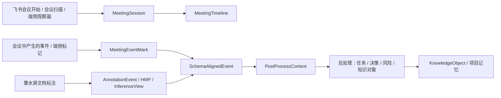

# 飞书会议时间轴接入方案

## 功能定位

飞书会议场景不是会议纪要模板，也不是把会议音频、字幕、议题、发言人整体送入证据流水线。首版只把会议中产生的事件和端侧标记作为 external mark 接入，再与墨水屏文档侧 Core Schema 对齐，最后由统一后处理层结合文档标注、会议标记和项目记忆生成结果。

首版采用 `xzq-xu/Lark-Meeting-Timeline` SDK 作为会议时间轴运行时。该 SDK 负责建立会议轴、接收会中外部标记事件、按会议时间归一化、通过 SSE 实时刷新页面，并把这些事件输出为可对齐的时间轴序列。会议音频、字幕、议题和发言人不进入 v1 主链路。

会议场景的数据冻结口径以 `../30_数据契约与外部投影_7月/InkLoop_Meeting_Event_Schema_Contract_v0.1.md` 为准。本文只描述接入方式和 MVP 落地路径。

## 场景目标

| 场景 | 用户动作 | 系统结果 |
| --- | --- | --- |
| 会中问题标记 | 用户在墨水屏上写 `why?` 或 `?` | 生成会议事件标记，并与当前文档/页面 schema 对齐 |
| 会中风险标记 | 用户写 `risk`、圈选或画重点 | 生成 risk 类事件标记，进入统一后处理队列 |
| 会中待办标记 | 用户写 `next`、`todo` 或行动项关键词 | 生成 action 类事件标记，后处理时结合文档上下文和项目目标 |
| 会后整理 | 用户结束会议后触发后处理 | 会议事件标记和墨水屏文档标注一起生成任务、决策、风险和知识对象 |

## 主链路

## SDK 接入点

| 能力 | SDK 入口 | InkLoop 用法 |
| --- | --- | --- |
| 查看当前会议轴状态 | `GET /api/meeting-session/status` | 判断是否已有真实会议轴、来源和当前时间基准 |
| 建立开放会议轴 | `POST /api/meeting-session/start` | 桌面观察器、端侧宿主或飞书事件确认会议开始后调用 |
| 结束会议轴 | `POST /api/meeting-session/end` | 会议结束、设备离会或飞书结束事件触发 |
| 写入单条会议标记 | `POST /api/annotations` | 墨水屏或宿主把会中产生的事件标记写入时间轴 |
| 批量写入会议标记 | `POST /api/annotations/batch` | 设备离线缓存恢复后批量补传 |
| 实时刷新 | `GET /api/stream` | 页面和调试台通过 SSE 接收最新 timeline state |
| 接收飞书会议事件 | `POST /api/lark/events` | 接收会议开始、结束、录制、共享屏幕等结构事件 |
| 会议扫描兜底 | `GET/POST /api/lark/passive-meeting-scan` | 官方事件延迟或未投递时，用当前用户授权扫描正在进行的会议 |

## v1 SDK 接入子集

| 状态 | SDK 能力 | InkLoop v1 处理 |
| --- | --- | --- |
| 启用 | 会议轴 status/start/end | 建立真实会议时间轴和结束状态 |
| 启用 | annotations / annotations batch | 写入 `MeetingAnnotationEvent`，归一化成 `MeetingEventMark` |
| 启用 | stream SSE | 广播会议轴和标记序列，用于设备状态同步和调试 |
| 启用 | lark events / passive meeting scan | 建轴主路径和扫描兜底 |
| 禁用 | import lark transcript | 不接入 v1 主链路，不作为后处理输入 |
| 禁用 | sync minute / search minutes | 不接入 v1 主链路，不申请 minutes scope |
| 禁用 | transcript segment alignment | 不参与 schema 对齐，不进入 `PostProcessContext` |

权限边界：

| 权限 | v1 状态 | 规则 |
| --- | --- | --- |
| `vc:meeting.all_meeting:readonly` | 允许 | 用于会议开始/结束事件 |
| `vc:meeting.search:read` | 允许 | 用于当前会议扫描兜底 |
| `vc:reserve` | 可选 | 只在应用创建会议时使用 |
| `minutes:minutes.search:read` | 禁用 | 不申请、不调用、不落库 |
| `minutes:minutes.basic:read` | 禁用 | 不申请、不调用、不落库 |
| `minutes:minutes.transcript:export` | 禁用 | 不申请、不调用、不落库 |

## 数据契约

| 对象 | 关键字段 | 作用 |
| --- | --- | --- |
| `MeetingSession` | `platform`、`meeting_id`、`meeting_url`、`title`、`start_time`、`end_time`、`source` | 定义一场真实会议轴和时间零点 |
| `MeetingEventMark` | `id`、`time_ms`、`captured_at_ms`、`source`、`kind`、`label`、`intent`、`payload` | 会议中产生的事件标记 |
| `MeetingAnnotationEvent` | `id`、`captured_at_ms`、`source`、`kind`、`label`、`text`、`intent`、`mark`、`strokes`、`meeting_session` | SDK 开放标注接口接收的原始事件形态 |
| `SchemaAlignedEvent` | `trace_id`、`meeting_id`、`event_id`、`schema_refs`、`time_ms`、`event_type`、`payload` | 与墨水屏文档 schema 对齐后的事件 |
| `PostProcessContext` | `document_refs`、`meeting_marks`、`project_memory_refs`、`user_feedback` | 统一后处理输入 |
| `PostProcessResult` | `result_type`、`content`、`source_refs`、`confidence` | 任务、决策、风险和知识对象的候选结果 |
| `InkLoopSourceRef` | `document`、`meeting_mark`、`project_memory` 三类引用 | 组合证据和可追溯来源 |

字段全集、枚举、失败原因和 Runtime 入账规则以会议事件 schema 合约为准。

## source_refs 规则

| 引用类型 | 必填字段 | 用途 |
| --- | --- | --- |
| `document` | `document_id`、`page_id`、`object_refs`、`confidence` | 证明后处理结果来自哪份文档、哪页和哪个文档对象 |
| `meeting_mark` | `meeting_id`、`meeting_mark_id`、`time_ms`、`kind`、`source` | 证明结果来自会议中的哪个事件标记 |
| `project_memory` | `memory_id`、`kind`、`title` | 证明结果引用了哪个目标、里程碑、风险或旧知识对象 |

`PostProcessResult.source_refs` 至少包含一个 `document` 和一个 `meeting_mark`。引用无法反查时结果不得进入可信 KnowledgeObject，只进入 debug 或待修复状态。

## 与 InkLoop 文档 Schema 的映射

| InkLoop 对象 | 会议场景映射 | 规则 |
| --- | --- | --- |
| `AnnotationEvent` | `MeetingAnnotationEvent` | 复用 `event_id`、`trace_id`、`stroke_points`、`device_id`，增加 `meeting_id` 和 `time_ms` |
| `HMP` | `mark` / `payload` | `action` 映射 underline、enclosure、arrow、freehand；`target_text` 只作为标记文本，不直接视为会议上下文 |
| `InferenceView` | `PostProcessContext.document_refs` | 文档侧仍按页面和 bbox 裁剪；会议侧只提供事件标记和时间锚点 |
| `RuntimeSyncEvent` | `SchemaAlignedEvent` | 只有 schema_refs 可校验的对齐事件进入 RuntimeSyncEvent v1.1 增量；未对齐标记保留在 meeting_alignment_ledger |
| `KnowledgeObject` | `MeetingAction` / `MeetingDecision` / `MeetingRisk` / `MeetingQuestion` | 只沉淀后处理确认过的结果 |

## 后处理输入

| 输入 | 构造方式 | 后处理用途 |
| --- | --- | --- |
| 会议事件标记 | `captured_at_ms` 转会议相对 `time_ms`，保留 `kind`、`intent`、`label` | 表示会议中发生了需要关注的事件 |
| 文档 schema 引用 | 从当前墨水屏文档、页面、bbox、HMP、InferenceView 取得 | 提供被讨论或被标注的文档上下文 |
| 项目记忆 | 按项目、文档、关键词或用户反馈召回 | 提供已有目标、风险、决策和里程碑 |

## 权限与数据边界

| 数据 | 处理规则 |
| --- | --- |
| 飞书应用凭证 | 只进入运行环境变量，不写入 Markdown 文档和客户端日志 |
| 会议开始事件 | 优先走飞书长连接或 HTTP 事件；扫描兜底只用于建立会议轴 |
| 用户 OAuth | 只用于当前用户会议扫描 |
| 原始音频 / 字幕 / 议题 / 发言人 | 不申请、不调用、不进入 v1 主证据流水线 |
| minutes / transcript scope | v1 禁用，不写入 `.env` 默认 scopes |
| 手写原始笔迹 | 本地保留，云端只接最小化文本、时间、source_refs |

## MVP 验收

| 验收项 | 目标 |
| --- | --- |
| 会议轴建立 | 真实会议开始后形成 `MeetingSession`，来源标明为官方事件、扫描兜底或开放会话 |
| 标记落轴 | 墨水屏或 API 标记写入后 1 秒内进入 `sequence` |
| 实时刷新 | SSE 在标记写入后 2 秒内推送最新 timeline |
| Schema 对齐 | 会议标记能生成 `SchemaAlignedEvent`，并关联到文档 schema 引用 |
| 后处理闭环 | 至少支持 action、decision、risk、question 四类候选结果 |
| 知识沉淀 | 被接受、编辑或追问的后处理结果进入 KnowledgeObject |

## 验收统计口径

| 指标 | 分母 | 分子 | 失败分类 |
| --- | --- | --- | --- |
| 标记落轴成功率 | 写入 API 的 `MeetingAnnotationEvent` 数 | 1 秒内进入 `MeetingTimeline.sequence` 的 `MeetingEventMark` 数 | `missing_meeting_axis`、`invalid_timestamp`、`duplicate_mark`、`server_error` |
| Schema 对齐成功率 | 有效且具备活动文档绑定的 `MeetingEventMark` 数 | 生成 `alignment_status='aligned'` 且 `schema_refs.length > 0` 的 `SchemaAlignedEvent` 数 | `no_active_document`、`stale_document`、`unresolved_bbox`、`permission_denied` |
| source_refs 校验成功率 | 被接受、编辑或追问的 `PostProcessResult` 数 | 至少包含 `document` 和 `meeting_mark` 且所有引用可反查的结果数 | `missing_document_ref`、`missing_meeting_ref`、`broken_project_memory_ref` |
| KO 映射成功率 | 进入 KnowledgeObject builder 的 `PostProcessResult` 数 | 成功生成 `KnowledgeObject` 且 `kind` 与 `result_type` 映射一致的对象数 | `unsupported_kind`、`missing_primary_source`、`hash_failed` |

无活动文档绑定的会议标记不计入 Schema 对齐成功率分母，但必须记录为 `unbound_mark_count` 并进入待修复队列。

## 工程落地

| 阶段 | 工程内容 | 交付 |
| --- | --- | --- |
| 7 月上旬 | SDK 跑通本地服务、开放会议轴和开放标记接口 | 可用 `POST /api/meeting-session/start` 和 `POST /api/annotations` 建轴落标 |
| 7 月中旬 | 墨水屏事件标记接入会议轴 | 第一版 MVP 同时演示阅读标注和会议事件标记 |
| 7 月底 | `MeetingEventMark`、`SchemaAlignedEvent`、`PostProcessContext`、`InkLoopSourceRef`、RuntimeSyncEvent v1.1 增量冻结 | 文档 schema 与会议事件标记对齐口径固定 |
| 8 月底 | 样机端侧宿主接入会议状态和标记上传 | 样机可在真实会议中写入事件标记 |
| 9 月底 | 文档标注、会议标记、项目记忆后处理联调 | 会议事件到项目管理知识沉淀闭环完成 |

## 当前代码落地状态

| 模块 | 路径 | 状态 |
| --- | --- | --- |
| SDK adapter | `examples/ai-annotation-demo/src/integration/lark-meeting-timeline/adapter.ts` | 已把开放会议会话和 annotation payload 转成 `MeetingSession`、`MeetingEventMark`、`SchemaAlignedEvent`、`PostProcessContext` |
| adapter 单测 | `examples/ai-annotation-demo/src/integration/lark-meeting-timeline/adapter.test.ts` | 覆盖 open session、intent 映射、文档 schema 对齐、未绑定文档降级、source_refs 去重 |
| SDK E2E | `examples/ai-annotation-demo/scripts/verify-meeting-v1-e2e.ts` | 已接入 adapter，实测 SDK 建轴、单条/批量标记、SSE、Cloud Hub 持久化、Obsidian 投影 |
| M103 设备 E2E | `examples/ai-annotation-demo/scripts/verify-m103-meeting-device.ts` | 已验证电子纸会议入口产生 decision/action/risk/question/note，并进入 Runtime Sync、后处理和 Obsidian 测试 vault |

最近一次验收结果：SDK E2E 4 条事件全部落轴，单条标记接口 1-3ms，批量标记 1ms，SSE 3ms；M103 设备 E2E 5 条事件全部同步，Cloud Hub 持久化 runtime event、ai_turn、KnowledgeObject 和 DocumentProjection。

## 资料来源

| 来源 | 路径 |
| --- | --- |
| SDK 仓库 | `https://github.com/xzq-xu/Lark-Meeting-Timeline` |
| 本地拉取副本 | `/Users/ethan/AI-Annotation-demo/examples/ai-annotation-demo/Lark-Meeting-Timeline-main` |
| 会议事件 schema 合约 | `../30_数据契约与外部投影_7月/InkLoop_Meeting_Event_Schema_Contract_v0.1.md` |
| 开放标注契约 | `/Users/ethan/AI-Annotation-demo/examples/ai-annotation-demo/Lark-Meeting-Timeline-main/public/annotation-schema.json` |
| 服务入口 | `/Users/ethan/AI-Annotation-demo/examples/ai-annotation-demo/Lark-Meeting-Timeline-main/src/server.mjs` |
