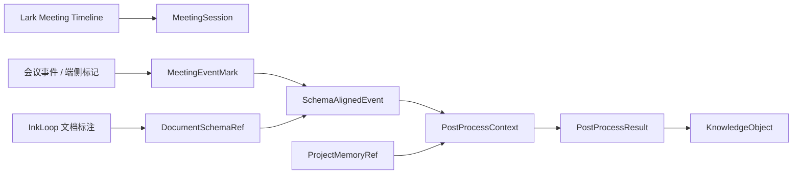

# InkLoop 会议事件 Schema 合约 v0.1

## 合约定位

本文是会议场景进入 InkLoop schema 层的冻结合约。v1 只接入会议中产生的事件标记，不把会议音频、字幕、议题、发言人作为主输入。会议 SDK 只承担建轴、落标、归一化和实时刷新；文档 schema 对齐、后处理、KnowledgeObject 沉淀由 InkLoop 负责。

## 主链路



## Canonical TypeScript 契约

```ts
type ISODateTime = string;
type NormBBox = [number, number, number, number];

type MeetingAxisSource =
  | 'lark_direct_event'
  | 'lark_join_event'
  | 'lark_passive_meeting_scan'
  | 'lark_tenant_passive_meeting_scan'
  | 'open_meeting_session'
  | 'annotation_fallback';

type MeetingMarkKind =
  | 'question'
  | 'risk'
  | 'action'
  | 'decision'
  | 'attention'
  | 'note';

type PostProcessResultType =
  | 'task'
  | 'decision'
  | 'risk'
  | 'question'
  | 'knowledge_note';

interface MeetingSession {
  schema_version: 'inkloop.meeting_session.v1';
  meeting_id: string;
  platform: 'feishu' | 'lark';
  title?: string;
  meeting_url?: string;
  start_time: ISODateTime;
  end_time?: ISODateTime;
  source: MeetingAxisSource;
  source_event_id?: string;
  created_at: ISODateTime;
  updated_at: ISODateTime;
}

interface MeetingEventMark {
  schema_version: 'inkloop.meeting_event_mark.v1';
  id: string;
  trace_id: string;
  meeting_id: string;
  time_ms: number;
  captured_at_ms: number;
  source: string;
  kind: MeetingMarkKind;
  label: string;
  intent: 'question' | 'risk' | 'action' | 'decision' | 'attention' | 'note';
  payload: {
    text?: string;
    mark?: {
      action?: 'underline' | 'enclosure' | 'arrow' | 'freehand' | 'highlight';
      target_text?: string;
    };
    device_id?: string;
    raw_event_id?: string;
  };
  idempotency_key: string;
  created_at: ISODateTime;
}

interface DocumentSchemaRef {
  ref_type: 'document';
  document_id: string;
  page_id: string;
  page_index?: number;
  event_id?: string;
  trace_id?: string;
  hmp_id?: string;
  inference_view_id?: string;
  bbox?: NormBBox;
  object_refs: string[];
  quote?: string;
  confidence: number;
}

interface MeetingSourceRef {
  ref_type: 'meeting_mark';
  meeting_id: string;
  meeting_mark_id: string;
  time_ms: number;
  captured_at_ms: number;
  kind: MeetingMarkKind;
  source: string;
}

interface ProjectMemoryRef {
  ref_type: 'project_memory';
  memory_id: string;
  kind: 'goal' | 'milestone' | 'decision' | 'risk' | 'task' | 'knowledge_object';
  title: string;
  source_uri?: string;
}

type InkLoopSourceRef = DocumentSchemaRef | MeetingSourceRef | ProjectMemoryRef;

interface SchemaAlignedEvent {
  schema_version: 'inkloop.schema_aligned_event.v1';
  trace_id: string;
  event_id: string;
  meeting_id: string;
  meeting_mark_id: string;
  time_ms: number;
  event_type:
    | 'meeting.question_mark'
    | 'meeting.risk_mark'
    | 'meeting.action_mark'
    | 'meeting.decision_mark'
    | 'meeting.attention_mark'
    | 'meeting.note_mark';
  schema_refs: DocumentSchemaRef[];
  source_refs: InkLoopSourceRef[];
  alignment_status: 'aligned' | 'needs_repair' | 'dropped';
  failure_reason?: 'no_active_document' | 'stale_document' | 'unresolved_bbox' | 'invalid_mark' | 'permission_denied';
  payload: Record<string, unknown>;
  created_at: ISODateTime;
}

interface PostProcessContext {
  schema_version: 'inkloop.post_process_context.v1';
  trace_id: string;
  aligned_events: SchemaAlignedEvent[];
  document_refs: DocumentSchemaRef[];
  meeting_marks: MeetingSourceRef[];
  project_memory_refs: ProjectMemoryRef[];
  user_feedback?: 'accepted' | 'edited' | 'dismissed' | 'follow_up';
  created_at: ISODateTime;
}

interface PostProcessResult {
  schema_version: 'inkloop.post_process_result.v1';
  result_id: string;
  trace_id: string;
  result_type: PostProcessResultType;
  title: string;
  content_md: string;
  source_refs: InkLoopSourceRef[];
  confidence: number;
  status: 'candidate' | 'accepted' | 'edited' | 'dismissed';
  created_at: ISODateTime;
}
```

## Runtime 事件账本增量

会议事件分两级入账：

| 对象 | 入账位置 | 规则 |
| --- | --- | --- |
| `MeetingEventMark` | `meeting_alignment_ledger` | 建轴后立即落本地会议账本；无文档绑定也必须保留，供会后修复 |
| `SchemaAlignedEvent` | `RuntimeSyncEvent v1.1` | 只有 `schema_refs` 可校验且 `doc_id` 可确定时进入文档运行时同步队列 |
| `PostProcessResult` | KnowledgeObject builder 输入 | 用户接受、编辑或追问后生成 `KnowledgeObject` |

`RuntimeSyncEvent v1.1` 增量 operation：

```ts
type RuntimeMeetingOperation =
  | 'meeting.schema_aligned.add'
  | 'postprocess.result.add';

type RuntimeMeetingTarget =
  | { type: 'schema_aligned_event'; id: string }
  | { type: 'knowledge_object'; id: string };
```

约束：

1. `doc_id` 使用 `SchemaAlignedEvent.schema_refs[0].document_id`。
2. `dedupe_key` 使用 `SchemaAlignedEvent.event_id` 或 `PostProcessResult.result_id`。
3. `payload.source_refs` 必须完整保留 `document`、`meeting_mark`、`project_memory` 三类引用。
4. `alignment_status != 'aligned'` 的事件不得进入 `RuntimeSyncEvent`，只进入待修复队列。

## KnowledgeObject 映射

| `PostProcessResult.result_type` | `KnowledgeObject.kind` | 默认 callout | 说明 |
| --- | --- | --- | --- |
| `task` | `task` | `todo` | 会中或会后确认的行动项 |
| `decision` | `decision` | `success` | 已确认的方案、取舍或结论 |
| `risk` | `risk` | `warning` | 需要跟踪的问题、阻塞和不确定性 |
| `question` | `question` | `question` | 需要回答、验证或追问的问题 |
| `knowledge_note` | `ai_note` | `note` | 普通知识沉淀 |

`KnowledgeObject.source` 继续保留主文档锚点，`KnowledgeObject.source_refs` 保留完整组合证据。Adapter 只渲染主锚点时仍必须保留 `source_refs`。

## Lark Meeting Timeline v1 接入子集

| 状态 | SDK 能力 | v1 用法 |
| --- | --- | --- |
| 启用 | `GET /api/meeting-session/status` | 查询当前会议轴 |
| 启用 | `POST /api/meeting-session/start` | 端侧观察器或开放会话建轴 |
| 启用 | `POST /api/meeting-session/end` | 结束会议轴 |
| 启用 | `POST /api/annotations` | 写入单条会议事件标记 |
| 启用 | `POST /api/annotations/batch` | 离线恢复后批量补传 |
| 启用 | `GET /api/stream` | SSE 广播 timeline state |
| 启用 | `POST /api/lark/events` | 接收会议开始、结束、加入、离开事件 |
| 启用 | `GET/POST /api/lark/passive-meeting-scan` | 事件延迟时扫描兜底建轴 |
| 禁用 | `POST /api/import/lark-transcript` | 不进入 v1 主链路 |
| 禁用 | `POST /api/lark/sync-minute` | 不进入 v1 主链路 |
| 禁用 | `POST /api/lark/search-minutes` | 不进入 v1 主链路 |
| 禁用 | minutes transcript/media API | 不申请、不调用、不落库 |

权限边界：

| 权限 | v1 状态 | 规则 |
| --- | --- | --- |
| `vc:meeting.all_meeting:readonly` | 允许 | 用于企业会议开始/结束事件 |
| `vc:meeting.search:read` | 允许 | 用于当前会议扫描兜底 |
| `vc:reserve` | 可选 | 只在由应用创建会议时使用 |
| `minutes:minutes.search:read` | 禁用 | 不进入 v1 主链路 |
| `minutes:minutes.basic:read` | 禁用 | 不进入 v1 主链路 |
| `minutes:minutes.transcript:export` | 禁用 | 不进入 v1 主链路 |

## 验收统计口径

| 指标 | 分母 | 分子 | 失败分类 |
| --- | --- | --- | --- |
| 会议标记落轴成功率 | 写入 API 的 `MeetingAnnotationEvent` 数 | 1 秒内进入 `MeetingTimeline.sequence` 的 `MeetingEventMark` 数 | `missing_meeting_axis`、`invalid_timestamp`、`duplicate_mark`、`server_error` |
| 会议 schema 对齐成功率 | 有效且具备活动文档绑定的 `MeetingEventMark` 数 | 生成 `alignment_status='aligned'` 且 `schema_refs.length > 0` 的 `SchemaAlignedEvent` 数 | `no_active_document`、`stale_document`、`unresolved_bbox`、`permission_denied` |
| source_refs 校验成功率 | 被接受、编辑或追问的 `PostProcessResult` 数 | `source_refs` 至少包含 `document` 和 `meeting_mark`，且所有引用可反查的结果数 | `missing_document_ref`、`missing_meeting_ref`、`broken_project_memory_ref` |
| KO 映射成功率 | 进入 KnowledgeObject builder 的 `PostProcessResult` 数 | 成功生成 `KnowledgeObject` 且 `kind` 与 result_type 映射一致的对象数 | `unsupported_kind`、`missing_primary_source`、`hash_failed` |

有效 `MeetingEventMark` 定义：

1. `meeting_id`、`id`、`trace_id`、`time_ms`、`captured_at_ms`、`kind`、`source` 非空。
2. `kind` 属于 `question`、`risk`、`action`、`decision`、`attention`、`note`。
3. `captured_at_ms` 能归一化到会议轴。
4. 重复 `idempotency_key` 只计一次。

无活动文档绑定的会议标记不计入 schema 对齐成功率分母，但必须计入 `unbound_mark_count`，并进入待修复队列。
