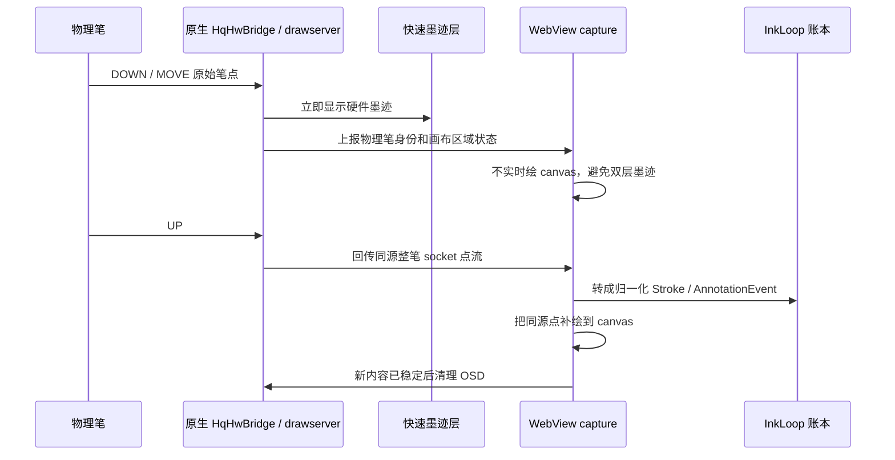

# M103 低延迟手写通用化技术方案

## 结论

M103 上的低延迟手写不是靠 WebView canvas 直接变快，而是把“实时视觉反馈”和“持久数据真相”拆成两层：

1. 落笔到抬笔前，由设备厂商 OSD / drawserver 快速墨迹层直接显示笔迹。
2. 抬笔后，InkLoop 用同一份硬件笔点流补写到 Web canvas、账本和标注流水线。
3. 页面翻页、重排、滚动、浮层遮挡时，前端用内容签名判断是否清理 OSD，避免旧硬件墨迹残留在新页面。

这套方案可以通用到其它电子纸设备，但前提不是“复制 M103 代码”，而是把设备能力抽象成 `FastInkOverlayAdapter`。

## 当前 M103 实现

相关代码：

| 模块 | 路径 | 作用 |
| --- | --- | --- |
| 画布区域上报 | `/Users/ethan/AI-Annotation-demo/examples/ai-annotation-demo/src/capture/m103-hqhw-area.ts` | 把当前可写画布的物理屏坐标上报给原生 HqHwBridge，只让 OSD 在阅读/会议画布区域响应 |
| 硬件笔点接收 | `/Users/ethan/AI-Annotation-demo/examples/ai-annotation-demo/src/capture/m103-hqhw-socket.ts` | 接收 drawserver 广播的 `/tmp/hqunifiedsocket` 整笔点流 |
| 输入分流和抬笔提交 | `/Users/ethan/AI-Annotation-demo/examples/ai-annotation-demo/src/capture/ink.ts` | 笔写字、手指导航；OSD 显示实时墨迹，抬笔后用 socket 点补 canvas 和账本 |
| 设备能力判断 | `/Users/ethan/AI-Annotation-demo/examples/ai-annotation-demo/src/capture/m103-input-source.ts` | 判断物理笔/手指、OSD 是否可用、何时清理 OSD |
| 原生桥 | `/Users/ethan/AI-Annotation-demo/examples/ai-annotation-demo/android/app/src/main/java/com/example/hmpocrpoc/HqHwBridge.kt` | 订阅硬件笔点、控制 OSD 画区、把整笔回传 WebView |

## 数据流



## 为什么能低延迟

| 问题 | 普通 WebView canvas | M103 当前方案 |
| --- | --- | --- |
| 落笔反馈 | PointerEvent -> JS -> canvas -> WebView 合成 -> 电子纸刷新 | 硬件 OSD / drawserver 直接画，绕开 JS 与 WebView 合成 |
| 点流一致性 | 实时显示点和持久化点可能来自不同坐标源 | OSD 和 canvas 补绘使用同一份 socket 笔点 |
| 抬笔重影 | OSD 一层、canvas 一层，坐标略偏就看到重刷 | 抬笔后等同源点，补 canvas，再清 OSD |
| 翻页残留 | OSD 是物理层，页面换了也可能留在原位置 | 内容签名变化后清 OSD，不变时不清 |
| 误清闪烁 | 每笔落库/重绘都清 OSD | 只在可见内容身份变化时清，写字不清 |

## 内容签名门

OSD 是物理屏上的临时层，和 WebView DOM 不同生命周期。需要一个权威签名判断“用户看到的内容是否已经换了”。

M103 当前签名包含：

| 分量 | 目的 |
| --- | --- |
| `mode/read/mtg/dev/surface` | 阅读、会议、dev、重排等视图切换 |
| `context_id` | 阅读实例和会议实例切换 |
| `doc_id/page_id/page_index` | 文档和页切换 |
| `viewMode/reflowProvider/reflowModel` | 原版和重排阅读切换 |
| `zoom` | 页面缩放变化 |
| 可见画布 selector + 物理坐标 | rail 折叠、画布移位、reader ink 层切换 |
| 滚动祖先 scrollTop/scrollLeft | 重排虚拟页、列表翻页、自由滚动 |
| 浮层状态 | 文件上传、AI 洞察、会议资料栏、时间脊、sheet 遮挡 |

规则：

| 情况 | 行为 |
| --- | --- |
| 签名不变 | 不清 OSD，避免每笔闪烁 |
| 签名变化且没落笔 | 等新内容稳定后清 OSD |
| 正在落笔 | 不清 OSD、不 resize 画区 |
| 浮层遮挡画布 | 上报 `null`，原生 disarm OSD |

## 通用抽象

建议把 M103 专有实现收敛成设备能力接口：

```ts
interface FastInkOverlayAdapter {
  readonly deviceKind: string;
  readonly supportsOverlay: boolean;
  readonly supportsHardwareStrokeReplay: boolean;

  arm(rect: PhysicalRect | null): void;
  clearAfterCommit(): Promise<void>;
  isPhysicalPen(event: PointerEvent): boolean;
  isPhysicalFinger(event: PointerEvent): boolean;
  shouldUseOverlayOnly(event: PointerEvent): boolean;
  takeCommittedStroke(startedAt: number, timeoutMs: number): Promise<HardwareStroke | null>;
}
```

业务层只依赖这个接口：

```text
pointerdown
-> adapter.isPhysicalPen ? annotate : navigate
-> adapter.shouldUseOverlayOnly ? 不实时画 canvas : 实时画 canvas
-> pointerup
-> adapter.takeCommittedStroke
-> 写 canvas / ledger / AnnotationEvent
-> adapter.clearAfterCommit
```

## 设备适配分层

| 层级 | 通用逻辑 | 设备专有逻辑 |
| --- | --- | --- |
| 输入策略 | 笔写字、手指导航、橡皮擦除、横滑翻页 | 笔/手指识别来源、橡皮头识别 |
| 快速墨迹 | OSD-only 期间不画 Web canvas | 如何 arm OSD、画区坐标单位、清理命令 |
| 点流回放 | 抬笔后用同源点补 ledger | 从 socket、JNI、厂商 SDK 或 HID 取整笔 |
| 内容签名 | doc/page/view/scroll/chrome 变化才清 OSD | 物理坐标换算、DPR、屏幕旋转 |
| 降级路径 | 没有硬件 overlay 就用 PointerEvent + canvas | 设备能力探测 |

## T10 C Plus 适配判断

T10 C Plus 是否能复用 M103 方案，关键看四个能力：

| 能力 | 必须程度 | 验证方法 |
| --- | --- | --- |
| 原生能区分笔和手指 | 必须 | Android MotionEvent `toolType` / 厂商 SDK / HID 事件 |
| 有低延迟墨迹层或局刷直通 | 强烈需要 | 是否存在 OSD、drawserver、partial refresh API、厂商手写模式 |
| 能拿到同源硬件笔点 | 强烈需要 | 是否能订阅 socket、JNI callback、input device 原始事件 |
| 能限制画区和清理墨迹层 | 必须 | 能否设置 overlay clip rect，能否按需 clear |

如果 T10 只有普通 WebView PointerEvent，没有硬件快速墨迹层，那只能做 canvas + 局部刷新优化，延迟上限会明显低于 M103 方案。

## 最小可迁移版本

第一阶段不要直接重写全设备通用框架，可以先抽三件事：

1. `FastInkOverlayAdapter` 接口和 `NoopFastInkOverlayAdapter`。
2. 把 `m103-hqhw-area.ts / m103-hqhw-socket.ts / m103-input-source.ts` 包成 `M103FastInkAdapter`。
3. `ink.ts` 只调用 adapter，不直接 import M103 模块。

验收：

| 验收项 | 标准 |
| --- | --- |
| M103 不回退 | 低延迟、无重影、翻页不残留 |
| 非 M103 不受影响 | PointerEvent + canvas 仍可写 |
| T10 可接入 | 新增一个 adapter，不改业务层 capture |
| 清 OSD 稳定 | 写字不闪，翻页/弹窗/重排清理准确 |

## 风险

| 风险 | 影响 | 处理 |
| --- | --- | --- |
| 厂商 OSD API 不开放 | 无法达到 M103 同级低延迟 | 退到 canvas + A2 局刷，单独记录设备能力等级 |
| 硬件点和 Web 坐标不同步 | 抬笔补绘偏移、重影 | 原生侧统一把点转换到 WebView CSS 视口坐标 |
| 清理时机过早 | 抬笔后笔迹消失 | 清理前等待 pending ink commit barrier |
| 清理时机过晚 | 翻页残留 | 内容签名覆盖所有可见内容变化 |
| 设备旋转/DPR 错误 | 画区错位 | 所有 clip rect 使用物理屏坐标，记录 DPR 和旋转 |
